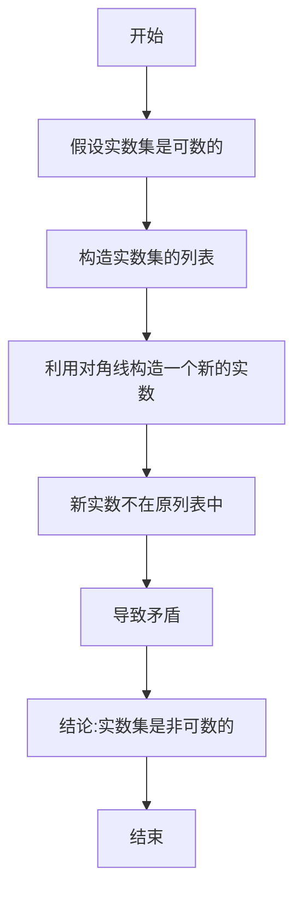

# 集合论导引：连续统假设

## 1.背景介绍

集合论是数学的一个基础分支,研究集合及其运算、关系等性质。它为数学奠定了坚实的基础,并广泛应用于逻辑、计算机科学和其他数学分支。在集合论中,连续统假设(Continuum Hypothesis, CH)是一个具有里程碑意义的公理,它试图回答有关无穷集合基数之间关系的根本问题。

连续统假设由著名数学家戈德尔(Georg Cantor)于1878年首次提出,旨在解决实数集$\mathbb{R}$与自然数集$\mathbb{N}$之间基数的关系。实数集的基数被称为$\mathfrak{c}$(连续统),自然数集的基数记为$\aleph_0$(可数无穷)。戈德尔认为,在$\aleph_0$和$\mathfrak{c}$之间不存在其他的基数,即连续统假设成立。

## 2.核心概念与联系

### 2.1 基数(Cardinality)

基数是衡量集合"大小"的一种方式,反映了集合中元素的多少。两个集合如果存在一个一一对应的双射(双向映射),则它们具有相同的基数。例如,自然数集$\mathbb{N}$与偶数集$\{2n|n\in\mathbb{N}\}$具有相同的可数无穷基数$\aleph_0$。

### 2.2 可数集合与非可数集合

一个集合如果与自然数集$\mathbb{N}$具有相同的基数,则称为可数集合。否则,如果集合的基数大于$\aleph_0$,则称为非可数集合。实数集$\mathbb{R}$就是一个典型的非可数集合。

### 2.3 连续统假设的陈述

连续统假设可以形式化地表述为:

$$
\neg\exists\kappa(\aleph_0<\kappa<\mathfrak{c})
$$

即在可数无穷基数$\aleph_0$和连续统$\mathfrak{c}$之间,不存在其他的基数$\kappa$。这意味着实数集$\mathbb{R}$是最"小"的非可数集合。

## 3.核心算法原理具体操作步骤

连续统假设并非一个算法,而是一个关于无穷集合基数关系的公理性陈述。然而,我们可以通过一些构造性方法来探讨它的内在逻辑。

### 3.1 对角线论证(Cantor's Diagonal Argument)

戈德尔利用对角线论证证明了实数集$\mathbb{R}$是非可数的。该论证的核心思想是:假设实数集是可数的,则可以构造一个新的实数,该实数不属于原有的列表,从而导致矛盾。因此,实数集必然是非可数的。



### 3.2 基数的运算

虽然连续统假设本身并不涉及算法,但是我们可以研究基数之间的一些运算性质。例如,如果$\kappa$和$\lambda$是两个基数,则它们的乘积$\kappa\cdot\lambda$表示所有从$\kappa$到$\lambda$的函数的集合的基数。我们有:

$$
\kappa\cdot\lambda\geq\max(\kappa,\lambda)
$$

特别地,如果$\kappa\leq\lambda$,则$\kappa\cdot\lambda=\lambda$。这种性质对于研究连续统假设的一些推论非常有用。

## 4.数学模型和公式详细讲解举例说明

### 4.1 实数集的基数$\mathfrak{c}$

实数集$\mathbb{R}$的基数$\mathfrak{c}$被称为连续统,是最"小"的非可数基数。我们可以通过一些等价的定义来刻画$\mathfrak{c}$:

1. $\mathfrak{c}$是实数集$\mathbb{R}$的基数。
2. $\mathfrak{c}$是单位闭区间$[0,1]$上的实数集合的基数。
3. $\mathfrak{c}$是$2^\omega$,即所有从自然数集$\mathbb{N}$到$\{0,1\}$的函数集合的基数。

上述定义的等价性可以通过一些双射构造来证明。例如,我们可以将任意实数$x\in[0,1]$表示为一个无限二进制小数序列$0.a_1a_2a_3\cdots$,其中$a_i\in\{0,1\}$。这样就建立了$[0,1]$和$2^\omega$之间的一个双射关系。

### 4.2 连续统假设的等价形式

连续统假设可以用多种等价的形式表达:

$$
\begin{align*}
\neg\exists\kappa(\aleph_0<\kappa<\mathfrak{c}) &\iff 2^{\aleph_0}=\mathfrak{c}\\
&\iff \mathcal{P}(\mathbb{N})\ \text{与}\ \mathbb{R}\ \text{有相同的基数}\\
&\iff \text{每个无限集合要么是可数的,要么与}\ \mathbb{R}\ \text{有相同的基数}
\end{align*}
$$

其中,$\mathcal{P}(\mathbb{N})$表示自然数集$\mathbb{N}$的幂集,即所有$\mathbb{N}$的子集构成的集合。上述等价形式为我们研究连续统假设提供了多种视角和思路。

### 4.3 CH与经典实数构造

如果连续统假设成立,那么实数集$\mathbb{R}$中的每个实数都可以由某个可数无穷序列构造得到。例如,我们可以考虑由所有有理数构成的序列$\{r_n\}_{n\in\mathbb{N}}$,并定义:

$$
x=\sum_{n=1}^\infty\frac{r_n}{2^n}
$$

则$x$是一个实数,且对于任意实数$y\in\mathbb{R}$,都存在某个可数无穷序列$\{r_n\}_{n\in\mathbb{N}}$使得$y$可以由上式构造得到。这种构造方式为研究实数集的性质提供了一种有力的工具。

## 5.项目实践:代码实例和详细解释说明

虽然连续统假设本身是一个纯粹的数学概念,但我们可以通过编程来模拟和探索一些相关的概念。下面是一个Python代码示例,用于生成实数的无限二进制小数表示:

```python
import random

def generate_binary_rep(num_digits):
    """
    生成一个实数的无限二进制小数表示
    
    参数:
        num_digits (int): 要生成的二进制位数
    返回:
        str: 实数的无限二进制小数表示
    """
    binary_rep = '0.'
    for _ in range(num_digits):
        binary_rep += str(random.randint(0, 1))
    return binary_rep

# 生成一个20位的无限二进制小数表示
binary_rep = generate_binary_rep(20)
print(f"实数的无限二进制小数表示: {binary_rep}")
```

在这个示例中,我们定义了一个`generate_binary_rep`函数,它接受一个参数`num_digits`,表示要生成的二进制位数。函数首先初始化一个字符串`binary_rep`为`'0.'`,表示二进制小数的开头。然后,它使用一个`for`循环随机生成`num_digits`个0或1,并将它们附加到`binary_rep`字符串的末尾。

最后,函数返回生成的无限二进制小数表示。在示例中,我们调用`generate_binary_rep(20)`生成一个20位的无限二进制小数表示,并将其打印出来。

这个简单的示例说明了如何使用编程来模拟实数的无限二进制小数表示,这与连续统假设中实数集的构造方式有着密切的联系。通过编程,我们可以更好地理解和探索这些数学概念。

## 6.实际应用场景

连续统假设虽然是一个纯粹的数学概念,但它在数学和计算机科学的许多领域都有着重要的应用和影响。

### 6.1 集合论和逻辑

连续统假设是集合论和逻辑的一个基础公理,它为研究无穷集合的性质提供了重要的理论基础。许多重要的数学定理和结果都依赖于连续统假设的成立或不成立。

### 6.2 实数计算和近似理论

在数值计算和近似理论中,连续统假设为理解实数集的性质提供了重要的启示。例如,如果连续统假设成立,那么每个实数都可以由某个可数无穷序列构造得到,这为实数的近似计算和表示提供了理论依据。

### 6.3 计算复杂性理论

在计算复杂性理论中,连续统假设与一些重要的问题和猜想密切相关,例如$P\neq NP$猜想。一些著名的结果,如Cohen强度定理,探讨了连续统假设对于复杂性类之间关系的影响。

### 6.4 编码理论和信息论

在编码理论和信息论中,连续统假设为研究信息源的熵和编码效率提供了重要的理论基础。例如,如果连续统假设成立,那么实数集的熵就等于$\log_2\mathfrak{c}$,这为设计高效的编码方案提供了指导。

## 7.工具和资源推荐

如果您希望深入学习和探索连续统假设及其相关概念,以下是一些推荐的工具和资源:

### 7.1 书籍和教材

- "Set Theory and the Continuum Hypothesis" by Paul Cohen
- "Set Theory" by Thomas Jech
- "A Mathematical Introduction to Logic" by Herbert Enderton

这些书籍为连续统假设及其在集合论和逻辑中的应用提供了全面的介绍和深入的探讨。

### 7.2 在线课程和视频

- coursera上的"Introduction to Mathematical Thinking"课程
- MIT公开课"Mathematics for Computer Science"
- YouTube上的"Essence of Calculus"系列视频

这些在线资源以通俗易懂的方式介绍了集合论和连续统假设的基本概念,适合初学者入门。

### 7.3 数学软件和编程工具

- Wolfram Mathematica
- SageMath
- Python数学库(如SymPy、NumPy等)

这些数学软件和编程工具可以帮助您进行符号计算、数值计算和可视化,从而更好地理解和探索连续统假设相关的概念。

## 8.总结:未来发展趋势与挑战

连续统假设自提出以来,一直是数学界持续探讨和研究的热点话题。虽然它在标准集合论ZFC(Zermelo-Fraenkel集合论+选择公理)中无法被证明或驳斥,但它对于理解无穷集合的性质至关重要。

未来,数学家和逻辑学家可能会继续探索连续统假设在不同数学分支中的应用,并寻找新的方法来深入理解它的本质和影响。同时,计算机科学家也可能会利用连续统假设的启示,设计更高效的算法和数据结构,推进计算复杂性理论的发展。

然而,连续统假设也面临着一些挑战和困难。例如,它与一些其他重要的集合论公理(如选择公理)存在着紧密的联系,探讨它们之间的相互影响是一个复杂的问题。另外,连续统假设的独立性问题(即它在ZFC中无法被证明或驳斥)也为数学家带来了新的挑战。

总的来说,连续统假设作为一个里程碑式的数学概念,将继续影响和推动数学、逻辑和计算机科学的发展。它的探索和研究将为我们揭示更多关于无穷集合的奥秘,并为解决复杂的理论和实际问题提供新的思路和方法。

## 9.附录:常见问题与解答

### 9.1 连续统假设是否可以被证明或驳斥?

在标准的ZFC(Zermelo-Fraenkel集合论+选择公理)公理系统中,连续统假设无法被证明或驳斥。这是由于ZFC是一个相对于连续统假设的"无决定论"(undecidable)的公理系统。换言之,连续统假设在ZFC中是独立的,它既不能从ZFC的公理推导出来,也