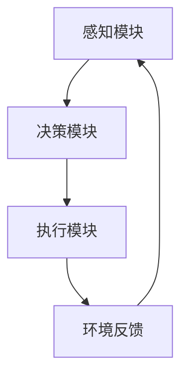

# AI人工智能 Agent：对生活的影响

## 1.背景介绍

人工智能（AI）已经成为现代科技发展的重要驱动力，尤其是AI Agent的出现，彻底改变了我们的生活方式。AI Agent是一种能够自主学习、决策和执行任务的智能系统。它们不仅在工业、医疗、金融等领域发挥着重要作用，还逐渐渗透到我们的日常生活中。

AI Agent的核心在于其自主性和智能性，这使得它们能够在复杂环境中执行任务，并根据环境变化进行自我调整。本文将深入探讨AI Agent的核心概念、算法原理、数学模型、实际应用以及未来发展趋势。

## 2.核心概念与联系

### 2.1 什么是AI Agent

AI Agent是一种能够感知环境、进行决策并执行任务的智能系统。它们通常由感知模块、决策模块和执行模块组成。感知模块负责收集环境信息，决策模块根据收集的信息进行分析和决策，执行模块则负责执行决策结果。

### 2.2 AI Agent的分类

AI Agent可以根据其智能程度和自主性进行分类：

- **简单反应型Agent**：只根据当前环境状态进行决策，不考虑历史信息。
- **基于模型的Agent**：能够记忆和利用历史信息进行决策。
- **目标导向型Agent**：具有明确的目标，并根据目标进行决策。
- **学习型Agent**：能够通过学习不断改进自身的决策能力。

### 2.3 AI Agent的应用领域

AI Agent在多个领域都有广泛应用，包括但不限于：

- **工业自动化**：如机器人制造、自动化生产线。
- **医疗健康**：如智能诊断系统、个性化治疗方案。
- **金融服务**：如智能投顾、风险管理。
- **智能家居**：如智能音箱、智能安防系统。

## 3.核心算法原理具体操作步骤

### 3.1 感知模块

感知模块的主要任务是收集环境信息，这通常通过传感器或数据接口实现。感知模块的设计需要考虑数据的准确性、实时性和多样性。

### 3.2 决策模块

决策模块是AI Agent的核心，常用的决策算法包括：

- **规则基础系统**：基于预定义的规则进行决策。
- **机器学习算法**：如决策树、支持向量机、神经网络等。
- **强化学习算法**：如Q-learning、深度Q网络（DQN）等。

### 3.3 执行模块

执行模块负责将决策结果转化为具体的行动。这通常涉及到控制系统的设计和执行策略的优化。

### 3.4 决策流程图



## 4.数学模型和公式详细讲解举例说明

### 4.1 强化学习模型

强化学习是AI Agent中常用的一种学习方法，其核心思想是通过与环境的交互，不断优化决策策略。强化学习模型通常包括以下几个部分：

- **状态（State）**：Agent在某一时刻的环境信息。
- **动作（Action）**：Agent在某一状态下可以采取的行为。
- **奖励（Reward）**：Agent采取某一动作后得到的反馈。
- **策略（Policy）**：Agent在不同状态下选择动作的规则。

### 4.2 Q-learning算法

Q-learning是一种常用的强化学习算法，其核心公式为：

$$
Q(s, a) \leftarrow Q(s, a) + \alpha [r + \gamma \max_{a'} Q(s', a') - Q(s, a)]
$$

其中：
- $Q(s, a)$ 是状态 $s$ 下采取动作 $a$ 的价值。
- $\alpha$ 是学习率。
- $r$ 是即时奖励。
- $\gamma$ 是折扣因子。
- $s'$ 是动作 $a$ 后的下一个状态。
- $a'$ 是在状态 $s'$ 下的最优动作。

### 4.3 实例讲解

假设一个简单的迷宫问题，Agent需要找到从起点到终点的最短路径。我们可以使用Q-learning算法来解决这个问题。首先，我们定义状态、动作和奖励，然后通过不断迭代更新Q值，最终得到最优策略。

## 5.项目实践：代码实例和详细解释说明

### 5.1 环境搭建

首先，我们需要搭建一个简单的强化学习环境。可以使用Python和OpenAI Gym库来实现。

```python
import gym
import numpy as np

env = gym.make('FrozenLake-v0')
```

### 5.2 Q-learning算法实现

接下来，我们实现Q-learning算法。

```python
# 初始化Q表
Q = np.zeros([env.observation_space.n, env.action_space.n])

# 设置参数
alpha = 0.8
gamma = 0.95
epsilon = 0.1
num_episodes = 2000

# 训练过程
for episode in range(num_episodes):
    state = env.reset()
    done = False
    while not done:
        if np.random.rand() < epsilon:
            action = env.action_space.sample()
        else:
            action = np.argmax(Q[state, :])
        
        next_state, reward, done, _ = env.step(action)
        
        Q[state, action] = Q[state, action] + alpha * (reward + gamma * np.max(Q[next_state, :]) - Q[state, action])
        
        state = next_state
```

### 5.3 结果分析

训练完成后，我们可以测试Agent的表现。

```python
state = env.reset()
done = False
while not done:
    action = np.argmax(Q[state, :])
    state, reward, done, _ = env.step(action)
    env.render()
```

通过上述代码，我们可以看到Agent在迷宫中的表现，并验证Q-learning算法的有效性。

## 6.实际应用场景

### 6.1 工业自动化

在工业自动化中，AI Agent可以用于优化生产流程、提高生产效率。例如，智能机器人可以根据生产线的实时数据进行自主决策，从而提高生产效率和产品质量。

### 6.2 医疗健康

在医疗健康领域，AI Agent可以用于智能诊断、个性化治疗方案的制定。例如，智能诊断系统可以根据患者的病历和检查结果进行诊断，并给出治疗建议。

### 6.3 金融服务

在金融服务领域，AI Agent可以用于智能投顾、风险管理。例如，智能投顾系统可以根据市场数据和用户的投资偏好，给出投资建议。

### 6.4 智能家居

在智能家居领域，AI Agent可以用于智能音箱、智能安防系统。例如，智能音箱可以根据用户的语音指令播放音乐、控制家电。

## 7.工具和资源推荐

### 7.1 开发工具

- **Python**：Python是AI开发的首选语言，具有丰富的库和工具支持。
- **TensorFlow**：TensorFlow是一个开源的机器学习框架，支持深度学习和强化学习。
- **PyTorch**：PyTorch是另一个流行的深度学习框架，具有动态计算图的特点。

### 7.2 学习资源

- **Coursera**：提供丰富的AI和机器学习课程。
- **Kaggle**：一个数据科学竞赛平台，提供丰富的数据集和竞赛项目。
- **arXiv**：一个开放的学术论文平台，可以获取最新的AI研究成果。

## 8.总结：未来发展趋势与挑战

### 8.1 未来发展趋势

AI Agent的发展前景广阔，未来可能会在以下几个方面取得突破：

- **自主学习能力**：AI Agent将具备更强的自主学习能力，能够在复杂环境中进行自我优化。
- **多模态感知**：AI Agent将能够融合多种感知信息，如视觉、听觉、触觉等，从而更全面地理解环境。
- **人机协作**：AI Agent将能够与人类进行更高效的协作，共同完成复杂任务。

### 8.2 面临的挑战

尽管AI Agent具有广阔的应用前景，但仍面临一些挑战：

- **数据隐私和安全**：AI Agent需要处理大量的个人数据，如何保护数据隐私和安全是一个重要问题。
- **伦理和法律问题**：AI Agent的自主决策能力可能引发一些伦理和法律问题，如责任归属、决策透明性等。
- **技术瓶颈**：AI Agent的性能和可靠性仍有待提高，特别是在复杂和动态环境中的表现。

## 9.附录：常见问题与解答

### 9.1 什么是AI Agent？

AI Agent是一种能够感知环境、进行决策并执行任务的智能系统。

### 9.2 AI Agent有哪些应用领域？

AI Agent在工业自动化、医疗健康、金融服务、智能家居等多个领域都有广泛应用。

### 9.3 如何实现一个简单的AI Agent？

可以使用Python和强化学习算法（如Q-learning）来实现一个简单的AI Agent。

### 9.4 AI Agent的未来发展趋势是什么？

AI Agent的未来发展趋势包括自主学习能力、多模态感知、人机协作等。

### 9.5 AI Agent面临哪些挑战？

AI Agent面临的数据隐私和安全、伦理和法律问题、技术瓶颈等挑战。

---

作者：禅与计算机程序设计艺术 / Zen and the Art of Computer Programming