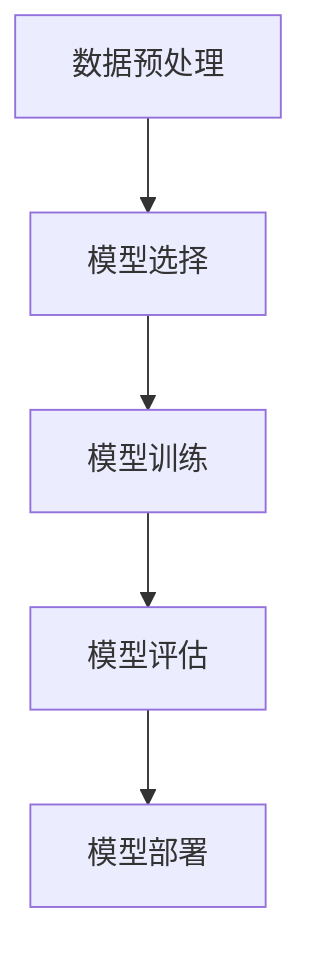

# AI人工智能深度学习算法：在电力预测中的应用

## 1.背景介绍

电力预测是电力系统管理中的一个关键环节。准确的电力负荷预测可以帮助电力公司优化发电计划、减少能源浪费、降低运营成本，并提高电力系统的可靠性和稳定性。传统的电力预测方法主要依赖于统计学模型，如时间序列分析、回归分析等。然而，随着数据量的增加和计算能力的提升，人工智能（AI）特别是深度学习算法在电力预测中的应用越来越受到关注。

深度学习算法通过模拟人脑的神经网络结构，能够从大量数据中自动提取特征并进行预测。相比传统方法，深度学习算法在处理复杂非线性关系和高维数据方面具有显著优势。因此，深度学习算法在电力预测中的应用前景广阔。

## 2.核心概念与联系

### 2.1 深度学习

深度学习是机器学习的一个分支，主要通过多层神经网络来模拟人脑的学习过程。深度学习模型通常包括输入层、多个隐藏层和输出层。每一层由多个神经元组成，神经元之间通过权重连接。通过反向传播算法，模型可以不断调整权重，从而优化预测结果。

### 2.2 电力负荷预测

电力负荷预测是指根据历史电力负荷数据和其他相关因素（如天气、节假日等），预测未来一段时间内的电力需求。电力负荷预测可以分为短期预测、中期预测和长期预测。短期预测通常用于电力调度和实时控制，中期预测用于发电计划和电网运行，长期预测用于电力规划和投资决策。

### 2.3 深度学习与电力预测的联系

深度学习算法在电力负荷预测中的应用主要体现在以下几个方面：

1. **特征提取**：深度学习算法能够自动从历史数据中提取复杂的特征，减少了人工特征工程的工作量。
2. **非线性建模**：深度学习算法能够处理复杂的非线性关系，提高了预测的准确性。
3. **高维数据处理**：深度学习算法能够处理高维数据，适用于多种输入变量的电力负荷预测。

## 3.核心算法原理具体操作步骤

### 3.1 数据预处理

数据预处理是深度学习模型训练的第一步。包括数据清洗、数据归一化、特征选择等步骤。数据清洗主要是去除异常值和缺失值，数据归一化是将数据缩放到一个统一的范围，特征选择是选择对预测结果有显著影响的特征。

### 3.2 模型选择

常用的深度学习模型包括前馈神经网络（FNN）、卷积神经网络（CNN）、循环神经网络（RNN）和长短期记忆网络（LSTM）等。对于电力负荷预测，LSTM由于其在处理时间序列数据方面的优势，常被广泛应用。

### 3.3 模型训练

模型训练是指通过反向传播算法，不断调整模型的权重，使得预测结果与真实值之间的误差最小。训练过程中需要设置超参数，如学习率、批量大小、训练轮数等。

### 3.4 模型评估

模型评估是通过测试集来评估模型的预测性能。常用的评估指标包括均方误差（MSE）、均方根误差（RMSE）、平均绝对误差（MAE）等。

### 3.5 模型部署

模型部署是将训练好的模型应用到实际的电力负荷预测中。可以通过API接口、嵌入式系统等方式将模型集成到电力系统中。

以下是深度学习电力预测流程的Mermaid图：



## 4.数学模型和公式详细讲解举例说明

### 4.1 神经网络基本公式

神经网络的基本公式包括前向传播和反向传播。前向传播是指输入数据通过各层神经元的计算，得到输出结果。反向传播是指通过计算预测结果与真实值之间的误差，调整各层神经元的权重。

#### 前向传播

假设输入层有 $x_1, x_2, ..., x_n$ 个输入，隐藏层有 $h_1, h_2, ..., h_m$ 个神经元，输出层有 $y_1, y_2, ..., y_k$ 个输出。前向传播的公式如下：

$$
h_j = f\left(\sum_{i=1}^{n} w_{ij} x_i + b_j\right)
$$

$$
y_k = g\left(\sum_{j=1}^{m} w_{jk} h_j + b_k\right)
$$

其中，$w_{ij}$ 和 $w_{jk}$ 分别是输入层到隐藏层、隐藏层到输出层的权重，$b_j$ 和 $b_k$ 分别是隐藏层和输出层的偏置，$f$ 和 $g$ 分别是隐藏层和输出层的激活函数。

#### 反向传播

反向传播的目标是通过梯度下降算法，最小化损失函数。损失函数常用均方误差（MSE）：

$$
L = \frac{1}{2} \sum_{k=1}^{K} (y_k - \hat{y}_k)^2
$$

其中，$y_k$ 是真实值，$\hat{y}_k$ 是预测值。

通过链式法则，计算损失函数对权重的梯度：

$$
\frac{\partial L}{\partial w_{jk}} = \frac{\partial L}{\partial \hat{y}_k} \cdot \frac{\partial \hat{y}_k}{\partial h_j} \cdot \frac{\partial h_j}{\partial w_{jk}}
$$

更新权重：

$$
w_{jk} = w_{jk} - \eta \frac{\partial L}{\partial w_{jk}}
$$

其中，$\eta$ 是学习率。

### 4.2 LSTM模型公式

LSTM（长短期记忆网络）是RNN的一种改进，能够更好地处理长时间依赖问题。LSTM的基本单元包括输入门、遗忘门和输出门。

#### 输入门

$$
i_t = \sigma(W_i \cdot [h_{t-1}, x_t] + b_i)
$$

#### 遗忘门

$$
f_t = \sigma(W_f \cdot [h_{t-1}, x_t] + b_f)
$$

#### 输出门

$$
o_t = \sigma(W_o \cdot [h_{t-1}, x_t] + b_o)
$$

#### 细胞状态更新

$$
\tilde{C}_t = \tanh(W_C \cdot [h_{t-1}, x_t] + b_C)
$$

$$
C_t = f_t \cdot C_{t-1} + i_t \cdot \tilde{C}_t
$$

#### 隐藏状态更新

$$
h_t = o_t \cdot \tanh(C_t)
$$

其中，$W_i, W_f, W_o, W_C$ 是权重矩阵，$b_i, b_f, b_o, b_C$ 是偏置，$\sigma$ 是sigmoid激活函数，$\tanh$ 是tanh激活函数。

## 5.项目实践：代码实例和详细解释说明

### 5.1 数据准备

首先，我们需要准备电力负荷数据。假设我们有一个包含日期、时间、温度和电力负荷的数据集。

```python
import pandas as pd

# 读取数据
data = pd.read_csv('electricity_load.csv')

# 查看数据
print(data.head())
```

### 5.2 数据预处理

对数据进行归一化处理，并将日期和时间转换为时间戳。

```python
from sklearn.preprocessing import MinMaxScaler

# 归一化处理
scaler = MinMaxScaler()
data[['Temperature', 'Load']] = scaler.fit_transform(data[['Temperature', 'Load']])

# 转换为时间戳
data['Timestamp'] = pd.to_datetime(data['Date'] + ' ' + data['Time'])
data.set_index('Timestamp', inplace=True)
data.drop(['Date', 'Time'], axis=1, inplace=True)
```

### 5.3 构建LSTM模型

使用Keras构建LSTM模型。

```python
from keras.models import Sequential
from keras.layers import LSTM, Dense

# 构建LSTM模型
model = Sequential()
model.add(LSTM(50, return_sequences=True, input_shape=(X_train.shape[1], X_train.shape[2])))
model.add(LSTM(50, return_sequences=False))
model.add(Dense(1))

# 编译模型
model.compile(optimizer='adam', loss='mean_squared_error')
```

### 5.4 模型训练

将数据分为训练集和测试集，进行模型训练。

```python
from sklearn.model_selection import train_test_split

# 分割数据集
X = data[['Temperature']].values
y = data['Load'].values
X_train, X_test, y_train, y_test = train_test_split(X, y, test_size=0.2, random_state=42)

# 训练模型
model.fit(X_train, y_train, epochs=50, batch_size=32, validation_data=(X_test, y_test))
```

### 5.5 模型评估

评估模型的预测性能。

```python
# 预测
y_pred = model.predict(X_test)

# 反归一化
y_test = scaler.inverse_transform(y_test)
y_pred = scaler.inverse_transform(y_pred)

# 计算评估指标
from sklearn.metrics import mean_squared_error, mean_absolute_error

mse = mean_squared_error(y_test, y_pred)
mae = mean_absolute_error(y_test, y_pred)

print(f'MSE: {mse}, MAE: {mae}')
```

## 6.实际应用场景

### 6.1 电力调度

电力调度是电力系统运行的核心环节。通过深度学习算法进行电力负荷预测，可以帮助调度员制定更加合理的发电计划，减少电力浪费，提高电力系统的运行效率。

### 6.2 电网运行

电网运行需要实时监控电力负荷的变化。通过深度学习算法进行短期电力负荷预测，可以帮助电网运营商及时调整电网运行状态，确保电力系统的稳定性和可靠性。

### 6.3 电力规划

电力规划需要对未来的电力需求进行长期预测。通过深度学习算法进行长期电力负荷预测，可以帮助电力公司制定更加科学的电力规划，合理安排电力基础设施的建设和投资。

## 7.工具和资源推荐

### 7.1 开发工具

- **Python**：Python是深度学习领域最常用的编程语言，拥有丰富的库和工具支持。
- **Keras**：Keras是一个高层神经网络API，能够快速构建和训练深度学习模型。
- **TensorFlow**：TensorFlow是一个开源的深度学习框架，提供了强大的计算能力和灵活的模型构建接口。

### 7.2 数据集

- **UCI Machine Learning Repository**：UCI机器学习库提供了多个电力负荷预测相关的数据集。
- **Kaggle**：Kaggle是一个数据科学竞赛平台，提供了丰富的电力负荷预测数据集和竞赛。

### 7.3 学习资源

- **《深度学习》**：由Ian Goodfellow等人编写的《深度学习》是深度学习领域的经典教材，适合初学者和进阶学习者。
- **Coursera**：Coursera提供了多个深度学习相关的在线课程，如Andrew Ng教授的《深度学习专项课程》。

## 8.总结：未来发展趋势与挑战

### 8.1 未来发展趋势

随着数据量的增加和计算能力的提升，深度学习算法在电力预测中的应用将会越来越广泛。未来，深度学习算法将会与其他先进技术（如物联网、大数据、区块链等）相结合，进一步提高电力预测的准确性和实时性。

### 8.2 挑战

尽管深度学习算法在电力预测中具有显著优势，但仍面临一些挑战：

1. **数据质量**：深度学习算法对数据质量要求较高，数据缺失、异常值等问题会影响预测结果。
2. **模型复杂性**：深度学习模型通常具有较高的复杂性，训练和调试需要大量的计算资源和时间。
3. **解释性**：深度学习模型的黑箱特性使得其预测结果难以解释，影响了其在实际应用中的可信度。

## 9.附录：常见问题与解答

### 9.1 深度学习算法在电力预测中的优势是什么？

深度学习算法能够自动提取复杂特征，处理非线性关系和高维数据，提高了电力预测的准确性。

### 9.2 如何选择合适的深度学习模型？

选择合适的深度学习模型需要根据具体的应用场景和数据特点。对于时间序列数据，LSTM通常是一个较好的选择。

### 9.3 如何处理数据缺失和异常值？

数据缺失和异常值可以通过插值、填充、删除等方法进行处理。在深度学习中，数据预处理是一个重要的环节，直接影响模型的预测性能。

### 9.4 如何提高深度学习模型的预测准确性？

提高深度学习模型的预测准确性可以通过增加数据量、优化模型结构、调整超参数、使用更先进的算法等方法。

### 9.5 深度学习算法在电力预测中的应用前景如何？

随着数据量的增加和计算能力的提升，深度学习算法在电力预测中的应用前景广阔。未来，深度学习算法将会与其他先进技术相结合，进一步提高电力预测的准确性和实时性。

---

作者：禅与计算机程序设计艺术 / Zen and the Art of Computer Programming