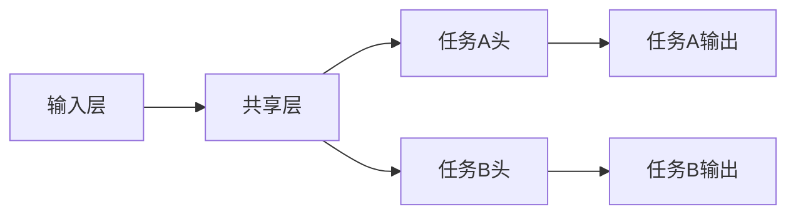
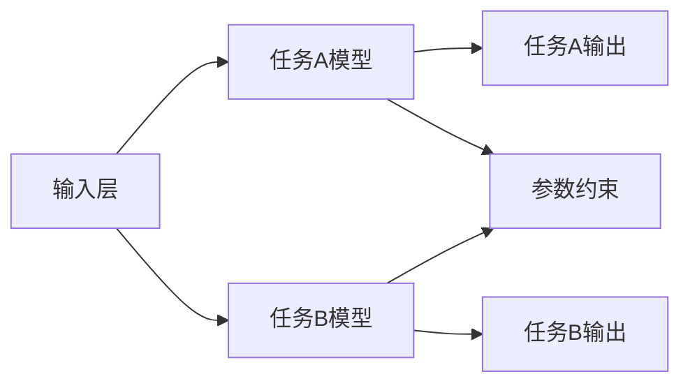

# AI大模型中的多任务学习：一石多鸟

## 1. 背景介绍
在人工智能的发展历程中，多任务学习（Multi-Task Learning, MTL）始终是一个研究的热点。它的核心思想是通过训练一个模型来解决多个相关任务，从而提高模型的泛化能力。随着大数据和计算能力的飞速发展，AI大模型逐渐成为了研究和应用的新趋势。这些模型不仅拥有庞大的参数量，而且具备处理多种任务的能力。本文将深入探讨AI大模型中的多任务学习，揭示其原理、实践方法和应用场景。

## 2. 核心概念与联系
### 2.1 多任务学习的定义
多任务学习是机器学习的一种范式，它通过共享表示来同时学习多个相关任务，目的是利用任务之间的相关性来提高学习效率和模型性能。

### 2.2 AI大模型的特点
AI大模型通常指的是参数规模巨大、能力强大的人工智能模型，如GPT-3、BERT等。这些模型能够捕捉到大量的数据特征，并在多个任务上表现出色。

### 2.3 多任务学习与AI大模型的关系
在AI大模型中实施多任务学习，可以使模型在不同任务间共享知识，提升模型的泛化能力和效率。

## 3. 核心算法原理具体操作步骤
### 3.1 硬参数共享
硬参数共享是多任务学习中最常见的方法，它通过共享模型的一部分参数来学习多个任务。



### 3.2 软参数共享
软参数共享允许每个任务有自己的模型参数，但是在训练过程中，这些参数会受到其他任务参数的约束。



## 4. 数学模型和公式详细讲解举例说明
在多任务学习中，我们通常会定义一个联合损失函数，它是所有任务损失函数的加权和：

$$ L(\theta) = \sum_{i=1}^{T} \alpha_i L_i(\theta_i) $$

其中，$L(\theta)$ 是联合损失函数，$L_i(\theta_i)$ 是第 $i$ 个任务的损失函数，$\alpha_i$ 是对应的权重系数，$\theta$ 和 $\theta_i$ 分别代表模型的总参数和第 $i$ 个任务的参数。

## 5. 项目实践：代码实例和详细解释说明
以一个简单的多任务学习框架为例，我们使用PyTorch来实现一个共享层和两个任务特定的输出层。

```python
import torch
import torch.nn as nn
import torch.optim as optim

# 定义模型
class MultiTaskModel(nn.Module):
    def __init__(self):
        super(MultiTaskModel, self).__init__()
        self.shared = nn.Linear(10, 20)
        self.task_a_head = nn.Linear(20, 1)
        self.task_b_head = nn.Linear(20, 1)

    def forward(self, x):
        shared_repr = self.shared(x)
        out_a = self.task_a_head(shared_repr)
        out_b = self.task_b_head(shared_repr)
        return out_a, out_b

# 实例化模型
model = MultiTaskModel()

# 定义损失函数和优化器
loss_fn_a = nn.MSELoss()
loss_fn_b = nn.BCEWithLogitsLoss()
optimizer = optim.Adam(model.parameters())

# 假设我们有一些数据
x = torch.randn(32, 10)
y_a = torch.randn(32, 1)
y_b = torch.randint(0, 2, (32, 1)).float()

# 训练模型
for epoch in range(100):
    optimizer.zero_grad()
    out_a, out_b = model(x)
    loss_a = loss_fn_a(out_a, y_a)
    loss_b = loss_fn_b(out_b, y_b)
    loss = loss_a + loss_b  # 简单的损失函数组合
    loss.backward()
    optimizer.step()
```

在这个例子中，我们定义了一个共享层和两个任务特定的输出层。每个任务有自己的损失函数，最终的损失是两个损失函数的和。

## 6. 实际应用场景
多任务学习在许多领域都有应用，例如自然语言处理（NLP）中的语言模型、计算机视觉中的图像识别和分割、推荐系统中的点击率预测和商品分类等。

## 7. 工具和资源推荐
- **框架和库**：PyTorch, TensorFlow, Keras
- **数据集**：GLUE, COCO, ImageNet
- **论文和文章**：arXiv, Google Scholar
- **社区和论坛**：Reddit Machine Learning, Stack Overflow

## 8. 总结：未来发展趋势与挑战
多任务学习在AI大模型中的应用前景广阔，但也面临着如任务间干扰、权重平衡等挑战。未来的研究将更加注重模型的泛化能力和效率，以及新的架构和算法的开发。

## 9. 附录：常见问题与解答
- **Q1**: 多任务学习的主要挑战是什么？
- **A1**: 主要挑战包括任务间的负迁移、权重平衡和计算资源的分配等。

- **Q2**: 如何选择多任务学习中的任务？
- **A2**: 选择相关性高的任务可以提高多任务学习的效果。

- **Q3**: 如何评估多任务学习模型的性能？
- **A3**: 可以通过各个任务的性能指标和整体的性能指标来评估。

作者：禅与计算机程序设计艺术 / Zen and the Art of Computer Programming