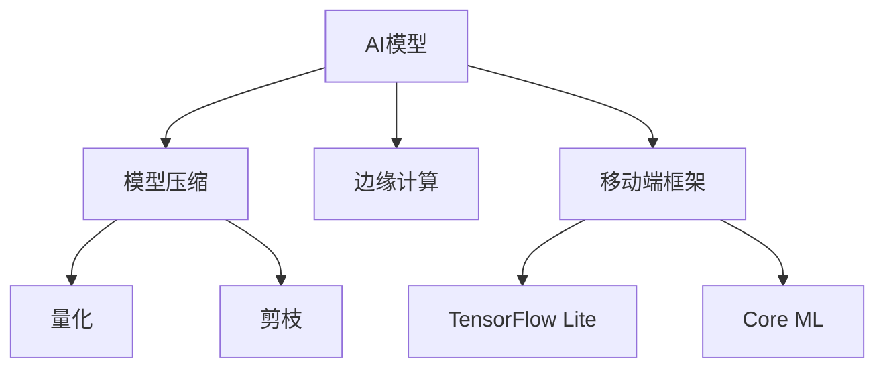

# AI模型部署到移动端原理与代码实战案例讲解

## 1.背景介绍

随着人工智能技术的迅猛发展，AI模型在各个领域的应用越来越广泛。然而，如何将这些复杂的AI模型部署到资源受限的移动设备上，成为了一个重要的研究课题。移动端AI模型的部署不仅可以提升用户体验，还能实现实时处理和本地化数据分析，减少对云端的依赖。

## 2.核心概念与联系

### 2.1 移动端AI模型部署的意义

移动端AI模型部署的主要意义在于：
- **实时性**：减少数据传输延迟，实现实时处理。
- **隐私保护**：数据在本地处理，减少隐私泄露风险。
- **离线能力**：在无网络环境下依然可以运行。

### 2.2 相关技术概述

- **模型压缩**：通过量化、剪枝等技术减少模型大小。
- **边缘计算**：在设备端进行计算，减少对云端的依赖。
- **移动端框架**：如TensorFlow Lite、Core ML等，专为移动设备优化的AI框架。

### 2.3 核心概念联系



## 3.核心算法原理具体操作步骤

### 3.1 模型压缩

#### 3.1.1 量化

量化是将模型中的浮点数参数转换为低精度的整数，从而减少模型大小和计算复杂度。

#### 3.1.2 剪枝

剪枝是通过移除不重要的神经元或连接，减少模型的参数量和计算量。

### 3.2 边缘计算

边缘计算是指在数据源头附近进行计算，减少数据传输的延迟和带宽消耗。

### 3.3 移动端框架

#### 3.3.1 TensorFlow Lite

TensorFlow Lite是TensorFlow的轻量级版本，专为移动和嵌入式设备设计。

#### 3.3.2 Core ML

Core ML是苹果公司推出的机器学习框架，专为iOS设备优化。

## 4.数学模型和公式详细讲解举例说明

### 4.1 量化数学模型

量化的核心思想是将浮点数映射到整数范围。假设有一个浮点数 $x$，其量化公式为：

$$
x_q = \text{round}(x / s)
$$

其中，$s$ 是缩放因子，$x_q$ 是量化后的整数值。

### 4.2 剪枝数学模型

剪枝的核心思想是通过移除权重较小的连接来简化模型。假设有一个权重矩阵 $W$，其剪枝公式为：

$$
W' = W \odot M
$$

其中，$M$ 是掩码矩阵，$\odot$ 表示逐元素相乘。

## 5.项目实践：代码实例和详细解释说明

### 5.1 TensorFlow Lite 实战

#### 5.1.1 模型转换

```python
import tensorflow as tf

# 加载预训练模型
model = tf.keras.models.load_model('model.h5')

# 转换为TensorFlow Lite模型
converter = tf.lite.TFLiteConverter.from_keras_model(model)
tflite_model = converter.convert()

# 保存转换后的模型
with open('model.tflite', 'wb') as f:
    f.write(tflite_model)
```

#### 5.1.2 模型加载与推理

```python
import numpy as np
import tensorflow as tf

# 加载TensorFlow Lite模型
interpreter = tf.lite.Interpreter(model_path='model.tflite')
interpreter.allocate_tensors()

# 获取输入和输出张量
input_details = interpreter.get_input_details()
output_details = interpreter.get_output_details()

# 准备输入数据
input_data = np.array([1.0, 2.0, 3.0], dtype=np.float32)
interpreter.set_tensor(input_details[0]['index'], input_data)

# 执行推理
interpreter.invoke()

# 获取输出数据
output_data = interpreter.get_tensor(output_details[0]['index'])
print(output_data)
```

### 5.2 Core ML 实战

#### 5.2.1 模型转换

```python
import coremltools as ct

# 加载预训练模型
model = tf.keras.models.load_model('model.h5')

# 转换为Core ML模型
coreml_model = ct.convert(model)

# 保存转换后的模型
coreml_model.save('model.mlmodel')
```

#### 5.2.2 模型加载与推理

```swift
import CoreML

// 加载Core ML模型
let model = try! MLModel(contentsOf: URL(fileURLWithPath: "model.mlmodel"))

// 准备输入数据
let input = try! MLMultiArray(shape: [3], dataType: .float32)
input[0] = 1.0
input[1] = 2.0
input[2] = 3.0

// 执行推理
let output = try! model.prediction(from: MLDictionaryFeatureProvider(dictionary: ["input": input]))

// 获取输出数据
let outputArray = output.featureValue(for: "output")!.multiArrayValue!
print(outputArray)
```

## 6.实际应用场景

### 6.1 图像识别

在移动设备上部署图像识别模型，可以实现实时的物体检测和分类，如相机应用中的人脸识别。

### 6.2 语音识别

语音助手和翻译应用可以通过在移动设备上部署语音识别模型，实现离线语音处理和翻译。

### 6.3 增强现实

增强现实应用可以通过在移动设备上部署AI模型，实现实时的场景理解和物体识别。

## 7.工具和资源推荐

### 7.1 开发工具

- **TensorFlow Lite**：适用于Android和iOS的轻量级深度学习框架。
- **Core ML**：苹果公司推出的机器学习框架，适用于iOS设备。

### 7.2 资源推荐

- **TensorFlow Lite 官方文档**：详细介绍了TensorFlow Lite的使用方法和最佳实践。
- **Core ML 官方文档**：提供了Core ML的使用指南和示例代码。

## 8.总结：未来发展趋势与挑战

### 8.1 未来发展趋势

- **模型压缩技术的进步**：未来将会有更多高效的模型压缩技术出现，使得更复杂的AI模型可以在移动设备上运行。
- **边缘计算的普及**：随着5G和物联网的发展，边缘计算将会变得更加普及，移动端AI模型的应用场景也会更加广泛。

### 8.2 挑战

- **计算资源限制**：移动设备的计算资源有限，如何在有限的资源下运行复杂的AI模型是一个重要的挑战。
- **隐私保护**：在移动设备上处理敏感数据时，如何保护用户隐私也是一个需要解决的问题。

## 9.附录：常见问题与解答

### 9.1 如何选择合适的模型压缩技术？

选择模型压缩技术时，需要考虑模型的复杂度、目标设备的计算能力以及应用场景的需求。一般来说，量化适用于大多数场景，而剪枝适用于对模型大小和计算量有严格要求的场景。

### 9.2 TensorFlow Lite 和 Core ML 有什么区别？

TensorFlow Lite 是一个跨平台的轻量级深度学习框架，适用于Android和iOS设备。而Core ML是苹果公司推出的机器学习框架，专为iOS设备优化。选择哪个框架取决于目标平台和具体需求。

### 9.3 如何优化移动端AI模型的性能？

优化移动端AI模型的性能可以从以下几个方面入手：
- 使用模型压缩技术，如量化和剪枝。
- 利用硬件加速，如GPU和NPU。
- 优化模型架构，减少计算复杂度。

作者：禅与计算机程序设计艺术 / Zen and the Art of Computer Programming