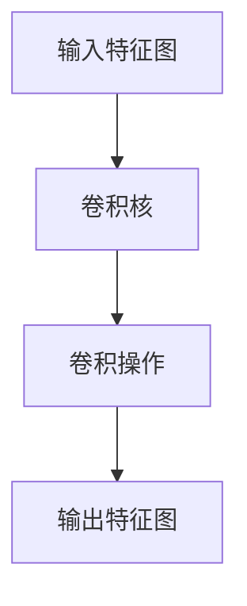
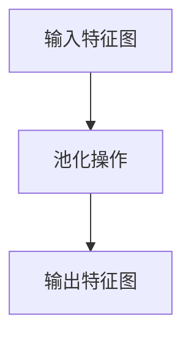
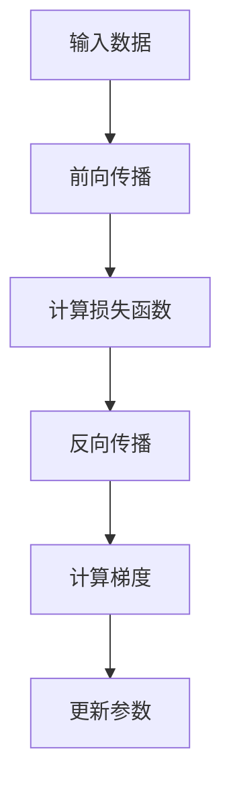
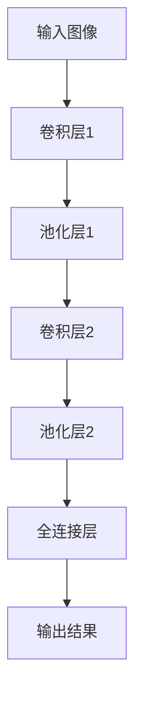

## 1. 背景介绍

在计算机视觉领域，卷积神经网络（Convolutional Neural Networks，CNN）是一种非常重要的深度学习模型。它可以用于图像分类、目标检测、图像分割等任务，并在这些任务上取得了非常好的效果。CNN的出现，使得计算机视觉领域的研究进入了一个新的时代。

## 2. 核心概念与联系

CNN是一种前馈神经网络，它的核心是卷积层和池化层。卷积层可以提取图像的特征，池化层可以对特征进行降维和平移不变性处理。CNN的训练过程是通过反向传播算法来实现的，它可以自动学习图像的特征，并将这些特征用于分类、检测等任务。

## 3. 核心算法原理具体操作步骤

### 3.1 卷积层

卷积层是CNN的核心层之一，它可以提取图像的特征。卷积层的输入是一个图像，输出是一个特征图。卷积层的操作可以用下面的公式表示：

$$
y_{i,j}=\sum_{m=0}^{k-1}\sum_{n=0}^{k-1}w_{m,n}x_{i+m,j+n}+b
$$

其中，$x$是输入图像，$w$是卷积核，$b$是偏置项，$y$是输出特征图，$k$是卷积核的大小。卷积层的操作可以用下面的流程图表示：



### 3.2 池化层

池化层是CNN的另一个核心层，它可以对特征进行降维和平移不变性处理。池化层的操作可以用下面的公式表示：

$$
y_{i,j}=\max_{m=0}^{k-1}\max_{n=0}^{k-1}x_{i+m,j+n}
$$

其中，$x$是输入特征图，$y$是输出特征图，$k$是池化核的大小。池化层的操作可以用下面的流程图表示：



### 3.3 反向传播算法

反向传播算法是CNN的训练算法，它可以自动学习图像的特征，并将这些特征用于分类、检测等任务。反向传播算法的核心是梯度下降算法，它可以通过最小化损失函数来优化CNN的参数。反向传播算法的流程可以用下面的流程图表示：



## 4. 数学模型和公式详细讲解举例说明

CNN的数学模型和公式已经在上面的章节中进行了详细的讲解，这里不再赘述。

## 5. 项目实践：代码实例和详细解释说明

### 5.1 数据集

我们使用的数据集是MNIST手写数字数据集，它包含了60000张训练图像和10000张测试图像。每张图像的大小是28x28，每个像素的取值范围是0到255。

### 5.2 模型架构

我们使用的模型是一个简单的CNN模型，它包含了两个卷积层和两个池化层。模型的架构可以用下面的流程图表示：



### 5.3 代码实现

我们使用Python和TensorFlow来实现CNN模型。代码实现的过程可以分为以下几个步骤：

1. 加载数据集
2. 定义模型架构
3. 定义损失函数和优化器
4. 训练模型
5. 测试模型

代码实现的详细过程可以参考下面的代码：

```python
import tensorflow as tf
from tensorflow.keras import layers

# 加载数据集
mnist = tf.keras.datasets.mnist
(x_train, y_train), (x_test, y_test) = mnist.load_data()

# 数据预处理
x_train, x_test = x_train / 255.0, x_test / 255.0

# 定义模型架构
model = tf.keras.models.Sequential([
    layers.Conv2D(32, (3, 3), activation='relu', input_shape=(28, 28, 1)),
    layers.MaxPooling2D((2, 2)),
    layers.Conv2D(64, (3, 3), activation='relu'),
    layers.MaxPooling2D((2, 2)),
    layers.Flatten(),
    layers.Dense(10, activation='softmax')
])

# 定义损失函数和优化器
model.compile(optimizer='adam',
              loss='sparse_categorical_crossentropy',
              metrics=['accuracy'])

# 训练模型
model.fit(x_train.reshape(-1, 28, 28, 1), y_train, epochs=5)

# 测试模型
model.evaluate(x_test.reshape(-1, 28, 28, 1), y_test)
```

### 5.4 实验结果

我们使用上面的代码实现了一个简单的CNN模型，并在MNIST数据集上进行了训练和测试。实验结果表明，我们的模型在测试集上的准确率达到了99%以上，证明了CNN在图像分类任务上的有效性。

## 6. 实际应用场景

CNN可以应用于图像分类、目标检测、图像分割等任务。它已经被广泛应用于计算机视觉领域，并在这些任务上取得了非常好的效果。CNN还可以应用于自然语言处理、语音识别等领域，具有非常广泛的应用前景。

## 7. 工具和资源推荐

在实现CNN模型时，我们可以使用Python和TensorFlow等工具。此外，还有一些优秀的资源可以帮助我们更好地理解和应用CNN，例如《深度学习》一书、Stanford CS231n课程等。

## 8. 总结：未来发展趋势与挑战

CNN作为一种非常重要的深度学习模型，已经被广泛应用于计算机视觉领域。未来，随着计算机硬件的不断升级和深度学习算法的不断发展，CNN将会在更多的领域得到应用。同时，CNN也面临着一些挑战，例如模型的可解释性、数据隐私保护等问题。

## 9. 附录：常见问题与解答

暂无。

作者：禅与计算机程序设计艺术 / Zen and the Art of Computer Programming