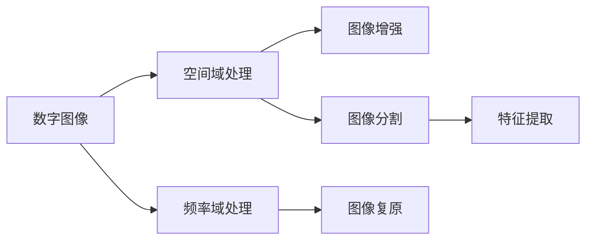

# Image Processing 原理与代码实战案例讲解

## 1.背景介绍

图像处理是计算机视觉、人工智能、多媒体等领域的重要基础。它涉及对数字图像进行分析、操作和处理,以提取有用的信息或生成所需的图像。随着数码相机、智能手机的普及,以及医疗成像、遥感等技术的发展,图像处理在各个行业中的应用越来越广泛。掌握图像处理的基本原理和实践技能,对于从事相关工作的技术人员来说至关重要。

本文将深入探讨图像处理的核心概念、算法原理,并结合具体的代码实例进行讲解。通过理论与实践相结合的方式,帮助读者全面理解图像处理的基础知识,掌握常用的处理技术,为进一步学习和应用打下坚实的基础。

## 2.核心概念与联系

在深入探讨图像处理之前,我们需要了解一些核心概念:

### 2.1 数字图像

数字图像是一个二维矩阵,矩阵中的每个元素称为像素(pixel)。灰度图像的像素值表示灰度级,通常范围为0-255。彩色图像由多个颜色通道组成,常见的是RGB三个通道。

### 2.2 图像的空间和频率域

图像可以在空间域和频率域进行处理。空间域处理直接操作图像的像素值,如滤波、锐化等。频率域处理将图像转换到频率域,对频率分量进行操作,再转换回空间域,如去噪、压缩等。

### 2.3 图像增强与复原

图像增强旨在改善图像的视觉效果,如对比度增强、直方图均衡化等。图像复原则是去除图像中的退化和噪声,恢复原始图像,如去模糊、去噪等。 

### 2.4 图像分割与特征提取

图像分割将图像划分为若干感兴趣的区域或对象,常用的方法有阈值分割、边缘检测、区域生长等。特征提取从图像中提取出有效的特征,如纹理、形状、颜色等,用于后续的分析和识别。

以下是这些概念之间的联系:



## 3.核心算法原理具体操作步骤

### 3.1 空间域滤波

空间域滤波是一种常用的图像增强方法,通过对图像的像素值进行直接操作来实现。其基本步骤如下:

1. 选择合适大小的滤波窗口(如3x3、5x5等)
2. 将滤波窗口的中心位置放在待处理的像素上
3. 根据滤波器类型,对窗口内的像素值进行加权求和或其他操作
4. 将计算结果作为中心像素的新值
5. 滑动滤波窗口,重复步骤2-4,直到处理完所有像素

常见的空间域滤波器包括均值滤波、中值滤波、高斯滤波等。

### 3.2 频率域滤波

频率域滤波首先将图像从空间域转换到频率域,对频率分量进行处理,再转换回空间域。步骤如下:

1. 对原始图像进行傅里叶变换,得到频率域表示
2. 根据滤波器类型,设计频域滤波器函数
3. 将频域滤波器与图像的频谱相乘
4. 对结果进行反傅里叶变换,得到处理后的空间域图像

常见的频率域滤波器有低通滤波器(平滑)、高通滤波器(锐化)、带通/带阻滤波器等。

### 3.3 图像分割-阈值法

阈值分割是一种简单有效的图像分割方法,将图像划分为前景和背景两部分。步骤如下:

1. 确定一个或多个阈值T
2. 扫描图像的每个像素,比较其灰度值I(x,y)与阈值T
3. 如果I(x,y)>T,则将该像素标记为前景,否则标记为背景
4. 得到二值化的分割结果图像

阈值的选择可以通过直方图分析、迭代优化等方法自动确定。

### 3.4 边缘检测

边缘检测用于提取图像中的边缘信息,常用的算法有Sobel、Prewitt、Laplacian、Canny等。以Canny边缘检测为例,步骤如下:

1. 对图像进行高斯平滑,减少噪声影响
2. 计算图像在x和y方向上的梯度Gx和Gy
3. 计算梯度幅值和方向
4. 对梯度幅值进行非极大值抑制,细化边缘
5. 用双阈值法连接边缘,得到最终结果

不同的边缘检测算法在细节处理上有所差异,但基本原理类似。

## 4.数学模型和公式详细讲解举例说明

图像处理中常用到一些数学模型和公式,下面以几个典型的例子进行讲解。

### 4.1 图像的数学表示

一幅大小为M×N的数字图像可以表示为一个二维矩阵:

$$
f(x,y) = 
\begin{bmatrix}
f(0,0) & f(0,1) & \cdots & f(0,N-1) \\ 
f(1,0) & f(1,1) & \cdots & f(1,N-1) \\
\vdots & \vdots & \ddots & \vdots \\
f(M-1,0) & f(M-1,1) & \cdots & f(M-1,N-1)
\end{bmatrix}
$$

其中,$f(x,y)$表示坐标为$(x,y)$处像素的灰度值或颜色值。

### 4.2 图像的傅里叶变换

图像$f(x,y)$的傅里叶变换为:

$$
F(u,v) = \sum_{x=0}^{M-1} \sum_{y=0}^{N-1} f(x,y) \cdot e^{-j2\pi(\frac{ux}{M}+\frac{vy}{N})}
$$

其中,$u,v$为频域坐标。傅里叶变换将图像从空间域转换到频率域,反之亦然。

### 4.3 高斯滤波器

高斯滤波器是一种常用的平滑滤波器,其二维高斯函数为:

$$
G(x,y) = \frac{1}{2\pi\sigma^2} e^{-\frac{x^2+y^2}{2\sigma^2}}
$$

其中,$\sigma$为高斯函数的标准差,控制平滑程度。将高斯函数作为滤波器核,与图像进行卷积,可以实现图像平滑。

### 4.4 Sobel算子

Sobel算子用于计算图像的梯度,包括水平方向和垂直方向的两个卷积核:

$$
G_x = 
\begin{bmatrix}
-1 & 0 & +1 \\ 
-2 & 0 & +2 \\
-1 & 0 & +1
\end{bmatrix},
G_y =
\begin{bmatrix}
-1 & -2 & -1 \\ 
0 & 0 & 0 \\
+1 & +2 & +1
\end{bmatrix}
$$

将图像分别与$G_x$和$G_y$进行卷积,得到梯度$g_x$和$g_y$,然后可以计算梯度幅值和方向:

$$
G = \sqrt{g_x^2 + g_y^2}, \theta = \arctan(\frac{g_y}{g_x})
$$

梯度信息可用于边缘检测、特征提取等任务。

## 5.项目实践：代码实例和详细解释说明

下面以Python和OpenCV库为例,给出一些图像处理的代码实例。

### 5.1 读取和显示图像

```python
import cv2

# 读取图像
img = cv2.imread('image.jpg')

# 显示图像
cv2.imshow('Image', img)
cv2.waitKey(0)
cv2.destroyAllWindows()
```

`cv2.imread()`函数用于读取图像文件,`cv2.imshow()`显示图像,`cv2.waitKey()`等待按键,`cv2.destroyAllWindows()`关闭窗口。

### 5.2 图像平滑

```python
import cv2

img = cv2.imread('image.jpg')

# 均值滤波
blur = cv2.blur(img, (5,5))

# 高斯滤波 
gaussian = cv2.GaussianBlur(img, (5,5), 0)

# 中值滤波
median = cv2.medianBlur(img, 5)

cv2.imshow('Original', img)
cv2.imshow('Blur', blur) 
cv2.imshow('Gaussian', gaussian)
cv2.imshow('Median', median)
cv2.waitKey(0)
cv2.destroyAllWindows()
```

`cv2.blur()`、`cv2.GaussianBlur()`、`cv2.medianBlur()`分别实现了均值滤波、高斯滤波和中值滤波,可以对图像进行平滑去噪。

### 5.3 图像锐化

```python
import cv2
import numpy as np

img = cv2.imread('image.jpg', 0)

# Laplacian锐化
laplacian = cv2.Laplacian(img, cv2.CV_64F)

# Sobel锐化
sobelx = cv2.Sobel(img, cv2.CV_64F, 1, 0, ksize=5)
sobely = cv2.Sobel(img, cv2.CV_64F, 0, 1, ksize=5)
sobel = cv2.addWeighted(sobelx, 0.5, sobely, 0.5, 0)

cv2.imshow('Original', img)
cv2.imshow('Laplacian', laplacian)
cv2.imshow('Sobel', sobel)
cv2.waitKey(0)
cv2.destroyAllWindows()
```

`cv2.Laplacian()`使用Laplacian算子进行图像锐化,`cv2.Sobel()`使用Sobel算子计算梯度,可以突出图像的边缘和细节。

### 5.4 图像分割

```python
import cv2

img = cv2.imread('image.jpg', 0)

# 阈值分割
_, thresh = cv2.threshold(img, 127, 255, cv2.THRESH_BINARY)

# 边缘检测
edges = cv2.Canny(img, 100, 200)

cv2.imshow('Original', img)
cv2.imshow('Threshold', thresh)
cv2.imshow('Edges', edges)
cv2.waitKey(0)
cv2.destroyAllWindows()
```

`cv2.threshold()`进行阈值分割,根据阈值将图像二值化。`cv2.Canny()`使用Canny算法进行边缘检测,提取图像的边缘信息。

## 6.实际应用场景

图像处理技术在各个领域都有广泛的应用,下面列举一些典型场景:

- 医学影像:如CT、MRI等医学图像的增强、分割、配准,辅助医生进行诊断和手术规划。
- 遥感图像:对卫星、航拍等遥感图像进行预处理、分类、变化检测等,用于地理信息分析、环境监测等。
- 工业视觉:在工业生产中对产品进行缺陷检测、尺寸测量、字符识别等,实现自动化质量控制。
- 安防监控:对监控视频进行目标检测、跟踪、行为分析等,用于智能安防、交通管理等。
- 虚拟现实:对图像进行抠图、合成、渲染等处理,生成逼真的虚拟场景,应用于游戏、电影等领域。
- 人脸识别:对人脸图像进行检测、对齐、特征提取、匹配等,实现身份认证、情绪分析等功能。

这些只是图像处理应用的一部分,随着计算机视觉和人工智能技术的发展,图像处理在更多领域发挥着重要作用。

## 7.工具和资源推荐

对于初学者和实践者,这里推荐一些常用的图像处理工具和学习资源:

- OpenCV:开源的计算机视觉库,支持多种编程语言,功能丰富,应用广泛。官网:https://opencv.org/
- MATLAB:商业数学软件,提供了强大的图像处理工具箱,适合科研和原型开发。官网:https://www.mathworks.com/
- Python:简单易学的编程语言,有丰富的图像处理库,如PIL、scikit-image等。
- ImageJ:免费的图像处理软件,界面友好,插件丰