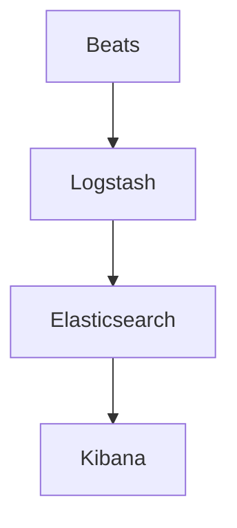

# Kibana原理与代码实例讲解

## 1.背景介绍

Kibana 是一个开源的数据可视化和探索工具，主要用于 Elasticsearch 数据的可视化。它提供了强大的图表、地图和仪表盘功能，使用户能够轻松地分析和展示数据。Kibana 是 Elastic Stack（也称为 ELK Stack）的一部分，其他组件包括 Elasticsearch、Logstash 和 Beats。Kibana 的主要目标是帮助用户从海量数据中提取有价值的信息，并以直观的方式展示出来。

## 2.核心概念与联系

### 2.1 Elasticsearch

Elasticsearch 是一个分布式搜索和分析引擎，能够处理大规模的数据。它是 Kibana 的数据源，所有的数据查询和分析都通过 Elasticsearch 完成。

### 2.2 Logstash

Logstash 是一个数据处理管道工具，用于从多个来源收集、转换和传输数据到 Elasticsearch。它在数据进入 Elasticsearch 之前进行预处理。

### 2.3 Beats

Beats 是一组轻量级的数据采集器，用于将数据从不同来源发送到 Logstash 或 Elasticsearch。它们是数据采集的前线。

### 2.4 Kibana

Kibana 是一个前端应用程序，提供了丰富的可视化工具和仪表盘功能。它通过与 Elasticsearch 交互，展示数据的可视化结果。

### 2.5 组件关系图



## 3.核心算法原理具体操作步骤

### 3.1 数据索引

数据索引是 Elasticsearch 的核心功能之一。它将数据存储在一个分布式的文档存储中，并为每个文档创建索引，以便快速搜索和分析。

### 3.2 数据查询

Kibana 使用 Elasticsearch 的查询语言（DSL）来检索数据。查询可以是简单的关键词搜索，也可以是复杂的布尔查询。

### 3.3 数据可视化

Kibana 提供了多种可视化工具，如柱状图、饼图、折线图和地图。用户可以通过拖拽和配置来创建自定义的可视化图表。

### 3.4 仪表盘

仪表盘是 Kibana 的核心功能之一。用户可以将多个可视化图表组合在一个仪表盘中，以便全面地查看和分析数据。

## 4.数学模型和公式详细讲解举例说明

### 4.1 反向索引

反向索引是 Elasticsearch 的核心数据结构之一。它将文档中的每个词映射到包含该词的文档列表中。反向索引的数学表示如下：

$$
I(t) = \{d_1, d_2, \ldots, d_n\}
$$

其中，$I(t)$ 表示包含词 $t$ 的文档集合，$d_i$ 表示文档。

### 4.2 TF-IDF 算法

TF-IDF（Term Frequency-Inverse Document Frequency）是用于评估一个词在文档集合中的重要性的统计方法。其公式如下：

$$
\text{TF-IDF}(t, d) = \text{TF}(t, d) \times \text{IDF}(t)
$$

其中，$\text{TF}(t, d)$ 表示词 $t$ 在文档 $d$ 中的词频，$\text{IDF}(t)$ 表示词 $t$ 的逆文档频率。

$$
\text{IDF}(t) = \log \frac{N}{|\{d \in D : t \in d\}|}
$$

其中，$N$ 表示文档总数，$|\{d \in D : t \in d\}|$ 表示包含词 $t$ 的文档数。

## 5.项目实践：代码实例和详细解释说明

### 5.1 安装和配置

首先，确保已经安装了 Elasticsearch 和 Kibana。可以使用 Docker 快速安装：

```bash
docker pull elasticsearch:7.10.0
docker pull kibana:7.10.0
```

启动 Elasticsearch：

```bash
docker run -d --name elasticsearch -p 9200:9200 -e "discovery.type=single-node" elasticsearch:7.10.0
```

启动 Kibana：

```bash
docker run -d --name kibana -p 5601:5601 --link elasticsearch kibana:7.10.0
```

### 5.2 数据导入

使用 Logstash 将数据导入 Elasticsearch。创建一个 Logstash 配置文件 `logstash.conf`：

```plaintext
input {
  file {
    path => "/path/to/your/data.log"
    start_position => "beginning"
  }
}

filter {
  json {
    source => "message"
  }
}

output {
  elasticsearch {
    hosts => ["localhost:9200"]
    index => "your_index"
  }
}
```

运行 Logstash：

```bash
logstash -f logstash.conf
```

### 5.3 创建可视化

在 Kibana 中，导航到 "Visualize" 选项卡，选择 "Create new visualization"。选择一种可视化类型（如柱状图），然后选择数据源（即之前创建的索引）。配置可视化参数并保存。

### 5.4 创建仪表盘

在 Kibana 中，导航到 "Dashboard" 选项卡，选择 "Create new dashboard"。将之前创建的可视化图表添加到仪表盘中，并进行布局调整。保存仪表盘。

## 6.实际应用场景

### 6.1 日志分析

Kibana 常用于日志分析。通过将应用程序和系统日志导入 Elasticsearch，用户可以使用 Kibana 创建实时的日志监控仪表盘，快速识别和解决问题。

### 6.2 安全监控

在安全监控中，Kibana 可以用于分析和可视化安全事件数据。通过创建自定义的安全仪表盘，安全团队可以实时监控潜在的安全威胁。

### 6.3 业务分析

Kibana 还可以用于业务数据分析。通过将销售、市场和运营数据导入 Elasticsearch，用户可以创建详细的业务分析仪表盘，帮助企业做出数据驱动的决策。

## 7.工具和资源推荐

### 7.1 官方文档

- [Elasticsearch 官方文档](https://www.elastic.co/guide/en/elasticsearch/reference/current/index.html)
- [Kibana 官方文档](https://www.elastic.co/guide/en/kibana/current/index.html)

### 7.2 社区资源

- [Elastic 社区论坛](https://discuss.elastic.co/)
- [GitHub 上的 Elastic 项目](https://github.com/elastic)

### 7.3 第三方工具

- [ElasticHQ](https://www.elastichq.org/): 一个用于管理和监控 Elasticsearch 集群的开源工具。
- [Kibana Plugins](https://www.elastic.co/guide/en/kibana/current/known-plugins.html): 一些有用的 Kibana 插件。

## 8.总结：未来发展趋势与挑战

Kibana 作为数据可视化和分析工具，已经在多个领域得到了广泛应用。未来，随着数据量的不断增长和分析需求的不断增加，Kibana 需要在以下几个方面进行改进和发展：

### 8.1 性能优化

随着数据量的增加，Kibana 的性能可能会受到影响。未来需要进一步优化查询和可视化的性能，以确保在大规模数据环境下的高效运行。

### 8.2 可扩展性

Kibana 需要提供更多的扩展接口和插件支持，以满足不同用户的定制化需求。通过开放更多的 API 和插件机制，用户可以根据自己的需求进行功能扩展。

### 8.3 安全性

随着数据安全问题的日益严重，Kibana 需要加强数据访问控制和安全审计功能，确保数据的安全性和合规性。

## 9.附录：常见问题与解答

### 9.1 Kibana 无法连接到 Elasticsearch

**问题描述**: Kibana 启动后无法连接到 Elasticsearch，显示连接错误。

**解决方案**: 检查 Elasticsearch 是否正常运行，并确保 Kibana 配置文件 `kibana.yml` 中的 `elasticsearch.hosts` 配置正确。

### 9.2 可视化图表显示不正确

**问题描述**: 创建的可视化图表显示不正确，数据不匹配或图表为空。

**解决方案**: 检查数据源是否正确，确保索引和字段配置正确。可以在 Kibana 的 "Discover" 选项卡中查看数据，确认数据是否正确导入。

### 9.3 仪表盘加载缓慢

**问题描述**: 仪表盘加载缓慢，影响用户体验。

**解决方案**: 优化 Elasticsearch 查询，减少不必要的查询和数据处理。可以使用 Elasticsearch 的性能优化工具，如索引模板和缓存机制。

---

作者：禅与计算机程序设计艺术 / Zen and the Art of Computer Programming