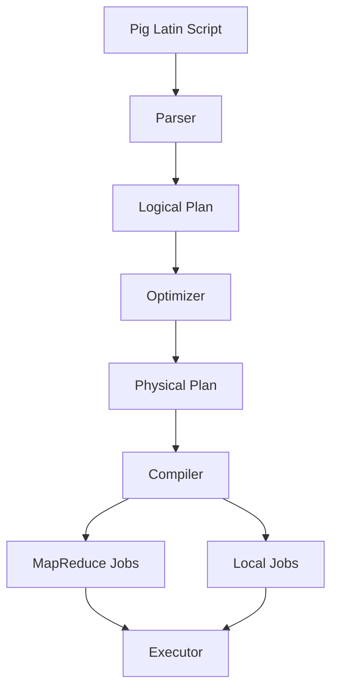

# Pig大规模数据分析平台原理与代码实例讲解

## 1.背景介绍

在当今大数据时代，海量的结构化和非结构化数据不断产生和积累。这些数据蕴含着巨大的商业价值和洞见,但如何高效地处理和分析这些数据成为了一个巨大的挑战。Apache Pig是一个用于大规模数据分析的平台和编程框架,旨在解决这一挑战。

Pig是基于Apache Hadoop构建的,它提供了一种高级的数据流语言(Pig Latin),使开发人员可以专注于描述数据转换,而不必担心底层MapReduce的复杂性。Pig Latin使得数据操作更加简单,并提供了优化器来优化执行计划,从而提高了处理效率。

Pig的主要优势在于它的可扩展性、容错性和高效性。它可以在大规模分布式集群上运行,并自动处理硬件故障。此外,Pig还支持多种数据格式,如结构化数据(如CSV、TSV)和半结构化数据(如JSON、XML),使其在处理各种数据源时具有极大的灵活性。

## 2.核心概念与联系

### 2.1 Pig Latin

Pig Latin是Pig平台的核心,它是一种数据流语言,用于描述数据的转换和分析。Pig Latin提供了一组丰富的操作符,如`LOAD`、`FILTER`、`GROUP`、`JOIN`等,用于加载数据、过滤数据、分组数据和连接数据等操作。

Pig Latin程序由一系列关系(Relation)组成,每个关系代表一个数据集。关系通过操作符进行转换,形成数据流水线。最终结果可以存储在HDFS或其他数据存储系统中。

```pig
-- 加载数据
records = LOAD 'input_data' USING PigStorage(',') AS (id:int, name:chararray, age:int);

-- 过滤数据
filtered_records = FILTER records BY age > 18;

-- 分组和聚合
grouped_records = GROUP filtered_records BY name;
result = FOREACH grouped_records GENERATE group, COUNT(filtered_records);

-- 存储结果
STORE result INTO 'output_data';
```

### 2.2 Pig运行模式

Pig支持两种运行模式:本地模式(Local Mode)和MapReduce模式(MapReduce Mode)。

- 本地模式:适用于小规模数据处理和调试,在单机上运行,不需要Hadoop集群。
- MapReduce模式:适用于大规模数据处理,在Hadoop集群上运行,利用MapReduce的并行计算能力。

### 2.3 Pig架构

Pig的架构由以下几个主要组件组成:

1. **Parser**: 解析Pig Latin脚本,生成逻辑计划(Logical Plan)。
2. **Optimizer**: 优化逻辑计划,生成物理计划(Physical Plan)。
3. **Compiler**: 将物理计划编译为MapReduce作业或本地作业。
4. **Executor**: 执行MapReduce作业或本地作业。



## 3.核心算法原理具体操作步骤

Pig的核心算法原理主要体现在优化器(Optimizer)和编译器(Compiler)两个组件中。

### 3.1 优化器(Optimizer)

优化器的主要任务是优化逻辑计划,生成高效的物理计划。它包括以下几个主要步骤:

1. **逻辑优化(Logical Optimization)**:对逻辑计划进行优化,如投影剪枝(Projection Pruning)、常量折叠(Constant Folding)等。
2. **MapReduce优化(MapReduce Optimization)**:将逻辑计划转换为MapReduce作业,并进行优化,如Map端合并(Map-Side Combine)、分区(Partitioning)等。
3. **代价模型(Cost Model)**:根据代价模型选择最优的执行计划。

### 3.2 编译器(Compiler)

编译器的主要任务是将优化后的物理计划编译为MapReduce作业或本地作业。它包括以下几个主要步骤:

1. **作业构建(Job Building)**:根据物理计划构建MapReduce作业或本地作业。
2. **作业优化(Job Optimization)**:对MapReduce作业进行进一步优化,如设置作业参数、压缩等。
3. **作业提交(Job Submission)**:将MapReduce作业提交到Hadoop集群执行,或在本地执行本地作业。

## 4.数学模型和公式详细讲解举例说明

在Pig中,一些常见的数学操作可以使用内置函数或用户自定义函数(UDF)来实现。下面是一些常见的数学模型和公式,以及在Pig中的实现方式。

### 4.1 平均值(Average)

平均值是一组数据的算术平均,计算公式如下:

$$\overline{x} = \frac{1}{n}\sum_{i=1}^{n}x_i$$

其中,$ \overline{x} $表示平均值,$ n $表示数据个数,$ x_i $表示第$ i $个数据。

在Pig中,可以使用`AVG`函数计算平均值:

```pig
-- 计算年龄的平均值
ages = LOAD 'input_data' AS (age:int);
avg_age = FOREACH (GROUP ages ALL) GENERATE AVG(ages.age);
DUMP avg_age;
```

### 4.2 标准差(Standard Deviation)

标准差是衡量数据分散程度的一种指标,计算公式如下:

$$\sigma = \sqrt{\frac{1}{n}\sum_{i=1}^{n}(x_i - \overline{x})^2}$$

其中,$ \sigma $表示标准差,$ n $表示数据个数,$ x_i $表示第$ i $个数据,$ \overline{x} $表示平均值。

在Pig中,可以使用`STDDEV`函数计算标准差:

```pig
-- 计算年龄的标准差
ages = LOAD 'input_data' AS (age:int);
std_age = FOREACH (GROUP ages ALL) GENERATE STDDEV(ages.age);
DUMP std_age;
```

### 4.3 线性回归(Linear Regression)

线性回归是一种常见的机器学习模型,用于建立自变量和因变量之间的线性关系。线性回归模型的公式如下:

$$y = \beta_0 + \beta_1x_1 + \beta_2x_2 + ... + \beta_nx_n + \epsilon$$

其中,$ y $表示因变量,$ x_1, x_2, ..., x_n $表示自变量,$ \beta_0, \beta_1, ..., \beta_n $表示回归系数,$ \epsilon $表示残差。

在Pig中,可以使用`DataFu`库中的`STREAM`函数实现线性回归:

```pig
-- 加载数据
data = LOAD 'input_data' AS (x1:double, x2:double, y:double);

-- 执行线性回归
DEFINE LinearRegression datafu.pig.linear.LinearRegression();
regression = STREAM data THROUGH LinearRegression('y', '1', 'x1', 'x2');

-- 输出回归系数
DUMP regression;
```

在上面的示例中,`LinearRegression`函数接收因变量`y`、常数项`1`和自变量`x1`、`x2`,并输出回归系数。

## 5.项目实践：代码实例和详细解释说明

在本节中,我们将通过一个实际项目示例来演示如何使用Pig进行大规模数据分析。该项目的目标是统计网站日志中的用户访问情况,包括每个用户的访问次数、访问时长等指标。

### 5.1 数据准备

假设我们有一个网站日志文件`access_log.txt`,其中每一行记录了一次用户访问,格式如下:

```
user_id,timestamp,duration
```

其中,`user_id`表示用户ID,`timestamp`表示访问时间戳,`duration`表示访问时长(秒)。

我们将该文件上传到HDFS中,路径为`/user/data/access_log.txt`。

### 5.2 Pig Latin脚本

下面是一个Pig Latin脚本,用于统计用户访问情况:

```pig
-- 加载数据
access_log = LOAD '/user/data/access_log.txt' USING PigStorage(',') AS (user_id:chararray, timestamp:chararray, duration:int);

-- 过滤无效记录
filtered_log = FILTER access_log BY duration > 0;

-- 分组统计
grouped_log = GROUP filtered_log BY user_id;
user_stats = FOREACH grouped_log GENERATE
    group AS user_id,
    COUNT(filtered_log) AS visit_count,
    SUM(filtered_log.duration) AS total_duration;

-- 存储结果
STORE user_stats INTO '/user/output/user_stats' USING PigStorage(',');
```

下面是对该脚本的详细解释:

1. `LOAD`语句用于加载网站日志数据,使用`PigStorage`函数指定字段分隔符为逗号。
2. `FILTER`语句用于过滤掉无效记录,即访问时长小于等于0的记录。
3. `GROUP`语句用于按照用户ID对记录进行分组。
4. `FOREACH`语句用于对每个分组进行统计计算,包括访问次数(`COUNT`)和总访问时长(`SUM`)。
5. `STORE`语句用于将统计结果存储到HDFS中。

### 5.3 执行脚本

我们可以使用以下命令在Hadoop集群上执行Pig Latin脚本:

```
pig -x mapreduce /path/to/user_stats.pig
```

该命令将在MapReduce模式下执行`user_stats.pig`脚本。执行完成后,结果文件`/user/output/user_stats`将包含每个用户的访问次数和总访问时长。

### 5.4 结果示例

假设执行后的结果文件`/user/output/user_stats`内容如下:

```
user1,100,36000
user2,50,18000
user3,200,72000
```

每一行表示一个用户的统计结果,格式为`user_id,visit_count,total_duration`。

- `user1`访问了100次,总访问时长为36000秒(10小时)。
- `user2`访问了50次,总访问时长为18000秒(5小时)。
- `user3`访问了200次,总访问时长为72000秒(20小时)。

## 6.实际应用场景

Pig大规模数据分析平台在各种领域都有广泛的应用场景,包括但不限于以下几个方面:

1. **网络日志分析**: 分析网站访问日志、用户行为日志等,了解用户访问模式、优化网站性能。
2. **电子商务分析**: 分析用户购买记录、浏览历史等,发现用户偏好,进行个性化推荐和营销策略优化。
3. **社交网络分析**: 分析用户社交关系、内容传播等,发现影响力用户、热点话题,优化社交网络体验。
4. **金融风控分析**: 分析金融交易记录、用户信用信息等,识别异常行为,防范金融风险。
5. **物联网数据分析**: 分析传感器数据、设备运行日志等,监控设备状态,优化设备运行效率。
6. **基因组学分析**: 分析基因序列数据,发现基因模式,促进基因组学研究。

总的来说,Pig大规模数据分析平台可以应用于各种需要处理海量数据的场景,帮助企业和组织从数据中挖掘洞见,提高决策效率和业务绩效。

## 7.工具和资源推荐

在使用Pig进行大规模数据分析时,有一些工具和资源可以为您提供帮助:

1. **Apache Pig官方文档**: Apache Pig官方文档(https://pig.apache.org/docs/)提供了详细的语法参考、示例和最佳实践。
2. **DataFu**: DataFu(https://datafu.apache.org/)是一个用于Apache Pig的库,提供了许多有用的用户自定义函数(UDF),如统计函数、机器学习函数等。
3. **Pig Book**: Pig Book(https://pig.apache.org/book/)是一本免费的在线书籍,全面介绍了Pig的概念、语法和使用方法。
4. **Pig Stack Overflow**: Stack Overflow(https://stackoverflow.com/questions/tagged/pig)上有许多关于Pig的问题和答案,可以作为一个很好的参考资源。
5. **Pig用户邮件列表**: Apache Pig用户邮件列表(https://pig.apache.org/mail_lists.html)是一个讨论和分享Pig相关问题的社区。
6. **Pig培训课程**:一些公司和机构提供Pig培训课程,可以帮助您快速掌握Pig的使用方法。

利用这些工具和资源,您可以更好地学习和使用Pig,提高大规模数据分析的效率和质量。

## 8.总结:未