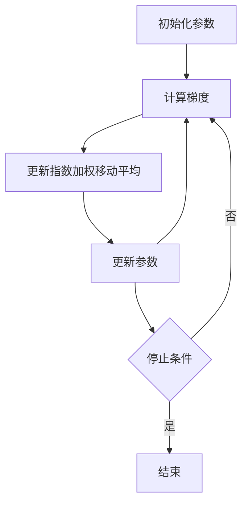

# RMSProp优化算法原理与代码实战案例讲解

## 1.背景介绍

在机器学习和深度学习领域，优化算法是训练模型的关键环节。优化算法的选择直接影响模型的收敛速度和最终性能。传统的梯度下降法虽然简单易懂，但在实际应用中存在一些问题，如学习率难以调节、容易陷入局部最优等。为了解决这些问题，研究人员提出了多种改进算法，其中RMSProp（Root Mean Square Propagation）是较为常用的一种。

RMSProp由Geoffrey Hinton在其Coursera课程中提出，旨在解决Adagrad算法在训练深度神经网络时学习率衰减过快的问题。RMSProp通过引入指数加权移动平均来调整学习率，使得算法在训练过程中能够更稳定地收敛。

## 2.核心概念与联系

在深入探讨RMSProp之前，我们需要了解一些基本概念和相关算法：

### 2.1 梯度下降法

梯度下降法是一种优化算法，用于最小化目标函数。其基本思想是沿着目标函数的负梯度方向更新参数，以逐步逼近最优解。公式如下：

$$
\theta_{t+1} = \theta_t - \eta \nabla_\theta J(\theta_t)
$$

其中，$\theta_t$表示第$t$次迭代的参数，$\eta$是学习率，$\nabla_\theta J(\theta_t)$是目标函数$J$关于参数$\theta$的梯度。

### 2.2 Adagrad算法

Adagrad（Adaptive Gradient Algorithm）是一种自适应学习率的优化算法。其核心思想是根据历史梯度信息调整每个参数的学习率。公式如下：

$$
\theta_{t+1} = \theta_t - \frac{\eta}{\sqrt{G_t + \epsilon}} \nabla_\theta J(\theta_t)
$$

其中，$G_t$是梯度平方和的累积矩阵，$\epsilon$是一个小常数，用于防止分母为零。

### 2.3 RMSProp算法

RMSProp是对Adagrad的改进，通过引入指数加权移动平均来平滑梯度平方和，从而避免学习率衰减过快的问题。其更新公式如下：

$$
E[g^2]_t = \gamma E[g^2]_{t-1} + (1 - \gamma) g_t^2
$$

$$
\theta_{t+1} = \theta_t - \frac{\eta}{\sqrt{E[g^2]_t + \epsilon}} g_t
$$

其中，$E[g^2]_t$是梯度平方的指数加权移动平均，$\gamma$是衰减率，$g_t$是当前梯度。

## 3.核心算法原理具体操作步骤

RMSProp的核心在于通过指数加权移动平均来平滑梯度平方和，从而动态调整学习率。具体操作步骤如下：

### 3.1 初始化参数

初始化模型参数$\theta$和梯度平方的指数加权移动平均$E[g^2]_0$。通常，$E[g^2]_0$初始化为零。

### 3.2 计算梯度

在每次迭代中，计算当前参数$\theta_t$的梯度$g_t$。

### 3.3 更新指数加权移动平均

使用当前梯度平方更新指数加权移动平均：

$$
E[g^2]_t = \gamma E[g^2]_{t-1} + (1 - \gamma) g_t^2
$$

### 3.4 更新参数

根据更新后的指数加权移动平均调整学习率，并更新参数：

$$
\theta_{t+1} = \theta_t - \frac{\eta}{\sqrt{E[g^2]_t + \epsilon}} g_t
$$

### 3.5 重复迭代

重复步骤3.2至3.4，直到满足停止条件（如达到最大迭代次数或损失函数收敛）。

以下是RMSProp算法的Mermaid流程图：



## 4.数学模型和公式详细讲解举例说明

为了更好地理解RMSProp算法，我们通过一个具体的例子来详细讲解其数学模型和公式。

假设我们有一个简单的二次函数作为目标函数：

$$
J(\theta) = \frac{1}{2} \theta^2
$$

其梯度为：

$$
\nabla_\theta J(\theta) = \theta
$$

### 4.1 初始化参数

假设初始参数$\theta_0 = 2$，学习率$\eta = 0.1$，衰减率$\gamma = 0.9$，$\epsilon = 1e-8$。

### 4.2 第一次迭代

计算梯度：

$$
g_0 = \theta_0 = 2
$$

更新指数加权移动平均：

$$
E[g^2]_1 = 0.9 \cdot 0 + 0.1 \cdot 2^2 = 0.4
$$

更新参数：

$$
\theta_1 = 2 - \frac{0.1}{\sqrt{0.4 + 1e-8}} \cdot 2 \approx 1.683
$$

### 4.3 第二次迭代

计算梯度：

$$
g_1 = \theta_1 \approx 1.683
$$

更新指数加权移动平均：

$$
E[g^2]_2 = 0.9 \cdot 0.4 + 0.1 \cdot 1.683^2 \approx 0.637
$$

更新参数：

$$
\theta_2 \approx 1.683 - \frac{0.1}{\sqrt{0.637 + 1e-8}} \cdot 1.683 \approx 1.436
$$

通过以上步骤，我们可以看到RMSProp算法如何动态调整学习率，使得参数更新更加稳定。

## 5.项目实践：代码实例和详细解释说明

为了更好地理解RMSProp算法，我们通过一个具体的代码实例来演示其实现过程。以下是使用Python和NumPy实现的RMSProp算法：

```python
import numpy as np

# 定义目标函数和梯度
def J(theta):
    return 0.5 * theta ** 2

def grad_J(theta):
    return theta

# 初始化参数
theta = 2.0
eta = 0.1
gamma = 0.9
epsilon = 1e-8
E_g2 = 0

# 迭代次数
num_iterations = 100

# 记录参数更新过程
theta_history = []

for t in range(num_iterations):
    # 计算梯度
    g_t = grad_J(theta)
    
    # 更新指数加权移动平均
    E_g2 = gamma * E_g2 + (1 - gamma) * g_t ** 2
    
    # 更新参数
    theta = theta - eta / np.sqrt(E_g2 + epsilon) * g_t
    
    # 记录参数
    theta_history.append(theta)

# 打印最终参数
print("最终参数值:", theta)

# 绘制参数更新过程
import matplotlib.pyplot as plt

plt.plot(theta_history)
plt.xlabel("迭代次数")
plt.ylabel("参数值")
plt.title("RMSProp参数更新过程")
plt.show()
```

### 代码解释

1. **定义目标函数和梯度**：我们定义了一个简单的二次函数$J(\theta) = \frac{1}{2} \theta^2$及其梯度。
2. **初始化参数**：初始化参数$\theta$、学习率$\eta$、衰减率$\gamma$、小常数$\epsilon$和指数加权移动平均$E_g2$。
3. **迭代更新**：在每次迭代中，计算梯度$g_t$，更新指数加权移动平均$E_g2$，并根据更新后的$E_g2$调整学习率，更新参数$\theta$。
4. **记录参数更新过程**：将每次迭代后的参数值记录下来，以便后续绘图。
5. **绘制参数更新过程**：使用Matplotlib绘制参数更新过程的曲线图。

通过以上代码实例，我们可以直观地看到RMSProp算法在优化过程中如何动态调整学习率，使得参数更新更加稳定。

## 6.实际应用场景

RMSProp算法在深度学习和机器学习的多个实际应用场景中得到了广泛应用。以下是一些典型的应用场景：

### 6.1 图像分类

在图像分类任务中，深度神经网络（如卷积神经网络，CNN）通常需要大量的训练数据和较长的训练时间。RMSProp算法通过动态调整学习率，可以加速模型的收敛过程，提高训练效率。

### 6.2 自然语言处理

在自然语言处理任务中，如文本分类、机器翻译和情感分析，RMSProp算法同样表现出色。由于这些任务的数据维度较高，RMSProp算法能够有效地处理高维数据，避免学习率衰减过快的问题。

### 6.3 强化学习

在强化学习任务中，智能体需要在动态环境中不断学习和调整策略。RMSProp算法通过平滑梯度平方和，可以使智能体在训练过程中更加稳定地更新策略，提高学习效果。

### 6.4 生成对抗网络

生成对抗网络（GAN）在图像生成、数据增强等任务中表现出色。RMSProp算法在训练GAN时，可以帮助生成器和判别器更稳定地更新参数，避免训练过程中的不稳定现象。

## 7.工具和资源推荐

为了更好地理解和应用RMSProp算法，以下是一些推荐的工具和资源：

### 7.1 深度学习框架

- **TensorFlow**：谷歌开发的开源深度学习框架，支持多种优化算法，包括RMSProp。
- **PyTorch**：Facebook开发的开源深度学习框架，具有灵活的动态计算图和强大的调试功能，同样支持RMSProp。

### 7.2 在线课程

- **Coursera**：Geoffrey Hinton的深度学习课程，详细讲解了RMSProp算法的原理和应用。
- **Udacity**：深度学习纳米学位课程，涵盖了多种优化算法的理论和实践。

### 7.3 书籍

- **《深度学习》**：Ian Goodfellow等人编写的经典教材，详细介绍了深度学习的基本概念和优化算法。
- **《神经网络与深度学习》**：Michael Nielsen编写的在线书籍，提供了丰富的理论和实践内容。

## 8.总结：未来发展趋势与挑战

RMSProp算法作为一种自适应学习率的优化算法，在深度学习和机器学习领域得到了广泛应用。其通过引入指数加权移动平均来平滑梯度平方和，解决了Adagrad算法学习率衰减过快的问题，使得模型训练更加稳定和高效。

### 8.1 未来发展趋势

随着深度学习技术的不断发展，优化算法也在不断演进。未来，RMSProp算法可能会与其他优化算法结合，形成更加高效和稳定的混合优化算法。此外，针对不同任务和数据集，研究人员可能会提出更加自适应和智能化的优化算法，以进一步提高模型的性能。

### 8.2 挑战

尽管RMSProp算法在许多应用中表现出色，但仍然存在一些挑战。例如，在处理大规模数据集和复杂模型时，RMSProp算法的计算开销较大。此外，如何选择合适的超参数（如学习率和衰减率）也是一个需要解决的问题。

## 9.附录：常见问题与解答

### 9.1 RMSProp与Adagrad的区别是什么？

RMSProp和Adagrad都是自适应学习率的优化算法。Adagrad通过累积梯度平方和来调整学习率，但在训练深度神经网络时，学习率会迅速衰减。RMSProp通过引入指数加权移动平均来平滑梯度平方和，避免了学习率衰减过快的问题。

### 9.2 如何选择RMSProp的超参数？

RMSProp的主要超参数包括学习率$\eta$、衰减率$\gamma$和小常数$\epsilon$。通常，学习率$\eta$可以选择较小的值（如0.001），衰减率$\gamma$可以选择0.9或0.99，小常数$\epsilon$可以选择1e-8。具体的超参数选择需要根据实际任务和数据集进行调整。

### 9.3 RMSProp适用于哪些任务？

RMSProp适用于多种机器学习和深度学习任务，包括图像分类、自然语言处理、强化学习和生成对抗网络等。其通过动态调整学习率，使得模型在训练过程中更加稳定和高效。

### 9.4 RMSProp与Adam的关系是什么？

Adam（Adaptive Moment Estimation）是另一种常用的自适应学习率优化算法，其结合了RMSProp和动量法的优点。Adam通过计算梯度的一阶矩和二阶矩的指数加权移动平均来调整学习率，使得参数更新更加稳定和高效。

### 9.5 RMSProp在实际应用中有哪些注意事项？

在实际应用中，使用RMSProp算法时需要注意以下几点：
- 合理选择超参数，避免学习率过大或过小。
- 监控训练过程中的损失函数和梯度变化，及时调整超参数。
- 在处理大规模数据集时，可以结合分布式训练技术，提高训练效率。

---

作者：禅与计算机程序设计艺术 / Zen and the Art of Computer Programming