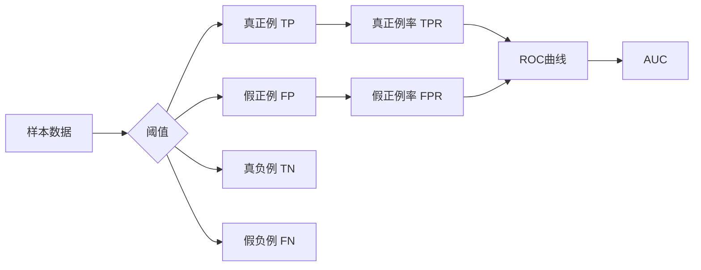

# ROC曲线原理与代码实例讲解

## 1. 背景介绍

### 1.1 什么是ROC曲线

ROC曲线（Receiver Operating Characteristic Curve）是一种用于评估二分类模型性能的图形工具。它通过绘制不同阈值下真正例率（TPR）和假正例率（FPR）的变化情况，直观地展示了分类器的性能。

### 1.2 ROC曲线的意义

ROC曲线可以帮助我们：
- 评估分类器的整体性能
- 选择最佳阈值
- 比较不同分类器的性能

### 1.3 ROC曲线的应用领域

ROC曲线广泛应用于各种领域，例如：
- 医学诊断
- 信用评分
- 欺诈检测
- 机器学习模型评估

## 2. 核心概念与联系

### 2.1 真正例率（TPR）和假正例率（FPR）

- 真正例率（TPR）：在所有实际为正例的样本中，被正确预测为正例的比例。
- 假正例率（FPR）：在所有实际为负例的样本中，被错误预测为正例的比例。

### 2.2 阈值（Threshold）

阈值是一个用于将连续型预测值转换为二分类结果的参数。当预测值大于或等于阈值时，样本被预测为正例；否则，被预测为负例。

### 2.3 ROC曲线与阈值的关系

ROC曲线通过改变阈值，绘制出TPR和FPR在不同阈值下的变化情况。当阈值从高到低变化时，TPR和FPR都会增加。

### 2.4 AUC（Area Under the Curve）

AUC是ROC曲线下的面积，它量化了分类器的整体性能。AUC的取值范围为[0, 1]，越接近1表示分类器性能越好。

## 3. 核心算法原理具体操作步骤

### 3.1 计算真正例率（TPR）和假正例率（FPR）

1. 对于每个阈值：
   - 将预测值大于或等于阈值的样本预测为正例，否则预测为负例。
   - 计算真正例数（TP）、假正例数（FP）、真负例数（TN）和假负例数（FN）。
   - 计算TPR = TP / (TP + FN)。
   - 计算FPR = FP / (FP + TN)。

2. 将TPR和FPR存储在列表中。

### 3.2 绘制ROC曲线

1. 将FPR作为x轴，TPR作为y轴。
2. 绘制(0, 0)和(1, 1)两个点，表示随机猜测的性能。
3. 按照FPR从小到大的顺序，依次绘制(FPR, TPR)点。
4. 连接相邻的点，形成ROC曲线。

### 3.3 计算AUC

1. 初始化AUC为0。
2. 对于每对相邻的点(FPR1, TPR1)和(FPR2, TPR2)：
   - 计算矩形面积：(FPR2 - FPR1) * TPR1。
   - 计算梯形面积：0.5 * (FPR2 - FPR1) * (TPR2 - TPR1)。
   - 将矩形面积和梯形面积相加，累加到AUC中。

3. 返回AUC。

## 4. 数学模型和公式详细讲解举例说明

### 4.1 混淆矩阵

混淆矩阵是一个用于评估二分类模型性能的表格，它包含四个关键指标：

- 真正例（TP）：实际为正例，被正确预测为正例的样本数。
- 假正例（FP）：实际为负例，被错误预测为正例的样本数。
- 真负例（TN）：实际为负例，被正确预测为负例的样本数。
- 假负例（FN）：实际为正例，被错误预测为负例的样本数。

混淆矩阵可以表示为：

$$
\begin{matrix}
& \text{Predicted Positive} & \text{Predicted Negative} \\
\text{Actual Positive} & \text{TP} & \text{FN} \\
\text{Actual Negative} & \text{FP} & \text{TN}
\end{matrix}
$$

### 4.2 真正例率（TPR）和假正例率（FPR）的计算

- 真正例率（TPR）：$TPR = \frac{TP}{TP + FN}$
- 假正例率（FPR）：$FPR = \frac{FP}{FP + TN}$

### 4.3 AUC的计算

AUC可以通过梯形法计算：

$$AUC = \sum_{i=1}^{n-1} \frac{1}{2}(FPR_{i+1} - FPR_i)(TPR_{i+1} + TPR_i)$$

其中，$n$是ROC曲线上的点的数量，$FPR_i$和$TPR_i$分别表示第$i$个点的假正例率和真正例率。

## 5. 项目实践：代码实例和详细解释说明

以下是使用Python实现ROC曲线和AUC计算的示例代码：

```python
import numpy as np
import matplotlib.pyplot as plt
from sklearn.metrics import roc_curve, auc

# 假设y_true和y_score是实际标签和预测值
y_true = np.array([1, 0, 1, 1, 0, 0, 1, 0, 1, 0])
y_score = np.array([0.8, 0.3, 0.9, 0.7, 0.4, 0.2, 0.6, 0.1, 0.5, 0.4])

# 计算ROC曲线和AUC
fpr, tpr, thresholds = roc_curve(y_true, y_score)
roc_auc = auc(fpr, tpr)

# 绘制ROC曲线
plt.figure()
plt.plot(fpr, tpr, color='darkorange', lw=2, label='ROC curve (AUC = %0.2f)' % roc_auc)
plt.plot([0, 1], [0, 1], color='navy', lw=2, linestyle='--')
plt.xlim([0.0, 1.0])
plt.ylim([0.0, 1.05])
plt.xlabel('False Positive Rate')
plt.ylabel('True Positive Rate')
plt.title('Receiver Operating Characteristic')
plt.legend(loc="lower right")
plt.show()
```

代码解释：
1. 导入必要的库：NumPy、Matplotlib和scikit-learn中的`roc_curve`和`auc`函数。
2. 准备实际标签（`y_true`）和预测值（`y_score`）。
3. 使用`roc_curve`函数计算ROC曲线上的点（`fpr`和`tpr`）以及对应的阈值（`thresholds`）。
4. 使用`auc`函数计算AUC。
5. 使用Matplotlib绘制ROC曲线，并显示AUC值。

## 6. 实际应用场景

ROC曲线在许多实际应用场景中发挥着重要作用，例如：

### 6.1 医学诊断

在医学诊断中，ROC曲线可以用于评估诊断测试的性能。通过分析ROC曲线和AUC，医生可以选择最佳的阈值，平衡敏感性和特异性，从而提高诊断的准确性。

### 6.2 信用评分

在信用评分中，ROC曲线可以用于评估信用评分模型的性能。通过分析ROC曲线和AUC，金融机构可以优化信用评分模型，提高信用风险的识别能力，减少坏账损失。

### 6.3 欺诈检测

在欺诈检测中，ROC曲线可以用于评估欺诈检测模型的性能。通过分析ROC曲线和AUC，企业可以选择最佳的阈值，在降低误报率的同时提高欺诈检测的准确性，保护企业利益。

## 7. 工具和资源推荐

以下是一些用于计算和绘制ROC曲线的工具和资源：

- scikit-learn：Python机器学习库，提供了`roc_curve`和`auc`函数。
- ROCR：R语言的ROC曲线绘制和分析包。
- pROC：另一个R语言的ROC曲线绘制和分析包。
- MedCalc：医学统计软件，提供ROC曲线分析功能。
- IBM SPSS：统计分析软件，提供ROC曲线分析功能。

## 8. 总结：未来发展趋势与挑战

ROC曲线是评估二分类模型性能的重要工具，它直观地展示了分类器在不同阈值下的性能表现。随着机器学习和人工智能技术的不断发展，ROC曲线的应用领域也在不断扩大。

未来，ROC曲线可能面临以下发展趋势和挑战：

- 多分类问题：传统的ROC曲线主要用于二分类问题，如何将ROC曲线扩展到多分类问题仍然是一个挑战。
- 不平衡数据：在不平衡数据集中，ROC曲线可能无法准确反映分类器的性能，需要探索新的评估指标和方法。
- 大数据场景：在大数据场景下，如何高效地计算和绘制ROC曲线是一个值得研究的问题。
- 解释性：虽然ROC曲线直观易懂，但对于非专业人士来说，理解ROC曲线背后的原理可能存在一定困难，提高ROC曲线的解释性是一个重要的研究方向。

## 9. 附录：常见问题与解答

### 9.1 ROC曲线和PR曲线有什么区别？

ROC曲线和PR（Precision-Recall）曲线都是评估二分类模型性能的工具，但它们侧重点不同：

- ROC曲线关注真正例率和假正例率，适用于平衡数据集。
- PR曲线关注精确率和召回率，适用于不平衡数据集。

### 9.2 如何选择最佳阈值？

选择最佳阈值取决于具体的应用场景和业务需求。常见的方法有：

- 约登指数（Youden's J statistic）：最大化灵敏度和特异性之和。
- 最佳平衡点：在ROC曲线上与(0, 1)点距离最近的点。
- 特定的灵敏度或特异性要求：根据业务需求，选择满足特定灵敏度或特异性要求的阈值。

### 9.3 AUC值的含义是什么？

AUC（Area Under the Curve）表示ROC曲线下的面积，取值范围为[0, 1]。AUC值越大，表示分类器的整体性能越好。一般来说，AUC值可以解释为：

- AUC = 0.5：分类器的性能与随机猜测相当。
- 0.5 < AUC < 1：分类器的性能优于随机猜测，AUC越接近1，性能越好。
- AUC < 0.5：分类器的性能劣于随机猜测，需要进一步改进。



以上是关于ROC曲线原理与代码实例的详细讲解。ROC曲线是评估二分类模型性能的重要工具，通过分析ROC曲线和AUC，我们可以全面了解分类器的性能，选择最佳阈值，并进行模型比较和优化。无论是在医学诊断、信用评分、欺诈检测还是其他领域，ROC曲线都发挥着重要作用，帮助我们建立更加准确和可靠的分类模型。

作者：禅与计算机程序设计艺术 / Zen and the Art of Computer Programming