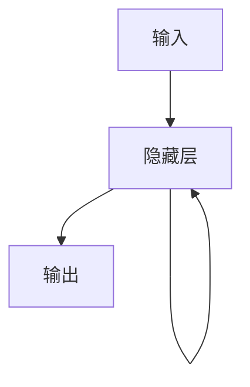

## 1.背景介绍

在机器学习领域，循环神经网络（Recurrent Neural Networks，RNN）是一种非常重要的模型。与传统的前馈神经网络不同，RNN具有记忆功能，可以处理序列数据，如语音、文本、时间序列等。因此，RNN在自然语言处理、语音识别、机器翻译、图像描述等领域有着广泛的应用。

## 2.核心概念与联系

RNN是一种神经网络模型，它的核心思想是将前一时刻的输出作为当前时刻的输入，从而实现对序列数据的处理。RNN的基本结构如下图所示：



其中，输入$x_t$和输出$y_t$都是向量，隐藏层$h_t$也是向量，它们的关系可以用下面的公式表示：

$$h_t = f(W_{xh}x_t + W_{hh}h_{t-1} + b_h)$$

$$y_t = g(W_{hy}h_t + b_y)$$

其中，$W_{xh}$、$W_{hh}$、$W_{hy}$分别是输入到隐藏层、隐藏层到隐藏层、隐藏层到输出层的权重矩阵，$b_h$、$b_y$分别是隐藏层和输出层的偏置向量，$f$和$g$是激活函数。

RNN的核心思想是将前一时刻的隐藏状态$h_{t-1}$作为当前时刻的输入，从而实现对序列数据的处理。这种记忆功能使得RNN可以处理变长的序列数据，如文本、语音、时间序列等。

## 3.核心算法原理具体操作步骤

RNN的训练过程可以使用反向传播算法，通过最小化损失函数来更新权重和偏置。具体来说，可以使用随时间反向传播算法（Backpropagation Through Time，BPTT）来计算梯度。

BPTT算法的基本思想是将序列数据展开成一个时间步长的前馈神经网络，然后使用标准的反向传播算法来计算梯度。具体来说，可以使用链式法则来计算梯度，如下所示：

$$\frac{\partial L}{\partial W_{hy}} = \sum_{t=1}^T \frac{\partial L}{\partial y_t} \frac{\partial y_t}{\partial W_{hy}}$$

$$\frac{\partial L}{\partial W_{hh}} = \sum_{t=1}^T \frac{\partial L}{\partial h_t} \frac{\partial h_t}{\partial W_{hh}}$$

$$\frac{\partial L}{\partial W_{xh}} = \sum_{t=1}^T \frac{\partial L}{\partial h_t} \frac{\partial h_t}{\partial W_{xh}}$$

其中，$L$是损失函数，$T$是序列的长度。

## 4.数学模型和公式详细讲解举例说明

为了更好地理解RNN的数学模型和公式，我们可以以文本生成为例进行说明。假设我们有一个文本序列$X$，我们希望使用RNN来生成一个新的文本序列$Y$，使得$Y$与$X$具有相似的语言风格和语法结构。

首先，我们需要将文本序列$X$转换成向量序列$x_1, x_2, ..., x_T$，其中$T$是序列的长度。这可以通过将每个单词映射到一个向量来实现，例如使用词向量。

然后，我们可以使用RNN来生成一个新的文本序列$Y$，具体来说，我们可以使用下面的公式来计算每个时刻的输出：

$$h_t = f(W_{xh}x_t + W_{hh}h_{t-1} + b_h)$$

$$y_t = g(W_{hy}h_t + b_y)$$

其中，$h_t$是隐藏状态，$y_t$是输出，$W_{xh}$、$W_{hh}$、$W_{hy}$分别是输入到隐藏层、隐藏层到隐藏层、隐藏层到输出层的权重矩阵，$b_h$、$b_y$分别是隐藏层和输出层的偏置向量，$f$和$g$是激活函数。

在文本生成任务中，我们可以将$y_t$作为下一个时刻的输入$x_{t+1}$，从而实现对序列数据的处理。具体来说，我们可以使用下面的公式来计算每个时刻的输入：

$$x_{t+1} = y_t$$

最后，我们可以使用交叉熵损失函数来衡量生成的文本序列$Y$与目标文本序列$X$之间的差异，从而进行模型的训练。

## 5.项目实践：代码实例和详细解释说明

下面，我们将使用Python和TensorFlow来实现一个简单的文本生成模型，以便更好地理解RNN的实现过程。

首先，我们需要加载数据集。这里我们使用莎士比亚的诗歌作为数据集，代码如下：

```python
import urllib.request

url = 'https://raw.githubusercontent.com/karpathy/char-rnn/master/data/tinyshakespeare/input.txt'
filename = 'input.txt'
urllib.request.urlretrieve(url, filename)
with open(filename, 'r') as f:
    text = f.read()
```

然后，我们需要将文本转换成向量序列。这里我们使用字符级别的RNN，将每个字符映射到一个向量。具体来说，我们可以使用one-hot编码来实现，代码如下：

```python
import numpy as np

chars = list(set(text))
char_to_idx = {ch:i for i, ch in enumerate(chars)}
idx_to_char = {i:ch for i, ch in enumerate(chars)}

seq_length = 25
num_seqs = len(text) // seq_length
X = np.zeros((num_seqs, seq_length, len(chars)))
Y = np.zeros((num_seqs, seq_length, len(chars)))
for i in range(num_seqs):
    X_sequence = text[i*seq_length:(i+1)*seq_length]
    X_sequence_idx = [char_to_idx[ch] for ch in X_sequence]
    X_sequence_one_hot = np.zeros((seq_length, len(chars)))
    X_sequence_one_hot[np.arange(seq_length), X_sequence_idx] = 1
    X[i,:,:] = X_sequence_one_hot
    
    Y_sequence = text[i*seq_length+1:(i+1)*seq_length+1]
    Y_sequence_idx = [char_to_idx[ch] for ch in Y_sequence]
    Y_sequence_one_hot = np.zeros((seq_length, len(chars)))
    Y_sequence_one_hot[np.arange(seq_length), Y_sequence_idx] = 1
    Y[i,:,:] = Y_sequence_one_hot
```

接下来，我们可以定义RNN模型。这里我们使用一个单层的LSTM网络，代码如下：

```python
import tensorflow as tf

num_hidden = 256
num_layers = 1
learning_rate = 0.01

inputs = tf.keras.layers.Input(shape=(seq_length, len(chars)))
lstm = tf.keras.layers.LSTM(num_hidden, return_sequences=True)(inputs)
outputs = tf.keras.layers.Dense(len(chars), activation='softmax')(lstm)
model = tf.keras.Model(inputs=inputs, outputs=outputs)

optimizer = tf.keras.optimizers.Adam(learning_rate=learning_rate)
model.compile(loss='categorical_crossentropy', optimizer=optimizer)
```

最后，我们可以使用训练数据来训练模型，代码如下：

```python
batch_size = 128
num_epochs = 100

model.fit(X, Y, batch_size=batch_size, epochs=num_epochs)
```

## 6.实际应用场景

RNN在自然语言处理、语音识别、机器翻译、图像描述等领域有着广泛的应用。下面，我们将以机器翻译为例，介绍RNN在实际应用中的应用。

机器翻译是一种将一种语言的文本转换成另一种语言的文本的任务。RNN可以用于机器翻译，具体来说，我们可以使用编码器-解码器模型来实现。编码器将源语言的文本序列转换成一个向量，解码器将这个向量转换成目标语言的文本序列。

具体来说，我们可以使用双向LSTM作为编码器，将源语言的文本序列转换成一个向量。然后，我们可以使用单向LSTM作为解码器，将这个向量转换成目标语言的文本序列。在训练过程中，我们可以使用交叉熵损失函数来衡量生成的目标语言文本序列与真实目标语言文本序列之间的差异，从而进行模型的训练。

## 7.工具和资源推荐

以下是一些RNN相关的工具和资源：

- TensorFlow：一个流行的深度学习框架，支持RNN等模型的实现。
- PyTorch：另一个流行的深度学习框架，支持RNN等模型的实现。
- Keras：一个高级深度学习框架，支持RNN等模型的实现。
- Char-RNN：一个使用字符级别RNN生成文本的示例代码库。
- TensorFlow官方文档：包含了RNN等模型的详细介绍和实现方法。

## 8.总结：未来发展趋势与挑战

RNN是一种非常重要的神经网络模型，具有记忆功能，可以处理序列数据。RNN在自然语言处理、语音识别、机器翻译、图像描述等领域有着广泛的应用。未来，随着深度学习技术的不断发展，RNN模型将会变得更加强大和普遍。

然而，RNN模型也面临着一些挑战。例如，RNN模型容易出现梯度消失和梯度爆炸的问题，这会导致模型的训练变得困难。此外，RNN模型也容易出现过拟合的问题，需要采取一些正则化方法来缓解这个问题。

## 9.附录：常见问题与解答

Q: RNN模型有哪些常见的变体？

A: RNN模型有很多常见的变体，例如LSTM、GRU、BiRNN等。这些变体都是为了解决RNN模型中的一些问题而提出的。

Q: RNN模型如何处理变长的序列数据？

A: RNN模型可以使用padding或者截断的方法来处理变长的序列数据。具体来说，可以使用padding将短序列填充到相同的长度，或者使用截断将长序列截断到相同的长度。

Q: RNN模型如何避免过拟合？

A: RNN模型可以采取一些正则化方法来避免过拟合，例如dropout、L2正则化等。

作者：禅与计算机程序设计艺术 / Zen and the Art of Computer Programming