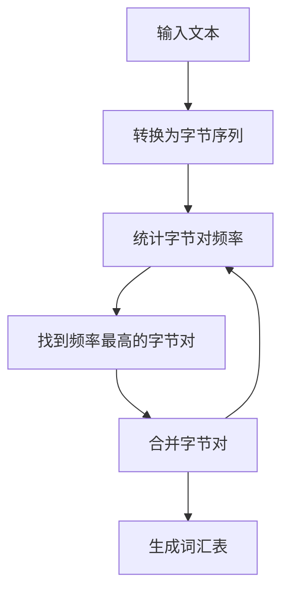

# Transformer大模型实战 使用字节级字节对编码作为子词词元化算法

## 1.背景介绍

在自然语言处理（NLP）领域，Transformer模型已经成为了主流的架构。自从Vaswani等人在2017年提出Transformer以来，它在多个任务中取得了显著的成果。然而，Transformer模型的性能在很大程度上依赖于词元化（tokenization）技术。传统的词元化方法如WordPiece和BPE（Byte Pair Encoding）在处理多语言文本时存在一定的局限性。本文将探讨一种新的词元化方法——字节级字节对编码（Byte-Level Byte Pair Encoding, BLBPE），并展示其在Transformer大模型中的实际应用。

## 2.核心概念与联系

### 2.1 Transformer模型

Transformer模型是一种基于自注意力机制（Self-Attention）的深度学习模型。它通过并行处理输入数据，显著提高了训练速度和效果。Transformer模型的核心组件包括编码器（Encoder）和解码器（Decoder），每个组件由多个层堆叠而成，每层包含多头自注意力机制和前馈神经网络。

### 2.2 词元化

词元化是将文本分割成更小的单元（词元）的过程。传统的词元化方法包括WordPiece、BPE等。这些方法在处理多语言文本时可能会遇到词汇表膨胀和未登录词（OOV）问题。

### 2.3 字节级字节对编码（BLBPE）

BLBPE是一种改进的词元化方法，它在字节级别上进行操作，避免了传统方法中的一些问题。BLBPE通过逐步合并频繁出现的字节对，生成一个紧凑的词汇表，适用于多语言文本处理。

## 3.核心算法原理具体操作步骤

### 3.1 初始词元化

首先，将输入文本转换为字节序列。每个字符被表示为其对应的字节值。

### 3.2 统计字节对频率

统计所有字节对的频率，找到出现频率最高的字节对。

### 3.3 合并字节对

将频率最高的字节对合并为一个新的词元，并更新词汇表。

### 3.4 重复步骤

重复步骤2和步骤3，直到达到预定的词汇表大小或没有频率较高的字节对。

### 3.5 生成最终词汇表

生成最终的词汇表，并用于后续的文本处理。

以下是BLBPE算法的Mermaid流程图：



## 4.数学模型和公式详细讲解举例说明

### 4.1 字节对频率统计

设 $S$ 为输入的字节序列，$P$ 为字节对的集合。对于每个字节对 $(b_i, b_j) \in P$，统计其在 $S$ 中的出现频率 $f(b_i, b_j)$。

$$
f(b_i, b_j) = \sum_{k=1}^{|S|-1} \delta((b_k, b_{k+1}), (b_i, b_j))
$$

其中，$\delta$ 是Kronecker delta函数，当 $(b_k, b_{k+1}) = (b_i, b_j)$ 时，$\delta$ 的值为1，否则为0。

### 4.2 合并字节对

找到频率最高的字节对 $(b_i, b_j)$，将其合并为一个新的词元 $b_{ij}$。更新字节序列 $S$ 和字节对集合 $P$。

$$
S' = S \setminus \{(b_i, b_j)\} \cup \{b_{ij}\}
$$

$$
P' = P \setminus \{(b_i, b_j)\} \cup \{b_{ij}\}
$$

### 4.3 迭代过程

重复上述步骤，直到达到预定的词汇表大小或没有频率较高的字节对。

## 5.项目实践：代码实例和详细解释说明

### 5.1 初始设置

首先，安装必要的Python库：

```bash
pip install transformers
```

### 5.2 数据预处理

将输入文本转换为字节序列：

```python
def text_to_byte_sequence(text):
    return [ord(char) for char in text]

text = "这是一个示例文本"
byte_sequence = text_to_byte_sequence(text)
print(byte_sequence)
```

### 5.3 统计字节对频率

统计字节对的频率：

```python
from collections import defaultdict

def get_byte_pair_frequencies(byte_sequence):
    byte_pair_freq = defaultdict(int)
    for i in range(len(byte_sequence) - 1):
        byte_pair = (byte_sequence[i], byte_sequence[i + 1])
        byte_pair_freq[byte_pair] += 1
    return byte_pair_freq

byte_pair_freq = get_byte_pair_frequencies(byte_sequence)
print(byte_pair_freq)
```

### 5.4 合并字节对

合并频率最高的字节对：

```python
def merge_byte_pair(byte_sequence, byte_pair):
    new_sequence = []
    i = 0
    while i < len(byte_sequence):
        if i < len(byte_sequence) - 1 and (byte_sequence[i], byte_sequence[i + 1]) == byte_pair:
            new_sequence.append(byte_pair)
            i += 2
        else:
            new_sequence.append(byte_sequence[i])
            i += 1
    return new_sequence

most_frequent_pair = max(byte_pair_freq, key=byte_pair_freq.get)
new_byte_sequence = merge_byte_pair(byte_sequence, most_frequent_pair)
print(new_byte_sequence)
```

### 5.5 生成词汇表

重复上述步骤，生成最终的词汇表：

```python
def generate_vocab(byte_sequence, vocab_size):
    vocab = set(byte_sequence)
    while len(vocab) < vocab_size:
        byte_pair_freq = get_byte_pair_frequencies(byte_sequence)
        if not byte_pair_freq:
            break
        most_frequent_pair = max(byte_pair_freq, key=byte_pair_freq.get)
        byte_sequence = merge_byte_pair(byte_sequence, most_frequent_pair)
        vocab.add(most_frequent_pair)
    return vocab

vocab = generate_vocab(byte_sequence, 50)
print(vocab)
```

## 6.实际应用场景

### 6.1 多语言文本处理

BLBPE在处理多语言文本时表现出色。由于它在字节级别上操作，可以有效地处理不同语言的字符集，避免了传统方法中的词汇表膨胀问题。

### 6.2 低资源语言

对于低资源语言，BLBPE可以生成更紧凑的词汇表，提高模型的训练效率和效果。

### 6.3 嵌入式系统

在嵌入式系统中，存储和计算资源有限。BLBPE生成的紧凑词汇表可以减少存储空间和计算开销，适用于嵌入式系统中的NLP应用。

## 7.工具和资源推荐

### 7.1 Hugging Face Transformers

Hugging Face的Transformers库提供了丰富的预训练模型和工具，支持BLBPE词元化方法。

### 7.2 SentencePiece

SentencePiece是一个开源的词元化工具，支持多种词元化方法，包括BLBPE。

### 7.3 Subword-NMT

Subword-NMT是一个用于神经机器翻译的子词词元化工具，支持BPE和BLBPE。

## 8.总结：未来发展趋势与挑战

BLBPE作为一种改进的词元化方法，在多语言文本处理和低资源语言中表现出色。然而，BLBPE也面临一些挑战，如处理长文本时的效率问题和生成词汇表的复杂性。未来，随着NLP技术的发展，BLBPE有望在更多应用场景中得到广泛应用。

## 9.附录：常见问题与解答

### Q1: BLBPE与传统BPE的区别是什么？

BLBPE在字节级别上进行操作，而传统BPE在字符级别上进行操作。BLBPE可以更好地处理多语言文本，避免词汇表膨胀问题。

### Q2: BLBPE适用于哪些应用场景？

BLBPE适用于多语言文本处理、低资源语言和嵌入式系统中的NLP应用。

### Q3: 如何选择词汇表大小？

词汇表大小的选择取决于具体应用场景和计算资源。一般来说，较大的词汇表可以提高模型的表现，但也会增加计算开销。

### Q4: BLBPE的实现复杂吗？

BLBPE的实现相对简单，但生成词汇表的过程可能较为复杂。可以使用现有的工具和库，如Hugging Face Transformers和SentencePiece，来简化实现过程。

作者：禅与计算机程序设计艺术 / Zen and the Art of Computer Programming