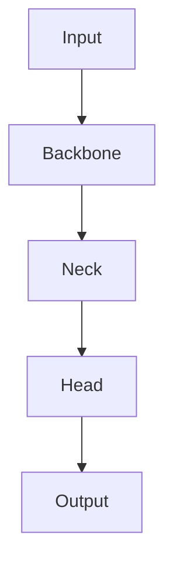

# YOLOv7原理与代码实例讲解

## 1.背景介绍

在计算机视觉领域，目标检测一直是一个重要的研究方向。目标检测技术的进步不仅推动了自动驾驶、智能监控等应用的发展，也为图像理解和分析提供了强有力的工具。YOLO（You Only Look Once）系列算法作为目标检测领域的代表性算法，以其高效的检测速度和较高的准确率受到了广泛关注。YOLOv7是YOLO系列的最新版本，进一步提升了检测性能和速度。本文将深入探讨YOLOv7的原理、算法、数学模型，并通过代码实例展示其实际应用。

## 2.核心概念与联系

### 2.1 YOLO系列算法概述

YOLO系列算法的核心思想是将目标检测问题转化为回归问题，通过单次前向传播实现目标的定位和分类。与传统的基于滑动窗口和区域提议的方法不同，YOLO系列算法直接在整张图像上进行检测，极大地提高了检测速度。

### 2.2 YOLOv7的创新点

YOLOv7在前几代YOLO算法的基础上进行了多项改进，包括但不限于：
- 更高效的网络结构设计
- 改进的损失函数
- 更优的训练策略

这些改进使得YOLOv7在保持高检测速度的同时，进一步提升了检测精度。

### 2.3 YOLOv7与其他目标检测算法的对比

YOLOv7与其他主流目标检测算法（如Faster R-CNN、SSD、RetinaNet等）相比，具有以下优势：
- 更高的检测速度
- 更低的计算资源需求
- 更好的实时性

## 3.核心算法原理具体操作步骤

### 3.1 网络结构设计

YOLOv7的网络结构设计包括以下几个关键部分：
- Backbone：用于提取图像特征的主干网络
- Neck：用于进一步处理特征图的中间层
- Head：用于生成最终检测结果的输出层

以下是YOLOv7网络结构的Mermaid流程图：



### 3.2 损失函数设计

YOLOv7的损失函数由三部分组成：
- 位置损失：用于衡量预测框与真实框之间的差距
- 分类损失：用于衡量预测类别与真实类别之间的差距
- 置信度损失：用于衡量预测框是否包含目标的置信度

### 3.3 训练策略

YOLOv7采用了多种训练策略以提升模型性能，包括数据增强、预训练模型、学习率调度等。

## 4.数学模型和公式详细讲解举例说明

### 4.1 位置损失

位置损失用于衡量预测框与真实框之间的差距，通常采用IoU（Intersection over Union）作为度量标准。IoU的计算公式为：

$$
IoU = \frac{Area\ of\ Overlap}{Area\ of\ Union}
$$

### 4.2 分类损失

分类损失用于衡量预测类别与真实类别之间的差距，通常采用交叉熵损失函数。交叉熵损失的计算公式为：

$$
L_{cls} = -\sum_{i=1}^{C} y_i \log(p_i)
$$

其中，$C$为类别数，$y_i$为真实类别，$p_i$为预测概率。

### 4.3 置信度损失

置信度损失用于衡量预测框是否包含目标的置信度，通常采用二元交叉熵损失。其计算公式为：

$$
L_{conf} = -[y \log(p) + (1 - y) \log(1 - p)]
$$

## 5.项目实践：代码实例和详细解释说明

### 5.1 环境配置

在开始代码实例之前，需要配置好开发环境。以下是所需的主要工具和库：
- Python
- PyTorch
- OpenCV

### 5.2 数据准备

首先，需要准备训练数据集。常用的数据集包括COCO、Pascal VOC等。数据集应包含图像和对应的标注文件。

### 5.3 模型训练

以下是YOLOv7模型训练的代码示例：

```python
import torch
import torchvision.transforms as transforms
from torch.utils.data import DataLoader
from yolo_model import YOLOv7

# 数据预处理
transform = transforms.Compose([
    transforms.Resize((416, 416)),
    transforms.ToTensor(),
])

# 加载数据集
train_dataset = CustomDataset(root='data/train', transform=transform)
train_loader = DataLoader(train_dataset, batch_size=16, shuffle=True)

# 初始化模型
model = YOLOv7(num_classes=80)
optimizer = torch.optim.Adam(model.parameters(), lr=0.001)
criterion = YOLOLoss()

# 训练模型
for epoch in range(100):
    for images, targets in train_loader:
        optimizer.zero_grad()
        outputs = model(images)
        loss = criterion(outputs, targets)
        loss.backward()
        optimizer.step()
    print(f'Epoch {epoch+1}, Loss: {loss.item()}')
```

### 5.4 模型评估

训练完成后，需要对模型进行评估。以下是评估代码示例：

```python
# 加载测试数据集
test_dataset = CustomDataset(root='data/test', transform=transform)
test_loader = DataLoader(test_dataset, batch_size=16, shuffle=False)

# 评估模型
model.eval()
with torch.no_grad():
    for images, targets in test_loader:
        outputs = model(images)
        # 计算评估指标，如mAP
```

## 6.实际应用场景

YOLOv7在多个实际应用场景中表现出色，包括但不限于：
- 自动驾驶：实时检测车辆、行人、交通标志等
- 智能监控：实时监控视频流中的异常行为
- 医疗影像分析：检测医学图像中的病变区域
- 工业检测：检测生产线上的缺陷产品

## 7.工具和资源推荐

### 7.1 开发工具

- PyTorch：深度学习框架
- OpenCV：计算机视觉库
- Jupyter Notebook：交互式开发环境

### 7.2 学习资源

- 官方文档：YOLOv7官方文档和教程
- 论文：YOLO系列算法的相关论文
- 开源项目：GitHub上的YOLOv7开源项目

## 8.总结：未来发展趋势与挑战

YOLOv7作为YOLO系列的最新版本，在目标检测领域取得了显著的进展。然而，随着应用场景的不断扩展和需求的不断提高，YOLOv7仍面临一些挑战：
- 更高的检测精度：在复杂场景下，如何进一步提升检测精度
- 更低的计算资源需求：在资源受限的设备上，如何实现高效的目标检测
- 更好的泛化能力：在不同数据集和应用场景下，如何保持稳定的检测性能

未来，随着深度学习技术的不断发展和硬件性能的提升，YOLOv7及其后续版本有望在更多实际应用中发挥重要作用。

## 9.附录：常见问题与解答

### 9.1 YOLOv7与YOLOv4、YOLOv5的主要区别是什么？

YOLOv7在网络结构、损失函数和训练策略上进行了多项改进，使其在检测速度和精度上均优于YOLOv4和YOLOv5。

### 9.2 如何选择合适的目标检测算法？

选择目标检测算法时，需要综合考虑检测速度、检测精度和计算资源需求。对于实时性要求较高的应用，YOLOv7是一个不错的选择。

### 9.3 如何提高YOLOv7的检测精度？

可以通过数据增强、预训练模型、调整超参数等方法提高YOLOv7的检测精度。

### 9.4 YOLOv7是否适用于小目标检测？

YOLOv7在小目标检测方面表现较好，但在极小目标检测场景下，可能需要进一步优化网络结构和训练策略。

### 9.5 YOLOv7的训练时间大概需要多久？

训练时间取决于数据集大小、硬件配置和超参数设置。一般来说，在高性能GPU上训练一个中等规模的数据集需要数小时到数天不等。

---

作者：禅与计算机程序设计艺术 / Zen and the Art of Computer Programming