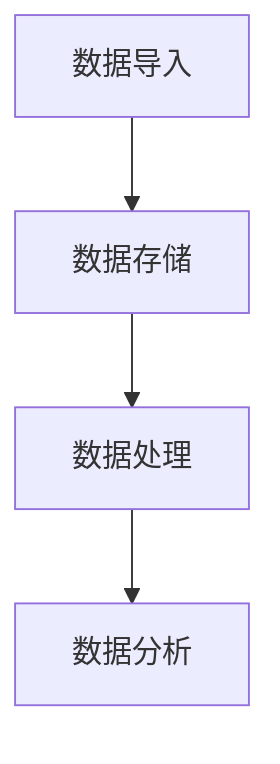

# 【AI大数据计算原理与代码实例讲解】数据湖

## 1.背景介绍

在大数据时代，数据的爆炸性增长使得传统的数据存储和处理方式面临巨大的挑战。数据湖（Data Lake）作为一种新兴的数据管理架构，提供了一种灵活、高效的解决方案。数据湖允许存储各种类型的数据，包括结构化、半结构化和非结构化数据，并支持大规模数据处理和分析。

数据湖的概念最早由James Dixon提出，他将其与数据仓库进行了对比。数据仓库类似于瓶装水，经过处理和过滤，适合直接消费；而数据湖则像一个天然湖泊，包含各种原始数据，供不同的用户和应用程序进行探索和利用。

## 2.核心概念与联系

### 2.1 数据湖的定义

数据湖是一个集中式存储库，能够存储来自不同来源的海量数据。这些数据可以是结构化的（如数据库表）、半结构化的（如JSON、XML）或非结构化的（如文本、图像、视频）。

### 2.2 数据湖与数据仓库的区别

- **数据结构**：数据仓库存储的是经过处理和结构化的数据，而数据湖存储的是原始的、未处理的数据。
- **数据处理**：数据仓库在数据进入之前进行ETL（提取、转换、加载）处理，而数据湖则采用ELT（提取、加载、转换）模式，数据在进入后再进行处理。
- **灵活性**：数据湖具有更高的灵活性，能够适应不同类型的数据和分析需求。

### 2.3 数据湖的组成部分

数据湖通常由以下几个部分组成：

- **数据存储**：用于存储各种类型的数据，通常使用分布式文件系统（如HDFS）或云存储（如Amazon S3）。
- **数据处理**：用于处理和分析数据，常用的工具包括Apache Spark、Hadoop等。
- **数据管理**：用于管理数据的元数据、权限和安全性，常用的工具包括Apache Atlas、AWS Glue等。

## 3.核心算法原理具体操作步骤

### 3.1 数据导入

数据导入是数据湖的第一步，涉及将数据从各种来源（如数据库、日志文件、传感器数据等）导入到数据湖中。常用的工具包括Apache NiFi、Kafka等。

### 3.2 数据存储

数据存储是数据湖的核心部分，涉及将导入的数据存储在分布式文件系统或云存储中。常用的存储系统包括HDFS、Amazon S3、Azure Blob Storage等。

### 3.3 数据处理

数据处理是数据湖的关键步骤，涉及对存储的数据进行清洗、转换和分析。常用的处理工具包括Apache Spark、Hadoop MapReduce等。

### 3.4 数据分析

数据分析是数据湖的最终目标，涉及对处理后的数据进行深入分析和挖掘。常用的分析工具包括Apache Hive、Presto、Druid等。

以下是数据湖的核心操作步骤的Mermaid流程图：



## 4.数学模型和公式详细讲解举例说明

### 4.1 数据清洗

数据清洗是数据处理的第一步，涉及去除数据中的噪声和错误。常用的方法包括缺失值填补、异常值检测等。

$$
\text{缺失值填补} = \frac{\sum_{i=1}^{n} x_i}{n}
$$

### 4.2 数据转换

数据转换是数据处理的关键步骤，涉及将数据从一种形式转换为另一种形式。常用的方法包括标准化、归一化等。

$$
\text{标准化} = \frac{x - \mu}{\sigma}
$$

### 4.3 数据分析

数据分析是数据处理的最终目标，涉及对数据进行统计分析和机器学习建模。常用的方法包括回归分析、分类、聚类等。

$$
\text{线性回归} = \hat{y} = \beta_0 + \beta_1 x
$$

## 5.项目实践：代码实例和详细解释说明

### 5.1 数据导入

以下是使用Apache NiFi进行数据导入的示例代码：

```python
from nifi import NiFiClient

client = NiFiClient('http://localhost:8080/nifi-api')
flow = client.create_flow('Data Import Flow')

processor = flow.create_processor('GetFile')
processor.set_property('Input Directory', '/data/input')
processor.set_property('Keep Source File', 'false')

flow.start()
```

### 5.2 数据存储

以下是使用HDFS进行数据存储的示例代码：

```python
from hdfs import InsecureClient

client = InsecureClient('http://localhost:50070', user='hdfs')
client.upload('/data/lake', '/data/input')
```

### 5.3 数据处理

以下是使用Apache Spark进行数据处理的示例代码：

```python
from pyspark.sql import SparkSession

spark = SparkSession.builder.appName('Data Processing').getOrCreate()
df = spark.read.csv('/data/lake/input.csv', header=True, inferSchema=True)

df_cleaned = df.dropna()
df_transformed = df_cleaned.withColumn('normalized', (df_cleaned['value'] - df_cleaned['value'].mean()) / df_cleaned['value'].std())

df_transformed.write.csv('/data/lake/output.csv')
```

### 5.4 数据分析

以下是使用Apache Hive进行数据分析的示例代码：

```sql
CREATE EXTERNAL TABLE data_lake (
    id INT,
    value DOUBLE,
    normalized DOUBLE
)
STORED AS PARQUET
LOCATION '/data/lake/output';

SELECT AVG(normalized) FROM data_lake;
```

## 6.实际应用场景

### 6.1 金融行业

在金融行业，数据湖可以用于存储和分析交易数据、客户数据和市场数据，帮助金融机构进行风险管理、客户分析和市场预测。

### 6.2 医疗行业

在医疗行业，数据湖可以用于存储和分析患者数据、医疗记录和基因数据，帮助医疗机构进行疾病预测、个性化治疗和医疗研究。

### 6.3 零售行业

在零售行业，数据湖可以用于存储和分析销售数据、客户数据和库存数据，帮助零售商进行市场分析、客户推荐和库存管理。

## 7.工具和资源推荐

### 7.1 数据导入工具

- Apache NiFi
- Apache Kafka
- AWS Glue

### 7.2 数据存储工具

- HDFS
- Amazon S3
- Azure Blob Storage

### 7.3 数据处理工具

- Apache Spark
- Hadoop MapReduce
- Apache Flink

### 7.4 数据分析工具

- Apache Hive
- Presto
- Apache Druid

## 8.总结：未来发展趋势与挑战

数据湖作为一种新兴的数据管理架构，具有灵活、高效的特点，能够适应大数据时代的需求。然而，数据湖也面临一些挑战，如数据治理、安全性和性能优化等。未来，随着技术的不断发展，数据湖将会在更多的领域得到应用，并且在数据管理和分析方面发挥更大的作用。

## 9.附录：常见问题与解答

### 9.1 数据湖与数据仓库可以共存吗？

是的，数据湖和数据仓库可以共存，并且可以互补。数据湖可以存储原始数据，而数据仓库可以存储经过处理和结构化的数据。

### 9.2 如何保证数据湖中的数据质量？

可以通过数据清洗、数据验证和数据治理等方法来保证数据湖中的数据质量。

### 9.3 数据湖的性能如何优化？

可以通过分布式存储、并行处理和缓存等技术来优化数据湖的性能。

---

作者：禅与计算机程序设计艺术 / Zen and the Art of Computer Programming