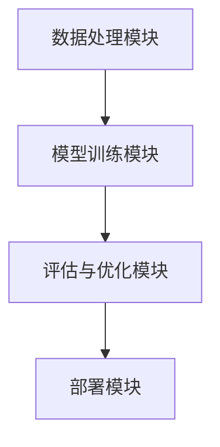

# 【LangChain编程：从入门到实践】LangChain框架的爆火

## 1.背景介绍

在人工智能和自然语言处理（NLP）领域，语言模型的应用越来越广泛。LangChain作为一个新兴的框架，迅速在技术社区中引起了广泛关注。LangChain框架的设计初衷是为了简化和加速语言模型的开发和部署过程。本文将深入探讨LangChain框架的核心概念、算法原理、数学模型、实际应用以及未来发展趋势。

## 2.核心概念与联系

### 2.1 LangChain的定义

LangChain是一个专注于语言模型开发的框架，旨在提供高效、灵活和可扩展的解决方案。它集成了多种语言模型和工具，支持从数据预处理到模型训练和部署的全流程。

### 2.2 主要组件

LangChain框架主要由以下几个组件构成：

- **数据处理模块**：负责数据的清洗、预处理和增强。
- **模型训练模块**：支持多种语言模型的训练，包括Transformer、BERT等。
- **评估与优化模块**：提供模型评估和优化工具，帮助开发者提升模型性能。
- **部署模块**：简化模型的部署过程，支持多种部署环境。

### 2.3 核心联系

LangChain框架的各个组件之间通过标准化接口进行通信，确保了模块之间的高效协作。以下是LangChain框架的核心联系图：



## 3.核心算法原理具体操作步骤

### 3.1 数据处理

数据处理是语言模型开发的第一步。LangChain的数据处理模块提供了多种数据清洗和预处理工具，包括去除噪声、分词、词性标注等。

### 3.2 模型训练

LangChain支持多种语言模型的训练。以下是一个典型的模型训练流程：

1. **数据加载**：从数据源加载训练数据。
2. **数据预处理**：对数据进行清洗和预处理。
3. **模型选择**：选择合适的语言模型，如Transformer。
4. **模型训练**：使用预处理后的数据进行模型训练。
5. **模型评估**：评估模型的性能，调整超参数。

### 3.3 评估与优化

LangChain提供了多种评估指标和优化工具，帮助开发者提升模型性能。常用的评估指标包括准确率、召回率、F1-score等。

### 3.4 部署

模型训练完成后，LangChain简化了模型的部署过程。支持多种部署环境，如本地服务器、云平台等。

## 4.数学模型和公式详细讲解举例说明

### 4.1 语言模型的数学基础

语言模型的核心是概率论和统计学。一个典型的语言模型可以表示为：

$$
P(w_1, w_2, ..., w_n) = \prod_{i=1}^{n} P(w_i | w_1, w_2, ..., w_{i-1})
$$

其中，$P(w_i | w_1, w_2, ..., w_{i-1})$ 表示在给定前面词语的情况下，词语 $w_i$ 出现的概率。

### 4.2 Transformer模型

Transformer模型是当前最流行的语言模型之一。其核心是自注意力机制（Self-Attention），其计算公式为：

$$
Attention(Q, K, V) = softmax\left(\frac{QK^T}{\sqrt{d_k}}\right)V
$$

其中，$Q$、$K$、$V$ 分别表示查询矩阵、键矩阵和值矩阵，$d_k$ 表示键矩阵的维度。

### 4.3 示例

假设我们有一个简单的句子 "I love programming"，我们可以使用LangChain框架对其进行建模和预测。首先，我们对句子进行分词和预处理，然后使用Transformer模型进行训练，最后评估模型的性能。

## 5.项目实践：代码实例和详细解释说明

### 5.1 环境配置

首先，我们需要配置开发环境。安装LangChain框架和相关依赖：

```bash
pip install langchain
```

### 5.2 数据加载与预处理

```python
from langchain.data import DataLoader

# 加载数据
data_loader = DataLoader('path/to/dataset')
data = data_loader.load()

# 数据预处理
preprocessed_data = data_loader.preprocess(data)
```

### 5.3 模型训练

```python
from langchain.model import TransformerModel

# 初始化模型
model = TransformerModel()

# 训练模型
model.train(preprocessed_data)
```

### 5.4 模型评估

```python
from langchain.evaluation import Evaluator

# 初始化评估器
evaluator = Evaluator(model)

# 评估模型
metrics = evaluator.evaluate(preprocessed_data)
print(metrics)
```

### 5.5 模型部署

```python
from langchain.deployment import Deployer

# 初始化部署器
deployer = Deployer(model)

# 部署模型
deployer.deploy('path/to/deployment')
```

## 6.实际应用场景

### 6.1 聊天机器人

LangChain可以用于开发智能聊天机器人，提供自然语言理解和生成能力。

### 6.2 机器翻译

通过训练多语言模型，LangChain可以实现高质量的机器翻译。

### 6.3 文本摘要

LangChain可以用于自动生成文本摘要，帮助用户快速获取关键信息。

### 6.4 情感分析

通过分析文本情感，LangChain可以用于市场分析、用户反馈等场景。

## 7.工具和资源推荐

### 7.1 开发工具

- **Jupyter Notebook**：用于数据分析和模型训练的交互式开发环境。
- **VSCode**：功能强大的代码编辑器，支持多种编程语言和插件。

### 7.2 数据集

- **IMDB**：电影评论数据集，常用于情感分析。
- **WMT**：机器翻译数据集，包含多种语言对。

### 7.3 参考文献

- **Attention is All You Need**：Transformer模型的经典论文。
- **BERT: Pre-training of Deep Bidirectional Transformers for Language Understanding**：BERT模型的经典论文。

## 8.总结：未来发展趋势与挑战

### 8.1 未来发展趋势

随着人工智能技术的不断进步，语言模型的应用将更加广泛。LangChain框架将继续优化和扩展，支持更多的语言模型和应用场景。

### 8.2 挑战

尽管LangChain框架提供了强大的功能，但在实际应用中仍然面临一些挑战，如数据隐私、模型解释性等。开发者需要不断探索和解决这些问题，以提升模型的实际应用效果。

## 9.附录：常见问题与解答

### 9.1 LangChain支持哪些语言模型？

LangChain支持多种语言模型，包括Transformer、BERT、GPT等。

### 9.2 如何优化模型性能？

可以通过调整超参数、增加训练数据、使用更复杂的模型等方法来优化模型性能。

### 9.3 LangChain是否支持分布式训练？

是的，LangChain支持分布式训练，可以利用多台机器进行模型训练。

### 9.4 如何处理数据隐私问题？

可以使用数据加密、差分隐私等技术来保护数据隐私。

### 9.5 LangChain是否开源？

是的，LangChain是一个开源框架，开发者可以自由使用和扩展。

---

作者：禅与计算机程序设计艺术 / Zen and the Art of Computer Programming