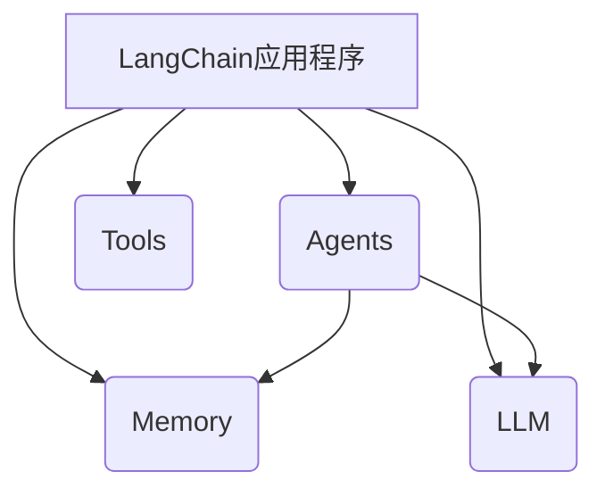

# 【LangChain编程：从入门到实践】应用监控

## 1.背景介绍

### 1.1 什么是LangChain

LangChain是一个用于构建应用程序的框架,旨在与大型语言模型(LLM)进行交互。它为开发人员提供了一种简单、一致和可扩展的方式来构建利用LLM功能的应用程序。无论是问答系统、总结生成、数据分析还是其他任务,LangChain都可以帮助您轻松集成LLM。

### 1.2 LangChain的应用场景  

LangChain可以应用于各种场景,包括但不限于:

- 问答系统
- 文本总结
- 数据分析
- 代码生成
- 任务自动化

### 1.3 为什么需要监控LangChain应用?

由于LangChain应用程序与LLM紧密集成,因此监控这些应用程序对于确保其正常运行至关重重要。监控可以帮助您:

- 检测和诊断问题
- 跟踪性能指标
- 优化资源利用率
- 了解用户行为

## 2.核心概念与联系

### 2.1 LangChain应用程序架构

LangChain应用程序通常由以下几个核心组件组成:

- **Agents**: 代理是与LLM交互的主要接口,负责协调和执行任务。
- **Tools**: 工具是可执行的函数或API,代理可以利用这些工具来完成特定的子任务。
- **Memory**: 内存存储代理与LLM之间的交互历史,以保持上下文一致性。
- **LLM**: 大型语言模型,如GPT-3,是应用程序的核心,提供自然语言处理能力。

这些组件通过LangChain框架无缝集成,形成了一个完整的应用程序。



### 2.2 监控LangChain应用程序的关键指标

为了有效监控LangChain应用程序,我们需要关注以下几个关键指标:

- **请求延迟**: 衡量应用程序响应请求所需的时间。
- **错误率**: 跟踪应用程序出现错误的频率。
- **资源利用率**: 监控CPU、内存和网络等资源的使用情况。
- **LLM使用情况**: 跟踪LLM的调用次数、成本和响应时间。
- **工具使用情况**: 监控各个工具的使用频率和性能。

## 3.核心算法原理具体操作步骤 

### 3.1 设置监控基础设施

在开始监控LangChain应用程序之前,我们需要设置监控基础设施。常见的监控工具包括Prometheus、Grafana、Jaeger等。以Prometheus为例,我们可以按照以下步骤进行设置:

1. 安装Prometheus
2. 配置Prometheus以抓取应用程序的指标
3. 安装Grafana,用于可视化指标

### 3.2 instrumenting LangChain应用程序

为了从LangChain应用程序中收集指标,我们需要对其进行instrumenting。LangChain提供了与OpenTelemetry和Prometheus等监控系统集成的功能。

以OpenTelemetry为例,我们可以按照以下步骤进行instrumenting:

1. 安装OpenTelemetry Python SDK
2. 配置OpenTelemetry以发送指标到Prometheus
3. 使用OpenTelemetry装饰器或上下文管理器包装LangChain组件

```python
import opentelemetry.metrics as metrics

# 配置OpenTelemetry指标导出器
exporter = ...

# 创建指标仪表
requests_counter = metrics.Counter(
    "langchain_requests",
    "Number of requests made to LangChain",
    ("agent", "tool"),
)

# 使用指标仪表装饰器
@requests_counter.bind(lambda info: {"agent": info.name, "tool": info.tool})
def run_agent(agent, ...):
    ...
```

### 3.3 监控关键指标

配置好监控基础设施和LangChain应用程序的instrumenting之后,我们就可以开始监控关键指标了。以Prometheus和Grafana为例:

1. 在Prometheus中配置抓取LangChain应用程序的指标
2. 在Grafana中创建仪表盘,可视化关键指标
3. 设置警报规则,在指标异常时发送通知

通过持续监控这些关键指标,我们可以及时发现并诊断LangChain应用程序中的问题,从而确保应用程序的稳定性和性能。

## 4.数学模型和公式详细讲解举例说明

在监控LangChain应用程序的过程中,我们可能需要使用一些数学模型和公式来分析和预测系统行为。以下是一些常见的模型和公式:

### 4.1 队列理论

队列理论可以用于分析和优化LangChain应用程序中的请求处理过程。假设请求到达服务器的过程是一个泊松过程,服务时间服从某种分布(如指数分布),我们可以使用以下公式计算系统的性能指标:

$$
\begin{aligned}
\rho &= \frac{\lambda}{\mu} \\
L &= \frac{\rho}{1-\rho} \\
W &= \frac{L}{\lambda}
\end{aligned}
$$

其中:
- $\rho$ 是系统利用率
- $\lambda$ 是请求到达率
- $\mu$ 是服务率
- $L$ 是系统中的平均队列长度
- $W$ 是平均等待时间

通过监控这些指标,我们可以评估系统的负载情况,并根据需要进行扩容或优化。

### 4.2 线性回归

线性回归可以用于预测LangChain应用程序的性能指标,例如响应时间。假设我们有一组历史数据 $(x_i, y_i)$,其中 $x_i$ 是一组特征(如并发请求数、CPU利用率等), $y_i$ 是响应时间。我们可以使用以下公式拟合一个线性模型:

$$
y = \beta_0 + \beta_1 x_1 + \beta_2 x_2 + \cdots + \beta_n x_n
$$

其中 $\beta_i$ 是需要估计的系数。我们可以使用最小二乘法来估计这些系数,从而得到一个线性模型,用于预测未来的响应时间。

### 4.3 指数平滑

指数平滑是一种时间序列预测方法,可以用于预测LangChain应用程序的指标趋势。假设我们有一个时间序列 $y_1, y_2, \ldots, y_n$,我们可以使用以下公式计算指数加权移动平均:

$$
S_t = \alpha y_t + (1 - \alpha) S_{t-1}
$$

其中 $S_t$ 是时间 $t$ 的平滑值, $\alpha$ 是平滑系数 $(0 < \alpha < 1)$。通过调整 $\alpha$ 的值,我们可以控制对新数据和历史数据的权重。

通过绘制指数平滑曲线,我们可以更好地观察LangChain应用程序指标的趋势,并预测未来的行为。

## 5.项目实践:代码实例和详细解释说明

在本节中,我们将通过一个示例项目来演示如何监控LangChain应用程序。我们将构建一个简单的问答系统,并使用Prometheus和Grafana进行监控。

### 5.1 问答系统代码

首先,我们需要编写问答系统的代码。以下是一个基于LangChain的简单实现:

```python
from langchain.agents import initialize_agent, Tool
from langchain.llms import OpenAI
from langchain.chains.conversation.memory import ConversationBufferMemory

# 初始化LLM
llm = OpenAI(temperature=0)

# 定义工具
tools = [
    Tool(
        name="Wikipedia",
        func=lambda query: f"Wikipedia search results for '{query}'",
        description="A Wikipedia search tool"
    )
]

# 初始化代理
memory = ConversationBufferMemory(memory_key="chat_history")
agent = initialize_agent(tools, llm, agent="conversational-react-description", verbose=True, memory=memory)

# 运行问答系统
while True:
    query = input("Human: ")
    response = agent.run(query)
    print("AI:", response)
```

在这个示例中,我们定义了一个名为"Wikipedia"的工具,并使用OpenAI的LLM初始化了一个conversational-react-description代理。用户可以输入查询,代理将使用Wikipedia工具和LLM来生成响应。

### 5.2 instrumenting with OpenTelemetry

接下来,我们需要对代码进行instrumenting,以收集监控指标。我们将使用OpenTelemetry来实现这一点:

```python
from opentelemetry import metrics
from opentelemetry.exporter.prometheus import PrometheusExporter

# 配置Prometheus导出器
exporter = PrometheusExporter()

# 创建指标仪表
requests_counter = metrics.Counter(
    "langchain_requests",
    "Number of requests made to LangChain",
    ("agent", "tool"),
)

# 使用指标仪表装饰器
@requests_counter.bind(lambda info: {"agent": "conversational-react-description", "tool": info.tool})
def run_agent(agent, query):
    return agent.run(query)

# 运行问答系统
while True:
    query = input("Human: ")
    response = run_agent(agent, query)
    print("AI:", response)
```

在这个示例中,我们创建了一个名为"langchain_requests"的计数器指标,用于跟踪对LangChain代理和工具的请求数量。我们使用`@requests_counter.bind`装饰器来自动记录每个请求的代理和工具信息。

### 5.3 配置Prometheus和Grafana

最后,我们需要配置Prometheus和Grafana来可视化监控指标。

1. 安装并运行Prometheus
2. 在Prometheus中配置抓取OpenTelemetry指标的作业
3. 安装并运行Grafana
4. 在Grafana中创建一个新的数据源,指向Prometheus
5. 创建一个新的仪表盘,可视化"langchain_requests"指标

通过这些步骤,我们就可以在Grafana中实时查看LangChain应用程序的监控指标了。

## 6.实际应用场景

监控LangChain应用程序在许多实际场景中都非常有用,例如:

### 6.1 客户服务聊天机器人

许多公司都在使用基于LangChain的聊天机器人来提供客户服务。监控这些机器人可以确保它们能够及时响应客户查询,并检测任何潜在的性能问题或错误。

### 6.2 知识库问答系统

一些组织使用LangChain构建内部知识库问答系统,以帮助员工快速找到所需的信息。监控这些系统可以跟踪用户行为,优化系统性能,并确保知识库的准确性和及时性。

### 6.3 自动化数据分析

LangChain也可以用于自动化数据分析任务,例如生成报告或执行预测建模。监控这些应用程序可以帮助您了解分析过程的效率,并确保结果的准确性。

### 6.4 内容生成

一些公司使用LangChain来生成营销内容、新闻文章或其他类型的内容。监控这些应用程序可以帮助您跟踪内容质量,并确保生成过程的可靠性和一致性。

## 7.工具和资源推荐

在监控LangChain应用程序时,以下工具和资源可能会非常有用:

### 7.1 Prometheus

Prometheus是一个开源的监控和警报系统,可以用于收集和存储时间序列数据。它支持多种指标类型,并提供了强大的查询语言。

### 7.2 Grafana

Grafana是一个开源的可视化和分析平台,可以与Prometheus等数据源集成。它提供了丰富的仪表盘和可视化功能,可以帮助您更好地理解监控数据。

### 7.3 OpenTelemetry

OpenTelemetry是一个开源的观测性框架,提供了一种标准化的方式来收集和导出指标、跟踪和日志数据。它支持多种编程语言和监控系统。

### 7.4 LangChain文档

LangChain的官方文档提供了大量有用的信息,包括入门指南、API参考和示例代码。它是学习和使用LangChain的绝佳资源。

### 7.5 LangChain社区

LangChain拥有一个活跃的社区,包括GitHub上的问题跟踪器和Discord服务器。您可以在这里寻求帮助,分享经验,并了解最新的发展动态。

## 8.总结:未来发展趋势与挑战

LangChain是一个强大的框架,