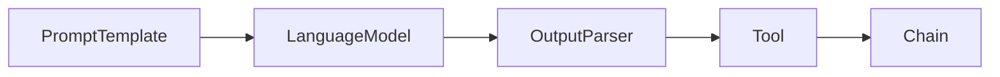

# 【LangChain编程：从入门到实践】链模块

## 1. 背景介绍
### 1.1 LangChain概述
LangChain是一个强大的开源框架,旨在帮助开发人员构建基于语言模型的应用程序。它提供了一组模块化组件和工具,可以轻松地与各种语言模型(如OpenAI的GPT系列)进行交互,并将它们集成到我们自己的应用程序中。

### 1.2 链模块的重要性
在LangChain中,链(Chain)是一个核心概念。链允许我们以灵活和可组合的方式组织和编排多个组件,例如提示模板(PromptTemplate)、语言模型(LanguageModel)和输出解析器(OutputParser)等。通过将这些组件链接在一起,我们可以构建复杂的自然语言处理(NLP)管道,以实现各种任务,如问答、文本生成、摘要等。

### 1.3 本文的目的和结构
本文旨在深入探讨LangChain的链模块,帮助读者全面了解链的概念、原理和实践。我们将从链的基本概念开始,然后详细介绍链的核心算法和数学模型。接下来,我们将通过实际的代码示例和详细的解释,演示如何使用LangChain构建和定制链。此外,我们还将讨论链在实际应用场景中的应用,并推荐一些有用的工具和资源。最后,我们将总结链模块的未来发展趋势和挑战,并在附录中解答一些常见问题。

## 2. 核心概念与联系
### 2.1 链的定义和特点
在LangChain中,链(Chain)是一个抽象的概念,表示一系列按顺序执行的组件。每个组件接收一个输入,执行某些操作,并产生一个输出,该输出又成为下一个组件的输入。通过将多个组件链接在一起,我们可以构建复杂的NLP管道。

链的主要特点包括:

1. 模块化:链由独立的组件构成,每个组件都有明确定义的输入和输出接口。这种模块化设计使得组件可以灵活地组合和重用。

2. 可组合性:链可以嵌套和组合,形成更复杂的链。我们可以将多个链连接在一起,或者将一个链作为另一个链的组件。

3. 顺序执行:链中的组件按照预定义的顺序依次执行。每个组件的输出成为下一个组件的输入,形成一个有向无环图(DAG)。

### 2.2 链与其他组件的关系
链与LangChain中的其他组件密切相关,包括:

1. 提示模板(PromptTemplate):用于定义与语言模型交互的输入提示。提示模板可以包含变量,在运行时动态填充。

2. 语言模型(LanguageModel):执行实际的自然语言处理任务,如文本生成、完成等。LangChain支持多种语言模型,如OpenAI的GPT系列。

3. 输出解析器(OutputParser):将语言模型的原始输出转换为结构化的格式,如JSON、字典等,以便后续处理。

4. 工具(Tool):表示可以执行特定操作的外部工具或API,如搜索引擎、计算器等。链可以调用工具来执行某些任务。

下图展示了链与其他组件之间的关系:



## 3. 核心算法原理具体操作步骤
### 3.1 链的执行过程
链的执行过程可以分为以下几个步骤:

1. 初始化:创建链对象,并配置其组件,如提示模板、语言模型、输出解析器等。

2. 输入处理:将用户输入或上一个组件的输出传递给当前组件。对于提示模板,将输入填充到模板的变量中。

3. 组件执行:调用当前组件的执行方法,如语言模型的`generate`方法,生成输出。

4. 输出处理:将当前组件的输出传递给输出解析器进行处理,提取所需的信息。

5. 迭代:将处理后的输出传递给下一个组件,重复步骤2-4,直到链的最后一个组件执行完毕。

6. 返回结果:将最后一个组件的输出作为链的最终输出,返回给用户或下一个链。

### 3.2 常见的链类型
LangChain提供了几种常见的链类型,包括:

1. LLMChain:将提示模板与语言模型组合,用于生成文本。

2. SequentialChain:按顺序执行多个链,将一个链的输出作为下一个链的输入。

3. MapReduceChain:对输入列表中的每个元素应用一个映射函数,然后使用reduce函数组合结果。

4. TransformChain:对输入应用一系列转换函数,例如提取实体、情感分析等。

5. CombineDocumentsChain:将多个文档组合成一个文档,常用于文档摘要、问答等任务。

### 3.3 自定义链
除了使用内置的链类型,我们还可以通过继承`Chain`基类来自定义链。自定义链需要实现以下方法:

1. `__init__`:初始化链对象,设置组件和配置。

2. `input_keys`:定义链的输入参数名称列表。

3. `output_keys`:定义链的输出参数名称列表。

4. `_call`:实现链的实际执行逻辑,接收输入参数,调用组件,并返回输出。

下面是一个自定义链的示例:

```python
from langchain.chains import Chain

class CustomChain(Chain):
    def __init__(self, prompt, llm):
        self.prompt = prompt
        self.llm = llm
        
    @property
    def input_keys(self):
        return ["query"]
    
    @property
    def output_keys(self):
        return ["result"]
    
    def _call(self, inputs):
        query = inputs["query"]
        prompt = self.prompt.format(query=query)
        result = self.llm(prompt)
        return {"result": result}
```

## 4. 数学模型和公式详细讲解举例说明
### 4.1 语言模型的数学基础
链中的核心组件之一是语言模型,它基于概率统计和机器学习的原理。给定一个单词序列 $w_1, w_2, \ldots, w_n$,语言模型的目标是估计该序列的概率分布 $P(w_1, w_2, \ldots, w_n)$。

根据链式法则,我们可以将联合概率分解为一系列条件概率的乘积:

$$
P(w_1, w_2, \ldots, w_n) = \prod_{i=1}^n P(w_i | w_1, w_2, \ldots, w_{i-1})
$$

其中, $P(w_i | w_1, w_2, \ldots, w_{i-1})$ 表示在给定前 $i-1$ 个单词的情况下,第 $i$ 个单词为 $w_i$ 的条件概率。

### 4.2 Transformer架构
现代语言模型,如GPT系列,基于Transformer架构。Transformer引入了自注意力机制(Self-Attention)和位置编码(Positional Encoding)来捕捉单词之间的长距离依赖关系。

在自注意力机制中,每个单词的表示通过与其他单词的加权和来更新。权重由查询(Query)、键(Key)和值(Value)的点积计算得出:

$$
\text{Attention}(Q, K, V) = \text{softmax}(\frac{QK^T}{\sqrt{d_k}})V
$$

其中, $Q$、$K$、$V$ 分别是查询、键、值矩阵,$d_k$ 是键向量的维度。

位置编码通过将位置信息添加到单词嵌入中,使模型能够捕捉单词的顺序信息。位置编码可以使用正弦和余弦函数来计算:

$$
PE_{(pos,2i)} = \sin(pos / 10000^{2i/d_{model}})
$$
$$
PE_{(pos,2i+1)} = \cos(pos / 10000^{2i/d_{model}})
$$

其中,$pos$是单词的位置,$i$是维度的索引,$d_{model}$是嵌入的维度。

### 4.3 微调和提示工程
为了使预训练的语言模型适应特定任务,我们可以使用微调(Fine-tuning)和提示工程(Prompt Engineering)技术。

微调是在特定任务的标记数据上继续训练预训练模型的过程。通过最小化任务特定的损失函数,模型可以学习如何执行新任务。微调的损失函数通常是交叉熵损失:

$$
\mathcal{L} = -\sum_{i=1}^N \sum_{j=1}^C y_{ij} \log(\hat{y}_{ij})
$$

其中,$N$是样本数量,$C$是类别数量,$y_{ij}$是真实标签,$\hat{y}_{ij}$是预测概率。

提示工程是设计输入提示的艺术,以引导语言模型生成所需的输出。通过精心设计的提示,我们可以控制模型的行为,而无需进行微调。例如,我们可以使用如下提示来生成问题的答案:

```
问题:谁是图灵奖的最新获得者?
答案:
```

语言模型将根据提示生成答案,如"2021年图灵奖的获得者是Jack Dongarra、Yoshua Bengio和Geoffrey Hinton,以表彰他们在深度学习领域的开创性工作。"

## 5. 项目实践:代码实例和详细解释说明
下面,我们将通过一个实际的项目来演示如何使用LangChain构建和定制链。该项目的目标是创建一个问答系统,能够根据给定的文本回答问题。

### 5.1 安装依赖
首先,我们需要安装LangChain及其依赖:

```bash
pip install langchain openai tiktoken
```

### 5.2 导入必要的模块
```python
from langchain.chains import LLMChain
from langchain.prompts import PromptTemplate
from langchain.llms import OpenAI
from langchain.document_loaders import TextLoader
from langchain.indexes import VectorstoreIndexCreator
```

### 5.3 加载和索引文档
我们使用`TextLoader`加载文本文件,并使用`VectorstoreIndexCreator`创建文档的向量索引:

```python
loader = TextLoader("document.txt")
index = VectorstoreIndexCreator().from_loaders([loader])
```

### 5.4 定义提示模板
我们定义一个提示模板,将问题和相关文档作为输入:

```python
template = """
请根据以下文档内容回答问题:
{context}

问题:{question}
答案:
"""

prompt = PromptTemplate(
    input_variables=["context", "question"],
    template=template,
)
```

### 5.5 创建语言模型和链
我们使用OpenAI的GPT-3作为语言模型,并创建一个`LLMChain`:

```python
llm = OpenAI(temperature=0)

chain = LLMChain(llm=llm, prompt=prompt)
```

### 5.6 查询文档并生成答案
给定一个问题,我们首先使用索引检索相关文档,然后将问题和文档传递给链以生成答案:

```python
question = "图灵奖的最新获得者是谁?"
docs = index.similarity_search(question)
context = " ".join([doc.page_content for doc in docs])

result = chain.run(context=context, question=question)
print(result)
```

输出结果可能如下:

```
2021年图灵奖的获得者是Jack Dongarra、Yoshua Bengio和Geoffrey Hinton,以表彰他们在深度学习领域的开创性工作。Jack Dongarra因其在高性能计算和数值软件方面的贡献而获奖,Yoshua Bengio和Geoffrey Hinton则因其在深度学习理论和应用方面的突破性工作而获奖。
```

## 6. 实际应用场景
链模块在许多实际应用场景中发挥着重要作用,包括:

1. 智能客服:使用链构建智能客服系统,根据客户的问题自动检索相关知识库并生成回答。

2. 文档摘要:使用链对长文档进行摘要,提取关键信息并生成简明扼要的摘要。

3. 代码生成:使用链根据自然语言描述生成代码片段,辅助开发人员提高效率。

4. 数据分析:使用链对结构化和非结构化数据进行分析,提取见解并生成报告。

5. 内容创作:使用链根据主题和关键词生成文章、博客等内容,辅助内容创作者。

## 7. 工具和资源推荐
以下是一些有用的工具和资源,