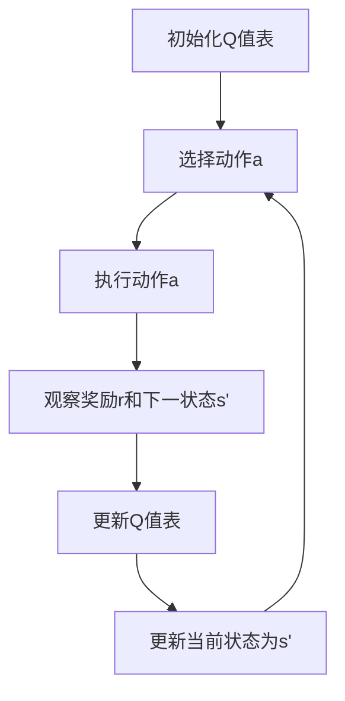

# 一切皆是映射：AI Q-learning在音乐制作中的应用

## 1.背景介绍

在人工智能的众多应用领域中，音乐制作是一个充满创意和挑战的领域。传统的音乐制作依赖于音乐家的灵感和技巧，而随着人工智能技术的进步，越来越多的音乐制作过程可以通过算法来辅助甚至自动化完成。Q-learning作为一种强化学习算法，因其在解决复杂决策问题上的卓越表现，逐渐被引入到音乐制作中。本文将深入探讨Q-learning在音乐制作中的应用，揭示其核心概念、算法原理、数学模型、实际应用场景以及未来的发展趋势。

## 2.核心概念与联系

### 2.1 强化学习与Q-learning

强化学习（Reinforcement Learning, RL）是一种通过与环境交互来学习策略的机器学习方法。Q-learning是强化学习中的一种无模型（model-free）算法，通过学习动作-状态值函数（Q函数）来指导智能体的行为。

### 2.2 音乐制作中的决策问题

音乐制作涉及多个决策过程，例如选择乐器、编排旋律、调整音效等。这些决策过程可以看作是一个多步的序列决策问题，非常适合使用Q-learning来解决。

### 2.3 映射的概念

在Q-learning中，状态和动作之间的映射关系是核心。类似地，音乐制作中的各种元素（如音符、节奏、和弦）也可以通过映射关系来进行优化和生成。

## 3.核心算法原理具体操作步骤

### 3.1 Q-learning算法概述

Q-learning通过更新Q值来学习最优策略。其核心公式为：

$$
Q(s, a) \leftarrow Q(s, a) + \alpha [r + \gamma \max_{a'} Q(s', a') - Q(s, a)]
$$

其中，$s$ 是当前状态，$a$ 是当前动作，$r$ 是即时奖励，$s'$ 是下一状态，$a'$ 是下一动作，$\alpha$ 是学习率，$\gamma$ 是折扣因子。

### 3.2 算法步骤

1. 初始化Q值表
2. 重复以下步骤直到收敛：
   - 在当前状态 $s$ 选择动作 $a$
   - 执行动作 $a$，观察奖励 $r$ 和下一状态 $s'$
   - 更新Q值表
   - 更新当前状态为 $s'$

### 3.3 Mermaid流程图



## 4.数学模型和公式详细讲解举例说明

### 4.1 状态和动作的定义

在音乐制作中，状态可以表示当前的音乐片段，动作可以表示添加一个音符或改变一个音效。例如，状态 $s$ 可以是一个音符序列，动作 $a$ 可以是添加一个新的音符。

### 4.2 奖励函数的设计

奖励函数是Q-learning的关键。在音乐制作中，奖励函数可以基于音乐的和谐度、节奏的连贯性等因素来设计。例如：

$$
r = \text{和谐度}(s') + \text{节奏连贯性}(s')
$$

### 4.3 Q值更新公式的应用

假设当前状态 $s$ 是一个音符序列 [C, E, G]，动作 $a$ 是添加音符 A，下一状态 $s'$ 是 [C, E, G, A]。如果和谐度和节奏连贯性分别为 0.8 和 0.9，则奖励 $r = 1.7$。假设 $\alpha = 0.1$，$\gamma = 0.9$，则Q值更新公式为：

$$
Q([C, E, G], \text{添加A}) \leftarrow Q([C, E, G], \text{添加A}) + 0.1 [1.7 + 0.9 \max_{a'} Q([C, E, G, A], a') - Q([C, E, G], \text{添加A})]
$$

## 5.项目实践：代码实例和详细解释说明

### 5.1 环境搭建

首先，我们需要安装必要的Python库：

```bash
pip install numpy
pip install matplotlib
```

### 5.2 Q-learning代码实现

以下是一个简单的Q-learning实现，用于生成音乐片段：

```python
import numpy as np

# 定义状态和动作空间
states = ['C', 'D', 'E', 'F', 'G', 'A', 'B']
actions = ['C', 'D', 'E', 'F', 'G', 'A', 'B']

# 初始化Q值表
Q = np.zeros((len(states), len(actions)))

# 参数设置
alpha = 0.1
gamma = 0.9
epsilon = 0.1

# 奖励函数
def reward(state, action):
    # 简单的和谐度和节奏连贯性计算
    return np.random.rand()

# Q-learning算法
for episode in range(1000):
    state = np.random.choice(states)
    for step in range(100):
        if np.random.rand() < epsilon:
            action = np.random.choice(actions)
        else:
            action = actions[np.argmax(Q[states.index(state)])]
        
        next_state = action
        r = reward(state, action)
        Q[states.index(state), actions.index(action)] += alpha * (r + gamma * np.max(Q[states.index(next_state)]) - Q[states.index(state), actions.index(action)])
        state = next_state

# 输出Q值表
print(Q)
```

### 5.3 代码解释

1. **定义状态和动作空间**：在这个例子中，状态和动作都是音符。
2. **初始化Q值表**：Q值表用来存储每个状态-动作对的Q值。
3. **参数设置**：包括学习率 $\alpha$、折扣因子 $\gamma$ 和探索率 $\epsilon$。
4. **奖励函数**：一个简单的和谐度和节奏连贯性计算函数。
5. **Q-learning算法**：通过多次迭代更新Q值表，最终得到最优策略。

## 6.实际应用场景

### 6.1 自动作曲

Q-learning可以用于自动生成音乐片段，通过学习和优化音符的排列组合，生成和谐且连贯的音乐。

### 6.2 音效设计

在音效设计中，Q-learning可以帮助选择和调整音效参数，以达到最佳的听觉效果。

### 6.3 音乐推荐系统

Q-learning还可以用于音乐推荐系统，通过学习用户的喜好，推荐最符合用户口味的音乐。

## 7.工具和资源推荐

### 7.1 开源库

- **TensorFlow**：一个强大的机器学习库，支持强化学习。
- **PyTorch**：另一个流行的机器学习库，具有良好的强化学习支持。

### 7.2 在线资源

- **OpenAI Gym**：一个用于开发和比较强化学习算法的工具包。
- **DeepMind Lab**：一个用于AI研究的3D学习环境。

## 8.总结：未来发展趋势与挑战

### 8.1 未来发展趋势

随着人工智能技术的不断进步，Q-learning在音乐制作中的应用前景广阔。未来，我们可以期待更多智能化的音乐制作工具，帮助音乐家更高效地创作出高质量的音乐。

### 8.2 挑战

尽管Q-learning在音乐制作中展现了巨大的潜力，但仍然面临一些挑战。例如，如何设计更有效的奖励函数，如何处理高维状态空间等问题，仍需进一步研究和探索。

## 9.附录：常见问题与解答

### 9.1 Q-learning与其他强化学习算法的区别是什么？

Q-learning是一种无模型的强化学习算法，不需要环境的模型，而其他一些算法（如DQN）则需要环境模型来进行学习。

### 9.2 如何选择合适的奖励函数？

奖励函数的设计需要结合具体的应用场景。在音乐制作中，可以基于和谐度、节奏连贯性等因素来设计奖励函数。

### 9.3 Q-learning在高维状态空间中的表现如何？

在高维状态空间中，Q-learning的表现可能会受到影响。可以考虑使用深度Q网络（DQN）等方法来处理高维状态空间。

---

作者：禅与计算机程序设计艺术 / Zen and the Art of Computer Programming