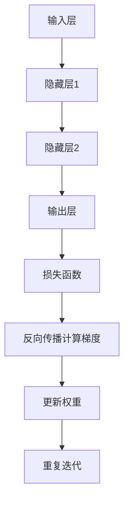

# 一切皆是映射：反向传播算法的数学原理

## 1. 背景介绍

在深度学习的世界里,反向传播算法(Backpropagation)是训练神经网络的核心算法之一。它通过计算每个权重对于最终输出的误差的梯度,从而不断调整网络权重,使得网络能够学习到正确的映射关系。反向传播算法的发明,使得多层神经网络能够被高效地训练,从而推动了深度学习的发展。

## 2. 核心概念与联系

反向传播算法的核心思想是利用链式法则计算复合函数的导数。在神经网络中,每一层的输出都是通过激活函数对上一层输出的加权和进行变换得到的。整个网络的输出就是层层复合函数的结果。反向传播算法就是从网络的输出层开始,沿着网络的反方向,通过链式法则计算每一层的误差对权重的梯度,从而实现对权重的更新。



## 3. 核心算法原理具体操作步骤

反向传播算法的具体步骤如下:

1. **前向传播**: 输入数据经过网络的层层变换,得到最终的输出。

2. **计算损失**: 将网络输出与真实标签计算损失函数(如均方误差或交叉熵)。

3. **反向传播**: 从输出层开始,利用链式法则计算每一层的误差对权重的梯度。
   - 输出层梯度: $\frac{\partial L}{\partial z^L} = \frac{\partial L}{\partial y} \odot \sigma'(z^L)$
   - 隐藏层梯度: $\frac{\partial L}{\partial z^l} = (W^{l+1})^T \frac{\partial L}{\partial z^{l+1}} \odot \sigma'(z^l)$

4. **权重更新**: 根据梯度下降法则,更新每一层的权重和偏置项。
   - 权重更新: $W^l \leftarrow W^l - \eta \frac{\partial L}{\partial W^l}$
   - 偏置更新: $b^l \leftarrow b^l - \eta \frac{\partial L}{\partial b^l}$

5. **重复迭代**: 重复以上步骤,直到网络收敛或达到最大迭代次数。

其中,$L$表示损失函数,$y$表示网络输出,$z^l$表示第$l$层的加权输入,$\sigma$表示激活函数,$\eta$表示学习率。

## 4. 数学模型和公式详细讲解举例说明

为了更好地理解反向传播算法的数学原理,我们以一个简单的两层神经网络为例进行推导。

假设我们有一个两层神经网络,输入层有两个节点,隐藏层有两个节点,输出层有一个节点。我们使用均方误差作为损失函数,sigmoid函数作为激活函数。

输入层到隐藏层的权重矩阵为$W^1$,隐藏层到输出层的权重矩阵为$W^2$,偏置项分别为$b^1$和$b^2$。

$$
\begin{aligned}
z^1 &= W^1 x + b^1\\
a^1 &= \sigma(z^1)\\
z^2 &= W^2 a^1 + b^2\\
y &= \sigma(z^2)\\
L &= \frac{1}{2}(y - t)^2
\end{aligned}
$$

其中,$x$表示输入,$t$表示真实标签,$a^1$表示隐藏层的输出。

我们需要计算$\frac{\partial L}{\partial W^1}$和$\frac{\partial L}{\partial W^2}$,以更新权重矩阵。

对于输出层,我们有:

$$
\begin{aligned}
\frac{\partial L}{\partial z^2} &= (y - t) \sigma'(z^2)\\
\frac{\partial L}{\partial W^2} &= \frac{\partial L}{\partial z^2} a^{1^T}\\
\frac{\partial L}{\partial b^2} &= \frac{\partial L}{\partial z^2}
\end{aligned}
$$

对于隐藏层,我们有:

$$
\begin{aligned}
\frac{\partial L}{\partial a^1} &= (W^2)^T \frac{\partial L}{\partial z^2}\\
\frac{\partial L}{\partial z^1} &= \frac{\partial L}{\partial a^1} \odot \sigma'(z^1)\\
\frac{\partial L}{\partial W^1} &= \frac{\partial L}{\partial z^1} x^T\\
\frac{\partial L}{\partial b^1} &= \frac{\partial L}{\partial z^1}
\end{aligned}
$$

通过上述公式,我们可以计算出每一层的梯度,并根据梯度下降法则更新权重矩阵和偏置项。反复迭代这个过程,直到网络收敛。

## 5. 项目实践: 代码实例和详细解释说明

为了更好地理解反向传播算法,我们用Python实现一个简单的两层神经网络,并手动计算梯度进行权重更新。

```python
import numpy as np

# sigmoid激活函数及其导数
def sigmoid(x):
    return 1 / (1 + np.exp(-x))

def sigmoid_derivative(x):
    return x * (1 - x)

# 输入数据
X = np.array([[0, 0], [0, 1], [1, 0], [1, 1]])
# 真实标签
y = np.array([[0], [1], [1], [0]])

# 初始化权重和偏置
np.random.seed(1)
W1 = np.random.randn(2, 2)
b1 = np.random.randn(1, 2)
W2 = np.random.randn(2, 1)
b2 = np.random.randn(1, 1)

# 超参数
learning_rate = 0.1
epochs = 10000

# 训练循环
for epoch in range(epochs):
    # 前向传播
    layer1 = sigmoid(np.dot(X, W1.T) + b1)
    layer2 = sigmoid(np.dot(layer1, W2.T) + b2)

    # 计算损失
    loss = np.mean((layer2 - y) ** 2)

    # 反向传播
    layer2_delta = (layer2 - y) * sigmoid_derivative(layer2)
    layer1_delta = np.dot(layer2_delta, W2) * sigmoid_derivative(layer1)

    # 更新权重和偏置
    W2 -= learning_rate * np.dot(layer1.T, layer2_delta)
    b2 -= learning_rate * np.sum(layer2_delta, axis=0, keepdims=True)
    W1 -= learning_rate * np.dot(X.T, layer1_delta)
    b1 -= learning_rate * np.sum(layer1_delta, axis=0, keepdims=True)

    # 打印损失
    if epoch % 1000 == 0:
        print(f"Epoch {epoch}, Loss: {loss}")

# 测试
print("Output:")
print(layer2)
```

在这个示例中,我们首先定义了sigmoid激活函数及其导数。然后,我们初始化了输入数据X、真实标签y,以及权重矩阵W1、W2和偏置项b1、b2。

在训练循环中,我们进行以下步骤:

1. 前向传播,计算每一层的输出。
2. 计算损失函数(均方误差)。
3. 反向传播,计算每一层的梯度。
4. 根据梯度,更新权重矩阵和偏置项。
5. 打印损失函数的值。

经过足够的迭代次数后,网络应该能够学习到正确的映射关系,输出接近真实标签。

通过这个简单的示例,我们可以更好地理解反向传播算法的具体实现过程。在实际应用中,我们通常会使用深度学习框架(如TensorFlow或PyTorch)来自动计算梯度和更新权重,而不是手动实现。

## 6. 实际应用场景

反向传播算法在深度学习的各个领域都有广泛的应用,包括但不限于:

1. **计算机视觉**: 图像分类、目标检测、语义分割等任务。
2. **自然语言处理**: 机器翻译、文本生成、情感分析等任务。
3. **语音识别**: 将语音信号转换为文本。
4. **推荐系统**: 根据用户历史行为预测用户偏好。
5. **游戏AI**: 训练智能体与人类玩家对抗。
6. **医疗诊断**: 根据医疗影像数据进行疾病诊断。

反向传播算法的广泛应用,促进了人工智能技术在各个领域的快速发展。

## 7. 工具和资源推荐

如果你想进一步学习和实践反向传播算法,以下是一些推荐的工具和资源:

1. **深度学习框架**: TensorFlow、PyTorch、MXNet等框架,提供了自动微分和反向传播的功能。
2. **在线课程**: 像Coursera、edX等平台上的深度学习课程,可以系统地学习反向传播算法及其应用。
3. **书籍**: 《深度学习》(Ian Goodfellow等人著)、《神经网络与深度学习》(Michael Nielsen著)等经典书籍。
4. **论文**: 反向传播算法的原始论文《Learning representations by back-propagating errors》(Rumelhart等人,1986)。
5. **开源项目**: 在GitHub上有许多开源的深度学习项目,可以学习和修改代码。
6. **在线社区**: 像StackOverflow、Reddit等社区,可以与其他学习者交流讨论。

通过利用这些工具和资源,你可以更好地掌握反向传播算法,并将其应用于实际项目中。

## 8. 总结: 未来发展趋势与挑战

尽管反向传播算法取得了巨大的成功,但它仍然存在一些局限性和挑战:

1. **梯度消失/爆炸**: 在深层网络中,梯度可能会随着层数的增加而急剧减小或增大,导致训练困难。
2. **局部最优**: 反向传播算法可能会陷入局部最优解,无法找到全局最优解。
3. **数据需求**: 深度神经网络通常需要大量的训练数据,否则容易过拟合。
4. **可解释性**: 深度神经网络的决策过程通常是一个黑箱,缺乏可解释性。
5. **能耗问题**: 训练深度神经网络需要消耗大量的计算资源和能源。

为了解决这些挑战,研究人员正在探索新的算法和架构,如:

1. **优化算法**: 如Adam、RMSProp等优化算法,可以加速收敛并缓解梯度问题。
2. **归一化技术**: 如BatchNorm、LayerNorm等技术,可以加速收敛并提高泛化能力。
3. **注意力机制**: 通过注意力机制,模型可以自适应地关注输入的不同部分,提高效率和性能。
4. **可解释性方法**: 如LIME、SHAP等方法,可以提高模型的可解释性。
5. **高效硬件**: 如TPU、GPU等专用硬件,可以加速训练和推理过程,降低能耗。
6. **元学习**: 通过元学习,模型可以从少量数据中快速学习,减轻对大量标注数据的依赖。

随着新算法和新硬件的不断出现,深度学习技术将继续推动人工智能的发展,并在更多领域发挥重要作用。

## 9. 附录: 常见问题与解答

1. **问题**: 为什么需要反向传播算法?直接计算梯度不可以吗?
   **答复**: 对于深层神经网络,直接计算梯度的计算量是指数级增长的,非常耗时。反向传播算法利用链式法则,可以高效地计算梯度,大大降低了计算复杂度。

2. **问题**: 反向传播算法是如何处理非线性激活函数的?
   **答复**: 对于非线性激活函数(如sigmoid或ReLU),反向传播算法利用其导数来计算梯度。对于不可导的函数(如ReLU在0处),可以通过次梯度或其他近似方法来处理。

3. **问题**: 如何选择合适的学习率?
   **答复**: 学习率的选择对训练效果有很大影响。太大的学习率可能导致diverge,太小的学习率则会使收敛速度变慢。通常可以采用动态调整学习率的策略,如指数衰减或warmup。

4. **问题**: 如何避免梯度消失或梯度爆炸?
   **答