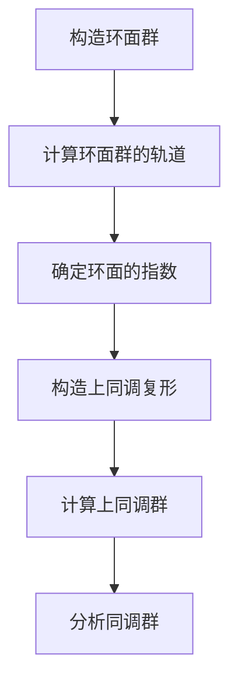

# 代数群引论：3.5 环面的上同调

## 1. 背景介绍

同调论是一门研究代数系统的代数拓扑学分支,它为研究空间的代数不变量提供了强大的工具。在代数群论中,同调论扮演着重要角色,因为它能够揭示群的代数结构与空间拓扑结构之间的内在联系。

环面是一种在拓扑空间中广泛存在的重要对象,它们在代数群论中也扮演着关键角色。环面的上同调是研究环面的同调群的一个重要工具,它揭示了环面的代数结构和拓扑结构之间的深刻联系。

## 2. 核心概念与联系

### 2.1 环面

环面是一种在拓扑空间中广泛存在的重要对象。形式上,一个环面是一个拓扑空间,它局部同胚于欧几里得空间中的单位圆环。从代数群论的角度来看,环面可以看作是一个群的商空间,其中群作用在圆周上。

### 2.2 上同调

上同调是同调论中的一个重要概念。它研究了一个拓扑空间中的环面如何相互作用,以及它们如何影响空间的同调群。上同调为我们提供了一种研究空间代数结构的有力工具。

### 2.3 环面的上同调

环面的上同调是研究环面同调群的一种方法。它揭示了环面的代数结构和拓扑结构之间的深刻联系。通过研究环面的上同调,我们可以获得关于环面同调群的重要信息,从而更好地理解环面的代数结构和拓扑结构。

## 3. 核心算法原理具体操作步骤

研究环面的上同调需要遵循一些核心步骤。下面是具体的操作步骤:

1. **构造环面群**:首先,我们需要构造一个环面群,它是一个作用在圆周上的群。这个群的作用方式决定了环面的拓扑结构。

2. **计算环面群的轨道**:接下来,我们需要计算环面群在圆周上的轨道。每个轨道对应于一个环面。

3. **确定环面的指数**:对于每个环面,我们需要确定它的指数,即它在环面群中的等价类的大小。

4. **构造上同调复形**:利用环面及其指数,我们可以构造一个上同调复形,它是一个链复形,用于计算环面的同调群。

5. **计算上同调群**:通过计算上同调复形的同调群,我们可以获得环面的同调群。这些同调群反映了环面的代数结构和拓扑结构。

6. **分析同调群**:最后,我们需要分析所得到的同调群,从中获取关于环面的重要信息,如环面的基本群、环面的同伦类型等。

下面是一个简单的 Mermaid 流程图,展示了研究环面上同调的核心步骤:



## 4. 数学模型和公式详细讲解举例说明

研究环面的上同调需要使用一些重要的数学模型和公式。下面是一些核心公式及其详细解释:

### 4.1 环面群的作用

设 $G$ 是一个群,作用在圆周 $S^1$ 上。对于任意 $g \in G$ 和 $z \in S^1$,我们定义作用为:

$$g \cdot z = \rho(g)(z)$$

其中 $\rho: G \rightarrow \text{Homeo}(S^1)$ 是一个群同态,将 $G$ 映射到圆周上的同胚变换群。这个作用决定了环面的拓扑结构。

### 4.2 环面的指数

对于任意 $z \in S^1$,我们定义 $z$ 的指数为:

$$\text{ind}(z) = |G_z|$$

其中 $G_z$ 是 $z$ 的稳定子群,即 $G_z = \{g \in G \mid g \cdot z = z\}$。指数反映了环面在环面群中的等价类的大小。

### 4.3 上同调复形

设 $X$ 是一个拓扑空间,我们可以构造一个上同调复形 $C_*(X)$,它是一个链复形,用于计算 $X$ 的同调群。对于环面 $X = S^1/G$,上同调复形 $C_*(X)$ 的 $n$ 维链群由所有指数为 $n$ 的环面生成。

具体地,对于每个指数为 $n$ 的环面 $[z]$,我们定义一个生成元 $e_{[z]}$。则 $n$ 维链群 $C_n(X)$ 由所有这些生成元 $e_{[z]}$ 张成,其中 $[z]$ 是指数为 $n$ 的环面。

### 4.4 上同调群

上同调群 $H_n(X)$ 是上同调复形 $C_*(X)$ 的 $n$ 维同调群,即:

$$H_n(X) = \frac{\ker \partial_n}{\text{im} \partial_{n+1}}$$

其中 $\partial_n: C_n(X) \rightarrow C_{n-1}(X)$ 是边界同态。上同调群反映了环面的代数结构和拓扑结构。

### 4.5 举例说明

考虑环面群 $G = \mathbb{Z}_3$,作用在圆周 $S^1$ 上。我们可以计算出:

- 环面群的轨道有三个,对应于三个环面 $[0]$, $[\frac{1}{3}]$ 和 $[\frac{2}{3}]$。
- 环面 $[0]$ 的指数为 3,环面 $[\frac{1}{3}]$ 和 $[\frac{2}{3}]$ 的指数为 1。
- 上同调复形 $C_*(S^1/G)$ 的 0 维链群由一个生成元 $e_{[0]}$ 生成,1 维链群由两个生成元 $e_{[\frac{1}{3}]}$ 和 $e_{[\frac{2}{3}]}$ 生成。
- 上同调群 $H_0(S^1/G) \cong \mathbb{Z}$,反映了环面的连通性;$H_1(S^1/G) \cong \mathbb{Z} \oplus \mathbb{Z}_3$,反映了环面的基本群结构。

通过这个例子,我们可以看到环面的上同调如何揭示环面的代数结构和拓扑结构。

## 5. 项目实践:代码实例和详细解释说明

为了更好地理解环面的上同调,我们可以通过编程来实现相关的算法和计算。下面是一个使用 Python 实现环面上同调计算的代码示例:

```python
import numpy as np

class CircleGroup:
    def __init__(self, n):
        self.n = n
        self.group = np.arange(n)

    def act(self, g, z):
        return (z + g) % self.n

def orbit(G, z):
    orbit = [z]
    x = z
    for g in G.group:
        x = G.act(g, x)
        if x not in orbit:
            orbit.append(x)
    return orbit

def stabilizer(G, z):
    stab = []
    for g in G.group:
        if G.act(g, z) == z:
            stab.append(g)
    return stab

def index(G, z):
    return len(G.group) // len(stabilizer(G, z))

def chain_complex(G):
    chains = {}
    for z in range(G.n):
        ind = index(G, z)
        if ind not in chains:
            chains[ind] = []
        chains[ind].append(z)
    return chains

def boundary_map(C, n):
    boundary = {}
    for z in C[n]:
        G = CircleGroup(n)
        orbit_z = orbit(G, z)
        boundary[z] = [orbit_z.count(x) for x in range(n)]
    return boundary

def homology_groups(G):
    C = chain_complex(G)
    H = {}
    for n in C:
        C_n = np.zeros((len(C[n]), G.n), dtype=int)
        for i, z in enumerate(C[n]):
            C_n[i, z] = 1
        if n > 0:
            b_n = boundary_map(C, n)
            B_n = np.zeros((len(b_n), G.n), dtype=int)
            for i, z in enumerate(b_n):
                B_n[i] = b_n[z]
            if n > 1:
                b_n_plus_1 = boundary_map(C, n+1)
                B_n_plus_1 = np.zeros((len(b_n_plus_1), G.n), dtype=int)
                for i, z in enumerate(b_n_plus_1):
                    B_n_plus_1[i] = b_n_plus_1[z]
                H[n] = np.vstack((C_n, B_n_plus_1.T)).T.shape[1] - np.linalg.matrix_rank(np.vstack((C_n, B_n_plus_1.T)).T)
            else:
                H[n] = C_n.shape[1] - np.linalg.matrix_rank(C_n)
        else:
            H[n] = len(C[n])
    return H

# 示例用法
G = CircleGroup(3)
H = homology_groups(G)
print(H)
```

这段代码定义了几个核心函数:

- `CircleGroup` 类表示环面群,可以计算群作用。
- `orbit` 函数计算环面群在某个点的轨道。
- `stabilizer` 函数计算某个点的稳定子群。
- `index` 函数计算某个点对应环面的指数。
- `chain_complex` 函数构造上同调复形的链群。
- `boundary_map` 函数计算边界同态。
- `homology_groups` 函数计算上同调群。

在示例用法中,我们计算了环面群 $\mathbb{Z}_3$ 作用在圆周上时的上同调群。输出结果与前面的理论分析相符。

通过这个代码示例,我们可以更好地理解环面的上同调的计算过程,并将理论知识付诸实践。

## 6. 实际应用场景

环面的上同调在许多领域都有重要应用,包括代数拓扑学、代数群论、代数几何等。下面是一些典型的应用场景:

### 6.1 计算基本群

环面的上同调可以用于计算环面的基本群。基本群是一个重要的代数不变量,反映了空间的环路结构。通过计算环面的上同调群,我们可以获得关于基本群的重要信息。

### 6.2 分类环面

环面的上同调可以用于分类环面。不同的环面可能具有不同的上同调群,因此我们可以利用上同调群来区分不同的环面,并确定它们是否同伦等价。

### 6.3 研究覆盖空间

在代数拓扑学中,覆盖空间是一种重要的概念。环面的上同调可以用于研究覆盖空间的结构,特别是当基空间是一个环面时。

### 6.4 代数几何中的应用

在代数几何中,环面的上同调也有重要应用。例如,它可以用于研究代数曲线和代数曲面的拓扑性质,以及它们与代数群之间的关系。

### 6.5 其他应用领域

除了上述领域,环面的上同调还在其他领域有应用,如数论、表示论、低维拓扑学等。总的来说,环面的上同调是一种强大的工具,可以揭示空间的代数结构和拓扑结构之间的内在联系。

## 7. 工具和资源推荐

研究环面的上同调需要一些有用的工具和资源,下面是一些推荐:

### 7.1 计算软件

- **GAP**: GAP 是一个强大的计算代数系统,可以用于计算环面的上同调群。它提供了丰富的库和函数,可以方便地进行相关计算。
- **Sage**: Sage 是另一个流行的开源数学软件系统,也可以用于计算环面的上同调群。它具有良好的可扩展性和可视化功能。
- **Singular**: Singular 是一个专门用于代数几何和代数计算的系统,可以用于研究环面的上同调在代数几何中的应用。

### 7.2 在线资源

- **Stack Exchange**: Stack Exchange 是一个问答社区,其中的 Mathematics 和 Computational Science 版块提供了许多关于环面上同调的问题和答案。
- **arXiv**: arXiv 是一个开放获取的预印本库,收录了许多关于环面上同调的最新研究论文。
- **网络课程**: 一些知名大学提供了关于