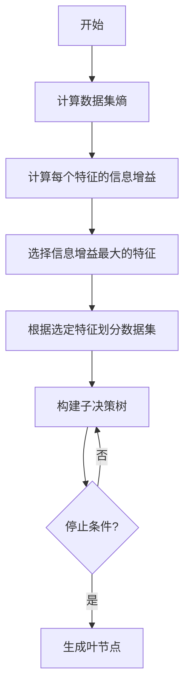
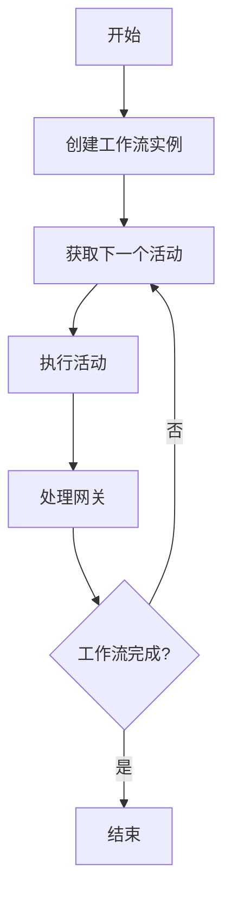
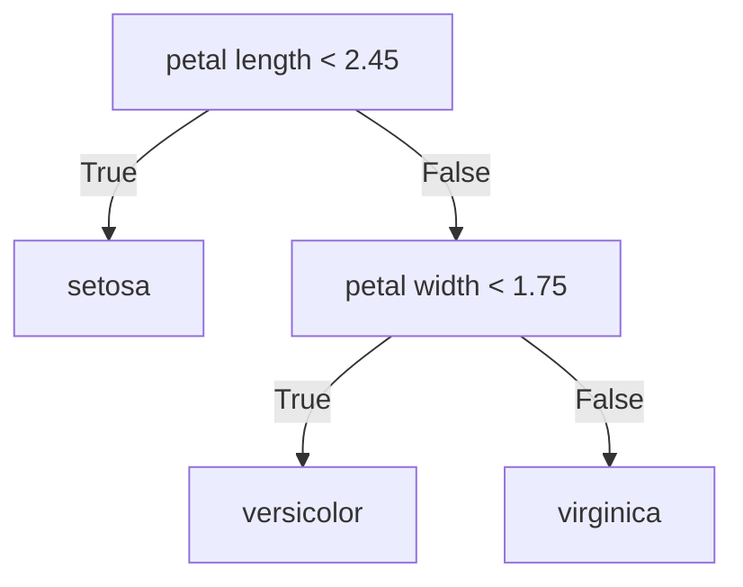

# 决策树和工作流：AI代理如何进行决策分析

## 1.背景介绍

在现代智能系统中,决策分析是一个关键环节。无论是企业级应用程序、游戏AI还是自主机器人,都需要根据当前状态做出明智的决策,以实现既定目标。决策树和工作流作为两种常用的决策分析模型,为AI代理提供了清晰的决策逻辑和执行路径。

### 1.1 什么是决策树?

决策树是一种树状结构模型,它将决策过程表示为一系列连续的决策节点。每个决策节点根据特定条件将数据划分为两个或多个子集,最终得到一个决策结果。决策树广泛应用于分类、回归和决策分析任务。

### 1.2 什么是工作流?

工作流描述了一系列按顺序执行的任务,用于实现特定目标。它通常由多个有条件转移的步骤组成,每个步骤可能会影响后续步骤的执行路径。工作流常见于业务流程自动化、数据处理管道等场景。

## 2.核心概念与联系  

### 2.1 决策树的核心概念

- **决策节点(Decision Node)**: 树中的内部节点,表示需要根据特征进行决策的点。
- **叶节点(Leaf Node)**: 树的终端节点,代表决策的最终结果或类别。
- **特征(Feature)**: 用于决策的输入变量,如年龄、收入等。
- **信息增益(Information Gain)**: 评估特征对数据集的分类能力,用于选择最优决策特征。
- **熵(Entropy)**: 衡量数据集的无序程度,用于计算信息增益。

### 2.2 工作流的核心概念  

- **活动(Activity)**: 工作流中的基本执行单元,表示需要完成的任务。
- **控制流(Control Flow)**: 定义活动执行的顺序和条件。
- **数据流(Data Flow)**: 描述活动之间的数据传递和映射关系。
- **网关(Gateway)**: 用于控制执行流程,如并行分支、条件分支等。
- **事件(Event)**: 触发工作流实例执行或影响执行路径的外部信号。

### 2.3 决策树与工作流的联系

决策树和工作流在本质上都是对决策过程的形式化描述,但侧重点不同:

- 决策树强调根据特征进行分类或回归,适合于数据驱动的决策场景。
- 工作流则关注活动的执行顺序和控制流程,常用于流程自动化领域。

两者可以结合使用,例如在工作流中嵌入决策树模型,根据决策树的输出结果选择不同的执行路径。

## 3.核心算法原理具体操作步骤

### 3.1 决策树算法

构建决策树的经典算法有ID3、C4.5和CART等,它们的核心思想是递归地构建决策树,选择最优特征进行数据集划分,直到满足停止条件。以ID3算法为例,其步骤如下:

1. **计算数据集的熵**,衡量数据集的无序程度。
2. **对每个特征计算信息增益**,选择信息增益最大的特征作为当前节点。
3. **根据选定特征将数据集划分为子集**。
4. **对每个子集递归构建子决策树**。
5. **直到所有实例属于同一类别或满足其他停止条件**。



### 3.2 工作流执行算法

工作流的执行算法需要处理活动的调度、并行分支、条件分支等控制流逻辑。一种常见的执行算法如下:

1. **创建工作流实例**,初始化上下文数据。
2. **获取下一个活动**,根据控制流逻辑确定执行路径。
3. **执行活动**,可能会修改上下文数据。
4. **处理网关**,如并行分支、条件分支等。
5. **重复2-4步骤**,直到工作流完成。



## 4.数学模型和公式详细讲解举例说明

### 4.1 决策树中的信息增益

信息增益是决策树算法中的核心概念,用于评估特征对数据集的分类能力。它基于信息论中的熵(Entropy)和条件熵(Conditional Entropy)的概念。

**熵(Entropy)** 衡量数据集的无序程度,定义如下:

$$
H(X) = -\sum_{i=1}^{n}p(x_i)\log_2 p(x_i)
$$

其中,n是类别数量,$p(x_i)$是第i个类别的概率。

**条件熵(Conditional Entropy)** 表示在已知某个特征值的条件下,数据集的无序程度:

$$
H(X|Y) = \sum_{j=1}^{m}p(y_j)H(X|Y=y_j)
$$

其中,m是特征Y的取值数量,$p(y_j)$是第j个特征值的概率,$H(X|Y=y_j)$是在特征值$y_j$条件下,数据集X的熵。

**信息增益(Information Gain)** 定义为:

$$
IG(X|Y) = H(X) - H(X|Y)
$$

它表示已知特征Y后,对数据集X的无序程度的减少程度。信息增益越大,说明特征Y对数据集X的分类能力越强。

### 4.2 示例:计算信息增益

假设有一个天气数据集,包含4个特征:阴晴(Outlook)、温度(Temperature)、湿度(Humidity)和是否适合打球(PlayTennis)。我们计算特征"阴晴"对"PlayTennis"的信息增益:

1. 计算"PlayTennis"的熵:

   $H(PlayTennis) = -\frac{9}{14}\log_2\frac{9}{14} - \frac{5}{14}\log_2\frac{5}{14} = 0.94$

2. 计算在已知"阴晴"特征值的条件下,"PlayTennis"的条件熵:

   $H(PlayTennis|Outlook)$
   $= \frac{5}{14}H(PlayTennis|Outlook=Sunny)$
   $+ \frac{4}{14}H(PlayTennis|Outlook=Overcast)$
   $+ \frac{5}{14}H(PlayTennis|Outlook=Rainy)$
   $= \frac{5}{14}\left(-\frac{2}{5}\log_2\frac{2}{5}-\frac{3}{5}\log_2\frac{3}{5}\right)$
   $+ \frac{4}{14}\left(-\log_2 1 - 0\log_2 0\right)$
   $+ \frac{5}{14}\left(-\frac{1}{5}\log_2\frac{1}{5}-\frac{4}{5}\log_2\frac{4}{5}\right)$
   $= 0.69$

3. 计算"阴晴"特征对"PlayTennis"的信息增益:

   $IG(PlayTennis|Outlook) = H(PlayTennis) - H(PlayTennis|Outlook) = 0.94 - 0.69 = 0.25$

信息增益为0.25,说明"阴晴"这个特征对于预测"PlayTennis"具有一定的分类能力。

## 5.项目实践:代码实例和详细解释说明

以下是使用Python和scikit-learn库构建决策树分类器的示例代码:

```python
from sklearn import tree
from sklearn.datasets import load_iris
from sklearn.model_selection import train_test_split
import graphviz

# 加载iris数据集
iris = load_iris()
X, y = iris.data, iris.target

# 拆分训练集和测试集
X_train, X_test, y_train, y_test = train_test_split(X, y, test_size=0.2, random_state=42)

# 创建决策树分类器
clf = tree.DecisionTreeClassifier(criterion='entropy', max_depth=3)

# 训练模型
clf.fit(X_train, y_train)

# 评估模型
score = clf.score(X_test, y_test)
print(f"Accuracy: {score:.2f}")

# 可视化决策树
dot_data = tree.export_graphviz(clf, out_file=None, 
                                feature_names=iris.feature_names,
                                class_names=iris.target_names,
                                filled=True, rounded=True)
graph = graphviz.Source(dot_data)
graph.render("iris_tree")
```

代码解释:

1. 导入必要的库和iris数据集。
2. 将数据集拆分为训练集和测试集。
3. 创建决策树分类器对象,设置熵作为信息增益标准,最大深度为3。
4. 使用训练集训练决策树模型。
5. 在测试集上评估模型的准确率。
6. 使用graphviz库可视化决策树,生成PDF文件。

运行结果:

```
Accuracy: 0.97
```

可视化的决策树如下:



该决策树根据花萼长度和花瓣宽度对鸢尾花进行分类,准确率达到97%。

## 6.实际应用场景

### 6.1 决策树在实际应用中的场景

- **金融风险评估**: 通过分析客户的信用记录、收入水平等特征,评估贷款违约风险。
- **医疗诊断**: 根据症状、检查结果等特征,对疾病进行诊断和分类。
- **目标营销**: 利用客户的人口统计学和购买行为数据,预测他们对特定产品或服务的兴趣。
- **欺诈检测**: 分析交易记录、IP地址等特征,识别潜在的欺诈行为。

### 6.2 工作流在实际应用中的场景

- **业务流程自动化(BPM)**: 自动执行和监控企业内部的各种业务流程,如采购、销售、人力资源等。
- **数据处理管道**: 构建数据提取、转换、加载(ETL)的工作流,实现数据的自动化处理。
- **科学计算工作流**: 在科学研究领域,工作流可以自动化复杂的计算和模拟过程。
- **IT运维自动化**: 通过工作流实现服务器provisioning、应用部署、监控警报等IT运维任务的自动化。

## 7.工具和资源推荐

### 7.1 决策树工具和库

- **scikit-learn**: Python中流行的机器学习库,提供了决策树分类器和回归器的实现。
- **XGBoost**: 一种高效的梯度提升决策树库,在许多机器学习竞赛中表现出色。
- **LightGBM**: 另一种高性能的梯度提升决策树框架,在内存使用和训练速度方面优于XGBoost。
- **Weka**: 一个集成了多种机器学习算法的Java工具,包括决策树算法。
- **R语言**: 在R中,可以使用rpart、party等包构建决策树模型。

### 7.2 工作流工具和框架

- **Apache Airflow**: 一个用Python编写的开源工作流管理系统,适用于数据管道自动化。
- **AWS Step Functions**: Amazon Web Services提供的无服务器工作流服务,可视化设计和运行工作流。
- **Camunda**: 一个开源的轻量级工作流和决策自动化平台,支持BPMN 2.0标准。
- **jBPM**: 一个基于Java的开源业务流程管理套件,集成了工作流、规则引擎和决策引擎。
- **Node-RED**: 一个基于Node.js的可视化工具,用于连接硬件设备、API和在线服务。

## 8.总结:未来发展趋势与挑战

### 8.1 决策树的发展趋势和挑战

- **集成学习**: 将多个决策树组合成更强大的模型,如随机森林、梯度提升树等,以提高预测性能和鲁棒性。
- **解释性**: 提高决策树模型的可解释性,使其决策过程更加透明和可