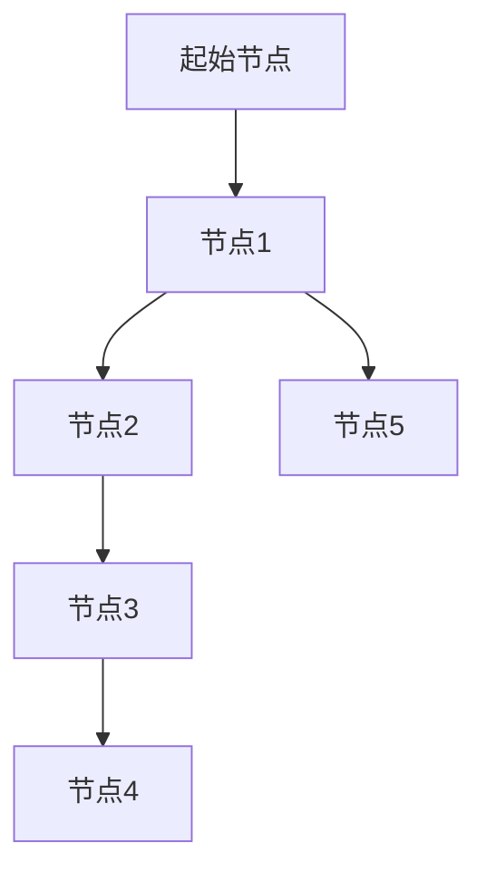
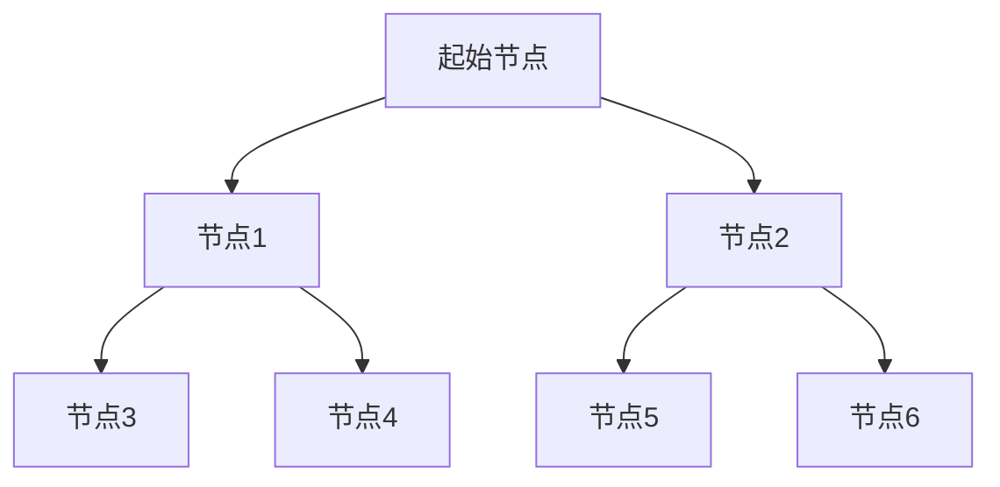
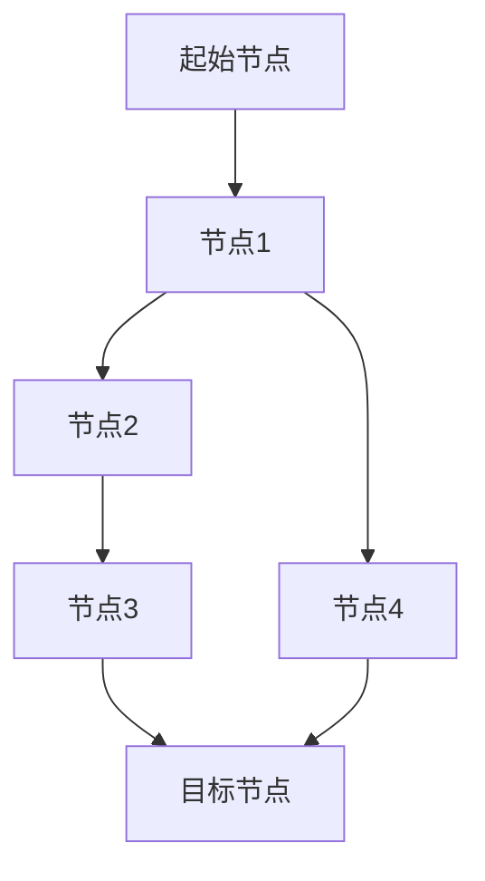

# 图数据库 原理与代码实例讲解

## 1.背景介绍

在现代数据管理和分析中，图数据库因其独特的结构和高效的查询能力，逐渐成为一种重要的数据库类型。传统的关系型数据库在处理复杂关系和连接查询时，往往效率低下，而图数据库则通过图结构的方式，能够更直观和高效地表示和处理数据之间的关系。

图数据库的应用场景非常广泛，包括社交网络分析、推荐系统、知识图谱、网络安全、物联网等。随着大数据和人工智能技术的发展，图数据库的优势愈发明显，成为数据科学家和工程师们的重要工具。

## 2.核心概念与联系

### 2.1 图的基本概念

图是一种由节点（Vertices）和边（Edges）组成的数据结构。节点表示实体，边表示实体之间的关系。图可以是有向的（Directed Graph）或无向的（Undirected Graph），也可以是加权的（Weighted Graph）或非加权的（Unweighted Graph）。

### 2.2 图数据库的基本概念

图数据库是一种专门用于存储和查询图结构数据的数据库。与传统的关系型数据库不同，图数据库直接将数据存储为图结构，使得查询和操作更加高效。常见的图数据库包括Neo4j、ArangoDB、OrientDB等。

### 2.3 图数据库与关系型数据库的对比

- **数据模型**：关系型数据库使用表格来表示数据，而图数据库使用节点和边。
- **查询语言**：关系型数据库使用SQL，图数据库使用专门的图查询语言，如Cypher（Neo4j）、Gremlin（Apache TinkerPop）。
- **性能**：在处理复杂关系和连接查询时，图数据库通常比关系型数据库更高效。

### 2.4 图数据库的优势

- **高效的关系查询**：图数据库在处理多层次、多维度的关系查询时，具有显著的性能优势。
- **灵活的数据模型**：图数据库的数据模型更加灵活，能够自然地表示复杂的关系。
- **直观的数据表示**：图结构的数据表示方式更加直观，便于理解和分析。

## 3.核心算法原理具体操作步骤

### 3.1 图遍历算法

图遍历是图数据库中最基本的操作之一，常见的图遍历算法包括深度优先搜索（DFS）和广度优先搜索（BFS）。

#### 3.1.1 深度优先搜索（DFS）

深度优先搜索是一种递归的图遍历算法，从起始节点开始，沿着一条路径一直走到尽头，然后回溯到上一个节点，继续沿另一条路径走，直到遍历完所有节点。



#### 3.1.2 广度优先搜索（BFS）

广度优先搜索是一种层次遍历算法，从起始节点开始，先遍历所有相邻节点，然后再遍历这些相邻节点的相邻节点，依此类推，直到遍历完所有节点。



### 3.2 最短路径算法

最短路径算法用于查找图中两个节点之间的最短路径，常见的最短路径算法包括Dijkstra算法和A*算法。

#### 3.2.1 Dijkstra算法

Dijkstra算法是一种经典的最短路径算法，适用于加权图。其基本思想是从起始节点开始，逐步扩展到其他节点，直到找到目标节点的最短路径。



#### 3.2.2 A*算法

A*算法是一种启发式搜索算法，结合了Dijkstra算法和贪心算法的优点，适用于加权图。其基本思想是从起始节点开始，使用启发式函数估计到目标节点的距离，逐步扩展到其他节点，直到找到目标节点的最短路径。


## 4.数学模型和公式详细讲解举例说明

### 4.1 图的数学表示

图可以用 $G = (V, E)$ 表示，其中 $V$ 是节点的集合，$E$ 是边的集合。每条边可以表示为一个二元组 $(u, v)$，其中 $u, v \in V$。

### 4.2 邻接矩阵

邻接矩阵是一种表示图的方式，使用一个 $|V| \times |V|$ 的矩阵 $A$，其中 $A[i][j]$ 表示节点 $i$ 和节点 $j$ 之间是否有边。如果有边，则 $A[i][j] = 1$，否则 $A[i][j] = 0$。

$$
A = \begin{bmatrix}
0 & 1 & 0 & 0 \\
1 & 0 & 1 & 1 \\
0 & 1 & 0 & 0 \\
0 & 1 & 0 & 0 \\
\end{bmatrix}
$$

### 4.3 邻接表

邻接表是另一种表示图的方式，使用一个数组 $Adj$，其中 $Adj[i]$ 是一个链表，表示节点 $i$ 的所有相邻节点。

$$
Adj = \begin{cases}
1: [2] \\
2: [1, 3, 4] \\
3: [2] \\
4: [2] \\
\end{cases}
$$

### 4.4 最短路径算法的数学表示

#### 4.4.1 Dijkstra算法

Dijkstra算法的基本思想是使用一个优先队列，逐步扩展到其他节点，直到找到目标节点的最短路径。其数学表示如下：

$$
d[v] = \min(d[v], d[u] + w(u, v))
$$

其中，$d[v]$ 表示从起始节点到节点 $v$ 的最短路径长度，$w(u, v)$ 表示边 $(u, v)$ 的权重。

#### 4.4.2 A*算法

A*算法的基本思想是使用一个启发式函数 $h(v)$，估计从节点 $v$ 到目标节点的距离。其数学表示如下：

$$
f(v) = g(v) + h(v)
$$

其中，$g(v)$ 表示从起始节点到节点 $v$ 的实际距离，$h(v)$ 表示从节点 $v$ 到目标节点的估计距离。

## 5.项目实践：代码实例和详细解释说明

### 5.1 使用Neo4j实现图数据库

Neo4j是目前最流行的图数据库之一，支持ACID事务，具有高性能和高可用性。下面我们通过一个简单的示例，展示如何使用Neo4j实现图数据库。

#### 5.1.1 安装Neo4j

首先，我们需要安装Neo4j。可以从Neo4j的官方网站下载并安装Neo4j。

```bash
wget -O - https://debian.neo4j.com/neotechnology.gpg.key | sudo apt-key add -
echo 'deb https://debian.neo4j.com stable 4.3' | sudo tee /etc/apt/sources.list.d/neo4j.list
sudo apt-get update
sudo apt-get install neo4j
```

#### 5.1.2 创建图数据

安装完成后，我们可以使用Cypher查询语言创建图数据。下面是一个简单的示例，创建一个社交网络图。

```cypher
CREATE (Alice:Person {name: 'Alice'})
CREATE (Bob:Person {name: 'Bob'})
CREATE (Carol:Person {name: 'Carol'})
CREATE (Dave:Person {name: 'Dave'})

CREATE (Alice)-[:FRIEND]->(Bob)
CREATE (Bob)-[:FRIEND]->(Carol)
CREATE (Carol)-[:FRIEND]->(Dave)
CREATE (Alice)-[:FRIEND]->(Dave)
```

#### 5.1.3 查询图数据

创建图数据后，我们可以使用Cypher查询语言查询图数据。下面是一个简单的示例，查询Alice的所有朋友。

```cypher
MATCH (Alice:Person {name: 'Alice'})-[:FRIEND]->(friend)
RETURN friend.name
```

### 5.2 使用Python与Neo4j交互

我们还可以使用Python与Neo4j交互，进行图数据的创建和查询。下面是一个简单的示例，展示如何使用Python与Neo4j交互。

#### 5.2.1 安装Neo4j Python驱动

首先，我们需要安装Neo4j的Python驱动。

```bash
pip install neo4j
```

#### 5.2.2 创建图数据

安装完成后，我们可以使用Python代码创建图数据。

```python
from neo4j import GraphDatabase

uri = "bolt://localhost:7687"
driver = GraphDatabase.driver(uri, auth=("neo4j", "password"))

def create_friend(tx, name, friend_name):
    tx.run("CREATE (a:Person {name: $name})-[:FRIEND]->(b:Person {name: $friend_name})", name=name, friend_name=friend_name)

with driver.session() as session:
    session.write_transaction(create_friend, "Alice", "Bob")
    session.write_transaction(create_friend, "Bob", "Carol")
    session.write_transaction(create_friend, "Carol", "Dave")
    session.write_transaction(create_friend, "Alice", "Dave")
```

#### 5.2.3 查询图数据

创建图数据后，我们可以使用Python代码查询图数据。

```python
def find_friends(tx, name):
    result = tx.run("MATCH (a:Person {name: $name})-[:FRIEND]->(friend) RETURN friend.name", name=name)
    for record in result:
        print(record["friend.name"])

with driver.session() as session:
    session.read_transaction(find_friends, "Alice")
```

## 6.实际应用场景

### 6.1 社交网络分析

图数据库在社交网络分析中有广泛的应用，可以用于分析用户之间的关系、发现社交圈子、推荐朋友等。

### 6.2 推荐系统

图数据库可以用于构建推荐系统，通过分析用户与物品之间的关系，推荐用户可能感兴趣的物品。

### 6.3 知识图谱

知识图谱是一种表示知识的图结构，图数据库可以用于存储和查询知识图谱，支持复杂的知识推理和查询。

### 6.4 网络安全

图数据库可以用于网络安全分析，通过分析网络中的节点和边，发现潜在的安全威胁和攻击路径。

### 6.5 物联网

图数据库可以用于物联网数据管理，通过分析物联网设备之间的关系，优化设备管理和数据传输。

## 7.工具和资源推荐

### 7.1 图数据库工具

- **Neo4j**：最流行的图数据库，支持ACID事务，具有高性能和高可用性。
- **ArangoDB**：多模型数据库，支持图、文档和键值存储。
- **OrientDB**：多模型数据库，支持图、文档和对象存储。

### 7.2 图数据库资源

- **Neo4j官方文档**：提供详细的Neo4j使用指南和参考文档。
- **Graph Algorithms**：一本介绍图算法的书籍，涵盖了图数据库中的常见算法和应用。
- **Awesome Graph Databases**：一个收集了各种图数据库资源的GitHub仓库。

## 8.总结：未来发展趋势与挑战

图数据库在处理复杂关系和连接查询方面具有显著的优势，随着大数据和人工智能技术的发展，图数据库的应用场景将越来越广泛。未来，图数据库的发展趋势包括：

- **性能优化**：进一步优化图数据库的性能，提高查询效率和数据处理能力。
- **分布式图数据库**：开发分布式图数据库，支持大规模图数据的存储和查询。
- **图数据库与机器学习的结合**：将图数据库与机器学习技术结合，支持更复杂的图数据分析和预测。

然而，图数据库也面临一些挑战：

- **标准化问题**：图数据库的查询语言和数据模型尚未标准化，不同图数据库之间的兼容性较差。
- **数据一致性**：在分布式环境中，保证图数据的一致性和完整性是一个难题。
- **复杂性**：图数据库的使用和维护相对复杂，需要专业的知识和技能。

## 9.附录：常见问题与解答

### 9.1 图数据库与关系型数据库的区别是什么？

图数据库使用节点和边来表示数据和关系，关系型数据库使用表格来表示数据。图数据库在处理复杂关系和连接查询时，通常比关系型数据库更高效。

### 9.2 如何选择合适的图数据库？

选择图数据库时，需要考虑数据规模、查询性能、事务支持、可扩展性等因素。常见的图数据库包括Neo4j、ArangoDB、OrientDB等。

### 9.3 图数据库的应用场景有哪些？

图数据库的应用场景包括社交网络分析、推荐系统、知识图谱、网络安全、物联网等。

### 9.4 如何优化图数据库的性能？

优化图数据库性能的方法包括使用索引、优化查询语句、合理设计数据模型、使用分布式图数据库等。

### 9.5 图数据库的未来发展趋势是什么？

图数据库的未来发展趋势包括性能优化、分布式图数据库、图数据库与机器学习的结合等。

---

作者：禅与计算机程序设计艺术 / Zen and the Art of Computer Programming