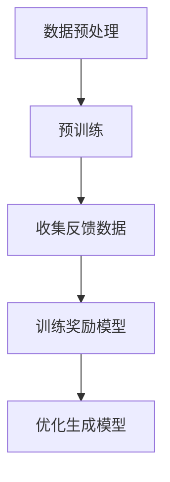

# 大语言模型原理与工程实践：InstructGPT

## 1.背景介绍

在过去的十年中，人工智能领域取得了显著的进展，特别是在自然语言处理（NLP）方面。大语言模型（Large Language Models, LLMs）如GPT-3、BERT等，已经展示了其在生成文本、翻译、问答等任务中的强大能力。InstructGPT 是 OpenAI 推出的一个重要模型，它在 GPT-3 的基础上进行了优化，旨在更好地理解和执行用户指令。

InstructGPT 的出现标志着大语言模型从单纯的文本生成向更智能、更实用的方向迈进了一大步。本文将深入探讨 InstructGPT 的核心概念、算法原理、数学模型、实际应用以及未来发展趋势。

## 2.核心概念与联系

### 2.1 大语言模型

大语言模型是基于深度学习的模型，通常使用数十亿甚至数千亿的参数进行训练。它们通过大量的文本数据进行预训练，能够生成高质量的自然语言文本。

### 2.2 GPT 系列

GPT（Generative Pre-trained Transformer）系列是由 OpenAI 开发的一系列大语言模型。GPT-3 是其中最为著名的版本，拥有1750亿个参数，能够生成高质量的文本。

### 2.3 InstructGPT

InstructGPT 是在 GPT-3 的基础上进行优化的模型，专注于更好地理解和执行用户指令。它通过强化学习和人类反馈（Reinforcement Learning from Human Feedback, RLHF）进行训练，使其在执行特定任务时更加准确和可靠。

### 2.4 强化学习与人类反馈

强化学习是一种机器学习方法，通过奖励和惩罚机制来优化模型的行为。InstructGPT 使用人类反馈来指导模型的训练，使其能够更好地理解和执行用户指令。

## 3.核心算法原理具体操作步骤

### 3.1 数据预处理

数据预处理是训练大语言模型的第一步。包括数据清洗、去重、分词等步骤。对于 InstructGPT，数据预处理还包括对指令和反馈数据的处理。

### 3.2 预训练

预训练是使用大量的文本数据对模型进行初步训练，使其能够生成高质量的文本。InstructGPT 的预训练过程与 GPT-3 类似，使用了Transformer架构。

### 3.3 强化学习与人类反馈

在预训练的基础上，InstructGPT 通过强化学习和人类反馈进行优化。具体步骤如下：

1. **收集反馈数据**：从人类用户那里收集关于模型生成文本的反馈。
2. **训练奖励模型**：使用反馈数据训练一个奖励模型，用于评估生成文本的质量。
3. **优化生成模型**：使用强化学习算法（如PPO）优化生成模型，使其生成的文本能够获得更高的奖励。



### 3.4 模型微调

在强化学习优化之后，模型还需要进行微调，以确保其在特定任务上的表现更加优异。微调通常使用小规模的、高质量的任务特定数据进行。

## 4.数学模型和公式详细讲解举例说明

### 4.1 Transformer 架构

Transformer 是大语言模型的核心架构。其主要组件包括多头自注意力机制（Multi-Head Self-Attention）和前馈神经网络（Feed-Forward Neural Network）。

$$
\text{Attention}(Q, K, V) = \text{softmax}\left(\frac{QK^T}{\sqrt{d_k}}\right)V
$$

其中，$Q$、$K$ 和 $V$ 分别表示查询（Query）、键（Key）和值（Value）矩阵，$d_k$ 是键的维度。

### 4.2 强化学习算法

InstructGPT 使用的强化学习算法主要是近端策略优化（Proximal Policy Optimization, PPO）。PPO 通过限制策略更新的步长来稳定训练过程。

$$
L^{CLIP}(\theta) = \mathbb{E}_t \left[ \min \left( r_t(\theta) \hat{A}_t, \text{clip}(r_t(\theta), 1 - \epsilon, 1 + \epsilon) \hat{A}_t \right) \right]
$$

其中，$r_t(\theta)$ 是策略比率，$\hat{A}_t$ 是优势函数，$\epsilon$ 是一个小常数，用于限制策略更新的步长。

### 4.3 奖励模型

奖励模型用于评估生成文本的质量。假设生成文本 $y$ 的质量得分为 $R(y)$，则优化目标是最大化期望奖励：

$$
\max_\theta \mathbb{E}_{y \sim \pi_\theta} [R(y)]
$$

其中，$\pi_\theta$ 表示生成模型的策略。

## 5.项目实践：代码实例和详细解释说明

### 5.1 数据预处理

```python
import re
import nltk
from nltk.tokenize import word_tokenize

# 下载必要的资源
nltk.download('punkt')

def preprocess_text(text):
    # 转换为小写
    text = text.lower()
    # 移除特殊字符
    text = re.sub(r'[^a-zA-Z0-9\s]', '', text)
    # 分词
    tokens = word_tokenize(text)
    return tokens

sample_text = "Hello, World! This is a sample text for preprocessing."
tokens = preprocess_text(sample_text)
print(tokens)
```

### 5.2 预训练

预训练通常需要大量的计算资源和时间，这里仅展示一个简化的示例。

```python
from transformers import GPT2LMHeadModel, GPT2Tokenizer

# 加载预训练模型和分词器
model = GPT2LMHeadModel.from_pretrained('gpt2')
tokenizer = GPT2Tokenizer.from_pretrained('gpt2')

# 编码输入文本
input_text = "Once upon a time"
input_ids = tokenizer.encode(input_text, return_tensors='pt')

# 生成文本
output = model.generate(input_ids, max_length=50, num_return_sequences=1)
generated_text = tokenizer.decode(output[0], skip_special_tokens=True)
print(generated_text)
```

### 5.3 强化学习与人类反馈

强化学习部分的代码较为复杂，这里仅展示一个简化的伪代码示例。

```python
# 伪代码示例
def train_reward_model(feedback_data):
    # 使用反馈数据训练奖励模型
    pass

def optimize_model_with_rl(model, reward_model):
    # 使用强化学习算法优化生成模型
    pass

# 收集反馈数据
feedback_data = collect_feedback_data()

# 训练奖励模型
reward_model = train_reward_model(feedback_data)

# 优化生成模型
optimized_model = optimize_model_with_rl(model, reward_model)
```

## 6.实际应用场景

### 6.1 客服系统

InstructGPT 可以用于构建智能客服系统，能够理解用户的提问并提供准确的回答，从而提高客户满意度。

### 6.2 教育领域

在教育领域，InstructGPT 可以用于自动生成教学材料、回答学生问题，甚至进行个性化辅导。

### 6.3 内容生成

InstructGPT 可以用于自动生成高质量的内容，如新闻报道、博客文章等，从而提高内容创作的效率。

### 6.4 医疗咨询

在医疗领域，InstructGPT 可以用于提供初步的医疗咨询服务，帮助患者了解病情和治疗方案。

## 7.工具和资源推荐

### 7.1 开源工具

- **Hugging Face Transformers**：一个流行的开源库，提供了多种预训练模型和工具，方便进行大语言模型的训练和应用。
- **OpenAI API**：提供了对 GPT-3 和 InstructGPT 的访问接口，方便开发者进行应用开发。

### 7.2 数据集

- **Common Crawl**：一个大型的网页抓取数据集，常用于大语言模型的预训练。
- **SQuAD**：一个问答数据集，常用于模型的微调和评估。

### 7.3 学习资源

- **《深度学习》**：一本经典的深度学习教材，适合初学者和进阶学习者。
- **Coursera 和 edX 上的相关课程**：提供了多种关于自然语言处理和深度学习的在线课程。

## 8.总结：未来发展趋势与挑战

### 8.1 未来发展趋势

- **更大规模的模型**：未来的大语言模型将会拥有更多的参数和更强的生成能力。
- **多模态模型**：结合文本、图像、音频等多种模态的数据，构建更加智能和全面的模型。
- **个性化模型**：针对不同用户需求进行个性化优化，使模型能够提供更加精准和个性化的服务。

### 8.2 挑战

- **计算资源**：训练和部署大语言模型需要大量的计算资源，这对许多组织来说是一个挑战。
- **数据隐私**：在使用大语言模型时，需要注意数据隐私和安全问题，确保用户数据不被滥用。
- **伦理问题**：大语言模型的应用可能会带来一些伦理问题，如生成虚假信息、侵犯隐私等，需要在技术发展过程中加以重视和解决。

## 9.附录：常见问题与解答

### 9.1 InstructGPT 与 GPT-3 有何不同？

InstructGPT 是在 GPT-3 的基础上进行优化的模型，专注于更好地理解和执行用户指令。它通过强化学习和人类反馈进行训练，使其在执行特定任务时更加准确和可靠。

### 9.2 如何使用 InstructGPT 进行项目开发？

可以使用 OpenAI 提供的 API 进行项目开发。首先需要注册并获取 API 密钥，然后使用相关的库（如 Hugging Face Transformers）进行模型调用和应用开发。

### 9.3 InstructGPT 的训练需要多长时间？

训练 InstructGPT 需要大量的计算资源和时间，具体时间取决于模型的规模和训练数据的量。通常需要数周甚至数月的时间。

### 9.4 InstructGPT 是否可以离线使用？

由于 InstructGPT 的规模较大，通常需要在云端进行部署和使用。离线使用需要强大的计算资源和存储空间，通常不太现实。

### 9.5 如何确保 InstructGPT 的生成内容准确可靠？

可以通过人类反馈和强化学习对模型进行优化，确保其生成的内容更加准确和可靠。此外，还可以使用多种评估指标对生成内容进行评估和验证。

---

作者：禅与计算机程序设计艺术 / Zen and the Art of Computer Programming