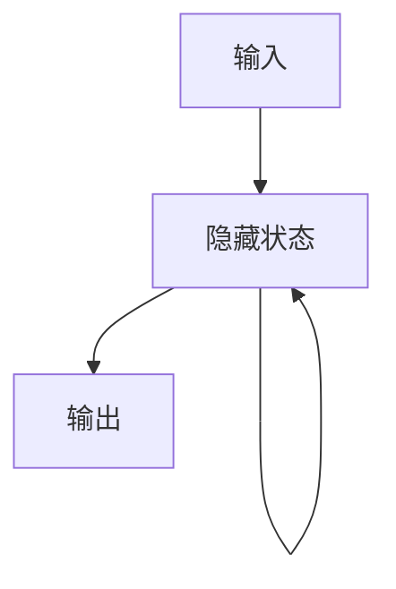
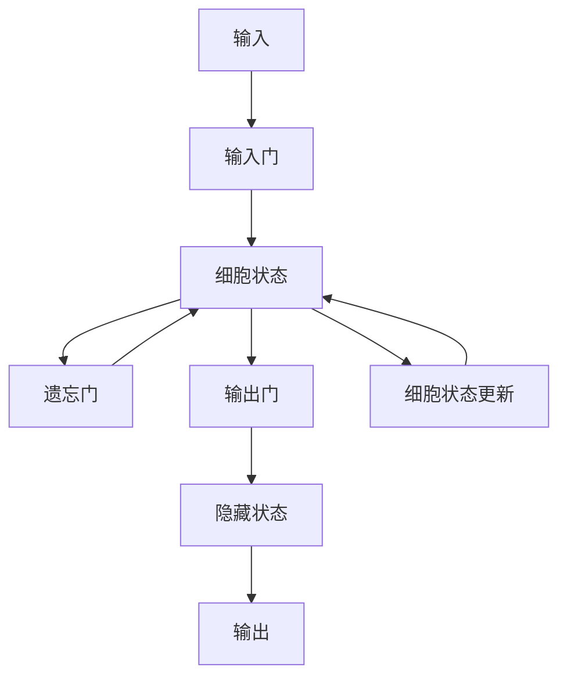

## 1. 背景介绍

自然语言处理（NLP）一直是人工智能领域的热门话题之一。在NLP中，语言模型是一个重要的概念，它可以用来预测一个句子或文本序列的下一个单词或字符。传统的语言模型通常使用n-gram模型，但是这种模型存在着数据稀疏性和上下文信息不足的问题。近年来，随着深度学习技术的发展，基于神经网络的大语言模型逐渐成为了主流。

大语言模型是指参数量非常大的神经网络模型，它可以学习到更多的上下文信息，从而提高预测的准确性。在实际应用中，大语言模型已经被广泛应用于机器翻译、语音识别、文本生成等领域。本文将介绍大语言模型的原理和工程实践，帮助读者深入了解这一领域的技术。

## 2. 核心概念与联系

### 2.1 语言模型

语言模型是指对语言的概率分布进行建模的一种方法。在NLP中，语言模型通常用来预测一个句子或文本序列的下一个单词或字符。语言模型可以用于机器翻译、语音识别、文本生成等任务。

### 2.2 大语言模型

大语言模型是指参数量非常大的神经网络模型，它可以学习到更多的上下文信息，从而提高预测的准确性。大语言模型通常使用循环神经网络（RNN）或者变种的RNN模型，如长短时记忆网络（LSTM）和门控循环单元（GRU）。

### 2.3 上下文学习

上下文学习是指利用上下文信息来进行学习的一种方法。在NLP中，上下文信息可以是前面的单词或字符，也可以是整个句子或文本序列。上下文学习可以帮助模型更好地理解语言的含义和结构。

### 2.4 推理策略

推理策略是指在给定上下文信息的情况下，选择最可能的下一个单词或字符的方法。在大语言模型中，推理策略通常使用贪心搜索或者束搜索。

## 3. 核心算法原理具体操作步骤

### 3.1 循环神经网络

循环神经网络（RNN）是一种能够处理序列数据的神经网络模型。RNN的核心思想是将前面的状态信息传递到当前状态中，从而实现对序列数据的建模。RNN的基本结构如下图所示：



其中，$x_t$表示输入序列中的第$t$个元素，$h_t$表示隐藏状态，$y_t$表示输出序列中的第$t$个元素。RNN的隐藏状态$h_t$可以通过下面的公式计算得到：

$$h_t = f(W_{xh}x_t + W_{hh}h_{t-1} + b_h)$$

其中，$W_{xh}$和$W_{hh}$分别表示输入和隐藏状态之间的权重矩阵，$b_h$表示偏置向量，$f$表示激活函数。RNN的输出$y_t$可以通过下面的公式计算得到：

$$y_t = g(W_{hy}h_t + b_y)$$

其中，$W_{hy}$表示隐藏状态和输出之间的权重矩阵，$b_y$表示偏置向量，$g$表示激活函数。

### 3.2 长短时记忆网络

长短时记忆网络（LSTM）是一种特殊的RNN模型，它可以解决传统RNN存在的梯度消失和梯度爆炸问题。LSTM的核心思想是引入了三个门控单元，分别是输入门、遗忘门和输出门。这些门控单元可以控制信息的流动，从而实现对序列数据的建模。LSTM的基本结构如下图所示：



其中，$x_t$表示输入序列中的第$t$个元素，$h_t$表示隐藏状态，$y_t$表示输出序列中的第$t$个元素，$c_t$表示细胞状态。LSTM的输入门、遗忘门和输出门可以通过下面的公式计算得到：

$$i_t = \sigma(W_{xi}x_t + W_{hi}h_{t-1} + W_{ci}c_{t-1} + b_i)$$

$$f_t = \sigma(W_{xf}x_t + W_{hf}h_{t-1} + W_{cf}c_{t-1} + b_f)$$

$$o_t = \sigma(W_{xo}x_t + W_{ho}h_{t-1} + W_{co}c_t + b_o)$$

其中，$\sigma$表示sigmoid函数，$W_{xi}$、$W_{hi}$、$W_{ci}$、$b_i$表示输入门的权重矩阵和偏置向量，$W_{xf}$、$W_{hf}$、$W_{cf}$、$b_f$表示遗忘门的权重矩阵和偏置向量，$W_{xo}$、$W_{ho}$、$W_{co}$、$b_o$表示输出门的权重矩阵和偏置向量。LSTM的细胞状态$c_t$可以通过下面的公式计算得到：

$$c_t = f_t \odot c_{t-1} + i_t \odot \tanh(W_{xc}x_t + W_{hc}h_{t-1} + b_c)$$

其中，$\odot$表示逐元素相乘，$\tanh$表示双曲正切函数，$W_{xc}$、$W_{hc}$、$b_c$表示细胞状态的权重矩阵和偏置向量。LSTM的隐藏状态$h_t$和输出$y_t$可以通过下面的公式计算得到：

$$h_t = o_t \odot \tanh(c_t)$$

$$y_t = g(W_{hy}h_t + b_y)$$

其中，$W_{hy}$表示隐藏状态和输出之间的权重矩阵，$b_y$表示偏置向量，$g$表示激活函数。

### 3.3 大语言模型

大语言模型通常使用循环神经网络或者变种的RNN模型，如LSTM和GRU。在训练大语言模型时，通常使用随机梯度下降（SGD）算法和反向传播算法来更新模型参数。在推理时，通常使用贪心搜索或者束搜索来选择最可能的下一个单词或字符。

## 4. 数学模型和公式详细讲解举例说明

### 4.1 语言模型

在NLP中，语言模型通常用来预测一个句子或文本序列的下一个单词或字符。语言模型可以用于机器翻译、语音识别、文本生成等任务。语言模型可以表示为下面的公式：

$$P(w_1, w_2, ..., w_n) = \prod_{i=1}^n P(w_i | w_1, w_2, ..., w_{i-1})$$

其中，$w_1, w_2, ..., w_n$表示一个句子或文本序列中的单词或字符，$P(w_i | w_1, w_2, ..., w_{i-1})$表示在给定前面的单词或字符的情况下，预测下一个单词或字符的概率。

### 4.2 大语言模型

大语言模型通常使用循环神经网络或者变种的RNN模型，如LSTM和GRU。大语言模型可以表示为下面的公式：

$$P(w_t | w_1, w_2, ..., w_{t-1}) = f(w_{t-1}, h_{t-1})$$

其中，$w_1, w_2, ..., w_{t-1}$表示前面的单词或字符，$w_t$表示要预测的下一个单词或字符，$f$表示大语言模型的推理策略，$h_{t-1}$表示前面的隐藏状态。

## 5. 项目实践：代码实例和详细解释说明

### 5.1 PyTorch实现大语言模型

下面是使用PyTorch实现大语言模型的代码示例：

```python
import torch
import torch.nn as nn

class LanguageModel(nn.Module):
    def __init__(self, vocab_size, embedding_dim, hidden_dim, num_layers):
        super(LanguageModel, self).__init__()
        self.embedding = nn.Embedding(vocab_size, embedding_dim)
        self.rnn = nn.LSTM(embedding_dim, hidden_dim, num_layers, batch_first=True)
        self.fc = nn.Linear(hidden_dim, vocab_size)

    def forward(self, x, h):
        x = self.embedding(x)
        out, h = self.rnn(x, h)
        out = self.fc(out)
        return out, h
```

其中，`vocab_size`表示词汇表的大小，`embedding_dim`表示词向量的维度，`hidden_dim`表示隐藏状态的维度，`num_layers`表示RNN的层数。在训练时，可以使用下面的代码：

```python
model = LanguageModel(vocab_size, embedding_dim, hidden_dim, num_layers)
criterion = nn.CrossEntropyLoss()
optimizer = torch.optim.Adam(model.parameters(), lr=learning_rate)

for epoch in range(num_epochs):
    for i, (inputs, targets) in enumerate(train_loader):
        h = (torch.zeros(num_layers, batch_size, hidden_dim),
             torch.zeros(num_layers, batch_size, hidden_dim))
        inputs = inputs.to(device)
        targets = targets.to(device)

        outputs, h = model(inputs, h)
        loss = criterion(outputs.view(-1, vocab_size), targets.view(-1))

        optimizer.zero_grad()
        loss.backward()
        optimizer.step()

        if (i+1) % 100 == 0:
            print('Epoch [{}/{}], Step [{}/{}], Loss: {:.4f}'
                  .format(epoch+1, num_epochs, i+1, total_step, loss.item()))
```

其中，`train_loader`是一个数据加载器，用来加载训练数据。在推理时，可以使用下面的代码：

```python
model.eval()
with torch.no_grad():
    h = (torch.zeros(num_layers, 1, hidden_dim),
         torch.zeros(num_layers, 1, hidden_dim))
    inputs = torch.tensor([[start_token]], dtype=torch.long).to(device)
    output = start_token
    while output != end_token:
        output, h = model(inputs, h)
        output = output.argmax(dim=-1).item()
        inputs = torch.tensor([[output]], dtype=torch.long).to(device)
        print(id2word[output], end=' ')
```

其中，`start_token`和`end_token`分别表示起始符和终止符，`id2word`是一个将单词ID映射为单词的字典。

## 6. 实际应用场景

大语言模型已经被广泛应用于机器翻译、语音识别、文本生成等领域。在机器翻译中，大语言模型可以用来生成目标语言的句子或文本序列。在语音识别中，大语言模型可以用来纠正语音识别结果中的错误。在文本生成中，大语言模型可以用来生成新的句子或文本序列。

## 7. 工具和资源推荐

- PyTorch：一个开源的深度学习框架，支持大语言模型的实现。
- TensorFlow：一个开源的深度学习框架，支持大语言模型的实现。
- GPT-2：一个由OpenAI开发的大语言模型，可以生成高质量的文本序列。
- BERT：一个由Google开发的大语言模型，可以实现文本分类、问答等任务。

## 8. 总结：未来发展趋势与挑战

大语言模型是NLP领域的重要技术之一，它可以用来预测一个句子或文本序列的下一个单词或字符。随着深度学习技术的发展，大语言模型的性能不断提高，已经被广泛应用于机器翻译、语音识别、文本生成等领域。未来，大语言模型将继续发展，面临的挑战包括模型的可解释性、数据隐私保护等问题。

## 9. 附录：常见问题与解答

Q: 大语言模型的训练需要多长时间？

A: 大语言模型的训练时间取决于模型的大小、训练数据的规模等因素。通常需要几天甚至几周的时间来训练一个大语言模型。

Q: 大语言模型的推理速度如何？

A: 大语言模型的推理速度取决于模型的大小、推理策略等因素。通常需要几秒钟到几分钟的时间来生成一个句子或文本序列。