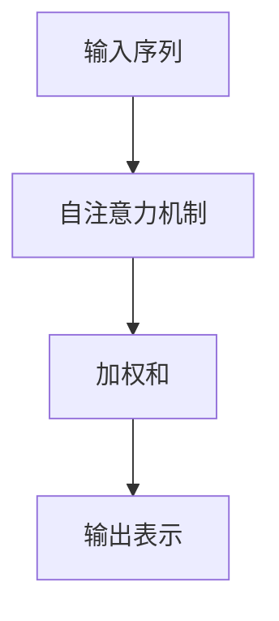
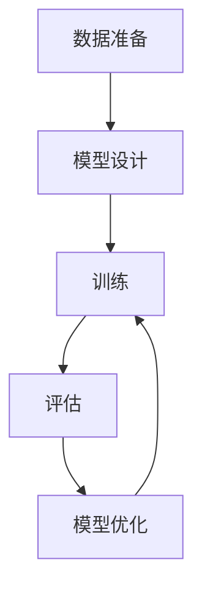

# 大语言模型原理基础与前沿 挑战与机遇

## 1.背景介绍

大语言模型（Large Language Models, LLMs）是近年来人工智能领域的一个重要突破。它们通过深度学习技术，特别是基于变换器（Transformer）架构的模型，能够在自然语言处理（NLP）任务中表现出色。大语言模型的出现不仅推动了学术研究的发展，也在实际应用中展现了巨大的潜力。

### 1.1 大语言模型的起源

大语言模型的起源可以追溯到早期的统计语言模型和神经网络语言模型。随着计算能力和数据量的增加，研究人员逐渐转向更复杂的模型架构，如循环神经网络（RNN）和长短期记忆网络（LSTM）。然而，真正的突破来自于2017年提出的变换器（Transformer）模型。

### 1.2 变换器模型的革命

变换器模型通过自注意力机制（Self-Attention Mechanism）解决了RNN和LSTM在处理长序列时的局限性。自注意力机制允许模型在处理每个词时都能关注到序列中的所有其他词，从而捕捉到更丰富的上下文信息。这一特性使得变换器模型在各种NLP任务中表现优异。

### 1.3 大语言模型的演进

自变换器模型提出以来，研究人员不断扩展其规模和能力，产生了一系列大语言模型，如BERT、GPT-3和T5。这些模型通过大规模预训练和微调技术，能够在多种任务中实现出色的性能。

## 2.核心概念与联系

大语言模型的核心概念包括词嵌入（Word Embeddings）、自注意力机制、预训练和微调等。理解这些概念有助于我们更好地掌握大语言模型的工作原理和应用。

### 2.1 词嵌入

词嵌入是将词语映射到高维向量空间的技术，使得语义相似的词在向量空间中距离较近。常见的词嵌入方法包括Word2Vec、GloVe和FastText。

### 2.2 自注意力机制

自注意力机制是变换器模型的核心组件。它通过计算输入序列中每个词与其他词的相关性，生成加权和的表示，从而捕捉到全局上下文信息。



### 2.3 预训练与微调

预训练是指在大规模无标签数据上训练模型，使其学习通用的语言表示。微调则是在特定任务的数据上进一步训练模型，使其适应具体任务的需求。

## 3.核心算法原理具体操作步骤

大语言模型的训练和应用涉及多个步骤，包括数据准备、模型设计、训练和评估等。以下是一个典型的大语言模型训练流程。

### 3.1 数据准备

数据准备是大语言模型训练的基础。需要收集大量的文本数据，并进行预处理，如分词、去除停用词和标注等。

### 3.2 模型设计

模型设计包括选择合适的模型架构和超参数。变换器模型是目前最常用的架构，其主要组件包括编码器和解码器。

### 3.3 训练

训练过程包括前向传播、损失计算和反向传播。通过不断调整模型参数，使得模型在训练数据上的损失最小化。

### 3.4 评估

评估是检验模型性能的重要环节。常用的评估指标包括准确率、精确率、召回率和F1值等。



## 4.数学模型和公式详细讲解举例说明

大语言模型的数学基础主要包括线性代数、概率论和信息论等。以下是一些关键公式和概念的详细讲解。

### 4.1 词嵌入

词嵌入将词语映射到高维向量空间。假设词汇表大小为 $V$，嵌入维度为 $d$，则词嵌入矩阵 $W \in \mathbb{R}^{V \times d}$。对于词 $w_i$，其嵌入向量为 $W[i]$。

### 4.2 自注意力机制

自注意力机制通过计算查询（Query）、键（Key）和值（Value）之间的相关性来生成加权和的表示。具体公式如下：

$$
\text{Attention}(Q, K, V) = \text{softmax}\left(\frac{QK^T}{\sqrt{d_k}}\right)V
$$

其中，$Q$、$K$ 和 $V$ 分别表示查询、键和值矩阵，$d_k$ 是键的维度。

### 4.3 预训练与微调

预训练通常采用自监督学习方法，如掩码语言模型（Masked Language Model, MLM）和自回归语言模型（Autoregressive Language Model, ALM）。以MLM为例，其目标是预测被掩码的词：

$$
\mathcal{L}_{MLM} = -\sum_{i \in \text{masked}} \log P(w_i | \mathbf{w}_{\text{context}})
$$

微调则是在特定任务的数据上进一步训练模型，使其适应具体任务的需求。

## 5.项目实践：代码实例和详细解释说明

为了更好地理解大语言模型的实际应用，我们将通过一个具体的代码实例来展示如何使用大语言模型进行文本生成任务。

### 5.1 环境准备

首先，我们需要安装必要的库，如Transformers和Torch。

```bash
pip install transformers torch
```

### 5.2 加载预训练模型

接下来，我们加载一个预训练的大语言模型，如GPT-3。

```python
from transformers import GPT2LMHeadModel, GPT2Tokenizer

model_name = 'gpt2'
model = GPT2LMHeadModel.from_pretrained(model_name)
tokenizer = GPT2Tokenizer.from_pretrained(model_name)
```

### 5.3 文本生成

我们可以使用加载的模型进行文本生成。以下是一个简单的示例：

```python
input_text = "人工智能的未来是"
input_ids = tokenizer.encode(input_text, return_tensors='pt')

output = model.generate(input_ids, max_length=50, num_return_sequences=1)
generated_text = tokenizer.decode(output[0], skip_special_tokens=True)

print(generated_text)
```

### 5.4 代码解释

上述代码首先加载了GPT-2模型和对应的分词器。然后，将输入文本编码为模型可接受的格式，并生成文本。最后，将生成的文本解码为可读的字符串。

## 6.实际应用场景

大语言模型在多个实际应用场景中展现了巨大的潜力，包括但不限于以下几个方面。

### 6.1 机器翻译

大语言模型可以用于机器翻译任务，通过学习不同语言之间的对应关系，实现高质量的翻译。

### 6.2 文本生成

大语言模型在文本生成任务中表现出色，可以用于自动写作、对话系统和内容创作等领域。

### 6.3 情感分析

通过对文本进行情感分析，大语言模型可以帮助企业了解用户情感，改进产品和服务。

### 6.4 信息检索

大语言模型可以用于信息检索任务，通过理解用户查询意图，提供更准确的搜索结果。

## 7.工具和资源推荐

在使用大语言模型时，有许多工具和资源可以帮助我们更高效地进行开发和研究。

### 7.1 开源库

- **Transformers**：由Hugging Face提供的开源库，支持多种预训练模型。
- **TensorFlow**：谷歌开发的开源深度学习框架，支持大规模模型训练。
- **PyTorch**：Facebook开发的开源深度学习框架，易于使用和扩展。

### 7.2 数据集

- **Wikipedia**：包含丰富的文本数据，可用于预训练和微调。
- **Common Crawl**：提供大规模的网页抓取数据，是训练大语言模型的理想选择。
- **OpenAI GPT-3 Dataset**：OpenAI提供的用于训练GPT-3的数据集。

### 7.3 在线资源

- **arXiv**：提供最新的学术论文和研究成果。
- **GitHub**：开源项目和代码库的集中地，包含大量大语言模型相关的项目。

## 8.总结：未来发展趋势与挑战

大语言模型在过去几年中取得了显著的进展，但仍面临许多挑战和机遇。

### 8.1 未来发展趋势

- **模型规模继续扩大**：随着计算能力的提升，未来的大语言模型将继续扩大规模，提升性能。
- **多模态学习**：结合文本、图像和音频等多种模态的数据，提升模型的理解和生成能力。
- **自监督学习**：自监督学习方法将进一步发展，减少对标注数据的依赖。

### 8.2 挑战

- **计算资源需求**：大语言模型的训练和推理需要大量的计算资源，限制了其广泛应用。
- **数据隐私和安全**：在使用大规模数据进行训练时，如何保护用户隐私和数据安全是一个重要问题。
- **模型解释性**：大语言模型的复杂性使得其内部机制难以解释，影响了其在某些领域的应用。

## 9.附录：常见问题与解答

### 9.1 大语言模型的训练需要多长时间？

训练大语言模型的时间取决于模型规模、数据量和计算资源。通常需要数周甚至数月的时间。

### 9.2 如何选择合适的大语言模型？

选择大语言模型时，应考虑任务需求、计算资源和模型性能等因素。可以通过实验比较不同模型的效果，选择最适合的模型。

### 9.3 大语言模型是否可以处理多语言任务？

是的，大语言模型可以通过多语言预训练和微调，处理多语言任务。常见的多语言模型包括mBERT和XLM-R。

### 9.4 如何提高大语言模型的性能？

可以通过增加数据量、优化模型架构和调整超参数等方法，提高大语言模型的性能。此外，结合领域知识和特定任务的特点进行微调，也能显著提升模型效果。

### 9.5 大语言模型在实际应用中有哪些限制？

大语言模型在实际应用中面临计算资源需求高、数据隐私和安全、模型解释性等限制。需要综合考虑这些因素，选择合适的应用场景和解决方案。

---

作者：禅与计算机程序设计艺术 / Zen and the Art of Computer Programming