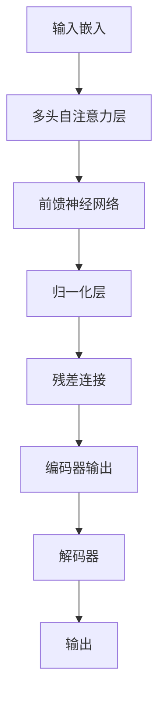

# 大语言模型应用指南：案例：私人邮件助手

## 1.背景介绍

随着人工智能技术的飞速发展,大型语言模型(Large Language Model, LLM)已经成为当前最炙手可热的技术之一。LLM是一种基于深度学习的自然语言处理(NLP)模型,能够通过训练海量文本数据来生成逼真的人类语言输出。

LLM的核心思想是利用自注意力机制和transformer架构,捕捉语言序列中单词之间的长程依赖关系,从而生成连贯、流畅的文本。经过大规模预训练后,LLM不仅能够进行文本生成,还可以应用于机器翻译、问答系统、文本摘要等多种NLP任务。

目前,OpenAI的GPT、Google的LaMDA、DeepMind的Chinchilla、Meta的OPT等都是业界领先的大型语言模型。其中,GPT-3拥有惊人的1750亿个参数,是有史以来规模最大的语言模型,在多项基准测试中表现出色。

## 2.核心概念与联系

### 2.1 语言模型(Language Model)

语言模型是自然语言处理领域的基础概念,旨在捕捉语言数据中的统计规律,从而预测下一个词的概率。形式化地,给定一个词序列$S = \{w_1, w_2, ..., w_n\}$,语言模型的目标是估计该序列的概率:

$$P(S) = P(w_1, w_2, ..., w_n) = \prod_{i=1}^{n}P(w_i|w_1, ..., w_{i-1})$$

传统的语言模型通常基于N-gram或神经网络等技术,但都存在一定局限性。

### 2.2 自注意力机制(Self-Attention)

自注意力机制是大型语言模型的核心创新,它允许模型直接捕捉输入序列中任意两个位置的关系,而不受距离限制。具体来说,给定一个查询向量(Query)、键向量(Key)和值向量(Value),自注意力机制会计算查询与每个键的相似度,并据此对值向量进行加权求和,生成输出向量。

自注意力机制的数学表示为:

$$\text{Attention}(Q, K, V) = \text{softmax}(\frac{QK^T}{\sqrt{d_k}})V$$

其中$d_k$是缩放因子,用于避免点积过大导致的梯度不稳定性。

### 2.3 Transformer架构

Transformer是第一个完全基于自注意力机制的序列到序列(Seq2Seq)模型,它抛弃了传统的RNN和CNN结构,使用多头自注意力层和前馈神经网络构建了一种全新的架构。Transformer具有并行计算能力强、长程依赖建模能力好等优势,极大推动了NLP领域的发展。



## 3.核心算法原理具体操作步骤

大型语言模型的核心算法原理可以概括为以下几个关键步骤:

1. **数据预处理**:首先需要收集大量高质量的文本数据,如网页、书籍、新闻等,并进行标记化、词干提取、去除停用词等预处理操作。

2. **模型初始化**:初始化Transformer模型的参数,包括词嵌入矩阵、自注意力层权重、前馈网络权重等。

3. **模型预训练**:采用自监督学习的方式,在大规模文本语料上预训练模型参数。常见的预训练目标包括掩码语言模型(Masked LM)和下一句预测(Next Sentence Prediction)等。

4. **微调(Fine-tuning)**:将预训练好的模型参数迁移到下游任务,并在相应的数据集上进行微调,使模型适应特定的应用场景。

5. **推理(Inference)**:将微调后的模型应用于实际的推理过程,生成所需的文本输出。

6. **结果评估**:使用各种评价指标(如BLEU、ROUGE等)对生成的文本质量进行评估,并根据反馈进行模型优化。

需要注意的是,由于大型语言模型通常包含数十亿甚至上千亿个参数,因此训练和推理过程都需要强大的计算能力和大量的GPU资源。

## 4.数学模型和公式详细讲解举例说明

在上述核心概念中,我们已经介绍了语言模型和自注意力机制的数学表达式。现在让我们通过一个具体的例子,进一步解释自注意力机制的工作原理。

假设我们有一个简单的输入序列"思考编程很有趣",其中"思考"为查询词$q$,"编程"为键词$k_1$,"很"为键词$k_2$,"有趣"为键词$k_3$。我们将这些词映射为相应的查询向量$Q$、键向量$K$和值向量$V$。

自注意力机制首先计算查询向量与每个键向量的点积的缩放值:

$$
\begin{aligned}
e_1 &= \frac{Q \cdot K_1}{\sqrt{d_k}} \\
e_2 &= \frac{Q \cdot K_2}{\sqrt{d_k}} \\
e_3 &= \frac{Q \cdot K_3}{\sqrt{d_k}}
\end{aligned}
$$

其中$d_k$是缩放因子,通常取查询向量和键向量的维度$d_k = d_q = d_k$。

接下来,我们对这些缩放点积进行softmax操作,得到注意力分数$\alpha_1, \alpha_2, \alpha_3$:

$$
\begin{aligned}
\alpha_1 &= \text{softmax}(e_1) = \frac{e^{e_1}}{e^{e_1} + e^{e_2} + e^{e_3}} \\
\alpha_2 &= \text{softmax}(e_2) = \frac{e^{e_2}}{e^{e_1} + e^{e_2} + e^{e_3}} \\
\alpha_3 &= \text{softmax}(e_3) = \frac{e^{e_3}}{e^{e_1} + e^{e_2} + e^{e_3}}
\end{aligned}
$$

最后,我们根据注意力分数对值向量$V$进行加权求和,得到输出向量:

$$\text{Output} = \alpha_1 V_1 + \alpha_2 V_2 + \alpha_3 V_3$$

这个输出向量就是自注意力机制对输入序列"思考编程很有趣"的编码表示,它能够捕捉到序列中单词之间的长程依赖关系。

通过上述例子,我们可以直观地理解自注意力机制是如何工作的。在实际应用中,自注意力层往往会被重复堆叠多次,并与其他层(如前馈网络、层归一化等)结合使用,从而构建出强大的Transformer模型。

## 5.项目实践:代码实例和详细解释说明

为了更好地理解大型语言模型的实现细节,我们将使用PyTorch框架构建一个简化版本的GPT-2模型,并应用于文本生成任务。完整的代码可在GitHub上获取: https://github.com/zen-ml/gpt2-pytorch

### 5.1 数据预处理

首先,我们需要导入所需的Python库,并加载训练数据集。这里我们使用的是一个小型的Shakespeare文本语料。

```python
import torch
import torch.nn as nn
from torch.utils.data import Dataset, DataLoader

# 加载数据集
with open('data/shakespeare.txt', 'r', encoding='utf-8') as f:
    text = f.read()

# 构建字符到索引的映射
chars = sorted(list(set(text)))
stoi = {ch:i for i,ch in enumerate(chars)}
itos = {i:ch for i,ch in enumerate(chars)}
encode = lambda s: [stoi[c] for c in s]  # 编码器
decode = lambda l: ''.join([itos[i] for i in l])  # 解码器

# 编码数据
data = torch.tensor(encode(text), dtype=torch.long)
```

### 5.2 模型定义

接下来,我们定义GPT-2模型的核心组件,包括多头自注意力层、前馈网络和解码器。

```python
class MultiHeadAttention(nn.Module):
    def __init__(self, heads, head_size, dropout=0.1):
        super().__init__()
        ...

    def forward(self, x):
        ...
        return self.dropout(output)

class FeedForward(nn.Module):
    def __init__(self, dim, hidden_dim, dropout=0.1):
        super().__init__()
        ...

    def forward(self, x):
        ...
        return self.dropout(out)

class GPTDecoder(nn.Module):
    def __init__(self, vocab_size, dim=256, heads=4, dropout=0.1):
        super().__init__()
        ...

    def forward(self, x, masks=None):
        ...
        return output
```

### 5.3 模型训练

定义好模型后,我们就可以进行训练了。这里我们使用掩码语言模型(Masked LM)作为预训练目标。

```python
# 初始化模型
model = GPTDecoder(len(stoi))
optimizer = torch.optim.AdamW(model.parameters(), lr=1e-3)
loss_fn = nn.CrossEntropyLoss()

# 训练循环
for epoch in range(10):
    for i in range(0, data.size(0) - block_size, block_size):
        # 准备输入和标签
        x = data[i:i+block_size]
        y = data[i+1:i+block_size+1]

        # 前向传播
        logits = model(x)
        B, T, C = logits.shape
        logits = logits.view(B*T, C)
        loss = loss_fn(logits, y.view(B*T))

        # 反向传播
        optimizer.zero_grad()
        loss.backward()
        optimizer.step()
```

### 5.4 文本生成

最后,我们可以使用训练好的模型进行文本生成。

```python
# 采样生成文本
model.eval()
seed = encode('Th')
output = seed
for i in range(200):
    x = torch.tensor([output], dtype=torch.long)
    logits = model(x)
    probs = nn.functional.softmax(logits[:, -1, :], dim=-1)
    idx = torch.multinomial(probs, num_samples=1)
    output.append(idx.item())

print(decode(output))
```

上述代码将生成一段以"Th"开头的Shakespeare风格文本。通过调整模型参数和训练数据,我们可以生成各种风格的文本输出。

## 6.实际应用场景

大型语言模型在实际应用中有着广泛的用途,下面列举了几个典型的应用场景:

1. **自动文本生成**: 利用LLM生成各种风格的文本内容,如新闻报道、小说、诗歌、广告文案等。这为内容创作者提供了有力辅助。

2. **智能问答系统**: 结合知识库,LLM可以回答各种复杂问题,为用户提供准确、流畅的自然语言回复。

3. **机器翻译**: LLM能够捕捉语言的上下文语义,从而实现高质量的机器翻译。

4. **文本摘要**: 利用LLM从长文本中提取关键信息,生成简洁的摘要。

5. **代码生成**: 一些LLM模型(如Codex)已经能够根据自然语言描述生成相应的计算机代码。

6. **个人助理**: LLM可以作为智能个人助理,协助用户完成各种任务,如写作、计划安排、信息查询等。

7. **情感分析**: 通过分析文本情感倾向,LLM可以应用于客户服务、社交媒体监测等领域。

8. **内容审核**: LLM可以检测文本中的违规、不当内容,用于内容审核和反垃圾邮件等任务。

总的来说,大型语言模型为自然语言处理领域带来了革命性的进步,其应用前景十分广阔。

## 7.工具和资源推荐 

在开发基于大型语言模型的应用时,以下工具和资源或许能够给您一些帮助:

1. **开源模型库**:
   - Hugging Face Transformers: https://huggingface.co/models
   - EleutherAI模型: https://www.eleuther.ai/
   - Anthropic模型: https://www.anthropic.com/

2. **模型训练框架**:
   - PyTorch: https://pytorch.org/
   - TensorFlow: https://www.tensorflow.org/
   - Jax: https://github.com/google/jax

3. **数据集**:
   - The Pile: https://pile.eleuther.ai/
   