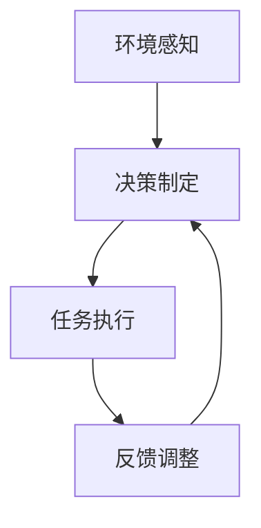

# 大语言模型应用指南：自主Agent系统

## 1.背景介绍

在人工智能领域，语言模型的进步已经引起了广泛的关注。特别是大语言模型（Large Language Models, LLMs），如GPT-3和BERT，展示了在自然语言处理（NLP）任务中的强大能力。这些模型不仅能够生成高质量的文本，还能理解和处理复杂的语言任务。自主Agent系统是利用这些大语言模型来实现自动化任务和决策的系统。本文将深入探讨大语言模型在自主Agent系统中的应用，提供详细的技术背景、核心概念、算法原理、数学模型、项目实践、实际应用场景、工具和资源推荐，并展望未来的发展趋势与挑战。

## 2.核心概念与联系

### 2.1 大语言模型

大语言模型是基于深度学习的模型，通常使用数十亿参数进行训练。它们通过大量的文本数据进行预训练，能够生成和理解自然语言。常见的大语言模型包括GPT-3、BERT、T5等。

### 2.2 自主Agent系统

自主Agent系统是指能够自主感知环境、做出决策并执行任务的系统。这些系统通常由多个Agent组成，每个Agent具有特定的功能和目标。自主Agent系统广泛应用于机器人、自动驾驶、智能客服等领域。

### 2.3 大语言模型与自主Agent系统的联系

大语言模型为自主Agent系统提供了强大的语言理解和生成能力，使得这些系统能够更好地与人类进行交互、理解复杂的指令并执行任务。通过结合大语言模型，自主Agent系统能够实现更高的智能化和自动化。

## 3.核心算法原理具体操作步骤

### 3.1 预训练与微调

大语言模型的训练通常分为两个阶段：预训练和微调。预训练阶段，模型在大规模的文本数据上进行训练，学习语言的基本结构和语义。微调阶段，模型在特定任务的数据上进行训练，以适应具体的应用场景。

### 3.2 自主Agent系统的架构设计

自主Agent系统的架构设计通常包括以下几个步骤：

1. **环境感知**：通过传感器或数据接口获取环境信息。
2. **决策制定**：利用大语言模型和其他算法进行决策。
3. **任务执行**：根据决策结果执行具体任务。
4. **反馈调整**：根据任务执行结果进行反馈调整，优化系统性能。

以下是自主Agent系统的架构设计的Mermaid流程图：



### 3.3 任务分解与协作

在自主Agent系统中，任务通常需要分解为多个子任务，由不同的Agent协作完成。大语言模型可以帮助Agent理解任务描述，并将其分解为可执行的子任务。

### 3.4 强化学习与自适应

自主Agent系统可以通过强化学习算法进行自适应优化。大语言模型可以作为策略网络的一部分，帮助Agent在复杂环境中学习最优策略。

## 4.数学模型和公式详细讲解举例说明

### 4.1 语言模型的数学基础

大语言模型通常基于Transformer架构，其核心是自注意力机制。自注意力机制通过计算输入序列中每个位置的注意力权重，捕捉序列中的长距离依赖关系。自注意力机制的数学公式如下：

$$
\text{Attention}(Q, K, V) = \text{softmax}\left(\frac{QK^T}{\sqrt{d_k}}\right)V
$$

其中，$Q$、$K$、$V$分别表示查询矩阵、键矩阵和值矩阵，$d_k$表示键矩阵的维度。

### 4.2 强化学习的数学模型

在自主Agent系统中，强化学习常用于优化Agent的决策策略。强化学习的核心是马尔可夫决策过程（Markov Decision Process, MDP），其数学模型包括状态空间$S$、动作空间$A$、状态转移概率$P$和奖励函数$R$。强化学习的目标是找到最优策略$\pi^*$，使得累积奖励最大化：

$$
\pi^* = \arg\max_\pi \mathbb{E}\left[\sum_{t=0}^\infty \gamma^t R(s_t, a_t)\right]
$$

其中，$\gamma$是折扣因子，$s_t$和$a_t$分别表示时间步$t$的状态和动作。

### 4.3 任务分解的数学模型

任务分解可以视为一个优化问题，目标是将复杂任务分解为若干子任务，使得总执行时间最短或总收益最大。假设任务$T$可以分解为$n$个子任务$T_1, T_2, \ldots, T_n$，每个子任务的执行时间为$t_i$，总执行时间$T_{total}$为：

$$
T_{total} = \sum_{i=1}^n t_i
$$

通过优化任务分解策略，可以最小化$T_{total}$。

## 5.项目实践：代码实例和详细解释说明

### 5.1 环境设置

首先，我们需要安装必要的库和工具。以下是一个简单的Python环境设置示例：

```bash
pip install transformers torch
```

### 5.2 预训练模型加载

接下来，我们加载一个预训练的大语言模型，例如GPT-3：

```python
from transformers import GPT3Tokenizer, GPT3Model

tokenizer = GPT3Tokenizer.from_pretrained("gpt3")
model = GPT3Model.from_pretrained("gpt3")
```

### 5.3 任务分解示例

以下是一个简单的任务分解示例，使用大语言模型将复杂任务分解为子任务：

```python
task_description = "准备一顿晚餐，包括购买食材、烹饪和摆盘。"

inputs = tokenizer(task_description, return_tensors="pt")
outputs = model.generate(inputs["input_ids"], max_length=100)

subtasks = tokenizer.decode(outputs[0], skip_special_tokens=True)
print(subtasks)
```

### 5.4 强化学习示例

以下是一个简单的强化学习示例，使用大语言模型作为策略网络的一部分：

```python
import torch
import torch.nn as nn
import torch.optim as optim

class PolicyNetwork(nn.Module):
    def __init__(self):
        super(PolicyNetwork, self).__init__()
        self.model = GPT3Model.from_pretrained("gpt3")
        self.fc = nn.Linear(768, 2)  # 假设动作空间为2

    def forward(self, x):
        x = self.model(x)[0]
        x = self.fc(x)
        return x

policy_net = PolicyNetwork()
optimizer = optim.Adam(policy_net.parameters(), lr=1e-4)

# 假设我们有一个环境env
state = env.reset()
for t in range(1000):
    action_probs = policy_net(state)
    action = torch.argmax(action_probs).item()
    next_state, reward, done, _ = env.step(action)
    # 更新策略网络
    loss = -torch.log(action_probs[action]) * reward
    optimizer.zero_grad()
    loss.backward()
    optimizer.step()
    if done:
        break
```

## 6.实际应用场景

### 6.1 智能客服

大语言模型在智能客服系统中具有广泛应用。通过自主Agent系统，客服机器人可以理解用户的复杂问题，并提供准确的回答。例如，银行客服机器人可以处理账户查询、转账等操作。

### 6.2 自动驾驶

在自动驾驶领域，自主Agent系统可以利用大语言模型理解交通规则和驾驶指令，做出安全的驾驶决策。例如，自动驾驶汽车可以根据语音指令选择最佳路线。

### 6.3 医疗诊断

大语言模型在医疗诊断中也有重要应用。自主Agent系统可以分析患者的病历和症状，提供初步的诊断建议。例如，智能医疗助手可以帮助医生快速筛查常见疾病。

### 6.4 机器人控制

在机器人控制领域，自主Agent系统可以利用大语言模型理解任务指令，并将其转化为具体的操作。例如，家用机器人可以根据语音指令完成清洁、烹饪等任务。

## 7.工具和资源推荐

### 7.1 开源库

- **Transformers**：由Hugging Face提供的开源库，支持多种大语言模型的加载和使用。
- **Gym**：由OpenAI提供的强化学习环境库，支持多种强化学习算法的实现。

### 7.2 在线资源

- **Hugging Face Model Hub**：提供多种预训练模型的下载和使用。
- **OpenAI API**：提供GPT-3等大语言模型的在线API服务。

### 7.3 学术资源

- **arXiv**：提供最新的人工智能和机器学习研究论文。
- **Google Scholar**：提供学术论文的搜索和引用服务。

## 8.总结：未来发展趋势与挑战

### 8.1 未来发展趋势

大语言模型和自主Agent系统的结合将推动人工智能的发展，带来更多智能化和自动化的应用。未来，随着模型规模和数据量的增加，大语言模型的性能将进一步提升，自主Agent系统的智能化水平也将不断提高。

### 8.2 挑战

尽管大语言模型在自主Agent系统中展现了强大的能力，但仍面临一些挑战：

- **数据隐私**：大语言模型的训练需要大量数据，如何保护用户隐私是一个重要问题。
- **模型解释性**：大语言模型的决策过程复杂，如何提高模型的解释性和透明度是一个挑战。
- **计算资源**：大语言模型的训练和推理需要大量计算资源，如何提高计算效率是一个关键问题。

## 9.附录：常见问题与解答

### 9.1 大语言模型的训练需要多长时间？

大语言模型的训练时间取决于模型规模和计算资源。通常，训练一个大型语言模型需要数周甚至数月的时间。

### 9.2 如何选择合适的大语言模型？

选择大语言模型时，需要考虑具体的应用场景和任务需求。对于生成任务，GPT-3是一个不错的选择；对于理解任务，BERT和T5表现较好。

### 9.3 自主Agent系统的开发难度如何？

自主Agent系统的开发难度较高，需要综合运用多种技术，包括大语言模型、强化学习、传感器技术等。建议开发者具备扎实的技术基础和丰富的项目经验。

### 9.4 如何优化自主Agent系统的性能？

优化自主Agent系统的性能可以从以下几个方面入手：

- **模型优化**：通过微调和剪枝技术优化大语言模型的性能。
- **算法优化**：通过强化学习和自适应算法优化Agent的决策策略。
- **系统优化**：通过分布式计算和并行处理技术提高系统的计算效率。

### 9.5 自主Agent系统的应用前景如何？

自主Agent系统在多个领域具有广阔的应用前景，包括智能客服、自动驾驶、医疗诊断、机器人控制等。随着技术的不断进步，自主Agent系统将发挥越来越重要的作用。

---

作者：禅与计算机程序设计艺术 / Zen and the Art of Computer Programming