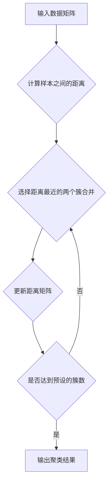
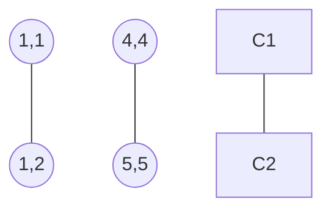

# 层次聚类(Hierarchical Clustering) - 原理与代码实例讲解

## 1. 背景介绍

在数据挖掘和机器学习领域,聚类分析是一个重要的研究方向。聚类的目标是将数据集中的样本点划分成若干个通常是不相交的子集,每个子集称为一个"簇"(cluster)。通过这样的划分,每个簇可能对应着数据集中的一个潜在概念或模式。聚类分析可以帮助我们发现数据的内在结构和规律。

层次聚类(Hierarchical Clustering)是一类重要的聚类算法。与划分聚类(Partitional Clustering)相比,层次聚类算法具有以下几个特点:

1. 层次聚类不需要预先指定簇的个数。
2. 层次聚类的结果可以用树状图直观地表示出来。
3. 通过树状图,我们可以分析数据在不同层次上的聚类结构。

因此,层次聚类在许多领域都有广泛应用,如生物学、社会学、市场营销等。本文将详细介绍层次聚类的原理、算法实现以及实际应用,帮助读者全面了解这一重要的聚类方法。

## 2. 核心概念与联系

要理解层次聚类,首先需要了解一些核心概念:

- **数据矩阵(Data Matrix)**: 表示待聚类的数据集,每行对应一个样本,每列对应一个特征。
- **距离(Distance)**: 衡量两个样本之间的相似度或差异性。常见的距离度量有欧氏距离、曼哈顿距离等。
- **簇(Cluster)**: 一组相似的样本点组成的子集。
- **树状图(Dendrogram)**: 表示层次聚类的结果,以树形结构展示样本的层次化聚类过程。

层次聚类的过程可以用下面的 Mermaid 流程图表示:



可以看出,层次聚类是一个迭代的过程。每次迭代选择距离最近的两个簇进行合并,直到达到预设的簇数或所有样本都在同一个簇中为止。

## 3. 核心算法原理具体操作步骤

层次聚类主要分为两类:

1. 凝聚层次聚类(Agglomerative Hierarchical Clustering)
2. 分裂层次聚类(Divisive Hierarchical Clustering)

其中,凝聚层次聚类使用得更为广泛。下面详细介绍凝聚层次聚类的算法步骤:

1. 将数据集中的每个样本看作一个初始簇。
2. 计算任意两个簇之间的距离。
3. 合并距离最近的两个簇。
4. 更新距离矩阵,重新计算新簇与其他簇之间的距离。
5. 重复步骤3-4,直到达到预设的簇数或所有样本都在同一个簇中。

关键在于如何定义两个簇之间的距离。常用的方法有:

- 最小距离(Single Linkage):取两个簇中样本间的最小距离。
- 最大距离(Complete Linkage):取两个簇中样本间的最大距离。 
- 平均距离(Average Linkage):取两个簇中样本间距离的平均值。
- Ward方法:合并两个簇,使得合并后簇内样本间的平方和最小。

不同的距离定义会导致不同的聚类结果。

## 4. 数学模型和公式详细讲解举例说明

以最小距离为例,详细说明层次聚类的数学模型。

假设有 $n$ 个样本 $\{x_1,x_2,...,x_n\}$,每个样本有 $m$ 个特征。定义样本 $x_i$ 和 $x_j$ 之间的距离为 $d(x_i,x_j)$,常用的是欧氏距离:

$$d(x_i,x_j)=\sqrt{\sum_{k=1}^m(x_{ik}-x_{jk})^2}$$

其中 $x_{ik}$ 表示样本 $x_i$ 的第 $k$ 个特征。

设第 $t$ 次迭代时有 $n_t$ 个簇 $\{C_1,C_2,...,C_{n_t}\}$。定义簇 $C_p$ 和 $C_q$ 之间的最小距离为:

$$D_{min}(C_p,C_q)=\min_{x_i\in C_p,x_j\in C_q}d(x_i,x_j)$$

则第 $t$ 次迭代的步骤为:

1. 计算当前任意两个簇之间的最小距离 $D_{min}(C_p,C_q)$。
2. 找出具有最小距离的两个簇 $C_{p^*}$ 和 $C_{q^*}$,合并为一个新簇 $C_{new}=C_{p^*}\cup C_{q^*}$。
3. 更新距离矩阵,计算新簇 $C_{new}$ 与其他簇之间的最小距离。

例如,假设有4个样本点,它们的坐标分别为 $(1,1),(1,2),(4,4),(5,5)$。按照最小距离的层次聚类过程:

1. 初始时每个样本为一个簇: $\{C_1,C_2,C_3,C_4\}$。
2. 计算距离矩阵:
   
$$\begin{bmatrix}
0 & 1 & 4.24 & 5.66 \\
1 & 0 & 3.61 & 5.00 \\  
4.24 & 3.61 & 0 & 1.41 \\
5.66 & 5.00 & 1.41 & 0
\end{bmatrix}$$

3. 合并距离最小的 $C_1$ 和 $C_2$ 为 $C_{new}$,更新距离矩阵。
4. 合并距离最小的 $C_3$ 和 $C_4$ 为 $C_{new}$,更新距离矩阵。
5. 合并两个剩余的簇为一个簇,聚类结束。

最终的聚类结果可以用树状图表示:



## 5. 项目实践：代码实例和详细解释说明

下面用Python实现最小距离的凝聚层次聚类算法:

```python
import numpy as np

def min_distance_clustering(data, k):
    n = len(data)
    # 初始化簇
    clusters = [[i] for i in range(n)]
    # 计算距离矩阵
    dist_matrix = np.zeros((n, n))
    for i in range(n):
        for j in range(i+1, n):
            dist_matrix[i][j] = np.linalg.norm(data[i]-data[j])
            dist_matrix[j][i] = dist_matrix[i][j]
    
    while len(clusters) > k:
        # 找出最小距离的两个簇
        min_dist = np.inf
        min_i, min_j = -1, -1
        for i in range(len(clusters)):
            for j in range(i+1, len(clusters)):
                dist = np.min([dist_matrix[x][y] for x in clusters[i] for y in clusters[j]])
                if dist < min_dist:
                    min_dist = dist
                    min_i, min_j = i, j
        # 合并簇        
        clusters[min_i].extend(clusters[min_j])
        del clusters[min_j]
        
    return clusters
```

代码解释:

1. 函数 `min_distance_clustering` 接受两个参数:数据矩阵 `data` 和预设的簇数 `k`。
2. 初始化每个样本为一个簇,存储在列表 `clusters` 中。
3. 计算距离矩阵 `dist_matrix`,记录任意两个样本之间的欧氏距离。
4. 进入循环,每次找出最小距离的两个簇,将它们合并,直到簇的个数等于 `k`。
5. 在寻找最小距离簇的过程中,用两个循环遍历当前的簇列表,计算任意两个簇之间的最小距离,并更新 `min_dist`, `min_i`, `min_j`。
6. 将下标为 `min_j` 的簇合并到下标为 `min_i` 的簇中,然后删除前者。
7. 当簇的个数等于 `k` 时,循环结束,返回聚类结果 `clusters`。

可以看出,层次聚类的时间复杂度较高,为 $O(n^3)$,其中 $n$ 是样本数。因此在处理大规模数据时,需要考虑算法的优化和近似。

## 6. 实际应用场景

层次聚类在许多领域都有应用,例如:

- 生物学:对基因表达数据进行聚类,发现基因的功能模块。
- 社会学:对人口的特征进行聚类,研究社会群体的结构。  
- 市场营销:对消费者的购买行为数据进行聚类,发现目标客户群。
- 图像处理:对图像的像素或特征进行聚类,实现图像分割。

以基因表达数据聚类为例。基因芯片技术可以测量成千上万个基因的表达水平。将基因表达水平看作样本的特征,就可以用层次聚类对基因进行分组。处于同一簇中的基因通常具有相似的表达模式,它们很可能参与相同的生物学通路或过程。通过聚类分析,生物学家可以推测未知基因的功能,为进一步的实验研究提供线索。

## 7. 工具和资源推荐

实现层次聚类的常用工具有:

- Python: 
  - scikit-learn: 提供了凝聚层次聚类 AgglomerativeClustering 的实现。
  - scipy: 提供了层次聚类相关的函数,如 linkage, dendrogram 等。
- R语言:
  - stats包:提供了 hclust 函数用于层次聚类。
  - factoextra包:提供了聚类结果可视化的函数。
- MATLAB:
  - Statistics and Machine Learning Toolbox: 提供了 clusterdata, linkage, dendrogram 等函数。

此外,一些在线资源可以帮助深入理解层次聚类:

- 斯坦福大学公开课:机器学习(Machine Learning)
- 数据挖掘导论(Introduction to Data Mining)
- scikit-learn文档:Hierarchical clustering

## 8. 总结：未来发展趋势与挑战

层次聚类是一种直观、灵活的聚类方法,能够生成样本的层次化结构。但是它也存在一些局限性:

1. 时间复杂度高,难以处理大规模数据。
2. 聚类结果对噪声和离群点敏感。
3. 难以确定最优的簇数。

未来层次聚类的研究方向可能包括:

1. 开发可扩展的层次聚类算法,如基于采样、基于并行计算的方法。
2. 研究层次聚类与其他聚类方法的结合,如谱聚类、密度聚类等。
3. 探索层次聚类在深度学习中的应用,如层次注意力机制。
4. 将层次聚类应用到新的领域,如社交网络分析、推荐系统等。

总之,层次聚类是一个经典而又充满活力的研究课题。深入理解其原理和应用,有助于我们更好地挖掘数据的价值。

## 9. 附录：常见问题与解答

1. 问: 层次聚类与k均值聚类有何区别?

   答: 层次聚类是一种无需预设簇数的聚类方法,可以生成树状的层次化聚类结果。而k均值聚类需要预先指定簇数,采用迭代优化的方式将样本划分到各个簇中。层次聚类的结果可以用树状图直观地表示,而k均值聚类的结果通常用散点图表示。

2. 问: 如何选择层次聚类的距离度量和连接方法?

   答: 距离度量和连接方法的选择取决于数据的特点和领域知识。常用的距离度量有欧氏距离、曼哈顿距离、余弦相似度等。对于连续型数据,欧氏距离是一个常用的选择。对于稀疏的高维数据,余弦相似度可能更合适。
   
   连接方法方面,最小距离(single linkage)倾向于生成长