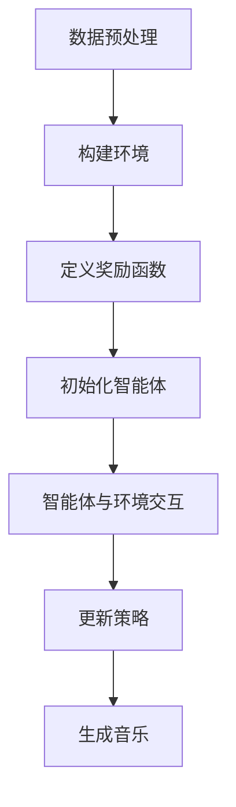

# 强化学习：在音乐生成中的应用

## 1. 背景介绍

随着人工智能技术的不断发展,音乐生成已成为一个备受关注的研究领域。传统的音乐创作过程通常需要作曲家投入大量的时间和精力,而利用人工智能技术生成音乐则可以极大地提高效率,并为音乐创作带来新的可能性。在这一背景下,强化学习作为一种重要的机器学习方法,为音乐生成任务提供了新的解决思路。

## 2. 核心概念与联系

### 2.1 强化学习概述

强化学习是机器学习的一个重要分支,它借鉴了心理学中关于有机体如何获取技能的理论。强化学习系统通过与环境进行交互,从环境中获取反馈信号(奖励或惩罚),并根据这些反馈信号调整自身的行为策略,最终达到最优化目标。

强化学习系统由四个核心要素组成:

- 智能体(Agent):执行动作的主体
- 环境(Environment):智能体所处的外部世界
- 状态(State):环境的instantaneous情况
- 奖励(Reward):环境对智能体行为的反馈

强化学习的核心思想是通过最大化长期累积奖励来优化智能体的行为策略。

### 2.2 音乐生成任务

音乐生成是指利用计算机算法自动生成新的音乐作品。这一任务通常包括以下几个方面:

- 旋律生成:生成一系列音符和节奏构成旋律线
- 和声生成:为旋律线添加和声伴奏部分
- 编曲:为乐器分配不同的音乐声部
- 情感控制:根据预设情感风格生成相应的音乐

将强化学习应用于音乐生成任务,可以将智能体视为作曲家,环境则是已有的音乐数据库。智能体通过与环境交互,根据生成的音乐片段获得奖励反馈,从而不断优化自身的作曲策略,最终生成高质量的音乐作品。

## 3. 核心算法原理具体操作步骤

强化学习在音乐生成中的应用通常遵循以下步骤:



### 3.1 数据预处理

首先需要对原始音乐数据进行预处理,将其转换为算法可识别的格式。常见的预处理步骤包括:

1. 将音乐作品转换为MIDI或ABC等格式
2. 提取音符、和弦、节奏等音乐要素
3. 对数据进行归一化或标准化处理

### 3.2 构建环境

根据预处理后的数据构建算法所需的环境。环境通常由以下几个部分组成:

- 状态空间:表示音乐的当前状态,如已生成的音符序列
- 动作空间:智能体可执行的动作,如添加新音符
- 转移函数:根据当前状态和动作计算下一状态
- 奖励函数:评估智能体动作的好坏

### 3.3 定义奖励函数

奖励函数是强化学习算法的核心,它决定了智能体的优化目标。在音乐生成任务中,奖励函数通常基于以下几个方面:

- 音乐理论规则:如和声、旋律等规则
- 风格相似度:生成音乐与目标风格的相似程度
- 音乐质量评估:人工或自动评估生成音乐的质量

设计合理的奖励函数对算法的性能至关重要。

### 3.4 初始化智能体

选择合适的强化学习算法,如Q-Learning、Policy Gradient等,并初始化智能体的策略网络。策略网络通常采用循环神经网络(RNN)或者转换器(Transformer)等序列建模架构。

### 3.5 智能体与环境交互

智能体根据当前状态选择动作,环境根据动作返回新的状态和奖励值。智能体和环境进行多轮交互,以探索状态空间并积累经验。

### 3.6 更新策略

根据探索过程中获得的经验,使用强化学习算法更新智能体的策略网络,以最大化长期累积奖励。

### 3.7 生成音乐

利用优化后的策略网络,从起始状态出发,通过逐步添加音符、和弦等动作,最终生成完整的音乐作品。

## 4. 数学模型和公式详细讲解举例说明

强化学习算法通常建立在马尔可夫决策过程(MDP)的数学框架之上。MDP可以用一个五元组 $(S, A, P, R, \gamma)$ 来表示,其中:

- $S$ 表示状态空间的集合
- $A$ 表示动作空间的集合
- $P(s'|s, a)$ 表示转移概率,即在状态 $s$ 下执行动作 $a$ 后转移到状态 $s'$ 的概率
- $R(s, a)$ 表示在状态 $s$ 执行动作 $a$ 后获得的即时奖励
- $\gamma \in [0, 1)$ 表示折现因子,用于权衡即时奖励和长期奖励的重要性

强化学习算法的目标是找到一个策略 $\pi: S \rightarrow A$,使得在该策略下的长期累积奖励最大化,即:

$$\max_\pi \mathbb{E}\left[\sum_{t=0}^\infty \gamma^t R(s_t, a_t) \right]$$

其中 $s_t$ 和 $a_t$ 分别表示第 $t$ 个时刻的状态和动作。

### 4.1 Q-Learning算法

Q-Learning是一种常用的强化学习算法,它通过估计状态-动作值函数 $Q(s, a)$ 来近似最优策略。状态-动作值函数定义为在状态 $s$ 下执行动作 $a$,之后能获得的长期累积奖励的期望值。

Q-Learning算法的更新规则如下:

$$Q(s_t, a_t) \leftarrow Q(s_t, a_t) + \alpha \left[r_t + \gamma \max_{a'} Q(s_{t+1}, a') - Q(s_t, a_t)\right]$$

其中 $\alpha$ 是学习率, $r_t$ 是立即奖励, $\gamma$ 是折现因子。通过不断更新 $Q$ 函数,最终可以收敛到最优的状态-动作值函数 $Q^*(s, a)$,从而得到最优策略 $\pi^*(s) = \arg\max_a Q^*(s, a)$。

### 4.2 Policy Gradient算法

Policy Gradient算法直接对策略函数 $\pi_\theta(a|s)$ 进行参数化,其中 $\theta$ 表示策略网络的参数。算法的目标是最大化长期累积奖励的期望:

$$\max_\theta \mathbb{E}_{\pi_\theta}\left[\sum_{t=0}^\infty \gamma^t R(s_t, a_t)\right]$$

通过计算目标函数对参数 $\theta$ 的梯度,并使用梯度上升法更新参数,可以得到最优的策略函数。

Policy Gradient算法的参数更新规则如下:

$$\theta \leftarrow \theta + \alpha \hat{g}$$

其中 $\alpha$ 是学习率, $\hat{g}$ 是目标函数梯度的无偏估计,可以通过各种方法进行计算,如REINFORCE算法等。

在音乐生成任务中,策略网络通常采用循环神经网络(RNN)或者转换器(Transformer)等序列建模架构,输入是已生成的音乐序列,输出是下一个动作(如添加新音符)的概率分布。

## 5. 项目实践:代码实例和详细解释说明

以下是一个使用PyTorch实现的简单Q-Learning示例,用于生成单音旋律。

### 5.1 环境构建

首先定义环境中的状态、动作空间以及奖励函数:

```python
import numpy as np

# 状态空间: 已生成的音符序列(最多8个音符)
state_dim = 8

# 动作空间: 12个音符
action_dim = 12

# 奖励函数: 基于音乐理论规则
def reward_function(state, action):
    # 实现细节省略
    return reward

# 初始化环境
env = MelodyEnvironment(state_dim, action_dim, reward_function)
```

### 5.2 Q-Learning算法实现

```python
import torch
import torch.nn as nn
import torch.optim as optim

# 定义Q网络
class QNetwork(nn.Module):
    def __init__(self, state_dim, action_dim):
        super(QNetwork, self).__init__()
        self.fc1 = nn.Linear(state_dim, 64)
        self.fc2 = nn.Linear(64, action_dim)

    def forward(self, state):
        x = torch.relu(self.fc1(state))
        q_values = self.fc2(x)
        return q_values

# 初始化Q网络
q_net = QNetwork(state_dim, action_dim)
optimizer = optim.Adam(q_net.parameters(), lr=0.001)

# Q-Learning算法
def q_learning(env, q_net, optimizer, num_episodes=1000):
    for episode in range(num_episodes):
        state = env.reset()
        done = False
        while not done:
            # 选择动作
            q_values = q_net(torch.FloatTensor(state))
            action = torch.argmax(q_values).item()

            # 执行动作并获取反馈
            next_state, reward, done = env.step(action)

            # 更新Q网络
            q_target = reward + 0.9 * torch.max(q_net(torch.FloatTensor(next_state)))
            loss = nn.MSELoss()(q_net(torch.FloatTensor(state))[action], q_target)
            optimizer.zero_grad()
            loss.backward()
            optimizer.step()

            state = next_state

# 训练Q网络
q_learning(env, q_net, optimizer)
```

### 5.3 生成音乐

训练完成后,可以使用优化后的Q网络生成新的旋律:

```python
# 初始状态
state = env.reset()

# 生成旋律
melody = []
while True:
    q_values = q_net(torch.FloatTensor(state))
    action = torch.argmax(q_values).item()
    melody.append(action)
    next_state, _, done = env.step(action)
    if done:
        break
    state = next_state

# 将生成的旋律序列转换为MIDI文件
midi_file = convert_to_midi(melody)
```

上述示例仅为简单演示,实际应用中需要考虑更复杂的状态表示、奖励函数设计以及算法优化等问题。

## 6. 实际应用场景

强化学习在音乐生成领域有着广泛的应用前景,包括但不限于:

1. **自动作曲**: 利用强化学习算法生成完整的音乐作品,为音乐创作提供辅助工具。

2. **音乐伴奏生成**: 根据已有的旋律线,自动生成和声伴奏部分。

3. **音乐风格迁移**: 将一种风格的音乐转换为另一种风格,实现风格迁移。

4. **音乐情感控制**: 根据预设的情感标签(如快乐、悲伤等),生成相应情感色彩的音乐作品。

5. **音乐续曲**: 基于已有的音乐片段,自动生成后续的音乐内容。

6. **音乐个性化推荐**: 根据用户的音乐偏好,生成个性化的音乐作品。

除了音乐领域,强化学习在其他艺术创作领域也有潜在的应用,如视觉艺术、文学创作等。

## 7. 工具和资源推荐

对于希望进一步学习和实践强化学习在音乐生成中的应用的读者,以下是一些推荐的工具和资源:

1. **开源框架**:
   - Stable Baselines: 一个基于PyTorch和TensorFlow的强化学习框架,提供了多种算法的实现。
   - RLlib: 基于Ray的分布式强化学习框架,具有良好的扩展性。
   - Dopamine: 由谷歌开源的强化学习框架,专注于研究和教学。

2. **数据集**:
   - Lakh MIDI Dataset: 一个包含17万多个MIDI文件的大型数据集,可用于音乐生成任务。
   - Nottingham Dataset: 一个经典的民谣旋律数据集,常用于算法测试和比较。

3. **在线课程**:
   - 吴恩达的《机器学习》课