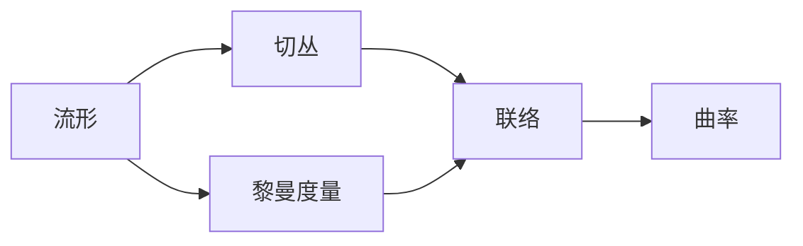

# 微分几何入门与广义相对论：类时测地线汇（测地参考系）的Raychaudhuri方程

## 1. 背景介绍
### 1.1 微分几何与广义相对论
微分几何是数学的一个分支,主要研究流形(manifold)上的几何性质。它在现代物理学,特别是广义相对论中有着广泛的应用。广义相对论是爱因斯坦在1915年提出的一个关于引力的理论,它将引力描述为时空的曲率,这与牛顿的经典引力理论有着本质的不同。

在广义相对论中,时空不再是平直的,而是由物质和能量所"弯曲"。这种弯曲就是引力的表现。为了描述这种弯曲的时空,我们需要使用微分几何的工具,如黎曼(Riemann)曲率张量、克氏(Christoffel)符号等。

### 1.2 测地线与Raychaudhuri方程
在弯曲的时空中,自由下落的粒子(即不受任何非引力作用力的粒子)运动轨迹称为测地线(geodesic)。测地线是时空中的"直线",它们在局部总是直的,但在整体上可能是弯曲的。

Raychaudhuri方程是描述一束测地线如何随时间演化的方程。它最初由印度物理学家Amal Kumar Raychaudhuri在1955年导出,后来被广泛应用于广义相对论和宇宙学中。这个方程告诉我们,在一定条件下,一束最初平行的测地线最终会聚焦到一点,形成所谓的"奇点"。这个结论对于我们理解黑洞和宇宙的起源(大爆炸理论)都有重要意义。

## 2. 核心概念与联系
### 2.1 流形(Manifold)
流形是一个局部看起来像欧几里得空间的空间。更准确地说,一个n维流形是一个拓扑空间,它的每一点都有一个邻域同胚于n维欧几里得空间的开子集。直观地说,流形就是一个可以用若干张"地图"(局部坐标系)覆盖的空间。

### 2.2 切丛(Tangent Bundle)
对于流形上的每一点,我们可以定义其切空间(tangent space),它是由该点出发的所有"速度矢量"组成的线性空间。所有这些切空间的集合称为流形的切丛。

### 2.3 黎曼度量(Riemannian Metric)
黎曼度量是定义在流形上的一个二次型,它为流形上的每一点指定了一个内积结构。有了度量,我们就可以测量流形上矢量的长度和角度,定义曲线的长度和测地线等。

### 2.4 联络(Connection)
联络是一种定义在切丛上的附加结构,它告诉我们如何沿着流形上的曲线平行移动矢量。克氏符号就是联络的一种表示方式。

### 2.5 曲率(Curvature)
曲率是对流形"弯曲程度"的度量。黎曼曲率张量完全刻画了流形的内蕴几何性质。

下图展示了这些核心概念之间的逻辑关系:



## 3. 核心算法原理具体操作步骤
### 3.1 测地线方程
测地线是流形上的"直线",其定义为平行移动自身切矢的曲线。在局部坐标系 $x^μ$ 下,测地线方程为:

$$
\frac{d^2x^μ}{dτ^2} + Γ^μ_{νρ} \frac{dx^ν}{dτ} \frac{dx^ρ}{dτ} = 0
$$

其中 $Γ^μ_{νρ}$ 是克氏符号, $τ$ 是曲线的弧长参数。

### 3.2 测地偏离方程
考虑一束测地线 $x^μ(τ,s)$,其中 $s$ 为标记不同测地线的参数。定义测地偏离矢量 $ξ^μ := \frac{∂x^μ}{∂s}$,则它满足测地偏离方程:

$$
\frac{D^2ξ^μ}{dτ^2} = R^μ_{νρσ} \frac{dx^ν}{dτ} ξ^ρ \frac{dx^σ}{dτ}
$$

其中 $R^μ_{νρσ}$ 是黎曼曲率张量, $\frac{D}{dτ}$ 表示沿测地线的协变导数。

### 3.3 Raychaudhuri方程
引入测地线汇的膨胀率 $θ$、剪切率 $σ_{μν}$ 和旋转率 $ω_{μν}$,它们定义为:

$$
θ := \frac{1}{2} h^{μν} \frac{Dh_{μν}}{dτ}, \quad σ_{μν} := h_{μ}^{ρ} h_{ν}^{σ} \frac{Dh_{ρσ}}{dτ} - \frac{1}{2} θ h_{μν}, \quad ω_{μν} := h_{μ}^{ρ} h_{ν}^{σ} \frac{D[h_{ρσ}]}{dτ}
$$

其中 $h_{μν} := g_{μν} + u_μ u_ν$ 是横截面度量, $u^μ := \frac{dx^μ}{dτ}$ 是测地线的切矢, $[\cdot,\cdot]$ 表示反对称化。

Raychaudhuri方程描述了膨胀率 $θ$ 的演化:

$$
\frac{dθ}{dτ} = -\frac{1}{2} θ^2 - σ_{μν} σ^{μν} + ω_{μν} ω^{μν} - R_{μν} u^μ u^ν
$$

其中 $R_{μν}$ 是黎曼曲率张量的缩并。

## 4. 数学模型和公式详细讲解举例说明
### 4.1 黎曼曲率张量
黎曼曲率张量 $R^μ_{νρσ}$ 是描述流形曲率的基本量。它由克氏符号及其导数表示为:

$$
R^μ_{νρσ} = ∂_ρ Γ^μ_{νσ} - ∂_σ Γ^μ_{νρ} + Γ^μ_{λρ} Γ^λ_{νσ} - Γ^μ_{λσ} Γ^λ_{νρ}
$$

例如,在二维球面 $S^2$ 上,线元可写为 $ds^2 = R^2(d\θ^2 + \sin^2\theta dφ^2)$,其中 $R$ 为球面半径。计算可得其黎曼曲率张量的独立分量为:

$$
R_{1212} = R^2 \sin^2\theta, \quad R_{2121} = \frac{\sin^2\theta}{R^2}
$$

其余分量由对称性给出或为零。这表明球面是一个具有正曲率的流形。

### 4.2 测地线方程求解
以二维球面为例,其测地线方程为:

$$
\frac{d^2\theta}{dτ^2} - \sin\theta \cos\theta \left(\frac{dφ}{dτ}\right)^2 = 0, \quad \frac{d^2φ}{dτ^2} + 2 \cot\theta \frac{dφ}{dτ} \frac{d\theta}{dτ} = 0
$$

求解这个方程组,可以得到球面上的测地线(大圆)为:

$$
\cos\theta = \cos\theta_0 \cos(τ/R), \quad φ = φ_0 + \arctan(\tan(τ/R) / \sin\theta_0)
$$

其中 $(\theta_0,φ_0)$ 为测地线的初始点。

### 4.3 Raychaudhuri方程的应用
考虑一束初始平行的类时测地线,即 $θ(0) = σ_{μν}(0) = ω_{μν}(0) = 0$。如果流形满足强能量条件 $R_{μν} u^μ u^ν ≥ 0$,则Raychaudhuri方程给出:

$$
\frac{dθ}{dτ} ≤ -\frac{1}{2} θ^2
$$

解此不等式得:

$$
θ(τ) ≤ \frac{2}{τ}
$$

这意味着测地线汇在有限时间内必然发生聚焦,形成奇点。这个结论被广泛应用于奇性定理和黑洞的研究中。

## 5. 项目实践：代码实例和详细解释说明
以下是一个用Python计算二维球面测地线的示例代码:

```python
import numpy as np
import matplotlib.pyplot as plt

def geodesic_on_sphere(theta0, phi0, tau, R=1):
    theta = np.arccos(np.cos(theta0) * np.cos(tau/R))
    phi = phi0 + np.arctan(np.tan(tau/R) / np.sin(theta0))
    return theta, phi

# 设置初始点和测地线参数
theta0, phi0 = np.pi/3, np.pi/6
tau = np.linspace(0, np.pi, 100)

# 计算测地线
theta, phi = geodesic_on_sphere(theta0, phi0, tau)

# 绘制球面和测地线
fig = plt.figure()
ax = fig.add_subplot(111, projection='3d')
u, v = np.mgrid[0:2*np.pi:50j, 0:np.pi:50j]
x = np.cos(u)*np.sin(v)
y = np.sin(u)*np.sin(v)
z = np.cos(v)
ax.plot_surface(x, y, z, alpha=0.5)
ax.plot(np.sin(phi)*np.sin(theta), np.cos(phi)*np.sin(theta), np.cos(theta), 'r-', lw=2)
plt.show()
```

这个代码首先定义了一个函数 `geodesic_on_sphere`,用于根据测地线方程计算球面上的测地线。然后设置初始点 $(\theta_0,φ_0)$ 和测地线参数 $τ$,调用函数计算测地线上的点。最后使用Matplotlib绘制球面和测地线。

运行这个代码,可以看到一个三维图像,其中半透明的球面表示 $S^2$,红色的曲线是从初始点 $(\theta_0,φ_0)$ 出发的测地线。

## 6. 实际应用场景
Raychaudhuri方程在广义相对论和宇宙学中有广泛的应用,下面是一些具体的例子:

1. 奇性定理:Raychaudhuri方程是Penrose-Hawking奇性定理的关键组成部分。这些定理表明,在广义相对论中,如果满足一些合理的条件(如强能量条件),时空奇点的形成是不可避免的。这为黑洞和宇宙起源的研究提供了理论基础。

2. 引力塌缩:在引力塌缩过程中,物质不断向中心聚集,密度不断增加。Raychaudhuri方程描述了这一过程中测地线汇的演化,并预言了奇点的形成。这对于研究黑洞的形成机制具有重要意义。

3. 宇宙学:在宇宙学中,Raychaudhuri方程被用来研究宇宙的大尺度结构和演化。例如,在均匀各向同性的宇宙模型中,Raychaudhuri方程简化为Friedmann方程,描述了宇宙尺度因子的演化。

4. 引力波:引力波是时空曲率的微小扰动,它们的传播和振幅受到Raychaudhuri方程的约束。通过研究引力波对测地线汇的影响,我们可以更好地理解引力波的性质和探测方法。

## 7. 工具和资源推荐
以下是一些学习和研究微分几何和广义相对论的有用资源:

1. 书籍:
   - "General Relativity" by Robert M. Wald
   - "Gravitation" by Charles W. Misner, Kip S. Thorne, John A. Wheeler
   - "Riemannian Geometry" by Manfredo Perdigão do Carmo
2. 在线课程:
   - "General Relativity" by Leonard Susskind (Stanford University)
   - "Differential Geometry" by Claudio Arezzo (ICTP)
3. 软件工具:
   - Mathematica的"GeneralRelativity"包
   - Python的"GraviPy"和"EinsteinPy"库
   - Maxima的"ctensor"包
4. 研究论文数据库:
   - arXiv (https://arxiv.org)
   - INSPIRE-HEP (https://inspirehep.net)

## 8. 总结：未来发展趋势