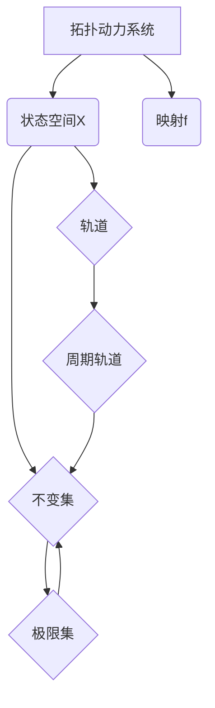

# 拓扑动力系统概论：定义与基本性质

## 1.背景介绍
### 1.1 动力系统的起源与发展
动力系统是数学、物理学等领域的一个重要分支,它研究随时间演化的系统。动力系统理论起源于牛顿力学,后来发展成为描述各种自然现象和工程问题的有力工具。从天体运动到气象预测,从生态系统到经济市场,动力系统无处不在。

### 1.2 拓扑学与动力系统的结合 
20世纪60年代,斯梅尔(Smale)等数学家开创性地将拓扑学引入动力系统的研究。拓扑学关注空间结构和连续映射,为刻画动力系统的定性性质提供了合适的语言。拓扑动力系统由此诞生,成为动力系统理论的一个重要分支。

### 1.3 拓扑动力系统的意义
拓扑动力系统在动力系统的定性研究中扮演着关键角色。它抓住了系统的本质特征,揭示了深层次的动力学结构。通过拓扑方法,我们能判断系统的稳定性、分岔现象、混沌行为等。拓扑动力系统在微分方程、符号动力学等众多领域都有广泛应用。

## 2.核心概念与联系
### 2.1 拓扑动力系统的定义
拓扑动力系统是由一个拓扑空间X和一个连续映射f:X→X组成的二元组(X,f)。其中X表示系统的状态空间,f刻画了系统状态的演化规律。直观地说,拓扑动力系统就是在拓扑空间上演化的离散时间动力系统。

### 2.2 基本概念
- 轨道:给定初始状态x∈X,它在f作用下的迭代序列O(x)={x,f(x),f²(x),...}称为x的(正)轨道。
- 不变集:若A⊂X满足f(A)=A,则称A是f的不变集。
- 周期点:若x∈X满足f^n(x)=x,称x为f的周期为n的周期点。周期点的轨道称为周期轨道。
- 极限集:对任意x∈X,由所有极限点$\lim_{k\to\infty} f^{n_k}(x)$组成的闭集称为x的ω极限集,记为ω(x)。

### 2.3 概念之间的联系
- 周期点的轨道是有限不变集。
- 极限集是不变集,并且每个不变集至少包含一个极限集。
- 系统的长时行为主要由不变集,特别是极限集决定。

下图展示了这些概念之间的关系:


## 3.核心算法原理具体操作步骤
### 3.1 判断不变集的算法
1. 选取状态空间X中的一个子集A。
2. 计算f(A)。
3. 若f(A)=A,则A是不变集;否则A不是不变集。

### 3.2 求解周期点的算法
1. 列出映射f的表达式。
2. 解方程f^n(x)=x,得到周期为n的周期点。
3. 对不同的n重复步骤2,得到所有周期点。

### 3.3 构造极限集的算法
1. 选取状态空间X中的一个点x。
2. 计算x在f下的正轨道{x,f(x),f²(x),...}。
3. 取轨道的闭包,得到x的ω极限集。
4. 对不同的x重复步骤1~3,得到所有的极限集。

## 4.数学模型和公式详细讲解举例说明
### 4.1 logistic映射
Logistic映射是一个经典的拓扑动力系统模型,其映射为:

$$f_{\mu}(x)=\mu x(1-x), \quad \mu \in [0,4], \quad x \in [0,1]$$

参数μ反映了种群增长率。不同μ值下logistic映射展现出丰富的动力学行为:
- 0<μ≤1时,0是全局吸引不动点。
- 1<μ≤3时,有两个不动点0和$x^*=1-\frac{1}{\mu}$,其中$x^*$是吸引不动点。
- 3<μ<1+$\sqrt{6}$时,吸引不动点$x^*$失稳,出现吸引2周期轨道。
- μ进一步增大时,出现周期倍增分岔,导致混沌行为的出现。

### 4.2 Shift映射
Shift映射是符号动力系统的重要模型,其定义在符号空间$\Sigma_2=\{0,1\}^{\mathbb{N}}$上:

$$\sigma(x_0x_1x_2\cdots)=x_1x_2x_3\cdots$$

Shift映射具有以下性质:
- 它是连续满射,但不是一一映射。
- 它的周期点稠密,但几乎处处不是周期点。
- 它具有稠密的轨道,称为传递性。
- 它对初值敏感,具有混沌行为。

Shift映射展现了拓扑动力系统的复杂性和精细结构。

## 5.项目实践：代码实例和详细解释说明
下面我们用Python实现logistic映射的轨道模拟和分岔图绘制。

```python
import numpy as np
import matplotlib.pyplot as plt

def logistic_map(mu, x0, n):
    """生成logistic映射的轨道"""
    x = np.zeros(n)
    x[0] = x0
    for i in range(1, n):
        x[i] = mu * x[i-1] * (1 - x[i-1])
    return x

def bifurcation_diagram(mu_range, n, iter_num):
    """绘制logistic映射的分岔图"""
    plt.figure(figsize=(8, 6))
    for mu in mu_range:
        x = logistic_map(mu, 0.5, iter_num)
        plt.plot(mu * np.ones(n), x[-n:], 'b.', ms=0.1)
    plt.xlabel('$\mu$')
    plt.ylabel('$x$')
    plt.title('Bifurcation Diagram of Logistic Map')
    plt.show()

# 参数设置
mu_range = np.linspace(2.5, 4, 2000) 
n = 100
iter_num = 1000

# 绘制分岔图
bifurcation_diagram(mu_range, n, iter_num)
```

上述代码中,`logistic_map`函数生成给定参数下logistic映射的轨道,`bifurcation_diagram`函数绘制分岔图。我们先迭代1000次使轨道进入吸引子,然后取最后100点绘制。通过改变μ的取值范围,可以观察到logistic映射从单一吸引不动点到周期倍增分岔再到混沌的动力学转变过程。

## 6.实际应用场景
拓扑动力系统在许多领域有重要应用,下面列举几个典型案例:
- 生态学:logistic映射可以描述单个物种在有限资源下的种群数量变化。
- 神经网络:Hopfield网络等神经网络模型可视为一类特殊的拓扑动力系统。
- 密码学:Shift映射、tent映射等混沌系统被用来设计伪随机数生成器。
- 经济学:一些经济周期模型可以用低维拓扑动力系统刻画。
- 流体力学:湍流中的混沌吸引子可用拓扑动力系统的不变集描述。

## 7.工具和资源推荐
以下是学习和研究拓扑动力系统的相关工具和资源:
- 书籍:《An Introduction to Chaotic Dynamical Systems》,《Topology in Dynamics》等。
- 软件:MATLAB、Python(NumPy、SciPy、Matplotlib)等编程与绘图工具。
- 网络资源:Scholarpedia、Wolfram MathWorld等在线百科,arXiv预印本数据库。

## 8.总结：未来发展趋势与挑战
拓扑动力系统经过半个多世纪的发展,已经成为一个成熟而活跃的数学分支。展望未来,拓扑动力系统仍面临许多开放问题和挑战:
- 高维系统的拓扑刻画:目前的研究主要集中在低维系统,高维系统的拓扑结构更加复杂。
- 随机动力系统:将随机因素引入拓扑动力系统,探究随机扰动下系统的稳健性和分岔。
- 动力系统与其他数学分支的交叉:与几何、代数、概率论等领域深入结合,发展新的理论与方法。
- 应用领域的拓展:将拓扑动力系统的思想和技术拓展到更广泛的自然科学和工程问题中。

总之,拓扑动力系统作为一个基础性的数学理论,它的发展动向必将影响到动力系统乃至整个非线性科学的未来走势。这一领域仍充满了机遇和挑战,值得我们去探索和开拓。

## 9.附录：常见问题与解答
### Q1:拓扑动力系统与微分动力系统有何区别?
A1:拓扑动力系统通常指离散时间系统,而微分动力系统研究连续时间系统。但两者在定性分析方面有许多共通之处,很多结果可以相互启发。

### Q2:拓扑动力系统的研究方法有哪些?
A2:主要有轨道结构分析、不变集理论、符号动力学、遍历理论等。此外,一些代数、几何的工具也常用于拓扑动力系统的研究。

### Q3:拓扑动力系统的典型模型有哪些?
A3:Shift映射、horseshoe映射、logistic映射、Henon映射等都是拓扑动力系统中的重要模型。它们虽然形式简单,但展现了丰富的动力学行为。

### Q4:如何判断一个拓扑动力系统是否具有混沌行为?
A4:常用的判据有:对初值敏感、拉伸和折叠、马蹄映射的存在、李雅普诺夫指数为正等。但要严格证明混沌性并不容易,需要精细的数学工具。

作者：禅与计算机程序设计艺术 / Zen and the Art of Computer Programming