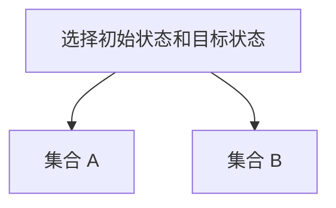

# 拓扑动力系统概论：测度混合性

## 1.背景介绍

拓扑动力系统是数学和计算机科学中的一个重要分支，研究的是系统在时间演化过程中的行为。它结合了拓扑学和动力系统理论，旨在理解系统的长期行为和复杂性。测度混合性是拓扑动力系统中的一个关键概念，描述了系统在时间演化过程中如何在不同状态之间混合。这个概念在许多实际应用中都有重要意义，如密码学、随机过程和混沌理论。

## 2.核心概念与联系

### 2.1 拓扑动力系统

拓扑动力系统是一个三元组 $(X, T, \phi)$，其中 $X$ 是一个拓扑空间，$T$ 是时间参数（通常是整数或实数），$\phi: X \times T \to X$ 是一个连续映射，描述了系统在时间 $T$ 下的演化。

### 2.2 测度混合性

测度混合性是指在一个测度空间 $(X, \mathcal{B}, \mu)$ 上的动力系统 $(X, T, \phi)$ 中，任意两个测度为正的集合 $A, B \subset X$，经过足够长时间的演化后，$A$ 和 $B$ 的交集的测度趋近于 $\mu(A) \cdot \mu(B)$。这意味着系统在时间演化过程中会在不同状态之间充分混合。

### 2.3 拓扑混合性与测度混合性的联系

拓扑混合性是指在拓扑空间 $X$ 上的动力系统 $(X, T, \phi)$ 中，任意两个非空开集 $U, V \subset X$，存在一个时间 $t$，使得 $\phi^t(U) \cap V \neq \emptyset$。测度混合性是拓扑混合性的一个更强的版本，要求系统在测度意义上充分混合。

## 3.核心算法原理具体操作步骤

### 3.1 算法概述

测度混合性的验证通常涉及以下几个步骤：

1. **定义系统和测度空间**：确定系统的状态空间 $X$、时间参数 $T$ 和测度空间 $(X, \mathcal{B}, \mu)$。
2. **选择初始状态和目标状态**：选择两个测度为正的集合 $A, B \subset X$。
3. **计算时间演化**：计算系统在时间 $t$ 下的演化 $\phi^t(A)$。
4. **验证混合性**：验证 $\mu(\phi^t(A) \cap B)$ 是否趋近于 $\mu(A) \cdot \mu(B)$。

### 3.2 具体操作步骤

#### 步骤1：定义系统和测度空间

```mermaid
graph TD
    A[定义系统] --> B[状态空间 X]
    A --> C[时间参数 T]
    A --> D[测度空间 (X, B, mu)]
```

#### 步骤2：选择初始状态和目标状态



#### 步骤3：计算时间演化

```mermaid
graph TD
    A[计算时间演化] --> B[时间 t]
    A --> C[演化 phi^t(A)]
```

#### 步骤4：验证混合性

```mermaid
graph TD
    A[验证混合性] --> B[计算 mu(phi^t(A) ∩ B)]
    A --> C[验证 mu(phi^t(A) ∩ B) 是否趋近于 mu(A) * mu(B)]
```

## 4.数学模型和公式详细讲解举例说明

### 4.1 数学模型

设 $(X, \mathcal{B}, \mu)$ 是一个测度空间，$\phi: X \times T \to X$ 是一个动力系统。对于任意两个测度为正的集合 $A, B \subset X$，如果存在一个时间 $t$，使得 $\mu(\phi^t(A) \cap B)$ 趋近于 $\mu(A) \cdot \mu(B)$，则称该系统具有测度混合性。

### 4.2 公式推导

设 $A, B \subset X$，则有：

$$
\lim_{t \to \infty} \mu(\phi^t(A) \cap B) = \mu(A) \cdot \mu(B)
$$

### 4.3 举例说明

假设我们有一个简单的动力系统 $(X, T, \phi)$，其中 $X = [0, 1]$，$T = \mathbb{N}$，$\phi(x, t) = (x + t \mod 1)$。设 $A = [0, 0.5]$，$B = [0.5, 1]$，则有：

$$
\mu(A) = 0.5, \quad \mu(B) = 0.5
$$

经过时间 $t$ 的演化，$\phi^t(A)$ 将覆盖整个 $[0, 1]$ 区间，因此：

$$
\lim_{t \to \infty} \mu(\phi^t(A) \cap B) = 0.5 \cdot 0.5 = 0.25
$$

## 5.项目实践：代码实例和详细解释说明

### 5.1 代码实例

以下是一个简单的 Python 代码示例，用于验证测度混合性：

```python
import numpy as np

def phi(x, t):
    return (x + t) % 1

def measure_mixing(A, B, t_max):
    count = 0
    for t in range(t_max):
        A_t = [phi(x, t) for x in A]
        count += len(set(A_t) & set(B))
    return count / (len(A) * len(B))

# 定义集合 A 和 B
A = np.linspace(0, 0.5, 100)
B = np.linspace(0.5, 1, 100)

# 验证测度混合性
t_max = 1000
result = measure_mixing(A, B, t_max)
print(f"测度混合性结果: {result}")
```

### 5.2 详细解释

1. **定义函数 $\phi$**：函数 $\phi(x, t)$ 描述了系统在时间 $t$ 下的演化。
2. **定义测度混合性函数**：函数 `measure_mixing(A, B, t_max)` 用于计算集合 $A$ 和 $B$ 在时间 $t$ 下的交集的测度。
3. **定义集合 $A$ 和 $B$**：使用 `numpy` 定义两个集合 $A$ 和 $B$。
4. **验证测度混合性**：通过调用 `measure_mixing` 函数，验证集合 $A$ 和 $B$ 的测度混合性。

## 6.实际应用场景

### 6.1 密码学

在密码学中，测度混合性用于评估加密算法的安全性。一个好的加密算法应当具有高混合性，使得密文和明文之间的关系难以预测。

### 6.2 随机过程

在随机过程和统计物理中，测度混合性用于描述系统在时间演化过程中的混合行为。这对于理解系统的长期行为和稳定性非常重要。

### 6.3 混沌理论

在混沌理论中，测度混合性用于描述系统的混沌行为。一个具有高混合性的系统通常表现出复杂和不可预测的行为。

## 7.工具和资源推荐

### 7.1 软件工具

- **Python**：用于实现和验证测度混合性的代码。
- **Matplotlib**：用于可视化系统的时间演化过程。
- **NumPy**：用于处理大规模数据和计算。

### 7.2 资源推荐

- **《拓扑动力系统导论》**：一本经典的拓扑动力系统教材，适合初学者和研究人员。
- **arXiv**：一个开放获取的学术论文存储库，包含大量关于拓扑动力系统和测度混合性的研究论文。

## 8.总结：未来发展趋势与挑战

### 8.1 未来发展趋势

随着计算能力的提升和数据量的增加，拓扑动力系统和测度混合性的研究将会更加深入。未来的研究可能会集中在以下几个方面：

- **高维系统的混合性**：研究高维系统的混合行为和复杂性。
- **混合性算法的优化**：开发更高效的算法来验证和计算系统的混合性。
- **实际应用的拓展**：将测度混合性应用于更多实际问题，如金融市场分析和生物系统建模。

### 8.2 挑战

- **计算复杂性**：高维系统的混合性计算通常具有较高的计算复杂性，需要开发更高效的算法。
- **数据准确性**：在实际应用中，数据的准确性和完整性对混合性验证的结果有重要影响。
- **理论与实践的结合**：将理论研究成果应用于实际问题需要克服许多实际挑战，如数据噪声和系统不确定性。

## 9.附录：常见问题与解答

### 9.1 什么是测度混合性？

测度混合性是指在一个测度空间上的动力系统中，任意两个测度为正的集合经过足够长时间的演化后，其交集的测度趋近于两个集合测度的乘积。

### 9.2 如何验证一个系统是否具有测度混合性？

可以通过计算系统在时间演化过程中的集合交集的测度，并验证其是否趋近于两个集合测度的乘积。

### 9.3 测度混合性有哪些实际应用？

测度混合性在密码学、随机过程和混沌理论中有广泛应用，用于评估系统的安全性、稳定性和复杂性。

### 9.4 拓扑混合性和测度混合性有什么区别？

拓扑混合性是指系统在拓扑空间中的混合行为，而测度混合性是指系统在测度空间中的混合行为。测度混合性是拓扑混合性的一个更强的版本。

### 9.5 如何使用 Python 实现测度混合性的验证？

可以使用 Python 编写代码，通过计算系统在时间演化过程中的集合交集的测度，验证系统的测度混合性。

---

作者：禅与计算机程序设计艺术 / Zen and the Art of Computer Programming