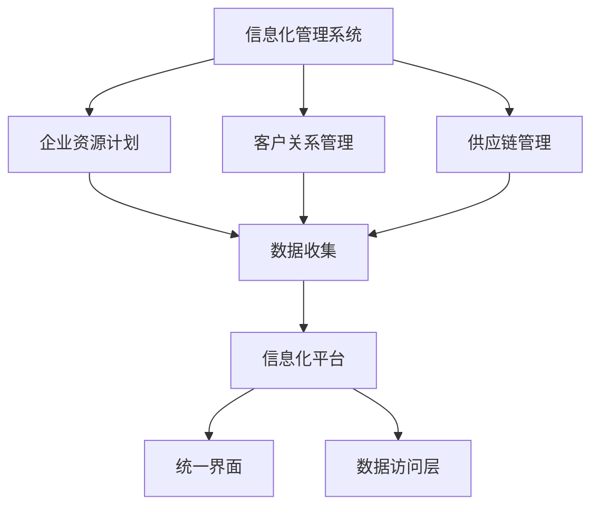

# 整合和管理信息化管理系统搭建信息化平台

## 1.背景介绍

在当今数字化时代，信息化管理系统（IMS）已经成为企业和组织提高效率、优化资源配置和增强竞争力的关键工具。信息化管理系统通过整合各种业务流程和数据，提供了一个统一的平台来管理和分析信息。然而，搭建一个高效的信息化平台并非易事，它需要综合考虑系统架构、数据管理、安全性和用户体验等多个方面。

## 2.核心概念与联系

### 2.1 信息化管理系统的定义

信息化管理系统（IMS）是指利用信息技术手段对企业或组织的各类信息进行收集、存储、处理、传输和利用的系统。它包括但不限于企业资源计划（ERP）、客户关系管理（CRM）、供应链管理（SCM）等子系统。

### 2.2 信息化平台的定义

信息化平台是指通过整合各种信息化管理系统，提供一个统一的界面和数据访问层，使得用户可以方便地进行数据查询、分析和决策支持的平台。

### 2.3 核心概念之间的联系

信息化管理系统和信息化平台之间的关系可以用以下Mermaid流程图表示：



## 3.核心算法原理具体操作步骤

### 3.1 数据收集与整合

数据收集是信息化管理系统的基础。它包括从各种数据源（如传感器、数据库、API等）收集数据，并将这些数据整合到一个统一的数据库中。

### 3.2 数据处理与分析

数据处理与分析是信息化平台的核心功能。它包括数据清洗、数据转换、数据挖掘和数据分析等步骤。

### 3.3 数据展示与决策支持

数据展示与决策支持是信息化平台的最终目标。它通过图表、报表和仪表盘等形式，将分析结果展示给用户，帮助他们做出科学的决策。

## 4.数学模型和公式详细讲解举例说明

### 4.1 数据清洗

数据清洗是指对原始数据进行预处理，以去除噪声和错误数据。常用的方法包括缺失值填补、异常值检测和数据标准化。

$$
x' = \frac{x - \mu}{\sigma}
$$

其中，$x$ 是原始数据，$\mu$ 是均值，$\sigma$ 是标准差。

### 4.2 数据挖掘

数据挖掘是指从大量数据中提取有用信息的过程。常用的算法包括聚类分析、分类算法和关联规则挖掘。

#### 4.2.1 聚类分析

聚类分析是将数据分成多个组，使得同一组内的数据相似度最大，不同组间的数据相似度最小。常用的算法有K-means聚类。

$$
J = \sum_{i=1}^{k} \sum_{j=1}^{n} ||x_j^{(i)} - \mu_i||^2
$$

其中，$k$ 是聚类数，$n$ 是数据点数，$x_j^{(i)}$ 是第 $i$ 个聚类中的第 $j$ 个数据点，$\mu_i$ 是第 $i$ 个聚类的中心。

### 4.3 数据展示

数据展示是将分析结果以可视化的形式展示给用户。常用的方法包括柱状图、折线图和饼图等。

## 5.项目实践：代码实例和详细解释说明

### 5.1 数据收集

以下是一个使用Python进行数据收集的示例代码：

```python
import requests

def collect_data(api_url):
    response = requests.get(api_url)
    if response.status_code == 200:
        return response.json()
    else:
        raise Exception("Failed to collect data")

data = collect_data("https://api.example.com/data")
```

### 5.2 数据处理

以下是一个使用Pandas进行数据清洗的示例代码：

```python
import pandas as pd

def clean_data(data):
    df = pd.DataFrame(data)
    df.fillna(df.mean(), inplace=True)
    return df

cleaned_data = clean_data(data)
```

### 5.3 数据分析

以下是一个使用Scikit-learn进行K-means聚类的示例代码：

```python
from sklearn.cluster import KMeans

def cluster_data(data, n_clusters):
    kmeans = KMeans(n_clusters=n_clusters)
    kmeans.fit(data)
    return kmeans.labels_

labels = cluster_data(cleaned_data, 3)
```

### 5.4 数据展示

以下是一个使用Matplotlib进行数据可视化的示例代码：

```python
import matplotlib.pyplot as plt

def plot_data(data, labels):
    plt.scatter(data[:, 0], data[:, 1], c=labels)
    plt.show()

plot_data(cleaned_data.values, labels)
```

## 6.实际应用场景

### 6.1 企业资源计划（ERP）

ERP系统通过整合企业的各个业务模块（如财务、人力资源、生产等），实现资源的优化配置和高效管理。

### 6.2 客户关系管理（CRM）

CRM系统通过收集和分析客户数据，帮助企业更好地了解客户需求，提高客户满意度和忠诚度。

### 6.3 供应链管理（SCM）

SCM系统通过整合供应链各个环节的数据，实现供应链的高效运作和优化管理。

## 7.工具和资源推荐

### 7.1 数据收集工具

- **Apache Kafka**：一个分布式流处理平台，适用于实时数据收集。
- **Flume**：一个分布式、可靠且可用的服务，用于高效地收集、聚合和移动大量日志数据。

### 7.2 数据处理工具

- **Pandas**：一个强大的数据处理和分析库，适用于Python。
- **NumPy**：一个支持大规模多维数组与矩阵运算的库，适用于Python。

### 7.3 数据分析工具

- **Scikit-learn**：一个简单高效的数据挖掘和数据分析工具，适用于Python。
- **TensorFlow**：一个开源的机器学习框架，适用于深度学习和复杂数据分析。

### 7.4 数据展示工具

- **Matplotlib**：一个绘图库，适用于Python。
- **Tableau**：一个强大的数据可视化工具，适用于各种数据展示需求。

## 8.总结：未来发展趋势与挑战

### 8.1 未来发展趋势

随着人工智能和大数据技术的不断发展，信息化管理系统将越来越智能化和自动化。未来的信息化平台将不仅仅是一个数据管理工具，而是一个智能决策支持系统。

### 8.2 挑战

尽管信息化管理系统和信息化平台有着广阔的应用前景，但在实际应用中仍面临着诸多挑战，如数据安全、系统集成和用户体验等问题。

## 9.附录：常见问题与解答

### 9.1 如何选择合适的信息化管理系统？

选择合适的信息化管理系统需要综合考虑企业的业务需求、预算和技术能力。建议在选择之前进行充分的市场调研和需求分析。

### 9.2 如何确保数据的安全性？

确保数据的安全性需要从多个方面入手，包括数据加密、访问控制和安全审计等。建议采用多层次的安全策略，确保数据在传输、存储和使用过程中的安全。

### 9.3 如何提高用户体验？

提高用户体验需要从用户需求出发，设计简洁、直观和易用的用户界面。同时，定期收集用户反馈，不断优化和改进系统。

---

作者：禅与计算机程序设计艺术 / Zen and the Art of Computer Programming