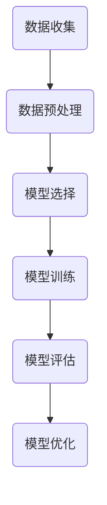

## 1.背景介绍

机器学习，作为人工智能的一个重要分支，近年来在科学研究和产业应用中都扮演着日益重要的角色。从自动驾驶汽车到语音识别，从电子商务推荐系统到股票市场预测，无处不在。本文将对机器学习的基本原理进行深入探讨，并通过实际代码示例，帮助读者更好地理解和应用这一技术。

## 2.核心概念与联系

### 2.1 机器学习的定义

机器学习是一种程序设计范式，它让计算机在不直接编程的情况下学习经验。一般而言，一个机器学习系统通过学习如何组合输入信息来对未见过的数据做出有用的预测。

### 2.2 机器学习的分类

机器学习通常分为三大类：监督学习，无监督学习和强化学习。

### 2.3 机器学习的流程

一般来说，机器学习的流程包括数据收集，数据预处理，模型选择，模型训练，模型评估和模型优化等步骤。



## 3.核心算法原理具体操作步骤

以线性回归为例，我们来详细介绍一下机器学习的具体操作步骤。

### 3.1 数据收集

数据是机器学习的基础，我们需要收集足够的数据来训练我们的模型。数据可以来自各种来源，如文件，数据库，互联网等。

### 3.2 数据预处理

数据预处理是将原始数据转化为更适合机器学习算法处理的格式。这一步通常包括数据清洗，数据转换，数据归一化等。

### 3.3 模型选择

模型选择是根据问题的特性选择合适的机器学习算法。比如，在我们的例子中，我们选择了线性回归模型。

### 3.4 模型训练

模型训练是使用我们的数据来训练我们的模型。在训练过程中，模型会学习到数据的特性，并尽量减小预测错误。

### 3.5 模型评估

模型评估是通过一些指标来评价我们的模型的性能。常见的评估指标有准确率，召回率，F1分数等。

### 3.6 模型优化

模型优化是通过调整模型的参数来提高模型的性能。这一步通常需要大量的实验和时间。


## 4.数学模型和公式详细讲解举例说明

线性回归是一种简单且常用的机器学习算法，它假设目标值与输入特征之间存在线性关系。其数学模型可以表示为：

$$
y = wx + b
$$

其中，$y$ 是目标值，$x$ 是输入特征，$w$ 是权重，$b$ 是偏置。

我们的目标是通过训练数据找到最佳的 $w$ 和 $b$，使得模型的预测值与真实值之间的误差最小。这个误差通常用均方误差（MSE）来衡量：

$$
MSE = \frac{1}{n}\sum_{i=1}^{n}(y_i - \hat{y}_i)^2
$$

其中，$y_i$ 是真实值，$\hat{y}_i$ 是预测值，$n$ 是样本数量。

为了找到最小的 MSE，我们可以使用梯度下降法来优化 $w$ 和 $b$。梯度下降法的更新公式为：

$$
w = w - \alpha \frac{\partial MSE}{\partial w}
$$

$$
b = b - \alpha \frac{\partial MSE}{\partial b}
$$

其中，$\alpha$ 是学习率，是一个需要我们设定的超参数。

## 5.项目实践：代码实例和详细解释说明

下面，我们将使用 Python 的 Scikit-learn 库来实现一个简单的线性回归模型。

```python
from sklearn.model_selection import train_test_split
from sklearn.linear_model import LinearRegression
from sklearn.datasets import make_regression
import matplotlib.pyplot as plt

# 生成数据
X, y = make_regression(n_samples=100, n_features=1, noise=0.1)

# 划分数据集
X_train, X_test, y_train, y_test = train_test_split(X, y, test_size=0.2)

# 创建模型
model = LinearRegression()

# 训练模型
model.fit(X_train, y_train)

# 预测
y_pred = model.predict(X_test)

# 绘图
plt.scatter(X_test, y_test, color='black')
plt.plot(X_test, y_pred, color='blue', linewidth=3)
plt.show()
```

这段代码首先生成了一些用于回归的数据，然后用 train_test_split 函数将数据划分为训练集和测试集。接着，我们创建了一个线性回归模型，并用训练数据来训练它。最后，我们用测试数据来进行预测，并将预测结果绘制出来。

## 6.实际应用场景

机器学习已经被广泛应用在各个领域，包括但不限于：

- 自动驾驶：通过机器学习，汽车可以学习如何识别路标，避开障碍物，预测其他车辆和行人的行为，从而实现自动驾驶。
- 语音识别：通过机器学习，计算机可以学习如何理解人类的语音，从而实现语音识别和语音合成。
- 推荐系统：通过机器学习，推荐系统可以学习用户的兴趣和行为，从而提供个性化的推荐。

## 7.工具和资源推荐

以下是一些学习和使用机器学习的推荐资源：

- 书籍：《Hands-On Machine Learning with Scikit-Learn and TensorFlow》是一本非常实用的书，它通过大量的代码示例，详细地介绍了如何使用 Scikit-learn 和 TensorFlow 进行机器学习。
- 在线课程：Coursera 的《Machine Learning》课程是一门非常经典的机器学习课程，由 Stanford 大学的 Andrew Ng 教授讲授。
- 工具：Python 的 Scikit-learn 库是一个强大的机器学习库，它包含了大量的机器学习算法和工具。

## 8.总结：未来发展趋势与挑战

机器学习是一个快速发展的领域，它的未来充满了无限的可能性。然而，也存在着许多挑战，如数据隐私，模型解释性，算法公平性等。作为一名机器学习工程师，我们不仅需要掌握技术，还需要关注这些社会和伦理问题。

## 9.附录：常见问题与解答

Q: 机器学习和人工智能有什么区别？

A: 人工智能是一个广泛的概念，它包括任何使得机器能够执行人类智能活动的技术。而机器学习是实现人工智能的一种方法，它让机器能够从数据中学习。

Q: 什么是过拟合和欠拟合？

A: 过拟合是指模型在训练数据上表现良好，但在未见过的数据上表现较差。欠拟合则是指模型在训练数据上表现就已经较差。

Q: 如何选择合适的机器学习算法？

A: 选择合适的机器学习算法需要考虑许多因素，如问题的性质，数据的类型，可用的计算资源等。一般来说，需要通过实验来确定最适合的算法。

作者：禅与计算机程序设计艺术 / Zen and the Art of Computer Programming