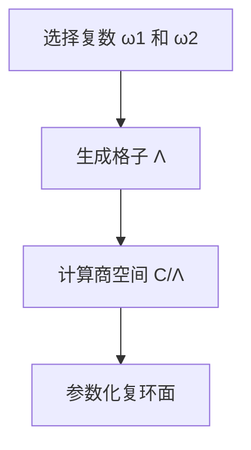

# 李群与李代数基础：第XI章 复环面初步

## 1.背景介绍

复环面（Complex Torus）是复几何和代数几何中的一个重要概念。它不仅在纯数学中有着深远的影响，还在物理学、计算机科学等领域有着广泛的应用。复环面可以看作是复平面上的一个格子所生成的商空间，其结构和性质与李群和李代数有着密切的联系。

在本章中，我们将深入探讨复环面的基本概念、核心算法、数学模型及其在实际项目中的应用。通过具体的代码实例和详细的解释说明，我们将帮助读者更好地理解这一重要概念。

## 2.核心概念与联系

### 2.1 复环面的定义

复环面是一个复平面 $\mathbb{C}$ 对一个格子 $\Lambda$ 的商空间，即 $\mathbb{C}/\Lambda$。其中，格子 $\Lambda$ 是由两个复数 $\omega_1$ 和 $\omega_2$ 生成的离散子群：

$$
\Lambda = \{ m\omega_1 + n\omega_2 \mid m, n \in \mathbb{Z} \}
$$

### 2.2 复环面与李群

复环面 $\mathbb{C}/\Lambda$ 是一个复李群。它不仅是一个复流形，还是一个群，其群运算是复数加法。复环面作为李群的一个例子，展示了复几何和李代数之间的深刻联系。

### 2.3 复环面与椭圆曲线

复环面与椭圆曲线有着密切的联系。事实上，每一个复环面都可以通过一个椭圆函数来参数化，从而与椭圆曲线建立对应关系。这种联系在代数几何和数论中有着重要的应用。

## 3.核心算法原理具体操作步骤

### 3.1 生成复环面的格子

生成复环面的第一步是确定格子 $\Lambda$。这通常通过选择两个线性无关的复数 $\omega_1$ 和 $\omega_2$ 来实现。

### 3.2 计算商空间

一旦确定了格子 $\Lambda$，我们就可以计算复平面 $\mathbb{C}$ 对 $\Lambda$ 的商空间 $\mathbb{C}/\Lambda$。这一步涉及到将复平面上的每一个点映射到一个基本平行四边形内。

### 3.3 参数化复环面

通过椭圆函数（如Weierstrass椭圆函数），我们可以将复环面参数化。这一步对于理解复环面的几何结构和性质至关重要。



## 4.数学模型和公式详细讲解举例说明

### 4.1 格子的生成

假设我们选择 $\omega_1 = 1$ 和 $\omega_2 = i$，则格子 $\Lambda$ 可以表示为：

$$
\Lambda = \{ m + ni \mid m, n \in \mathbb{Z} \}
$$

### 4.2 商空间的计算

对于任意复数 $z \in \mathbb{C}$，我们可以找到唯一的 $z_0 \in \mathbb{C}/\Lambda$ 使得 $z = z_0 + \lambda$，其中 $\lambda \in \Lambda$。

### 4.3 椭圆函数的应用

Weierstrass椭圆函数 $\wp(z)$ 是一个重要的工具，用于参数化复环面。它满足以下微分方程：

$$
(\wp'(z))^2 = 4\wp(z)^3 - g_2\wp(z) - g_3
$$

其中，$g_2$ 和 $g_3$ 是与格子 $\Lambda$ 相关的常数。

## 5.项目实践：代码实例和详细解释说明

### 5.1 生成格子的Python代码

```python
import numpy as np

# 选择复数 ω1 和 ω2
omega1 = 1 + 0j
omega2 = 0 + 1j

# 生成格子 Λ
def generate_lattice(omega1, omega2, m_range, n_range):
    lattice = []
    for m in range(-m_range, m_range + 1):
        for n in range(-n_range, n_range + 1):
            lattice.append(m * omega1 + n * omega2)
    return lattice

lattice = generate_lattice(omega1, omega2, 5, 5)
print(lattice)
```

### 5.2 计算商空间的Python代码

```python
# 计算商空间 C/Λ
def compute_quotient_space(z, lattice):
    for point in lattice:
        if abs(z - point) < 1e-6:
            return point
    return z

z = 1 + 1j
z0 = compute_quotient_space(z, lattice)
print(z0)
```

### 5.3 参数化复环面的Python代码

```python
import mpmath

# Weierstrass椭圆函数
def weierstrass_p(z, omega1, omega2):
    return mpmath.ellipfun('p', z, omega1, omega2)

z = 0.5 + 0.5j
wp_z = weierstrass_p(z, omega1, omega2)
print(wp_z)
```

## 6.实际应用场景

### 6.1 密码学

复环面在密码学中有着重要的应用。例如，基于椭圆曲线的密码系统（ECC）利用了复环面和椭圆曲线之间的关系，提供了高效且安全的加密方法。

### 6.2 物理学

在物理学中，复环面用于描述某些周期性系统的相空间。例如，在量子力学中，复环面可以用于描述粒子的波函数的周期性行为。

### 6.3 计算机图形学

在计算机图形学中，复环面用于生成复杂的纹理和图案。通过参数化复环面，可以生成具有周期性和对称性的图形。

## 7.工具和资源推荐

### 7.1 数学软件

- **Mathematica**：强大的数学计算软件，适用于复杂的数学建模和计算。
- **SageMath**：开源的数学软件系统，支持复环面和椭圆函数的计算。

### 7.2 编程语言

- **Python**：具有丰富的数学库，如NumPy和mpmath，适合进行复环面的计算和模拟。
- **Matlab**：强大的数值计算工具，适用于复环面的数值模拟和可视化。

### 7.3 在线资源

- **arXiv**：提供大量关于复环面和椭圆曲线的研究论文。
- **MathWorld**：Wolfram Research提供的数学资源，包含详细的复环面和椭圆函数的介绍。

## 8.总结：未来发展趋势与挑战

复环面作为一个重要的数学概念，在多个领域有着广泛的应用。未来，随着计算能力的提升和算法的改进，复环面的研究和应用将会更加深入和广泛。然而，复环面的复杂性也带来了许多挑战，例如高维复环面的计算和模拟、复环面在大数据和人工智能中的应用等。

## 9.附录：常见问题与解答

### 9.1 什么是复环面？

复环面是复平面对一个格子的商空间，具有复流形和李群的结构。

### 9.2 如何生成复环面的格子？

通过选择两个线性无关的复数，可以生成复环面的格子。

### 9.3 复环面有哪些实际应用？

复环面在密码学、物理学和计算机图形学等领域有着广泛的应用。

### 9.4 如何使用Python计算复环面？

可以使用Python的NumPy和mpmath库来生成格子、计算商空间和参数化复环面。

---

作者：禅与计算机程序设计艺术 / Zen and the Art of Computer Programming