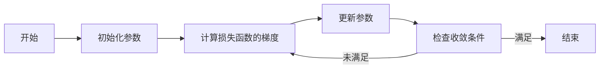

# 梯度下降Gradient Descent原理与代码实例讲解

## 1. 背景介绍
在机器学习和深度学习的世界里，梯度下降（Gradient Descent）是一种基础且极其重要的优化算法。它被广泛应用于训练各种模型，尤其是在神经网络的训练过程中扮演着核心角色。梯度下降的目标是最小化一个损失函数，通过迭代的方式，逐步调整模型参数，直至找到损失函数的最小值或者达到某个可接受的误差范围。

## 2. 核心概念与联系
在深入梯度下降的原理之前，我们需要理解几个核心概念及它们之间的联系：

- **损失函数(Loss Function)**：衡量模型预测值与真实值之间差异的函数。
- **梯度(Gradient)**：损失函数在参数空间中的导数，指示了损失函数增长最快的方向。
- **学习率(Learning Rate)**：决定在每次迭代中参数更新的步长大小。
- **迭代(Iteration)**：梯度下降算法的每一步更新过程。

这些概念之间的联系是：通过计算损失函数的梯度，我们可以知道如何调整模型参数来减少损失。学习率决定了我们调整参数的幅度。通过迭代这个过程，我们逐渐接近损失函数的最小值。

## 3. 核心算法原理具体操作步骤
梯度下降算法的操作步骤可以用以下流程图表示：



具体步骤如下：
1. 选择初始参数值。
2. 计算损失函数关于当前参数的梯度。
3. 根据梯度和学习率更新参数。
4. 判断是否满足收敛条件（例如，梯度的大小小于某个阈值，或者达到预设的迭代次数）。
5. 如果未满足收敛条件，回到步骤2继续迭代；如果满足，结束算法。

## 4. 数学模型和公式详细讲解举例说明
梯度下降算法的核心是对损失函数$L(\theta)$进行最小化，其中$\theta$表示模型参数。损失函数的梯度$\nabla_\theta L(\theta)$是一个向量，其各个分量是$L(\theta)$关于$\theta$各个分量的偏导数。更新参数的公式为：

$$
\theta_{new} = \theta_{old} - \alpha \nabla_\theta L(\theta_{old})
$$

其中，$\alpha$是学习率，它控制着我们在梯度方向上前进的步长。

例如，假设我们有一个线性回归模型，其损失函数为均方误差：

$$
L(\theta) = \frac{1}{2m} \sum_{i=1}^{m} (h_\theta(x^{(i)}) - y^{(i)})^2
$$

其中，$m$是样本数量，$h_\theta(x)$是模型的预测值，$y$是真实值。对于单个参数$\theta_j$的梯度计算如下：

$$
\frac{\partial L(\theta)}{\partial \theta_j} = \frac{1}{m} \sum_{i=1}^{m} (h_\theta(x^{(i)}) - y^{(i)})x_j^{(i)}
$$

通过计算所有参数的梯度，我们可以使用上述更新公式来调整参数。

## 5. 项目实践：代码实例和详细解释说明
让我们通过一个简单的线性回归例子来实践梯度下降算法。假设我们的数据集由一组点$(x^{(i)}, y^{(i)})$组成，我们的目标是找到一条直线$y = \theta_0 + \theta_1 x$，使得预测值和真实值之间的均方误差最小。

```python
import numpy as np

# 假设的数据集
X = np.array([1, 2, 3, 4, 5])
Y = np.array([2, 4, 6, 8, 10])

# 初始化参数
theta_0 = 0
theta_1 = 0

# 学习率
alpha = 0.01

# 迭代次数
iterations = 1000

# 梯度下降算法
for _ in range(iterations):
    # 预测值
    Y_pred = theta_0 + theta_1 * X
    # 计算损失
    error = Y_pred - Y
    # 计算梯度
    grad_theta_0 = np.sum(error) / len(Y)
    grad_theta_1 = np.sum(error * X) / len(Y)
    # 更新参数
    theta_0 = theta_0 - alpha * grad_theta_0
    theta_1 = theta_1 - alpha * grad_theta_1

print(f"模型参数: theta_0 = {theta_0}, theta_1 = {theta_1}")
```

在这段代码中，我们首先初始化模型参数$\theta_0$和$\theta_1$，然后设置学习率和迭代次数。在每次迭代中，我们计算预测值和真实值之间的误差，接着计算梯度，并更新参数。最终，我们得到了一组参数，它们定义了一条最佳拟合直线。

## 6. 实际应用场景
梯度下降算法在机器学习和深度学习领域有着广泛的应用，例如：

- 线性回归和逻辑回归模型的参数优化。
- 神经网络的权重和偏置的调整。
- 支持向量机中的核参数优化。
- 聚类算法中心点的更新。

在这些应用中，梯度下降算法帮助我们找到了能够最小化损失函数的模型参数，从而提高了模型的预测性能。

## 7. 工具和资源推荐
为了更好地实现和优化梯度下降算法，以下是一些有用的工具和资源：

- **NumPy**：进行高效的数值计算。
- **Matplotlib**：可视化损失函数和模型参数的变化。
- **TensorFlow和PyTorch**：这两个深度学习框架提供了自动梯度计算和高级优化器。
- **Scikit-learn**：提供了许多预先实现的机器学习算法，包括基于梯度下降的模型。

## 8. 总结：未来发展趋势与挑战
梯度下降算法虽然简单有效，但在面对大规模数据集、高维参数空间或复杂的模型结构时，仍存在一些挑战和发展趋势：

- **优化算法的发展**：如Adam、RMSprop等，它们试图解决梯度下降在某些情况下收敛速度慢或容易陷入局部最小值的问题。
- **并行和分布式计算**：随着数据量的增加，分布式梯度下降和并行计算成为了研究的热点。
- **自适应学习率**：自动调整学习率以改善收敛性能的技术正在不断发展。

## 9. 附录：常见问题与解答
**Q1: 如何选择合适的学习率？**
A1: 学习率的选择是一个实验性的过程，通常从一个较小的值开始，并通过实验来调整。如果学习率太大，可能会导致算法发散；如果太小，收敛速度会很慢。

**Q2: 梯度下降是否总是能找到全局最小值？**
A2: 对于凸函数，梯度下降可以保证找到全局最小值。但对于非凸函数，梯度下降可能会陷入局部最小值或鞍点。

**Q3: 如何判断梯度下降是否收敛？**
A3: 通常通过设置一个阈值来判断梯度的大小，如果梯度小于这个阈值，可以认为算法已经收敛。另一种方法是设置迭代次数，如果达到迭代次数仍未收敛，则可能需要调整学习率或重新考虑模型。

作者：禅与计算机程序设计艺术 / Zen and the Art of Computer Programming