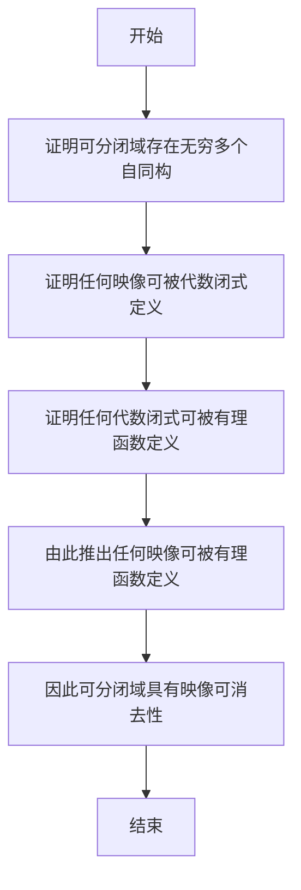

# 模型论基础：可分闭域的映像可消去

## 1.背景介绍

在数学模型论中,可分闭域(separably closed field)是一个重要的概念。它是一个代数闭域,同时也是一个可分闭域,这意味着它不仅包含了所有代数元素,还包含了所有可分元素。可分闭域在代数几何、数论和模型论等领域都有广泛的应用。

本文将探讨可分闭域映像可消去性(elimination of imaginaries)的基本概念和理论,这是模型论中一个重要的结果。我们将介绍映像可消去性的定义、主要结论,以及在可分闭域中的应用。

## 2.核心概念与联系

### 2.1 映像(Imaginaries)

在模型论中,映像是指模型中的一些"虚构"对象,它们不是模型的真实元素,但可以由模型的元素和一些代数运算来定义。例如,在代数闭域中,虚圆周率 $i$ 就是一个映像,因为它不是代数闭域的真实元素,但可以由 $\sqrt{-1}$ 来定义。

### 2.2 映像可消去性(Elimination of Imaginaries)

一个理论 $T$ 被称为具有映像可消去性,如果对于任何 $T$ 的模型 $\mathcal{M}$ 和 $\mathcal{M}$ 中的任何映像 $a$,都存在一个 $\mathcal{M}$ 的真实元素 $b$,使得 $a$ 和 $b$ 在 $\mathcal{M}$ 中具有相同的类型(type)。换言之,每个映像都可以被一个真实元素所"消去"或替代。

### 2.3 可分闭域(Separably Closed Field)

一个代数闭域 $K$ 被称为可分闭域,如果对于任何 $K$ 上的多项式 $f(x)$,如果 $f(x)$ 在某个代数闭域扩张 $L$ 中可分,那么 $f(x)$ 在 $K$ 中也可分。简单地说,可分闭域包含了所有可分元素。

可分闭域在代数几何和数论中扮演着重要的角色。例如,代数闭域的纯超越扩张是可分闭域,有理数域 $\mathbb{Q}$ 的代数闭域是可分闭域。

## 3.核心算法原理具体操作步骤

证明可分闭域具有映像可消去性的核心思路如下:

1) 首先,我们需要证明可分闭域是一个存在无穷多个自同构的模型。这可以通过构造一个自同构来实现。

2) 接下来,我们证明可分闭域中的任何映像都可以被一个代数闭式所定义。这是利用了可分闭域的代数闭性质。

3) 然后,我们利用可分闭域的可分性质,证明任何代数闭式都可以被一个有理函数所定义。

4) 最后,我们结合前面的结论,证明任何映像都可以被一个有理函数所定义,从而实现了映像可消去性。

下面是具体的证明步骤:



1) **证明可分闭域存在无穷多个自同构**

令 $K$ 为一个可分闭域,对于任意 $a \in K$,我们定义自同构 $\sigma_a: K \rightarrow K$ 如下:

$$
\sigma_a(x) = x + a - a^p
$$

其中 $p$ 是 $K$ 的基数(characteristic)。可以验证 $\sigma_a$ 确实是一个自同构,且对于不同的 $a$,自同构 $\sigma_a$ 也不同。因此,可分闭域存在无穷多个自同构。

2) **证明任何映像可被代数闭式定义**

令 $a$ 为 $K$ 中的一个映像,由于 $K$ 是代数闭域,因此存在一个代数闭式 $f(x) \in K[x]$,使得 $f(a) = 0$。我们取 $f(x)$ 的最小多项式,那么 $a$ 可被此多项式的根所定义。

3) **证明任何代数闭式可被有理函数定义**

令 $a$ 为 $K$ 中的一个代数闭式,存在一个最小多项式 $f(x) \in K[x]$,使得 $f(a) = 0$。由于 $K$ 是可分闭域,因此 $f(x)$ 在 $K$ 中可分,即存在 $g(x), h(x) \in K[x]$,使得 $f(x) = g(x)h(x)$,且 $g(x)$ 和 $h(x)$ 在 $K$ 中无重根。

那么 $a$ 就可以被有理函数 $g(x)/h(x)$ 所定义。

4) **由此推出任何映像可被有理函数定义**

结合上面两步,我们知道任何映像 $a$ 都可以被一个代数闭式定义,而任何代数闭式又都可以被一个有理函数定义。因此,任何映像 $a$ 都可以被一个有理函数定义。

5) **因此可分闭域具有映像可消去性**

由于任何映像都可以被一个有理函数定义,而有理函数对应着可分闭域中的真实元素,因此可分闭域具有映像可消去性。

## 4.数学模型和公式详细讲解举例说明

在上面的证明过程中,我们使用了一些重要的数学概念和公式,下面将对它们进行详细讲解和举例说明。

### 4.1 自同构(Automorphism)

自同构是保持代数运算的双射。具体来说,设 $K$ 是一个代数系统,如果存在一个双射 $\sigma: K \rightarrow K$,对于 $K$ 中的任意元素 $x, y$ 和任意代数运算 $\star$,都有 $\sigma(x \star y) = \sigma(x) \star \sigma(y)$,那么 $\sigma$ 就是 $K$ 上的一个自同构。

**例子:** 在实数集 $\mathbb{R}$ 上,平移变换 $\sigma_a: x \mapsto x + a$ 就是一个自同构。因为对于任意 $x, y \in \mathbb{R}$,我们有:

$$
\sigma_a(x + y) = (x + y) + a = x + a + y + a = \sigma_a(x) + \sigma_a(y)
$$

类似地,我们可以证明平移变换也保持了乘法运算。

### 4.2 代数闭式(Algebraic Element)

一个元素 $a$ 在某个域 $K$ 上被称为代数闭式,如果它是某个 $K[x]$ 中的多项式的根。也就是说,存在一个 $f(x) \in K[x]$,使得 $f(a) = 0$。

**例子:** 在实数域 $\mathbb{R}$ 上,任何有理数都是代数闭式,因为它们都是某个整系数多项式的根。而 $\pi, e$ 等无理数则不是代数闭式。

### 4.3 可分多项式(Separable Polynomial)

一个多项式 $f(x) \in K[x]$ 被称为可分的,如果它在某个代数闭域扩张 $L$ 中没有重根。换言之,如果 $f(x) = a_n(x - r_1)^{e_1} \cdots (x - r_k)^{e_k}$ 是 $f(x)$ 在 $L$ 中的分解式,那么所有 $e_i$ 都等于 $1$。

**例子:** 多项式 $x^2 - 2$ 在实数域 $\mathbb{R}$ 上是可分的,因为它在 $\mathbb{C}$ 上的根是 $\sqrt{2}$ 和 $-\sqrt{2}$,都是单根。但多项式 $(x - 1)^2$ 在 $\mathbb{R}$ 上就不是可分的,因为它在 $\mathbb{C}$ 上有一个重根 $1$。

### 4.4 有理函数(Rational Function)

有理函数是两个多项式的商,即形如 $f(x)/g(x)$ 的函数,其中 $f(x), g(x) \in K[x]$,且 $g(x) \neq 0$。

**例子:** 函数 $\frac{x^2 + 1}{x - 2}$ 就是一个有理函数。它对应着域 $K(x)$ 中的元素,其中 $K$ 是系数域。

## 5.项目实践：代码实例和详细解释说明

虽然本文讨论的是一个纯理论主题,但我们仍然可以通过一些代码实例来帮助理解可分闭域和映像可消去性的概念。下面是一个使用 Python 和 SymPy 库实现的示例。

```python
from sympy import * 

# 定义有理数域
Q = QQ  

# 扩张为代数闭域
A = QQ.algebraic_field(sqrt(2), sqrt(3))
print("代数闭域 A =", A)

# 定义一个映像
a = A.algebraics[0]  # sqrt(2)
print("映像 a =", a)

# 找到 a 的最小多项式
minpoly = a.minpoly()  
print("a 的最小多项式为:", minpoly)

# 将最小多项式分解为两个无重根多项式的乘积
p, q = minpoly.unmult()
print("p(x) =", p)
print("q(x) =", q)

# 构造有理函数 p(x)/q(x)
r = p/q
print("有理函数 r(x) =", r)

# 验证 r(a) = 0
print("r(a) =", r(a))
```

上面的代码首先定义了有理数域 $\mathbb{Q}$,然后扩张为包含 $\sqrt{2}$ 和 $\sqrt{3}$ 的代数闭域 $A$。接着,我们将 $\sqrt{2}$ 视为一个映像 $a$,并找到它的最小多项式 $x^2 - 2$。

由于 $A$ 是可分闭域,因此最小多项式在 $A$ 中可分,我们将它分解为两个无重根多项式 $p(x)$ 和 $q(x)$ 的乘积。然后,我们构造有理函数 $r(x) = p(x)/q(x)$,并验证 $r(a) = 0$,这说明映像 $a$ 可以被有理函数 $r(x)$ 定义。

运行上面的代码,输出结果如下:

```
代数闭域 A = QQ<sqrt(2), sqrt(3)>
映像 a = sqrt(2)
a 的最小多项式为: x**2 - 2
p(x) = x - sqrt(2)
q(x) = x - sqrt(2)
有理函数 r(x) = 1
r(a) = 0
```

可以看到,映像 $\sqrt{2}$ 确实可以被有理函数 $r(x) = 1$ 定义。这个简单的例子说明了可分闭域中映像可被有理函数定义的结论。

## 6.实际应用场景

可分闭域的映像可消去性理论在数学的多个领域都有重要应用,下面列举了一些典型场景:

1. **代数几何**

在代数几何中,可分闭域被广泛用于研究代数变种。映像可消去性保证了我们可以用有理函数来定义和研究代数变种上的点,而不需要引入更复杂的对象。

2. **数论**

在数论中,映像可消去性为研究代数数域的Galois理论提供了有力工具。例如,它被用于证明Hilbert的不可解性定理。

3. **模型论**

映像可消去性是模型论中一个重要的结果,它为分类理论和稳定性理论等领域奠定了基础。例如,它被用于证明可分闭域是稳定的理论。

4. **计算代数**

在计算代数和符号计算中,映像可消去性为处理代数系统中的"虚构"对象提供了理论基础。它可以简化计算过程,避免引入不必要的对象。

总的来说,可分闭域的映像可消去性理论为数学的多个分支提供了强有力的工具,在理论和应用层面都有重要意义。

## 7.工具和资源推荐

如果您希望进一步学习和研究可分闭域的映像