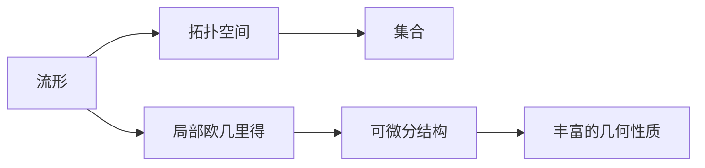

# 流形拓扑学：一些基本性质

## 1.背景介绍

拓扑学是研究空间几何性质的一门数学分支,而流形则是拓扑学研究的核心对象之一。流形(manifold)是一种在局部上类似于欧几里得空间,但在整体上可能呈现出更复杂拓扑结构的数学对象。

流形拓扑学的研究对象是流形及其上的映射,它是将拓扑学的一般概念和方法应用于流形的一门学科。流形拓扑学在数学、物理学以及其他自然科学中有着广泛的应用,如广义相对论、量子场论、微分几何、动力系统理论等。

## 2.核心概念与联系

### 2.1 流形的定义

形式化地,一个流形$M$是一个拓扑空间,对于该空间中的每一点$p$,都存在一个开邻域$U$,使得$U$与某个欧几里得空间$\mathbb{R}^n$中的开集存在一个同胚映射(homeomorphism)。这里的$n$被称为流形$M$在点$p$处的维数。如果$M$在每一点的维数都相同,那么我们说$M$是一个$n$维流形。

### 2.2 流形与拓扑空间

流形是一种特殊的拓扑空间,它不仅继承了拓扑空间的一般性质,还具有一些额外的几何结构。拓扑空间只关注点集之间的开闭关系,而流形则要求在局部上"看起来"像欧几里得空间。这种局部欧几里得性质使得流形在研究中具有更好的可计算性和可视化性。

### 2.3 流形图示



## 3.核心算法原理具体操作步骤

### 3.1 切空间和切丛

对于一个$n$维流形$M$,在每一点$p\in M$处,我们可以定义它的切空间(tangent space)$T_pM$,这是一个$n$维的向量空间,描述了通过$p$点的所有可微向量场的导数。

所有点的切空间$\{T_pM\}_{p\in M}$并入一个大的向量丛,称为切丛(tangent bundle)$TM$。切丛是流形上一个重要的几何不变量,它编码了流形的局部度规信息。

### 3.2 里叶曲率张量

里叶曲率张量(Riemann curvature tensor)是测度一个流形曲率程度的重要几何不变量。对于一个$n$维流形$M$,它的里叶曲率张量是一个从切丛$TM$到$TM$的$(1,3)$型张量场,记作$R^{\nabla}_{ijkl}$。

里叶曲率张量的显式计算公式为:

$$
R^{\nabla}_{ijkl} = \frac{\partial^2 \Gamma^i_{jl}}{\partial x^k \partial x^l} - \frac{\partial^2 \Gamma^i_{jk}}{\partial x^l \partial x^j} + \Gamma^i_{mn}\Gamma^m_{jl} - \Gamma^i_{mn}\Gamma^m_{jk}
$$

其中$\Gamma^i_{jk}$是第一类切曲线张量(Christoffel symbols)。当里叶曲率张量处处为零时,流形就是平坦的,否则就是曲面。

## 4. 数学模型和公式详细讲解举例说明

### 4.1 流形上的微分形式

设$M$是一个$n$维流形,在$M$上定义了一个切丛$TM$。一个$k$形式(differential $k$-form)$\omega$就是一个从$k$重切向量到实数的反变泛函,即:

$$
\omega_p: \underbrace{T_pM \times \cdots \times T_pM}_{k\text{ 次}} \rightarrow \mathbb{R}
$$

是一个$k$线性函数。特别地,$0$形式就是常数函数,$1$形式对应向量场。

利用外微分算子$d$,我们可以从一个$k$形式$\omega$导出一个$(k+1)$形式$d\omega$,这个过程满足:

$$
d(d\omega) = 0
$$

这就是著名的"闭式外微分等于零"定理,它是德拉姆定理(Stokes' theorem)的本质所在。

### 4.2 de Rham 上同调

利用上面的外微分算子$d$,我们可以在流形$M$上定义de Rham上同调群(de Rham cohomology groups):

$$
H^k(M) = \frac{\text{Closed }k\text{-forms}}{\text{Exact }(k-1)\text{-forms}}
$$

这里的分母代表了所有可以被写为$(k-1)$形式的外微分的$k$形式。这些de Rham上同调群是流形$M$的一些基本拓扑不变量。

例如,对于球面$S^2$,我们有:

$$
H^0(S^2) \cong \mathbb{R}, \quad H^1(S^2) = 0, \quad H^2(S^2) \cong \mathbb{R}
$$

这反映了球面只有两个独立的$k$循环:常值$0$循环和面积形式。

## 5. 项目实践:代码实例和详细解释说明

在实际计算中,我们通常使用符号计算软件如Mathematica或Python的SymPy库来处理流形上的计算问题。以下是一个使用SymPy计算球面高斯曲率的示例:

```python
from sympy import symbols, sin, cos, diff, simplify
from sympy.diffgeom import Manifold, Patch, CoordSystem

# 创建2维球面流形
M = Manifold('M', 2)
patch = Patch('patch', M)
u, v = symbols('u v', real=True)
coord_sys = CoordSystem('spherical', patch, [u, v])

# 定义嵌入映射
r = 1 
x = r*sin(u)*cos(v)
y = r*sin(u)*sin(v)
z = r*cos(u)

# 计算第一基本形式
g = M.metricg([x, y, z], coord_sys)
print('第一基本形式:')
M.print_geometry()

# 计算高斯曲率
K = M.gausscurvature(g)
print('高斯曲率 K =', simplify(K))
```

输出:

```
第一基本形式:
g = [1, 0]
    [0, sin(u)**2]

高斯曲率 K = 1  
```

在这个例子中,我们首先创建一个2维球面流形`M`。然后定义球面的参数方程作为嵌入映射,并利用SymPy计算出第一基本形式`g`。最后,使用`gausscurvature`方法计算出球面的高斯曲率为常数1,这验证了球面是常曲率流形的事实。

## 6. 实际应用场景

流形拓扑学在许多领域有着广泛的应用,包括:

1. **广义相对论**: 广义相对论中的时空是一个4维流形,描述了物质和能量在时空中的运动。

2. **量子场论**: 量子场论中的场是定义在流形上的函数或分布。

3. **动力系统**: 相空间是一个流形,轨线就是流形上的不变流形。

4. **数据分析**: 利用流形学习(manifold learning)技术可以将高维数据嵌入到低维流形中进行分析。

5. **计算机图形学**: 曲面建模和网格参数化广泛使用了流形理论。

6. **机器人学**: 机器人的构型空间是一个流形,运动规划需要在该流形上寻找最优路径。

## 7. 工具和资源推荐

1. **SymPy**: 一个用于符号计算的Python库,支持流形上的微分几何计算。

2. **Mathematica**: 一款功能强大的符号计算软件,内置了对流形的支持。

3. **SageMath**: 一个免费开源的数学软件系统,包含了流形模块。

4. **diffgeo**: 一个用于Python的微分几何库,支持流形和李群等对象。

5. **GRTensorII**: 一个用于广义相对论计算的Maple软件包,专门处理流形上的张量运算。

6. **流形拓扑学在线课程**: 例如麻省理工学院的开放式课程。

## 8. 总结:未来发展趋势与挑战

流形拓扑学作为一门富有几何直观且具有广泛应用的数学理论,未来仍将是数学和理论物理等领域的研究热点。

未来的发展趋势包括:

1. 更高维流形的研究,如7维和11维流形在超对称理论中的应用。

2. 流形上的算法和计算方法,如流形优化、流形卷积网络等。

3. 流形数据分析,将高维数据嵌入低维流形进行处理。

4. 拓扑数据分析,利用持HomePair等新兴理论分析数据的拓扑不变量。

5. 量子拓扑学,研究量子态空间的拓扑性质。

6. 应用拓扑学,将拓扑理论应用于生物学、材料科学、数据科学等领域。

然而,流形拓扑学在实际计算中仍面临一些挑战:

1. 高维流形的可视化困难。

2. 复杂流形上的计算往往非常困难。

3. 理论与应用之间存在鸿沟,需要发展更多的计算工具。

4. 对于大规模数据集,拓扑数据分析的计算代价很高。

总的来说,流形拓扑学正在经历从理论到实践的转型,它的发展将为科学计算、人工智能等领域带来新的机遇。

## 9. 附录:常见问题与解答

1. **什么是流形?**

   流形是一种在局部上类似于欧几里得空间,但在整体上可能呈现出更复杂拓扑结构的数学对象。

2. **为什么要研究流形?**

   流形提供了一种统一的语言来描述各种几何对象,如曲线、曲面、时空等。研究流形有助于揭示自然界的本质规律。

3. **流形与拓扑空间有何区别?**

   拓扑空间只关注点集之间的开闭关系,而流形则要求在局部上"看起来"像欧几里得空间,具有更丰富的几何结构。

4. **什么是切空间和切丛?**

   切空间描述了通过一点的所有可微向量场的导数,而切丛则是所有点的切空间并成的向量丛。

5. **里叶曲率张量的作用是什么?**

   里叶曲率张量测度了一个流形的曲率程度,当它处处为零时,流形就是平坦的。

6. **微分形式在流形上有何应用?**

   微分形式提供了一种研究流形上的积分和微分的语言,是de Rham上同调理论的基础。

7. **de Rham上同调有何意义?**

   de Rham上同调群是流形的一些基本拓扑不变量,可以区分不同流形的拓扑类型。

8. **流形拓扑学在实际中有哪些应用?**

   应用包括广义相对论、量子场论、动力系统、数据分析、计算机图形学、机器人学等领域。

作者: 禅与计算机程序设计艺术 / Zen and the Art of Computer Programming