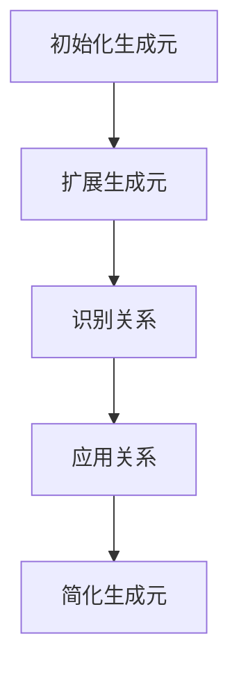

# 环与代数：有限表示型代数

## 1.背景介绍

在计算机科学和数学的交汇处，代数结构扮演着至关重要的角色。环与代数是其中的一个重要分支，特别是有限表示型代数，它在理论计算机科学、密码学、编码理论和数据结构等领域有着广泛的应用。本文旨在深入探讨有限表示型代数的核心概念、算法原理、数学模型、实际应用以及未来发展趋势。

## 2.核心概念与联系

### 2.1 环的定义

环是一个集合 $R$，配备了两个二元运算：加法和乘法。满足以下条件：

1. $(R, +)$ 是一个交换群。
2. 乘法在 $R$ 上是结合的。
3. 乘法对加法分配，即对于所有 $a, b, c \in R$，有 $a(b + c) = ab + ac$ 和 $(a + b)c = ac + bc$。

### 2.2 代数的定义

代数是一个向量空间 $A$，配备了一个双线性乘法运算。换句话说，对于所有 $a, b, c \in A$ 和标量 $\lambda, \mu$，有：

1. $(a + b)c = ac + bc$
2. $a(b + c) = ab + ac$
3. $(\lambda a)(\mu b) = (\lambda \mu)(ab)$

### 2.3 有限表示型代数

有限表示型代数是指那些可以用有限个生成元和关系来表示的代数。它们在计算机科学中尤为重要，因为它们可以通过有限的描述来进行计算和分析。

## 3.核心算法原理具体操作步骤

### 3.1 生成元和关系

生成元是代数中的基本元素，通过它们的线性组合和乘积可以生成整个代数。关系是这些生成元之间的等式，用来约束生成元的组合方式。

### 3.2 计算生成元的算法

1. **初始化**：选择代数的基本元素作为初始生成元。
2. **扩展**：通过乘法和加法操作生成新的元素。
3. **简化**：应用关系来简化生成的元素，去除冗余。

### 3.3 关系的处理

1. **识别关系**：确定生成元之间的基本关系。
2. **应用关系**：在计算过程中应用这些关系来简化计算。

### 3.4 核心算法示例



## 4.数学模型和公式详细讲解举例说明

### 4.1 代数的表示

一个代数 $A$ 可以表示为 $A = K\langle x_1, x_2, \ldots, x_n \rangle / I$，其中 $K$ 是一个域，$x_1, x_2, \ldots, x_n$ 是生成元，$I$ 是一个理想，包含所有的关系。

### 4.2 具体例子

考虑一个简单的代数 $A$，它由两个生成元 $x$ 和 $y$ 组成，并且满足关系 $xy = yx$。则 $A$ 可以表示为：

$$
A = K\langle x, y \rangle / (xy - yx)
$$

### 4.3 计算示例

假设我们要计算 $x^2y + yx^2$ 在代数 $A$ 中的表示。根据关系 $xy = yx$，我们有：

$$
x^2y + yx^2 = xxy + yxx = x(yx) + y(xx) = xyx + yxx = yxx + yxx = 2yxx
$$

## 5.项目实践：代码实例和详细解释说明

### 5.1 环与代数的Python实现

```python
class RingElement:
    def __init__(self, value, ring):
        self.value = value
        self.ring = ring

    def __add__(self, other):
        return RingElement((self.value + other.value) % self.ring.modulus, self.ring)

    def __mul__(self, other):
        return RingElement((self.value * other.value) % self.ring.modulus, self.ring)

class Ring:
    def __init__(self, modulus):
        self.modulus = modulus

    def element(self, value):
        return RingElement(value, self)

# 示例
ring = Ring(7)
a = ring.element(3)
b = ring.element(5)

print((a + b).value)  # 输出 1
print((a * b).value)  # 输出 1
```

### 5.2 代码解释

上述代码定义了一个环及其元素的基本操作。`RingElement` 类表示环中的元素，支持加法和乘法操作。`Ring` 类表示环本身，包含一个模数属性。

## 6.实际应用场景

### 6.1 密码学

有限表示型代数在密码学中有广泛应用。例如，椭圆曲线密码学（ECC）利用有限域上的代数结构来实现高效且安全的加密算法。

### 6.2 编码理论

在编码理论中，有限表示型代数用于构造和分析纠错码。例如，Reed-Solomon码利用有限域上的多项式代数来实现数据的纠错和恢复。

### 6.3 数据结构

有限表示型代数在数据结构的设计和分析中也有应用。例如，布尔代数用于设计和优化逻辑电路和查询处理。

## 7.工具和资源推荐

### 7.1 计算机代数系统

- **SageMath**：一个开源的数学软件系统，支持代数计算。
- **Mathematica**：一个强大的符号计算工具，适用于代数和其他数学计算。

### 7.2 在线资源

- **arXiv**：一个开放获取的学术论文预印本平台，包含大量关于环与代数的研究论文。
- **MathWorld**：一个全面的数学资源网站，提供详细的数学概念和定理解释。

## 8.总结：未来发展趋势与挑战

### 8.1 发展趋势

随着计算能力的提升和算法的优化，有限表示型代数在更多实际应用中展现出巨大的潜力。例如，量子计算中的代数结构研究正在成为一个热门领域。

### 8.2 挑战

尽管有限表示型代数有广泛的应用，但其计算复杂性和理论深度仍然是一个挑战。如何在实际应用中高效地处理这些代数结构是一个亟待解决的问题。

## 9.附录：常见问题与解答

### 9.1 什么是有限表示型代数？

有限表示型代数是指那些可以用有限个生成元和关系来表示的代数。

### 9.2 有限表示型代数有哪些实际应用？

有限表示型代数在密码学、编码理论和数据结构等领域有广泛的应用。

### 9.3 如何计算有限表示型代数中的元素？

通过生成元和关系，可以使用代数运算规则来计算代数中的元素。

---

作者：禅与计算机程序设计艺术 / Zen and the Art of Computer Programming