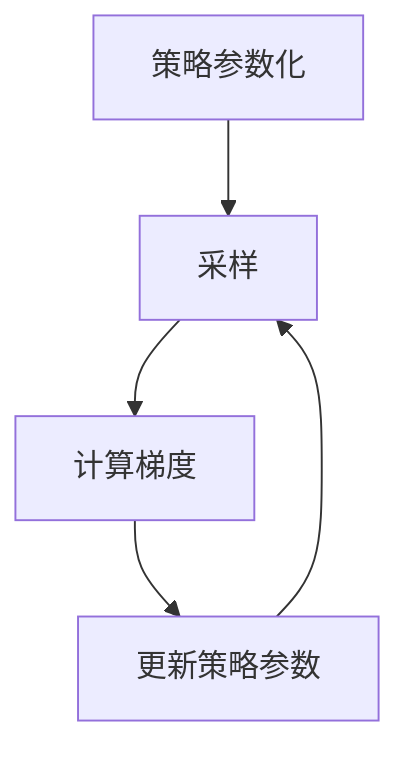

# 策略梯度 (Policy Gradients) 原理与代码实例讲解

## 1.背景介绍

在机器学习和人工智能领域，强化学习（Reinforcement Learning, RL）是一种重要的学习范式。与监督学习和无监督学习不同，强化学习通过与环境的交互来学习策略，以最大化累积奖励。策略梯度（Policy Gradients）方法是强化学习中的一种重要技术，广泛应用于复杂的决策问题，如游戏AI、机器人控制和自动驾驶等领域。

策略梯度方法的核心思想是直接对策略进行参数化，并通过梯度上升的方法优化策略参数，使得策略能够获得更高的累积奖励。相比于基于值函数的方法（如Q-learning），策略梯度方法在处理连续动作空间和高维状态空间时具有显著优势。

## 2.核心概念与联系

在深入探讨策略梯度方法之前，我们需要了解一些核心概念：

### 2.1 强化学习基本概念

- **状态（State, s）**：环境在某一时刻的具体情况。
- **动作（Action, a）**：智能体在某一状态下可以采取的行为。
- **奖励（Reward, r）**：智能体在某一状态下采取某一动作后获得的反馈。
- **策略（Policy, π）**：智能体在每一状态下选择动作的概率分布。

### 2.2 策略梯度方法

策略梯度方法直接对策略进行参数化，记为 $\pi_\theta(a|s)$，其中 $\theta$ 是策略的参数。通过优化 $\theta$，使得策略能够获得更高的累积奖励。策略梯度方法的核心在于计算策略的梯度，并利用梯度上升法进行优化。

### 2.3 优势函数（Advantage Function）

优势函数 $A(s, a)$ 用于衡量在状态 $s$ 下采取动作 $a$ 相对于平均水平的好坏。它是策略梯度方法中的一个重要概念，常用于改进梯度估计的方差。

## 3.核心算法原理具体操作步骤

策略梯度方法的核心算法可以分为以下几个步骤：

### 3.1 策略参数化

首先，我们需要对策略进行参数化。常见的策略参数化方法包括线性函数、神经网络等。假设策略 $\pi_\theta(a|s)$ 由参数 $\theta$ 控制。

### 3.2 采样

在当前策略 $\pi_\theta$ 下，智能体与环境进行交互，生成一系列状态、动作和奖励的序列。这个过程称为采样。

### 3.3 计算梯度

根据采样得到的数据，计算策略的梯度。策略梯度的计算公式为：

$$
\nabla_\theta J(\theta) = \mathbb{E}_{\pi_\theta} \left[ \nabla_\theta \log \pi_\theta(a|s) \cdot A(s, a) \right]
$$

其中，$J(\theta)$ 是累积奖励的期望，$A(s, a)$ 是优势函数。

### 3.4 更新策略参数

利用梯度上升法更新策略参数：

$$
\theta \leftarrow \theta + \alpha \nabla_\theta J(\theta)
$$

其中，$\alpha$ 是学习率。

### 3.5 重复迭代

重复上述步骤，直到策略收敛或达到预定的训练轮数。

以下是策略梯度方法的Mermaid流程图：



## 4.数学模型和公式详细讲解举例说明

在这一部分，我们将详细讲解策略梯度方法的数学模型和公式，并通过具体例子进行说明。

### 4.1 策略梯度定理

策略梯度定理是策略梯度方法的理论基础。它指出，策略的梯度可以表示为：

$$
\nabla_\theta J(\theta) = \mathbb{E}_{\pi_\theta} \left[ \nabla_\theta \log \pi_\theta(a|s) \cdot Q^\pi(s, a) \right]
$$

其中，$Q^\pi(s, a)$ 是状态-动作值函数，表示在状态 $s$ 下采取动作 $a$ 后的累积奖励期望。

### 4.2 优势函数的引入

为了减少梯度估计的方差，我们引入优势函数 $A(s, a)$，其定义为：

$$
A(s, a) = Q^\pi(s, a) - V^\pi(s)
$$

其中，$V^\pi(s)$ 是状态值函数，表示在状态 $s$ 下的累积奖励期望。

### 4.3 REINFORCE算法

REINFORCE算法是最基本的策略梯度方法，其梯度估计公式为：

$$
\nabla_\theta J(\theta) = \mathbb{E}_{\pi_\theta} \left[ \nabla_\theta \log \pi_\theta(a|s) \cdot G_t \right]
$$

其中，$G_t$ 是从时间步 $t$ 开始的累积奖励。

### 4.4 具体例子

假设我们有一个简单的环境，其中状态 $s$ 可以取值 {0, 1}，动作 $a$ 可以取值 {0, 1}。策略 $\pi_\theta(a|s)$ 由参数 $\theta$ 控制，定义为：

$$
\pi_\theta(a|s) = \frac{e^{\theta_{s, a}}}{\sum_{a'} e^{\theta_{s, a'}}}
$$

在这个例子中，我们可以通过采样生成状态、动作和奖励的序列，并利用REINFORCE算法更新策略参数。

## 5.项目实践：代码实例和详细解释说明

在这一部分，我们将通过一个具体的代码实例来演示如何实现策略梯度方法。

### 5.1 环境设置

首先，我们需要设置一个简单的环境。这里我们使用OpenAI Gym库中的CartPole环境。

```python
import gym
import numpy as np

env = gym.make('CartPole-v1')
```

### 5.2 策略网络

接下来，我们定义一个简单的策略网络。这里我们使用一个两层的全连接神经网络。

```python
import torch
import torch.nn as nn
import torch.optim as optim

class PolicyNetwork(nn.Module):
    def __init__(self, state_dim, action_dim):
        super(PolicyNetwork, self).__init__()
        self.fc1 = nn.Linear(state_dim, 128)
        self.fc2 = nn.Linear(128, action_dim)
    
    def forward(self, x):
        x = torch.relu(self.fc1(x))
        x = torch.softmax(self.fc2(x), dim=-1)
        return x

state_dim = env.observation_space.shape[0]
action_dim = env.action_space.n
policy_net = PolicyNetwork(state_dim, action_dim)
optimizer = optim.Adam(policy_net.parameters(), lr=0.01)
```

### 5.3 采样

在当前策略下进行采样，生成状态、动作和奖励的序列。

```python
def sample_episode(env, policy_net):
    state = env.reset()
    states, actions, rewards = [], [], []
    done = False
    while not done:
        state = torch.FloatTensor(state).unsqueeze(0)
        action_probs = policy_net(state).detach().numpy().flatten()
        action = np.random.choice(len(action_probs), p=action_probs)
        next_state, reward, done, _ = env.step(action)
        states.append(state)
        actions.append(action)
        rewards.append(reward)
        state = next_state
    return states, actions, rewards
```

### 5.4 计算梯度并更新策略参数

根据采样得到的数据，计算策略的梯度并更新策略参数。

```python
def compute_returns(rewards, gamma=0.99):
    returns = []
    R = 0
    for r in reversed(rewards):
        R = r + gamma * R
        returns.insert(0, R)
    return returns

def update_policy(states, actions, returns, policy_net, optimizer):
    policy_net.train()
    optimizer.zero_grad()
    loss = 0
    for state, action, R in zip(states, actions, returns):
        state = state.squeeze(0)
        action_prob = policy_net(state)[action]
        loss += -torch.log(action_prob) * R
    loss.backward()
    optimizer.step()
```

### 5.5 训练

将上述步骤整合在一起，进行策略梯度方法的训练。

```python
num_episodes = 1000
for episode in range(num_episodes):
    states, actions, rewards = sample_episode(env, policy_net)
    returns = compute_returns(rewards)
    update_policy(states, actions, returns, policy_net, optimizer)
    if episode % 100 == 0:
        print(f'Episode {episode}, Total Reward: {sum(rewards)}')
```

## 6.实际应用场景

策略梯度方法在许多实际应用中表现出色，以下是一些典型的应用场景：

### 6.1 游戏AI

策略梯度方法在游戏AI中得到了广泛应用。例如，AlphaGo使用了策略梯度方法来优化其策略网络，从而在围棋比赛中击败了人类顶尖选手。

### 6.2 机器人控制

在机器人控制领域，策略梯度方法被用于优化机器人在复杂环境中的行为策略。例如，使用策略梯度方法可以训练机器人在动态环境中进行导航和避障。

### 6.3 自动驾驶

在自动驾驶领域，策略梯度方法被用于优化车辆的驾驶策略。例如，通过策略梯度方法可以训练自动驾驶车辆在复杂交通环境中进行安全驾驶。

## 7.工具和资源推荐

在进行策略梯度方法的研究和应用时，以下工具和资源可以提供帮助：

### 7.1 开源库

- **OpenAI Gym**：一个用于开发和比较强化学习算法的工具包，提供了许多标准化的环境。
- **PyTorch**：一个流行的深度学习框架，支持动态计算图，适合实现策略梯度方法。
- **TensorFlow**：另一个流行的深度学习框架，提供了丰富的工具和资源。

### 7.2 书籍

- **《强化学习：原理与实践》**：一本全面介绍强化学习理论和实践的书籍，适合初学者和进阶读者。
- **《深度强化学习》**：一本专注于深度强化学习的书籍，介绍了许多前沿算法和应用。

### 7.3 在线课程

- **Coursera上的强化学习课程**：由知名教授讲授的强化学习课程，涵盖了从基础到高级的内容。
- **Udacity的深度强化学习纳米学位**：一个系统的深度强化学习课程，包含许多实际项目和案例。

## 8.总结：未来发展趋势与挑战

策略梯度方法作为强化学习中的重要技术，已经在许多领域取得了显著成果。然而，未来仍然存在许多挑战和发展方向：

### 8.1 高效的梯度估计

尽管策略梯度方法在理论上是可行的，但在实际应用中，梯度估计的方差较大，导致收敛速度慢。未来的研究可以致力于开发更高效的梯度估计方法。

### 8.2 多智能体系统

在多智能体系统中，每个智能体的策略会相互影响，导致策略优化变得更加复杂。未来的研究可以探索多智能体系统中的策略梯度方法。

### 8.3 真实世界应用

尽管策略梯度方法在模拟环境中表现出色，但在真实世界应用中仍然面临许多挑战，如环境的不确定性和复杂性。未来的研究可以致力于将策略梯度方法应用于更多的真实世界场景。

## 9.附录：常见问题与解答

### 9.1 策略梯度方法与Q-learning的区别是什么？

策略梯度方法直接对策略进行参数化，并通过梯度上升法优化策略参数，而Q-learning是基于值函数的方法，通过学习状态-动作值函数来间接优化策略。策略梯度方法在处理连续动作空间和高维状态空间时具有优势。

### 9.2 如何选择合适的策略参数化方法？

策略参数化方法的选择取决于具体问题的复杂性和特性。对于简单问题，可以使用线性函数进行参数化；对于复杂问题，可以使用深度神经网络进行参数化。

### 9.3 如何减少梯度估计的方差？

可以通过引入优势函数、使用基线函数和采用更高效的采样方法来减少梯度估计的方差。

### 9.4 策略梯度方法的收敛性如何保证？

策略梯度方法的收敛性依赖于学习率的选择和梯度估计的准确性。可以通过调整学习率和改进梯度估计方法来提高收敛性。

### 9.5 策略梯度方法在实际应用中有哪些挑战？

策略梯度方法在实际应用中面临许多挑战，如环境的不确定性、复杂性和高维性。需要结合具体问题的特性，设计合适的策略参数化方法和优化算法。

---

作者：禅与计算机程序设计艺术 / Zen and the Art of Computer Programming