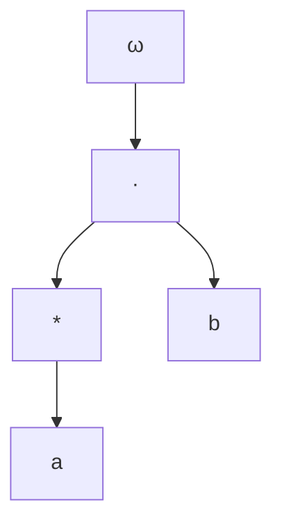

# 算子代数：ω代数及其表示

## 1.背景介绍

在计算机科学和形式语言理论中,算子代数是一种用于描述和操作正则语言的代数系统。它由一组基本运算和一组代数律组成,可以用来表示和操作正则语言。ω代数是算子代数的一种扩展形式,它引入了一个新的运算符ω,用于表示无限重复的语言。

ω代数不仅在理论计算机科学中具有重要意义,而且在多个应用领域也有广泛的应用,例如程序验证、模型检查、自动机理论和形式语言处理等。它为研究无限行为系统提供了一种代数框架,并为解决相关问题提供了有力的工具。

## 2.核心概念与联系

### 2.1 正则语言和有限自动机

正则语言是由有限个基本符号按照一定规则构成的语言集合。它们可以用有限自动机来表示和识别。有限自动机是一种抽象的计算模型,由有限个状态、输入符号、转移函数和接受状态组成。

正则语言和有限自动机之间存在着紧密的联系:一个正则语言对应一个有限自动机,反之亦然。这种对应关系被称为Kleene定理,它为算子代数的发展奠定了基础。

### 2.2 算子代数基本运算

算子代数由以下几个基本运算组成:

- 并运算 (∪): 表示两个语言的并集。
- 连接运算 (·): 表示两个语言的级联。
- 闭包运算 (*): 表示一个语言的无限重复。
- 空集 (∅): 表示不包含任何字符串的语言。
- 空字 (ε): 表示只包含空字符串的语言。

这些运算可以用来构造和操作正则语言。

### 2.3 ω代数与无限行为

ω代数在算子代数的基础上引入了ω运算符,用于表示无限重复的语言。对于任何语言L,Lω表示L的无限重复,即L(L)ω。

ω运算符的引入使得ω代数能够表示和操作无限行为系统,如并发程序、反应系统和实时系统等。这为研究这些系统的动态行为提供了代数工具。

## 3.核心算法原理具体操作步骤

### 3.1 ω代数的形式定义

ω代数可以形式化地定义为一个代数系统 (Σ, L, Ω),其中:

- Σ是一个有限字母表,表示系统的输入符号集合。
- L是正则语言集合,表示有限行为。
- Ω是ω代数的运算集合,包括并运算 (∪)、连接运算 (·)、闭包运算 (*)和ω运算。

ω代数的语言由以下三个部分构成:

1. 基本语言:包括空集 (∅)、空字 (ε)和所有单个符号 (a ∈ Σ)构成的语言。
2. 有限语言:通过并运算、连接运算和闭包运算从基本语言构造而来的正则语言。
3. ω语言:通过ω运算从有限语言构造而来的无限语言。

### 3.2 ω代数的运算规则

ω代数的运算规则如下:

1. 并运算 (∪):
   - L ∪ ∅ = L
   - L ∪ (M ∪ N) = (L ∪ M) ∪ N
   - L ∪ M = M ∪ L

2. 连接运算 (·):
   - L · ∅ = ∅ · L = ∅
   - L · (M · N) = (L · M) · N
   - L · (M ∪ N) = (L · M) ∪ (L · N)
   - (M ∪ N) · L = (M · L) ∪ (N · L)

3. 闭包运算 (*):
   - L* = ε ∪ L ∪ L · L ∪ L · L · L ∪ ...
   - (L ∪ M)* = (L* · M*)*
   - (L · M)* = L · (M · L)*

4. ω运算:
   - Lω = L · Lω
   - (L ∪ M)ω = Lω ∪ (L* · Mω)
   - (L · M)ω = L · (M · L)ω

这些运算规则确保了ω代数的封闭性,即运算的结果仍然是ω代数中的语言。

### 3.3 ω代数的等价性

在ω代数中,两个表达式可能表示相同的语言。判断两个表达式是否等价是ω代数中一个重要的问题。

等价性可以通过代数等式推导来判断。例如,对于任何语言L和M,我们有:

$$L · Mω = (L · M)ω$$

这个等式表明,语言L重复M的无限次,等价于先连接L和M,然后对结果进行无限重复。

通过建立一系列等价变换规则,我们可以简化ω代数表达式,并判断两个表达式是否等价。

## 4.数学模型和公式详细讲解举例说明

### 4.1 ω代数的语法树表示

ω代数表达式可以用语法树来表示,每个节点对应一个运算符,叶子节点对应基本语言。例如,表达式 $(a^* \cdot b)^\omega$ 的语法树如下:



语法树提供了一种直观的方式来表示和操作ω代数表达式。

### 4.2 ω代数的矩阵表示

ω代数也可以用矩阵来表示。对于一个有限自动机M = (Q, Σ, δ, q0, F),我们可以构造一个转移矩阵 $A_M$,其中 $A_M(p, q)$ 表示从状态p到状态q的转移标号。

对于ω语言 $L^\omega$,我们可以构造一个矩阵 $B_L$,其中 $B_L(p, q)$ 表示从状态p到状态q的标号串属于L。

则 $L^\omega$ 可以表示为:

$$L^\omega = \bigcup_{n \geq 0} (B_L)^n$$

这种矩阵表示为ω代数的分析和操作提供了代数工具。

### 4.3 ω代数与正则表达式的等价性

ω代数与经典的正则表达式存在等价关系。对于任何ω代数表达式E,我们可以构造一个等价的正则表达式R,使得E和R表示相同的语言。

例如,对于ω代数表达式 $(a^* \cdot b)^\omega$,等价的正则表达式为:

$$R = (a^* \cdot b)^+ \cdot a^*$$

这种等价性为ω代数的应用提供了便利,因为我们可以利用正则表达式的工具和技术来处理ω代数。

## 5.项目实践:代码实例和详细解释说明

为了更好地理解ω代数及其应用,我们可以通过编程实现一个ω代数表达式求值器。下面是一个使用Python实现的示例代码:

```python
from typing import Set

# 定义正则语言和ω语言的类型
Language = Set[str]
OmegaLanguage = Set[str]

# 基本语言构造函数
def empty() -> Language:
    return set()

def epsilon() -> Language:
    return {""}

def symbol(a: str) -> Language:
    return {a}

# 正则语言运算
def union(L1: Language, L2: Language) -> Language:
    return L1.union(L2)

def concat(L1: Language, L2: Language) -> Language:
    return {s1 + s2 for s1 in L1 for s2 in L2}

def star(L: Language) -> Language:
    prev = empty()
    curr = epsilon()
    while curr != prev:
        prev = curr
        curr = union(curr, concat(prev, L))
    return curr

# ω运算
def omega(L: Language) -> OmegaLanguage:
    result = set()
    prev = empty()
    curr = L
    while curr != prev:
        result.update(curr)
        prev = curr
        curr = concat(curr, L)
    return result

# 示例用法
L1 = star(symbol("a"))
L2 = symbol("b")
L3 = concat(L1, L2)
L_omega = omega(L3)
print(L_omega)
```

在这个示例中,我们首先定义了正则语言和ω语言的类型,然后实现了基本语言构造函数和正则语言运算。接下来,我们实现了ω运算,它通过不断连接语言本身,直到达到不动点,从而构造出ω语言。

最后,我们给出了一个示例用法,计算了语言 $(a^* \cdot b)^\omega$ 的结果。

这个示例代码展示了如何使用Python实现ω代数的基本运算和ω运算。通过编程实践,我们可以更好地理解ω代数的概念和原理,并探索其在实际应用中的潜力。

## 6.实际应用场景

ω代数在多个领域都有重要的应用,包括但不限于:

1. **程序验证**: ω代数可用于验证并发程序和反应系统的正确性。通过建模程序的行为为ω语言,我们可以使用ω代数的工具和技术来验证程序是否满足期望的性质。

2. **模型检查**: 模型检查是一种自动化验证技术,用于检查系统模型是否满足给定的规格。ω代数为建模无限行为系统提供了代数框架,因此可以应用于模型检查中。

3. **自动机理论**: ω代数与自动机理论密切相关。ω自动机是一种扩展的有限自动机模型,可以识别ω语言。ω代数为研究ω自动机的性质和操作提供了代数工具。

4. **形式语言处理**: ω代数可用于处理和操作无限长度的字符串,如无限制上下文语言和ω上下文无关语言。这在自然语言处理和编译器构造等领域有潜在应用。

5. **实时系统**: 实时系统通常需要处理无限执行序列,ω代数为建模和分析这些系统提供了代数框架。

6. **信号处理**: ω代数可用于表示和操作无限长度的信号序列,因此在数字信号处理领域有应用前景。

总的来说,ω代数为研究和操作无限行为系统提供了一种代数工具,在多个领域都有广泛的应用潜力。

## 7.工具和资源推荐

对于想要深入学习和使用ω代数的读者,以下是一些推荐的工具和资源:

1. **MONA工具**: MONA是一个用于操作和决策ω代数的工具,支持ω自动机和ω正则表达式。它提供了图形界面和命令行界面,可用于教学和研究。

2. **Büchi自动机在线工具**: 这个在线工具允许用户构建和操作Büchi自动机,一种用于识别ω语言的自动机模型。它提供了直观的可视化界面和多种操作选项。

3. **ω代数在线课程**: 一些知名大学和在线教育平台提供了关于ω代数的在线课程,如斯坦福大学的"自动机理论"课程和Coursera上的"形式概念分析"课程。

4. **ω代数书籍和论文**: 有多本专门介绍ω代数理论和应用的书籍和论文,如"Automata on Infinite Words"和"Omega-Automata"等。这些资源对于深入学习ω代数非常有帮助。

5. **ω代数相关会议和期刊**: 一些顶级计算机科学会议和期刊,如LICS、CAV和TOPLAS等,经常发表关于ω代数及其应用的最新研究成果。

6. **开源代码库**: 一些开源代码库,如Python的Automata库和Java的Brics自动机库,提供了ω代数和相关自动机模型的实现,可用于学习和开发。

利用这些工具和资源,读者可以更深入地学习ω代数的理论基础,掌握相关的工具和技术,并探索ω代数在不同领域的应用。

## 8.总结:未来发展趋势与挑战

ω代数为研究和操作无限行为系统提供了一种代数框架,在多个领域都有广泛的应用前景。然而,ω代数理论和应用也面临一些挑战和发展方向:

1. **决策问题**: 虽然ω代数为无限行为系统建模提供了工具,但一些关于ω语言的决策问题仍然是