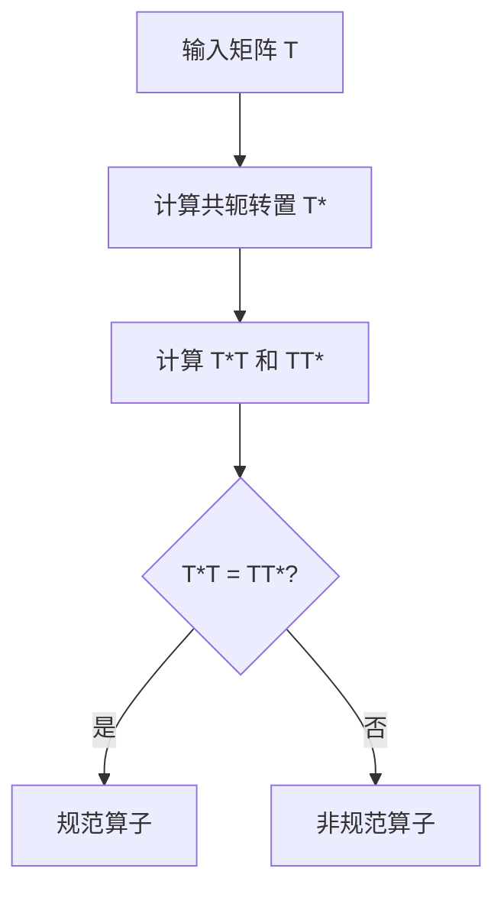

# 线性代数导引：规范算子

## 1.背景介绍

线性代数是现代数学和计算机科学的基石之一，其应用范围广泛，从数据分析、机器学习到计算机图形学等领域。规范算子（Normal Operator）是线性代数中的一个重要概念，广泛应用于量子力学、信号处理和数值分析等领域。本文将深入探讨规范算子的核心概念、算法原理、数学模型及其实际应用。

## 2.核心概念与联系

### 2.1 线性变换与矩阵

线性变换是线性代数的基本概念之一，它将一个向量空间中的向量映射到另一个向量空间。矩阵是表示线性变换的工具，通过矩阵乘法可以实现向量的线性变换。

### 2.2 规范算子的定义

规范算子是指在复数域上，满足 $T^*T = TT^*$ 的线性算子，其中 $T^*$ 是 $T$ 的共轭转置。规范算子包括自伴算子（Hermitian Operator）、酉算子（Unitary Operator）和正交算子（Orthogonal Operator）等。

### 2.3 规范算子与特征值

规范算子的特征值具有特殊性质，例如自伴算子的特征值是实数，酉算子的特征值在单位圆上。这些性质在实际应用中具有重要意义。

## 3.核心算法原理具体操作步骤

### 3.1 计算共轭转置

共轭转置是规范算子定义中的关键步骤。对于一个矩阵 $A$，其共轭转置 $A^*$ 是将 $A$ 的转置矩阵中的每个元素取共轭。

### 3.2 验证规范性

验证一个算子是否为规范算子，需要检查 $T^*T = TT^*$ 是否成立。具体步骤如下：

1. 计算 $T^*$。
2. 计算 $T^*T$ 和 $TT^*$。
3. 比较 $T^*T$ 和 $TT^*$ 是否相等。

### 3.3 特征值分解

特征值分解是分析规范算子的常用方法。通过特征值分解，可以将矩阵分解为特征向量和特征值的乘积，从而简化计算。



## 4.数学模型和公式详细讲解举例说明

### 4.1 规范算子的数学定义

规范算子 $T$ 满足 $T^*T = TT^*$。例如，考虑一个 $2 \times 2$ 的复数矩阵 $T$：

$$
T = \begin{pmatrix}
a & b \\
c & d
\end{pmatrix}
$$

其共轭转置 $T^*$ 为：

$$
T^* = \begin{pmatrix}
\overline{a} & \overline{c} \\
\overline{b} & \overline{d}
\end{pmatrix}
$$

验证 $T$ 是否为规范算子需要检查 $T^*T$ 和 $TT^*$ 是否相等。

### 4.2 特征值分解

特征值分解是将矩阵 $T$ 分解为 $T = PDP^{-1}$，其中 $P$ 是特征向量矩阵，$D$ 是对角矩阵，包含特征值。对于规范算子，特征值具有特殊性质。

### 4.3 示例

考虑矩阵 $T$：

$$
T = \begin{pmatrix}
1 & i \\
-i & 1
\end{pmatrix}
$$

其共轭转置 $T^*$ 为：

$$
T^* = \begin{pmatrix}
1 & -i \\
i & 1
\end{pmatrix}
$$

计算 $T^*T$ 和 $TT^*$：

$$
T^*T = \begin{pmatrix}
1 & -i \\
i & 1
\end{pmatrix}
\begin{pmatrix}
1 & i \\
-i & 1
\end{pmatrix}
= \begin{pmatrix}
2 & 0 \\
0 & 2
\end{pmatrix}
$$

$$
TT^* = \begin{pmatrix}
1 & i \\
-i & 1
\end{pmatrix}
\begin{pmatrix}
1 & -i \\
i & 1
\end{pmatrix}
= \begin{pmatrix}
2 & 0 \\
0 & 2
\end{pmatrix}
$$

因此，$T^*T = TT^*$，$T$ 是规范算子。

## 5.项目实践：代码实例和详细解释说明

### 5.1 Python 实现

以下是一个使用 Python 实现规范算子验证的示例代码：

```python
import numpy as np

def is_normal_operator(matrix):
    conjugate_transpose = np.conjugate(matrix.T)
    return np.allclose(np.dot(conjugate_transpose, matrix), np.dot(matrix, conjugate_transpose))

# 示例矩阵
T = np.array([[1, 1j], [-1j, 1]])

# 验证是否为规范算子
if is_normal_operator(T):
    print("矩阵 T 是规范算子")
else:
    print("矩阵 T 不是规范算子")
```

### 5.2 代码解释

1. 导入 `numpy` 库，用于矩阵运算。
2. 定义 `is_normal_operator` 函数，计算矩阵的共轭转置，并验证 $T^*T$ 和 $TT^*$ 是否相等。
3. 创建示例矩阵 $T$。
4. 调用 `is_normal_operator` 函数，验证矩阵 $T$ 是否为规范算子。

## 6.实际应用场景

### 6.1 量子力学

在量子力学中，规范算子用于描述量子态的演化和测量。自伴算子对应于可观测量，其特征值表示测量结果。

### 6.2 信号处理

在信号处理领域，规范算子用于滤波器设计和信号变换。酉算子用于傅里叶变换和小波变换等。

### 6.3 数值分析

在数值分析中，规范算子用于求解线性方程组和特征值问题。规范算子的特征值分解可以简化计算，提高计算效率。

## 7.工具和资源推荐

### 7.1 软件工具

- **NumPy**：Python 的科学计算库，提供矩阵运算和线性代数函数。
- **MATLAB**：强大的数学计算软件，广泛用于工程和科学计算。
- **SciPy**：Python 的科学计算库，扩展了 NumPy 的功能，提供更多的线性代数工具。

### 7.2 在线资源

- **Khan Academy**：提供免费的线性代数课程和视频教程。
- **MIT OpenCourseWare**：麻省理工学院的开放课程，包含线性代数的详细讲解。
- **Coursera**：提供多种线性代数和数学课程，由顶尖大学和机构提供。

## 8.总结：未来发展趋势与挑战

### 8.1 发展趋势

随着计算能力的提升和数据量的增加，线性代数和规范算子的应用将更加广泛。量子计算的发展也将推动规范算子在量子信息处理中的应用。

### 8.2 挑战

尽管规范算子在理论上具有重要意义，但在实际应用中，计算复杂度和数值稳定性仍然是挑战。如何高效地计算大规模矩阵的特征值分解是一个亟待解决的问题。

## 9.附录：常见问题与解答

### 9.1 什么是规范算子？

规范算子是满足 $T^*T = TT^*$ 的线性算子，包括自伴算子、酉算子和正交算子等。

### 9.2 如何验证一个算子是否为规范算子？

通过计算算子的共轭转置，并验证 $T^*T$ 和 $TT^*$ 是否相等。

### 9.3 规范算子有哪些实际应用？

规范算子广泛应用于量子力学、信号处理和数值分析等领域。

### 9.4 规范算子的特征值有何特殊性质？

自伴算子的特征值是实数，酉算子的特征值在单位圆上，这些性质在实际应用中具有重要意义。

---

作者：禅与计算机程序设计艺术 / Zen and the Art of Computer Programming