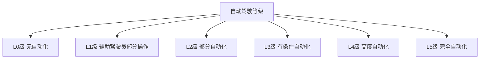
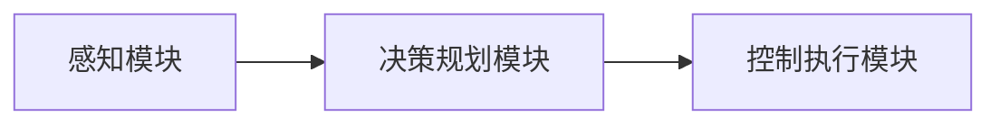

# 自动驾驶(Autonomous Driving)原理与代码实战案例讲解

## 1.背景介绍

### 1.1 自动驾驶的概念

自动驾驶(Autonomous Driving)是指汽车能够在没有人工干预的情况下,自主感知周围环境、决策规划行驶路线并控制车辆的行为。它集成了环境感知、决策规划、车辆控制等多项尖端技术,是人工智能、机器视觉、机器学习等多个领域技术的综合应用。

### 1.2 自动驾驶的发展历程

自动驾驶技术的发展经历了漫长的过程。早在20世纪60年代,通用汽车公司就开发了一款半自动驾驶汽车。21世纪以来,谷歌、特斯拉、百度、小马智行等科技公司和传统车企纷纷投入自动驾驶领域,推动了这项技术的快速发展。

### 1.3 自动驾驶的重要意义

自动驾驶技术有望彻底改变交通出行方式,提高道路交通效率,减少交通事故,节省能源并为残障人士提供无障碍出行。它被认为是继电动车之后,汽车产业的又一次革命性变革。

## 2.核心概念与联系

### 2.1 自动驾驶等级划分

根据自动化程度的不同,自动驾驶技术可分为6个等级:

- L0级:无自动化
- L1级:辅助驾驶员部分操作
- L2级:部分自动化
- L3级:有条件自动化
- L4级:高度自动化
- L5级:完全自动化,无需人工干预



### 2.2 自动驾驶系统架构

一个典型的自动驾驶系统主要由三大模块组成:

1. **感知模块**:通过激光雷达、摄像头等传感器获取车辆周围环境信息。
2. **决策规划模块**:基于感知信息,运用决策算法规划车辆的行驶路线。
3. **控制执行模块**:控制执行系统根据规划的路线控制车辆的实际操作。



### 2.3 关键技术

自动驾驶涉及多项关键技术:

- 环境感知技术:激光雷达、摄像头等传感器融合
- 高精度地图及定位技术
- 决策规划算法:行为决策、轨迹规划等
- 控制执行技术:纵向控制、横向控制
- 功能安全与测试验证技术

## 3.核心算法原理具体操作步骤

### 3.1 环境感知算法

#### 3.1.1 障碍物检测与跟踪

1) 点云聚类分割
2) 基于深度学习的2D/3D目标检测
3) 数据关联跟踪算法(如卡尔曼滤波、PMHT等)

#### 3.1.2 语义分割

1) 基于全卷积神经网络的像素级语义分割
2) 实例分割算法(如Mask R-CNN)

#### 3.1.3 3D环境建模

1) 基于激光雷达的3D点云重建
2) 基于视觉的3D重建(如SLAM、SfM等)

### 3.2 决策规划算法

#### 3.2.1 行为决策

1) 基于规则的状态机决策
2) 基于成本场景的决策
3) 基于强化学习的决策

#### 3.2.2 路径规划

1) 采样式路径规划(如RRT、RRT*等)
2) 非采样式路径规划(如A*、Hybrid A*等)

#### 3.2.3 轨迹规划

1) 多项式曲线拟合
2) 最优控制理论(如MPC等)

### 3.3 控制执行算法

#### 3.3.1 纵向控制

1) PID控制
2) 模型预测控制(MPC)
3) 自适应巡航控制(ACC)

#### 3.3.2 横向控制  

1) 纯追踪控制
2) 线性二次型控制器(LQR)
3) 模型预测控制(MPC)

## 4.数学模型和公式详细讲解举例说明

### 4.1 卡尔曼滤波

卡尔曼滤波是一种有效的最优估计算法,常用于目标跟踪。它通过预测和更新两个步骤递归地估计目标的状态。

状态方程:

$$x_k = Fx_{k-1} + Bu_k + w_k$$

测量方程:

$$z_k = Hx_k + v_k$$

其中:
- $x_k$是时刻k的状态向量
- $z_k$是时刻k的测量值
- $F$是状态转移矩阵
- $B$是控制矩阵
- $u_k$是控制输入
- $w_k$是过程噪声
- $v_k$是测量噪声

### 4.2 采样式路径规划RRT

RRT(Rapidly-exploring Random Tree)是一种高效的采样式路径规划算法。它通过在配置空间中随机生成节点并不断延伸生成树,最终连接起点和终点。

算法步骤:

1) 初始化树T只有起点节点
2) 随机采样一个节点$q_{rand}$
3) 在T中找到距离$q_{rand}$最近的节点$q_{near}$  
4) 从$q_{near}$延伸出一条新的边,得到新节点$q_{new}$
5) 将$q_{new}$加入T
6) 重复2-5步,直到找到连接终点的路径或达到最大迭代次数

### 4.3 模型预测控制MPC

MPC(Model Predictive Control)是一种优化控制算法,通过求解一个有约束的优化问题,预测未来的状态和控制输出序列。

代价函数:

$$J = \sum_{k=0}^{N_p} \left\|y(k+1) - r(k+1)\right\|_Q^2 + \sum_{k=0}^{N_c-1} \left\|u(k)\right\|_R^2$$

约束条件:

$$x(k+1) = f(x(k), u(k))$$
$$u_{min} \le u(k) \le u_{max}$$

其中:
- $N_p$为预测步长
- $N_c$为控制步长 
- $y$为输出
- $r$为期望输出
- $u$为控制输入
- $Q$和$R$为权重矩阵
- $f$为系统模型方程

## 5.项目实践:代码实例和详细解释说明  

以下是一个基于Python和OpenCV实现的简单车道线检测示例:

```python
import cv2
import numpy as np

def detect_lane(image):
    # 转换为灰度图像
    gray = cv2.cvtColor(image, cv2.COLOR_BGR2GRAY)
    
    # 高斯滤波
    blur = cv2.GaussianBlur(gray, (5, 5), 0)
    
    # 边缘检测
    edges = cv2.Canny(blur, 50, 150)
    
    # 设置感兴趣区域
    height = image.shape[0]
    width = image.shape[1]
    mask = np.zeros_like(edges)
    polygon = np.array([[
        (0, height),
        (width // 2 - 100, height // 2),
        (width // 2 + 100, height // 2),
        (width, height)
    ]], np.int32)
    cv2.fillPoly(mask, polygon, 255)
    cropped_edges = cv2.bitwise_and(edges, mask)
    
    # 检测直线
    lines = cv2.HoughLinesP(cropped_edges, 1, np.pi/180, 100, np.array([]), minLineLength=100, maxLineGap=10)
    
    # 绘制车道线
    lane_image = np.zeros_like(image)
    if lines is not None:
        for line in lines:
            x1, y1, x2, y2 = line.reshape(4)
            cv2.line(lane_image, (x1, y1), (x2, y2), (0, 255, 0), 10)
            
    # 合并原始图像和车道线
    output = cv2.addWeighted(image, 0.8, lane_image, 1, 1)
    return output
```

代码解释:

1. 首先将输入图像转换为灰度图像,并应用高斯滤波去除噪声。
2. 使用Canny算子进行边缘检测,得到二值化的边缘图像。
3. 设置感兴趣区域(ROI),只保留道路区域的边缘信息。
4. 使用霍夫线变换检测直线,得到代表车道线的线段集合。
5. 在一张空白图像上绘制检测到的车道线。
6. 将绘制好的车道线图像与原始图像进行加权融合,得到最终输出图像。

该示例只是一个简单的车道线检测实现,实际的自动驾驶系统需要结合多种感知技术和复杂的决策规划算法。

## 6.实际应用场景

自动驾驶技术在以下场景有着广阔的应用前景:

### 6.1 智能网约车服务

无人驾驶网约车可提供安全、高效、经济的出行服务,满足不同群体的出行需求。

### 6.2 物流运输

无人驾驶卡车可实现远程集中调度,提高运输效率,降低人力成本。

### 6.3 环境感知与地图构建

自动驾驶车辆搭载的传感器可用于高精度三维环境建模和地图构建。

### 6.4 智慧城市

自动驾驶系统可为智慧城市提供移动数据采集、环境监测等多方面支持。

### 6.5 残障人士无障碍出行

自动驾驶汽车为残障人士提供安全、方便的出行方式,提高生活质量。

## 7.工具和资源推荐

### 7.1 开源工具

- Autoware: 一款流行的自动驾驶开源软件套件
- Apollo: 百度自动驾驶开源平台
- OpenPilot: 一款开源的ADAS和自动驾驶系统

### 7.2 开发平台

- NVIDIA DRIVE: 用于自动驾驶开发的硬件和软件平台
- Baidu Apollo Cyber RT: 百度自动驾驶参考设计

### 7.3 数据集

- KITTI: 著名的自动驾驶数据集
- Waymo Open Dataset: 谷歌无人车开源数据集
- Argoverse: 来自Argo AI的自动驾驶数据集

### 7.4 在线课程

- 来自斯坦福大学的自动驾驶纳米学位课程
- Udacity自动驾驶工程师纳米学位课程
- edX的自动驾驶课程

## 8.总结:未来发展趋势与挑战

### 8.1 发展趋势

- 自动驾驶技术日趋成熟,商业化进程加快
- 自动驾驶与5G、V2X等技术融合,实现车联网
- 自动驾驶将进一步推动智能交通和智慧城市建设

### 8.2 面临的挑战

- 提高环境感知、决策规划、控制执行的鲁棒性和可靠性
- 解决自动驾驶在复杂场景下的决策困难
- 制定完善的法律法规,加强测试验证
- 提高自动驾驶系统的可解释性和透明度
- 保护用户隐私和数据安全

## 9.附录:常见问题与解答

### 9.1 自动驾驶汽车如何检测和识别障碍物?

自动驾驶汽车通常使用激光雷达、摄像头等多种传感器融合,结合点云聚类、目标检测和跟踪等算法来检测和识别障碍物。

### 9.2 自动驾驶汽车如何做出智能决策?

决策系统通常采用状态机、成本场景分析、强化学习等方法,结合车辆状态、道路信息、障碍物等多种因素,选择最优的行驶策略。

### 9.3 自动驾驶汽车如何保证行车安全?

安全是自动驾驶的核心要求。系统需要通过冗余设计、功能安全管理、测试验证等多种手段来确保行车安全。

### 