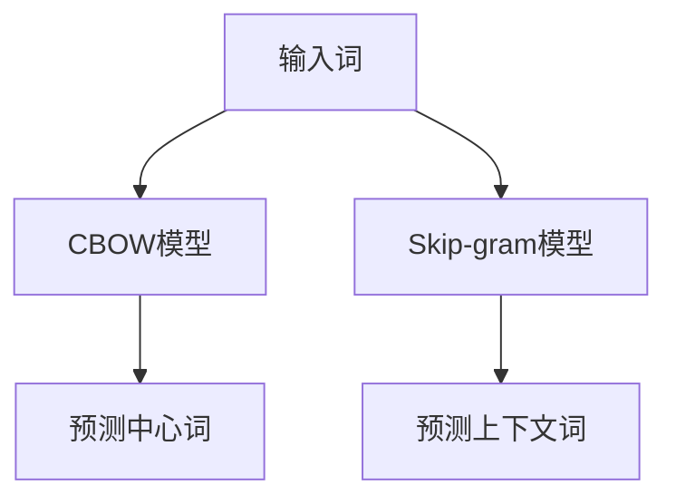
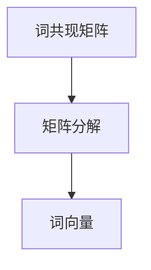
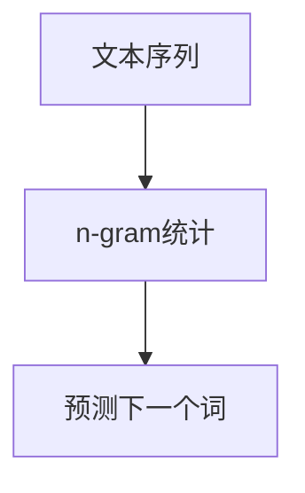
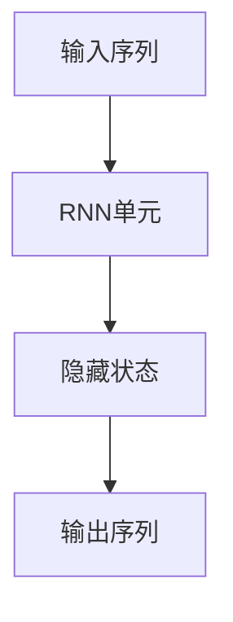
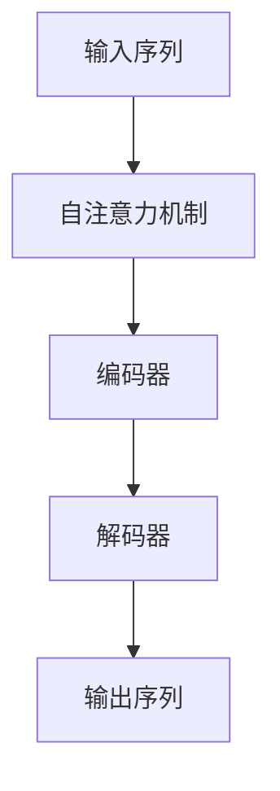

# 自然语言处理在AI工作流中的应用与挑战

## 1.背景介绍

自然语言处理（NLP）是人工智能（AI）领域中一个重要的分支，旨在使计算机能够理解、解释和生成人类语言。随着大数据和深度学习技术的快速发展，NLP在各个行业中的应用越来越广泛，从搜索引擎、智能助手到医疗诊断和金融分析，NLP技术正在改变我们的生活和工作方式。

在AI工作流中，NLP的应用不仅限于文本处理，还包括语音识别、情感分析、机器翻译等多个方面。本文将深入探讨NLP在AI工作流中的应用与挑战，帮助读者更好地理解这一领域的核心概念、算法原理、数学模型、实际应用场景以及未来的发展趋势。

## 2.核心概念与联系

### 2.1 自然语言处理的定义

自然语言处理是计算机科学、人工智能和语言学的交叉学科，主要研究如何使计算机能够处理和理解人类语言。NLP的主要任务包括但不限于：

- 语言模型：预测文本序列中的下一个词或字符。
- 词嵌入：将词语映射到高维向量空间中。
- 句法分析：分析句子的语法结构。
- 语义分析：理解句子的含义。
- 情感分析：判断文本的情感倾向。
- 机器翻译：将一种语言翻译成另一种语言。

### 2.2 NLP与AI工作流的联系

在AI工作流中，NLP通常作为数据预处理、特征提取和模型训练的一部分。以下是NLP在AI工作流中的几个关键环节：

- 数据预处理：包括文本清洗、分词、去停用词等。
- 特征提取：将文本数据转换为数值特征，如词频、TF-IDF、词嵌入等。
- 模型训练：使用提取的特征训练机器学习或深度学习模型。
- 模型评估：评估模型的性能，如准确率、召回率、F1分数等。
- 模型部署：将训练好的模型部署到生产环境中，进行实时预测或分析。

## 3.核心算法原理具体操作步骤

### 3.1 词嵌入（Word Embedding）

词嵌入是NLP中的一种技术，用于将词语映射到高维向量空间中，使得相似的词语在向量空间中距离较近。常见的词嵌入方法包括Word2Vec、GloVe和FastText。

#### 3.1.1 Word2Vec

Word2Vec是一种基于神经网络的词嵌入方法，主要有两种模型：CBOW（Continuous Bag of Words）和Skip-gram。

- CBOW：通过上下文词预测中心词。
- Skip-gram：通过中心词预测上下文词。



#### 3.1.2 GloVe

GloVe（Global Vectors for Word Representation）是一种基于全局词共现矩阵的词嵌入方法，通过矩阵分解得到词向量。



### 3.2 语言模型（Language Model）

语言模型用于预测文本序列中的下一个词或字符。常见的语言模型包括n-gram模型、RNN（循环神经网络）和Transformer。

#### 3.2.1 n-gram模型

n-gram模型通过统计n个连续词的共现频率来预测下一个词。



#### 3.2.2 RNN

RNN是一种能够处理序列数据的神经网络，通过循环结构捕捉序列中的依赖关系。



#### 3.2.3 Transformer

Transformer是一种基于自注意力机制的模型，能够并行处理序列数据，显著提高了训练效率和效果。



## 4.数学模型和公式详细讲解举例说明

### 4.1 词嵌入数学模型

#### 4.1.1 Word2Vec

Word2Vec的目标是最大化目标词和上下文词的共现概率。对于CBOW模型，其目标函数为：

$$
J = - \sum_{t=1}^{T} \log P(w_t | w_{t-m}, \ldots, w_{t-1}, w_{t+1}, \ldots, w_{t+m})
$$

其中，$w_t$ 是目标词，$w_{t-m}, \ldots, w_{t-1}, w_{t+1}, \ldots, w_{t+m}$ 是上下文词。

#### 4.1.2 GloVe

GloVe的目标是通过最小化词共现矩阵的重构误差来学习词向量。其目标函数为：

$$
J = \sum_{i,j=1}^{V} f(X_{ij}) (w_i^T \tilde{w}_j + b_i + \tilde{b}_j - \log X_{ij})^2
$$

其中，$X_{ij}$ 是词 $i$ 和词 $j$ 的共现次数，$w_i$ 和 $\tilde{w}_j$ 是词向量，$b_i$ 和 $\tilde{b}_j$ 是偏置项，$f(X_{ij})$ 是权重函数。

### 4.2 语言模型数学模型

#### 4.2.1 n-gram模型

n-gram模型通过统计n个连续词的共现频率来预测下一个词。其概率计算公式为：

$$
P(w_t | w_{t-n+1}, \ldots, w_{t-1}) = \frac{C(w_{t-n+1}, \ldots, w_{t-1}, w_t)}{C(w_{t-n+1}, \ldots, w_{t-1})}
$$

其中，$C(w_{t-n+1}, \ldots, w_{t-1}, w_t)$ 是n-gram的共现次数，$C(w_{t-n+1}, \ldots, w_{t-1})$ 是前n-1个词的共现次数。

#### 4.2.2 RNN

RNN通过循环结构捕捉序列中的依赖关系。其隐藏状态更新公式为：

$$
h_t = \sigma(W_h h_{t-1} + W_x x_t + b)
$$

其中，$h_t$ 是当前隐藏状态，$h_{t-1}$ 是前一时刻的隐藏状态，$x_t$ 是当前输入，$W_h$ 和 $W_x$ 是权重矩阵，$b$ 是偏置项，$\sigma$ 是激活函数。

#### 4.2.3 Transformer

Transformer通过自注意力机制捕捉序列中的依赖关系。其自注意力计算公式为：

$$
\text{Attention}(Q, K, V) = \text{softmax}\left(\frac{QK^T}{\sqrt{d_k}}\right) V
$$

其中，$Q$ 是查询矩阵，$K$ 是键矩阵，$V$ 是值矩阵，$d_k$ 是键向量的维度。

## 5.项目实践：代码实例和详细解释说明

### 5.1 词嵌入项目实践

#### 5.1.1 Word2Vec代码实例

以下是使用Python和Gensim库实现Word2Vec的代码示例：

```python
from gensim.models import Word2Vec

# 训练数据
sentences = [["I", "love", "natural", "language", "processing"],
             ["NLP", "is", "a", "fascinating", "field"]]

# 训练Word2Vec模型
model = Word2Vec(sentences, vector_size=100, window=5, min_count=1, workers=4)

# 获取词向量
vector = model.wv['natural']
print(vector)
```

#### 5.1.2 GloVe代码实例

以下是使用Python和GloVe库实现GloVe的代码示例：

```python
from glove import Corpus, Glove

# 训练数据
sentences = [["I", "love", "natural", "language", "processing"],
             ["NLP", "is", "a", "fascinating", "field"]]

# 创建词共现矩阵
corpus = Corpus()
corpus.fit(sentences, window=5)

# 训练GloVe模型
glove = Glove(no_components=100, learning_rate=0.05)
glove.fit(corpus.matrix, epochs=30, no_threads=4, verbose=True)
glove.add_dictionary(corpus.dictionary)

# 获取词向量
vector = glove.word_vectors[glove.dictionary['natural']]
print(vector)
```

### 5.2 语言模型项目实践

#### 5.2.1 n-gram模型代码实例

以下是使用Python实现n-gram模型的代码示例：

```python
from collections import defaultdict

# 训练数据
sentences = ["I love natural language processing",
             "NLP is a fascinating field"]

# 构建n-gram模型
n = 2
ngrams = defaultdict(int)
for sentence in sentences:
    words = sentence.split()
    for i in range(len(words) - n + 1):
        ngram = tuple(words[i:i+n])
        ngrams[ngram] += 1

# 预测下一个词
context = ("natural", "language")
next_word = max(ngrams, key=lambda x: ngrams[x] if x[:-1] == context else 0)[-1]
print(next_word)
```

#### 5.2.2 RNN代码实例

以下是使用Python和TensorFlow实现RNN的代码示例：

```python
import tensorflow as tf
from tensorflow.keras.models import Sequential
from tensorflow.keras.layers import SimpleRNN, Dense

# 训练数据
sentences = ["I love natural language processing",
             "NLP is a fascinating field"]
vocab = sorted(set(" ".join(sentences)))
char2idx = {u:i for i, u in enumerate(vocab)}
idx2char = np.array(vocab)

# 数据预处理
input_text = " ".join(sentences)
input_seq = [char2idx[c] for c in input_text]
input_seq = tf.keras.preprocessing.sequence.pad_sequences([input_seq], maxlen=100, padding='post')

# 构建RNN模型
model = Sequential([
    SimpleRNN(50, input_shape=(100, len(vocab))),
    Dense(len(vocab), activation='softmax')
])

# 编译模型
model.compile(optimizer='adam', loss='sparse_categorical_crossentropy')

# 训练模型
model.fit(input_seq, input_seq, epochs=10)

# 预测下一个字符
predicted_char = idx2char[np.argmax(model.predict(input_seq))]
print(predicted_char)
```

#### 5.2.3 Transformer代码实例

以下是使用Python和TensorFlow实现Transformer的代码示例：

```python
import tensorflow as tf
from tensorflow.keras.layers import Dense, Embedding, MultiHeadAttention, LayerNormalization, Dropout

# 构建Transformer编码器层
class TransformerEncoderLayer(tf.keras.layers.Layer):
    def __init__(self, d_model, num_heads, dff, rate=0.1):
        super(TransformerEncoderLayer, self).__init__()
        self.mha = MultiHeadAttention(num_heads=num_heads, key_dim=d_model)
        self.ffn = tf.keras.Sequential([
            Dense(dff, activation='relu'),
            Dense(d_model)
        ])
        self.layernorm1 = LayerNormalization(epsilon=1e-6)
        self.layernorm2 = LayerNormalization(epsilon=1e-6)
        self.dropout1 = Dropout(rate)
        self.dropout2 = Dropout(rate)

    def call(self, x, training, mask):
        attn_output = self.mha(x, x, x, attention_mask=mask)
        attn_output = self.dropout1(attn_output, training=training)
        out1 = self.layernorm1(x + attn_output)
        ffn_output = self.ffn(out1)
        ffn_output = self.dropout2(ffn_output, training=training)
        return self.layernorm2(out1 + ffn_output)

# 构建Transformer模型
class Transformer(tf.keras.Model):
    def __init__(self, num_layers, d_model, num_heads, dff, input_vocab_size, rate=0.1):
        super(Transformer, self).__init__()
        self.embedding = Embedding(input_vocab_size, d_model)
        self.enc_layers = [TransformerEncoderLayer(d_model, num_heads, dff, rate) for _ in range(num_layers)]
        self.dropout = Dropout(rate)

    def call(self, x, training, mask):
        x = self.embedding(x)
        x = self.dropout(x, training=training)
        for i in range(len(self.enc_layers)):
            x = self.enc_layers[i](x, training, mask)
        return x

# 训练数据
sentences = ["I love natural language processing",
             "NLP is a fascinating field"]
vocab = sorted(set(" ".join(sentences)))
char2idx = {u:i for i, u in enumerate(vocab)}
input_seq = [[char2idx[c] for c in sentence] for sentence in sentences]
input_seq = tf.keras.preprocessing.sequence.pad_sequences(input_seq, maxlen=100, padding='post')

# 构建和训练Transformer模型
transformer = Transformer(num_layers=2, d_model=128, num_heads=8, dff=512, input_vocab_size=len(vocab))
transformer.compile(optimizer='adam', loss='sparse_categorical_crossentropy')
transformer.fit(input_seq, input_seq, epochs=10)

# 预测下一个字符
predicted_char = idx2char[np.argmax(transformer.predict(input_seq))]
print(predicted_char)
```

## 6.实际应用场景

### 6.1 搜索引擎

搜索引擎是NLP最早和最广泛的应用之一。通过分析用户的查询语句，搜索引擎能够理解用户的意图，并返回相关的搜索结果。NLP技术在搜索引擎中的应用包括：

- 查询理解：通过分词、词性标注、命名实体识别等技术，理解用户的查询意图。
- 文档检索：通过TF-IDF、BM25等算法，计算文档与查询的相关性。
- 排序优化：通过机器学习模型，优化搜索结果的排序。

### 6.2 智能助手

智能助手如Siri、Alexa和Google Assistant，依赖于NLP技术来理解用户的语音命令，并执行相应的操作。NLP技术在智能助手中的应用包括：

- 语音识别：将用户的语音转换为文本。
- 意图识别：通过分类模型，识别用户的意图。
- 对话管理：通过对话状态跟踪和策略优化，管理对话的流程。

### 6.3 医疗诊断

在医疗领域，NLP技术被用于电子病历分析、医学文献检索和疾病预测等方面。NLP技术在医疗诊断中的应用包括：

- 电子病历分析：通过信息抽取技术，从电子病历中提取关键信息，如病症、药物和治疗方案。
- 医学文献检索：通过语义搜索技术，帮助医生快速找到相关的医学文献。
- 疾病预测：通过机器学习模型，预测患者的疾病风险。

### 6.4 金融分析

在金融领域，NLP技术被用于情感分析、新闻分析和风险评估等方面。NLP技术在金融分析中的应用包括：

- 情感分析：通过情感分析模型，分析社交媒体和新闻中的情感倾向，预测市场走势。
- 新闻分析：通过信息抽取技术，从新闻中提取关键信息，如公司事件和市场动态。
- 风险评估：通过文本分类模型，评估企业的信用风险和市场风险。

## 7.工具和资源推荐

### 7.1 工具推荐

- **NLTK**：一个强大的Python库，提供了丰富的NLP工具和数据集。
- **spaCy**：一个高效的NLP库，支持多种语言的文本处理。
- **Gensim**：一个用于主题建模和词嵌入的Python库。
- **TensorFlow**：一个广泛使用的深度学习框架，支持多种NLP模型的实现。
- **PyTorch**：另一个流行的深度学习框架，提供了灵活的NLP模型构建工具。

### 7.2 资源推荐

- **《Speech and Language Processing》**：一本经典的NLP教材，涵盖了NLP的基本概念和算法。
- **Coursera上的NLP课程**：提供了丰富的NLP在线课程，适合初学者和进阶学习者。
- **Kaggle上的NLP竞赛**：提供了丰富的NLP数据集和竞赛，帮助学习者实践NLP技术。
- **arXiv上的NLP论文**：提供了最新的NLP研究论文，帮助研究者了解NLP领域的前沿进展。

## 8.总结：未来发展趋势与挑战

### 8.1 未来发展趋势

- **多模态学习**：结合文本、图像和语音等多种模态的数据，提升NLP