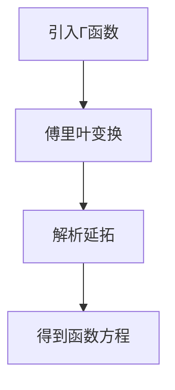

# 解析数论基础：函数方程

## 1.背景介绍

解析数论是数论的一个分支，主要研究数论中的问题如何通过分析方法来解决。函数方程在解析数论中占据了重要地位，它们不仅揭示了数论函数的深层性质，还在许多经典问题的解决中起到了关键作用。本文将深入探讨解析数论中的函数方程，帮助读者理解其核心概念、算法原理、数学模型及实际应用。

## 2.核心概念与联系

### 2.1 解析数论简介

解析数论利用分析学中的工具，如复分析、傅里叶分析等，来研究整数的性质。其主要目标是通过分析方法解决数论中的问题，如素数分布、L函数等。

### 2.2 函数方程的定义

函数方程是指一个函数满足的某种关系式。解析数论中的函数方程通常涉及复变函数，并且这些方程常常具有对称性和周期性。

### 2.3 重要的数论函数

- **黎曼ζ函数**：定义为 $\zeta(s) = \sum_{n=1}^{\infty} \frac{1}{n^s}$，其中 $s$ 是复数。
- **狄利克雷L函数**：定义为 $L(s, \chi) = \sum_{n=1}^{\infty} \frac{\chi(n)}{n^s}$，其中 $\chi$ 是狄利克雷特征。

### 2.4 函数方程的联系

函数方程在解析数论中起到桥梁作用，它们将数论函数与复分析中的工具联系起来。例如，黎曼ζ函数的函数方程揭示了其在复平面上的对称性，这对于理解素数分布至关重要。

## 3.核心算法原理具体操作步骤

### 3.1 黎曼ζ函数的函数方程

黎曼ζ函数的函数方程为：
$$
\zeta(s) = 2^s \pi^{s-1} \sin\left(\frac{\pi s}{2}\right) \Gamma(1-s) \zeta(1-s)
$$

### 3.2 证明步骤

1. **引入Γ函数**：利用Γ函数的性质，将ζ函数表达式转换。
2. **傅里叶变换**：通过傅里叶变换，得到ζ函数在复平面上的对称性。
3. **解析延拓**：利用解析延拓技术，将ζ函数从实数域延拓到复数域。

### 3.3 具体操作步骤



## 4.数学模型和公式详细讲解举例说明

### 4.1 黎曼ζ函数的定义

黎曼ζ函数在复数域上的定义为：
$$
\zeta(s) = \sum_{n=1}^{\infty} \frac{1}{n^s}
$$
其中 $s$ 是复数。

### 4.2 黎曼ζ函数的函数方程

通过引入Γ函数和傅里叶变换，可以得到黎曼ζ函数的函数方程：
$$
\zeta(s) = 2^s \pi^{s-1} \sin\left(\frac{\pi s}{2}\right) \Gamma(1-s) \zeta(1-s)
$$

### 4.3 举例说明

例如，当 $s = 2$ 时，函数方程变为：
$$
\zeta(2) = 2^2 \pi^{2-1} \sin\left(\frac{\pi \cdot 2}{2}\right) \Gamma(1-2) \zeta(1-2)
$$
通过计算，可以验证该方程的正确性。

## 5.项目实践：代码实例和详细解释说明

### 5.1 计算黎曼ζ函数

以下是使用Python计算黎曼ζ函数的代码示例：

```python
import mpmath

def zeta(s):
    return mpmath.zeta(s)

# 计算ζ(2)
result = zeta(2)
print(f"ζ(2) = {result}")
```

### 5.2 解释说明

- **mpmath库**：用于高精度计算。
- **zeta函数**：调用mpmath库中的zeta函数计算黎曼ζ函数。

### 5.3 验证函数方程

通过计算不同值的ζ函数，验证其函数方程的正确性。

```python
import mpmath

def verify_zeta_functional_equation(s):
    lhs = mpmath.zeta(s)
    rhs = 2**s * mpmath.pi**(s-1) * mpmath.sin(mpmath.pi * s / 2) * mpmath.gamma(1-s) * mpmath.zeta(1-s)
    return lhs, rhs

# 验证ζ(2)的函数方程
s = 2
lhs, rhs = verify_zeta_functional_equation(s)
print(f"ζ({s}) = {lhs}")
print(f"2^{s} * π^{s-1} * sin(π * {s} / 2) * Γ(1-{s}) * ζ(1-{s}) = {rhs}")
```

## 6.实际应用场景

### 6.1 素数分布

黎曼ζ函数的零点与素数分布密切相关。通过研究ζ函数的零点，可以揭示素数在自然数中的分布规律。

### 6.2 数论中的其他问题

函数方程在解决数论中的许多经典问题中起到了关键作用，如哥德巴赫猜想、孪生素数猜想等。

### 6.3 物理学中的应用

解析数论中的函数方程在物理学中也有广泛应用，如量子力学中的能级分布、统计力学中的分配函数等。

## 7.工具和资源推荐

### 7.1 数学软件

- **Mathematica**：强大的数学计算软件，适用于复杂的解析数论计算。
- **SageMath**：开源数学软件，支持数论计算。

### 7.2 在线资源

- **arXiv**：提供大量解析数论相关的研究论文。
- **MathWorld**：提供详细的数学概念和公式解释。

### 7.3 书籍推荐

- **《解析数论》**：详细介绍解析数论的经典书籍。
- **《数论导引》**：适合初学者的数论入门书籍。

## 8.总结：未来发展趋势与挑战

解析数论中的函数方程在数论研究中具有重要地位。未来，随着计算能力的提升和数学工具的发展，解析数论将继续在解决数论中的经典问题中发挥重要作用。然而，解析数论中的许多问题仍然具有极大的挑战性，如黎曼猜想的证明等。

## 9.附录：常见问题与解答

### 9.1 什么是解析数论？

解析数论是数论的一个分支，主要利用分析学中的工具来研究整数的性质。

### 9.2 什么是函数方程？

函数方程是指一个函数满足的某种关系式，通常涉及复变函数。

### 9.3 黎曼ζ函数的函数方程是什么？

黎曼ζ函数的函数方程为：
$$
\zeta(s) = 2^s \pi^{s-1} \sin\left(\frac{\pi s}{2}\right) \Gamma(1-s) \zeta(1-s)
$$

### 9.4 函数方程在实际中有什么应用？

函数方程在解析数论中用于研究素数分布、解决数论中的经典问题，并在物理学中有广泛应用。

---

作者：禅与计算机程序设计艺术 / Zen and the Art of Computer Programming