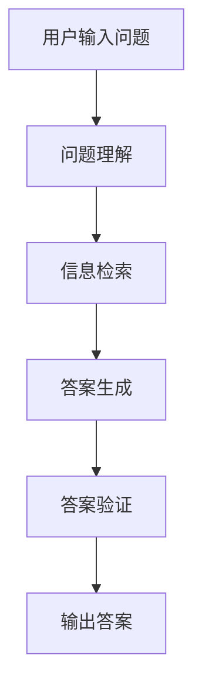

# 问答系统(Question Answering)原理与代码实战案例讲解

## 1.背景介绍

问答系统（Question Answering，QA）是自然语言处理（NLP）领域中的一个重要分支，旨在通过计算机程序自动回答用户提出的问题。随着人工智能技术的快速发展，问答系统在搜索引擎、智能助手、在线客服等领域得到了广泛应用。本文将深入探讨问答系统的核心原理、算法、数学模型，并通过实际代码示例展示其实现过程。

## 2.核心概念与联系

### 2.1 问答系统的分类

问答系统可以根据不同的标准进行分类，主要包括以下几种：

- **基于规则的问答系统**：依赖预定义的规则和模板来回答问题。
- **基于信息检索的问答系统**：通过检索相关文档并从中提取答案。
- **基于知识库的问答系统**：利用结构化的知识库（如知识图谱）来回答问题。
- **基于深度学习的问答系统**：使用深度学习模型（如BERT、GPT）来理解和生成答案。

### 2.2 问答系统的基本流程

问答系统的基本流程通常包括以下几个步骤：

1. **问题理解**：对用户输入的问题进行分析和理解。
2. **信息检索**：从文档或知识库中检索相关信息。
3. **答案生成**：从检索到的信息中生成答案。
4. **答案验证**：对生成的答案进行验证和优化。

以下是问答系统基本流程的Mermaid流程图：



## 3.核心算法原理具体操作步骤

### 3.1 问题理解

问题理解是问答系统的第一步，主要包括以下几个操作步骤：

1. **分词**：将输入的问题分解成单词或词组。
2. **词性标注**：标注每个词的词性（如名词、动词等）。
3. **命名实体识别**：识别出问题中的命名实体（如人名、地名等）。
4. **依存句法分析**：分析句子中词与词之间的依存关系。

### 3.2 信息检索

信息检索是问答系统的核心步骤之一，主要包括以下几个操作步骤：

1. **查询生成**：根据问题生成查询语句。
2. **文档检索**：使用查询语句从文档库中检索相关文档。
3. **文档排序**：根据相关性对检索到的文档进行排序。

### 3.3 答案生成

答案生成是问答系统的关键步骤，主要包括以下几个操作步骤：

1. **答案抽取**：从检索到的文档中抽取可能的答案。
2. **答案排序**：根据置信度对抽取的答案进行排序。
3. **答案生成**：生成最终的答案。

### 3.4 答案验证

答案验证是问答系统的最后一步，主要包括以下几个操作步骤：

1. **答案验证**：对生成的答案进行验证，确保其准确性。
2. **答案优化**：对答案进行优化，提高其可读性和准确性。

## 4.数学模型和公式详细讲解举例说明

### 4.1 问题理解中的数学模型

在问题理解中，常用的数学模型包括：

- **词向量模型**：将词表示为向量，如Word2Vec、GloVe等。
- **句子向量模型**：将句子表示为向量，如BERT、GPT等。

例如，使用Word2Vec模型将词表示为向量的公式为：

$$
\text{Word2Vec}(w) = \mathbf{v}_w
$$

其中，$\mathbf{v}_w$ 是词 $w$ 的向量表示。

### 4.2 信息检索中的数学模型

在信息检索中，常用的数学模型包括：

- **TF-IDF模型**：用于衡量词在文档中的重要性。
- **BM25模型**：一种改进的TF-IDF模型。

例如，TF-IDF模型的公式为：

$$
\text{TF-IDF}(t, d) = \text{TF}(t, d) \times \text{IDF}(t)
$$

其中，$\text{TF}(t, d)$ 是词 $t$ 在文档 $d$ 中的词频，$\text{IDF}(t)$ 是词 $t$ 的逆文档频率。

### 4.3 答案生成中的数学模型

在答案生成中，常用的数学模型包括：

- **注意力机制**：用于在生成答案时关注输入的不同部分。
- **序列到序列模型**：用于将输入序列转换为输出序列。

例如，注意力机制的公式为：

$$
\text{Attention}(Q, K, V) = \text{softmax}\left(\frac{QK^T}{\sqrt{d_k}}\right)V
$$

其中，$Q$ 是查询矩阵，$K$ 是键矩阵，$V$ 是值矩阵，$d_k$ 是键向量的维度。

## 5.项目实践：代码实例和详细解释说明

### 5.1 环境准备

在开始项目实践之前，我们需要准备好开发环境。本文将使用Python语言和相关的NLP库，如NLTK、spaCy、transformers等。

```bash
pip install nltk spacy transformers
```

### 5.2 问题理解代码示例

以下是一个简单的代码示例，展示如何使用spaCy进行问题理解：

```python
import spacy

# 加载spaCy模型
nlp = spacy.load("en_core_web_sm")

# 输入问题
question = "What is the capital of France?"

# 进行分词、词性标注和命名实体识别
doc = nlp(question)

# 输出结果
for token in doc:
    print(f"Token: {token.text}, POS: {token.pos_}, Entity: {token.ent_type_}")
```

### 5.3 信息检索代码示例

以下是一个简单的代码示例，展示如何使用TF-IDF模型进行信息检索：

```python
from sklearn.feature_extraction.text import TfidfVectorizer
from sklearn.metrics.pairwise import cosine_similarity

# 文档集合
documents = [
    "Paris is the capital of France.",
    "Berlin is the capital of Germany.",
    "Madrid is the capital of Spain."
]

# 输入问题
question = "What is the capital of France?"

# 生成TF-IDF矩阵
vectorizer = TfidfVectorizer()
tfidf_matrix = vectorizer.fit_transform(documents + [question])

# 计算余弦相似度
cosine_similarities = cosine_similarity(tfidf_matrix[-1], tfidf_matrix[:-1])

# 输出最相似的文档
most_similar_doc_index = cosine_similarities.argmax()
print(f"Most similar document: {documents[most_similar_doc_index]}")
```

### 5.4 答案生成代码示例

以下是一个简单的代码示例，展示如何使用BERT模型进行答案生成：

```python
from transformers import BertForQuestionAnswering, BertTokenizer
import torch

# 加载BERT模型和分词器
model = BertForQuestionAnswering.from_pretrained("bert-large-uncased-whole-word-masking-finetuned-squad")
tokenizer = BertTokenizer.from_pretrained("bert-large-uncased-whole-word-masking-finetuned-squad")

# 输入问题和文档
question = "What is the capital of France?"
context = "Paris is the capital of France."

# 进行分词
inputs = tokenizer.encode_plus(question, context, return_tensors="pt")

# 生成答案
outputs = model(**inputs)
start_scores, end_scores = outputs.start_logits, outputs.end_logits

# 获取答案的起始和结束位置
start_index = torch.argmax(start_scores)
end_index = torch.argmax(end_scores) + 1

# 输出答案
answer = tokenizer.convert_tokens_to_string(tokenizer.convert_ids_to_tokens(inputs["input_ids"][0][start_index:end_index]))
print(f"Answer: {answer}")
```

## 6.实际应用场景

问答系统在实际中有广泛的应用场景，以下是几个典型的例子：

### 6.1 搜索引擎

搜索引擎通过问答系统可以直接回答用户的问题，而不是仅仅返回相关的网页链接。例如，用户输入“法国的首都是哪里？”，搜索引擎可以直接返回“巴黎”。

### 6.2 智能助手

智能助手（如Siri、Alexa）通过问答系统可以回答用户的各种问题，从天气预报到日程安排，提高用户体验。

### 6.3 在线客服

在线客服系统通过问答系统可以自动回答用户的常见问题，减少人工客服的工作量，提高服务效率。

### 6.4 教育领域

在教育领域，问答系统可以用于自动答疑、在线考试等，帮助学生更好地学习和掌握知识。

## 7.工具和资源推荐

### 7.1 开发工具

- **Python**：问答系统开发的首选编程语言，拥有丰富的NLP库。
- **Jupyter Notebook**：方便进行代码实验和结果展示的工具。
- **VS Code**：功能强大的代码编辑器，支持多种编程语言。

### 7.2 NLP库

- **NLTK**：Python中最常用的NLP库，提供了丰富的文本处理工具。
- **spaCy**：高效的NLP库，支持多种语言的文本处理。
- **transformers**：由Hugging Face提供的库，支持多种预训练的深度学习模型。

### 7.3 数据集

- **SQuAD**：斯坦福问答数据集，是问答系统研究中最常用的数据集之一。
- **MS MARCO**：微软提供的大规模问答数据集，包含真实用户的问题和答案。

## 8.总结：未来发展趋势与挑战

问答系统作为人工智能和自然语言处理的重要应用，未来有着广阔的发展前景。以下是几个主要的趋势和挑战：

### 8.1 趋势

- **多模态问答**：结合文本、图像、视频等多种模态的信息，提供更丰富的答案。
- **个性化问答**：根据用户的历史行为和偏好，提供个性化的答案。
- **实时问答**：提高问答系统的响应速度，实现实时回答用户的问题。

### 8.2 挑战

- **数据质量**：问答系统的性能高度依赖于训练数据的质量，如何获取高质量的数据是一个挑战。
- **模型解释性**：深度学习模型的黑箱特性使得其解释性较差，如何提高模型的解释性是一个重要问题。
- **多语言支持**：问答系统需要支持多种语言，如何在多语言环境下保持高性能是一个挑战。

## 9.附录：常见问题与解答

### 9.1 问题：问答系统的性能如何评估？

问答系统的性能通常通过以下几个指标进行评估：

- **准确率**：正确回答的问题占总问题的比例。
- **召回率**：正确回答的问题占所有应答问题的比例。
- **F1值**：准确率和召回率的调和平均数。

### 9.2 问题：如何提高问答系统的准确性？

提高问答系统准确性的方法包括：

- **使用更好的预训练模型**：如BERT、GPT等。
- **增加训练数据**：使用更多的高质量训练数据进行训练。
- **优化模型参数**：通过超参数调优提高模型性能。

### 9.3 问题：问答系统如何处理多轮对话？

多轮对话问答系统需要记住上下文信息，可以使用序列到序列模型或记忆网络来实现。

### 9.4 问题：问答系统如何处理模糊问题？

处理模糊问题的方法包括：

- **使用模糊匹配算法**：如编辑距离、Jaccard相似度等。
- **增加上下文信息**：通过多轮对话获取更多的上下文信息。

### 9.5 问题：问答系统如何处理开放域问题？

开放域问答系统需要处理各种类型的问题，可以使用预训练的深度学习模型（如BERT、GPT）来提高其泛化能力。

---

作者：禅与计算机程序设计艺术 / Zen and the Art of Computer Programming