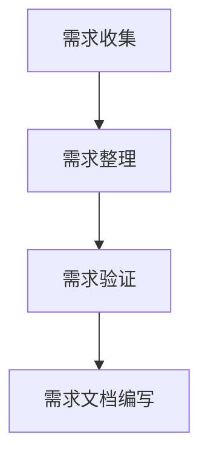
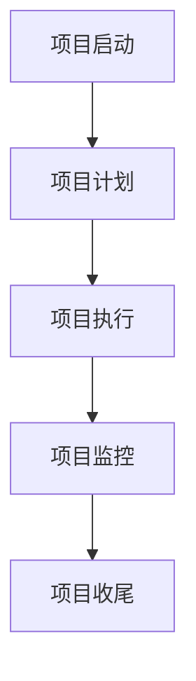

# 需求分析、项目管理、系统规划能力核心培养

## 1.背景介绍

在当今快速发展的科技时代，需求分析、项目管理和系统规划能力成为了IT从业者不可或缺的核心技能。这些能力不仅仅是技术人员的基本素养，更是项目成功与否的关键因素。本文将深入探讨如何培养这些核心能力，帮助读者在实际工作中更好地应用和提升。

## 2.核心概念与联系

### 2.1 需求分析

需求分析是指通过与客户和利益相关者的沟通，明确项目的功能和非功能需求。需求分析的准确性直接影响到项目的成功与否。

### 2.2 项目管理

项目管理是指在项目生命周期内，通过计划、组织、领导和控制等手段，确保项目按时、按质、按预算完成。项目管理包括范围管理、时间管理、成本管理、质量管理、风险管理等多个方面。

### 2.3 系统规划

系统规划是指在项目初期，通过对系统的整体架构、模块划分、技术选型等方面的规划，确保系统的可扩展性、可维护性和高性能。

### 2.4 三者的联系

需求分析、项目管理和系统规划是一个有机整体。需求分析是项目管理的基础，项目管理是系统规划的保障，而系统规划则是实现需求的手段。

## 3.核心算法原理具体操作步骤

### 3.1 需求分析的具体步骤

1. **需求收集**：通过访谈、问卷、观察等方式收集用户需求。
2. **需求整理**：将收集到的需求进行分类、整理和优先级排序。
3. **需求验证**：与用户和利益相关者确认需求的准确性和完整性。
4. **需求文档编写**：编写详细的需求规格说明书。

### 3.2 项目管理的具体步骤

1. **项目启动**：确定项目目标、范围和利益相关者。
2. **项目计划**：制定详细的项目计划，包括时间表、资源分配和风险管理计划。
3. **项目执行**：按照计划执行项目，监控进度和质量。
4. **项目监控**：定期评估项目进展，调整计划和资源。
5. **项目收尾**：完成项目交付，进行项目评估和总结。

### 3.3 系统规划的具体步骤

1. **需求分析**：基于需求分析结果，确定系统的功能和非功能需求。
2. **架构设计**：设计系统的整体架构，包括模块划分、数据流和控制流。
3. **技术选型**：选择合适的技术栈和工具。
4. **详细设计**：进行详细的模块设计和接口设计。
5. **文档编写**：编写详细的设计文档。

## 4.数学模型和公式详细讲解举例说明

### 4.1 需求分析中的数学模型

在需求分析中，常用的数学模型包括决策树、层次分析法（AHP）等。

#### 4.1.1 决策树

决策树是一种树状结构，用于决策分析。每个节点代表一个决策点，每条边代表一个决策结果。



#### 4.1.2 层次分析法（AHP）

层次分析法是一种多准则决策方法，通过构建层次结构模型，将复杂问题分解为多个层次和准则。

$$
AHP = \sum_{i=1}^{n} w_i \cdot a_i
$$

其中，$w_i$ 是第 $i$ 个准则的权重，$a_i$ 是第 $i$ 个准则的评分。

### 4.2 项目管理中的数学模型

在项目管理中，常用的数学模型包括关键路径法（CPM）、计划评审技术（PERT）等。

#### 4.2.1 关键路径法（CPM）

关键路径法是一种项目管理技术，用于确定项目的最短完成时间。



#### 4.2.2 计划评审技术（PERT）

计划评审技术是一种项目管理技术，用于估算项目的完成时间。

$$
PERT = \frac{O + 4M + P}{6}
$$

其中，$O$ 是乐观时间，$M$ 是最可能时间，$P$ 是悲观时间。

### 4.3 系统规划中的数学模型

在系统规划中，常用的数学模型包括排队论、马尔可夫链等。

#### 4.3.1 排队论

排队论是一种研究排队系统的数学模型，用于分析系统的性能和效率。

$$
L = \lambda W
$$

其中，$L$ 是系统中的平均客户数，$\lambda$ 是到达率，$W$ 是平均等待时间。

#### 4.3.2 马尔可夫链

马尔可夫链是一种随机过程，用于描述系统的状态转移。

$$
P(X_{n+1} = j | X_n = i) = P_{ij}
$$

其中，$P_{ij}$ 是从状态 $i$ 转移到状态 $j$ 的概率。

## 5.项目实践：代码实例和详细解释说明

### 5.1 需求分析的代码实例

在需求分析中，我们可以使用Python编写一个简单的需求收集和整理工具。

```python
import json

def collect_requirements():
    requirements = []
    while True:
        req = input("请输入需求（输入'结束'结束）：")
        if req == '结束':
            break
        requirements.append(req)
    return requirements

def sort_requirements(requirements):
    return sorted(requirements, key=lambda x: len(x))

def save_requirements(requirements, filename):
    with open(filename, 'w') as f:
        json.dump(requirements, f)

if __name__ == "__main__":
    requirements = collect_requirements()
    sorted_requirements = sort_requirements(requirements)
    save_requirements(sorted_requirements, 'requirements.json')
```

### 5.2 项目管理的代码实例

在项目管理中，我们可以使用Python编写一个简单的项目计划和监控工具。

```python
import datetime

class Task:
    def __init__(self, name, duration):
        self.name = name
        self.duration = duration
        self.start_date = None
        self.end_date = None

    def set_dates(self, start_date):
        self.start_date = start_date
        self.end_date = start_date + datetime.timedelta(days=self.duration)

def create_project_plan(tasks):
    start_date = datetime.date.today()
    for task in tasks:
        task.set_dates(start_date)
        start_date = task.end_date

def print_project_plan(tasks):
    for task in tasks:
        print(f"任务：{task.name}, 开始日期：{task.start_date}, 结束日期：{task.end_date}")

if __name__ == "__main__":
    tasks = [Task('需求分析', 5), Task('系统设计', 10), Task('编码', 20), Task('测试', 15)]
    create_project_plan(tasks)
    print_project_plan(tasks)
```

### 5.3 系统规划的代码实例

在系统规划中，我们可以使用Python编写一个简单的系统架构设计工具。

```python
class Module:
    def __init__(self, name):
        self.name = name
        self.submodules = []

    def add_submodule(self, submodule):
        self.submodules.append(submodule)

def print_architecture(module, indent=0):
    print(' ' * indent + module.name)
    for submodule in module.submodules:
        print_architecture(submodule, indent + 2)

if __name__ == "__main__":
    root = Module('系统')
    module1 = Module('模块1')
    module2 = Module('模块2')
    submodule1 = Module('子模块1')
    submodule2 = Module('子模块2')

    module1.add_submodule(submodule1)
    module2.add_submodule(submodule2)
    root.add_submodule(module1)
    root.add_submodule(module2)

    print_architecture(root)
```

## 6.实际应用场景

### 6.1 需求分析的实际应用

需求分析在软件开发、产品设计、市场调研等多个领域都有广泛应用。例如，在软件开发中，需求分析可以帮助开发团队明确用户需求，避免开发出不符合用户期望的产品。

### 6.2 项目管理的实际应用

项目管理在工程建设、软件开发、产品研发等多个领域都有广泛应用。例如，在工程建设中，项目管理可以帮助项目团队按时、按质、按预算完成项目，避免项目延期和超支。

### 6.3 系统规划的实际应用

系统规划在信息系统、网络架构、软件设计等多个领域都有广泛应用。例如，在信息系统中，系统规划可以帮助系统架构师设计出高性能、可扩展、易维护的系统架构。

## 7.工具和资源推荐

### 7.1 需求分析工具

1. **JIRA**：一款流行的需求管理和项目跟踪工具。
2. **Confluence**：一款用于需求文档编写和协作的工具。
3. **Trello**：一款简单易用的需求管理工具。

### 7.2 项目管理工具

1. **Microsoft Project**：一款功能强大的项目管理工具。
2. **Asana**：一款流行的项目管理和协作工具。
3. **Monday.com**：一款灵活的项目管理工具。

### 7.3 系统规划工具

1. **Enterprise Architect**：一款专业的系统架构设计工具。
2. **Lucidchart**：一款在线的系统架构设计工具。
3. **Draw.io**：一款免费的在线系统架构设计工具。

## 8.总结：未来发展趋势与挑战

### 8.1 未来发展趋势

1. **自动化**：随着人工智能和机器学习的发展，需求分析、项目管理和系统规划将越来越自动化。
2. **协作化**：随着远程办公和全球化的发展，需求分析、项目管理和系统规划将越来越协作化。
3. **智能化**：随着大数据和智能分析的发展，需求分析、项目管理和系统规划将越来越智能化。

### 8.2 挑战

1. **复杂性**：随着系统复杂性的增加，需求分析、项目管理和系统规划的难度也在增加。
2. **不确定性**：随着市场和技术的不确定性增加，需求分析、项目管理和系统规划的风险也在增加。
3. **人才短缺**：随着对高素质人才的需求增加，需求分析、项目管理和系统规划的人才短缺问题也在加剧。

## 9.附录：常见问题与解答

### 9.1 需求分析常见问题

**问题**：如何确保需求的准确性和完整性？

**解答**：通过与用户和利益相关者的反复沟通，使用原型和用户故事等工具进行需求验证。

### 9.2 项目管理常见问题

**问题**：如何应对项目中的风险？

**解答**：通过制定详细的风险管理计划，定期评估和监控风险，采取预防和应对措施。

### 9.3 系统规划常见问题

**问题**：如何设计高性能、可扩展的系统架构？

**解答**：通过合理的模块划分、技术选型和性能优化，确保系统的高性能和可扩展性。

---

作者：禅与计算机程序设计艺术 / Zen and the Art of Computer Programming