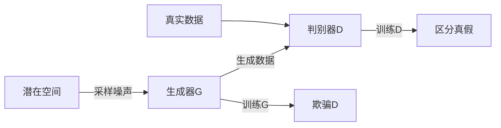

# AI Agent: AI的下一个风口 生成式AI的崛起

## 1. 背景介绍
在人工智能的发展历程中，生成式AI技术无疑是近年来最令人振奋的进展之一。从最初的简单模型到现在的复杂网络结构，生成式AI已经在图像、音频、文本等多个领域展现出了惊人的能力。它不仅能够模仿现实世界中的数据分布，还能创造出前所未有的新内容。这种能力的背后，是深度学习、强化学习等技术的快速发展和融合。

## 2. 核心概念与联系
生成式AI主要包括生成对抗网络（GANs）、变分自编码器（VAEs）、自回归模型等。这些模型的共同点在于，它们都试图学习数据的潜在分布，并能够从这个分布中采样生成新的数据实例。

### 2.1 生成对抗网络（GANs）
GANs由一个生成器和一个判别器组成，生成器负责生成数据，判别器负责判断数据是真实的还是由生成器生成的。两者相互竞争，最终达到平衡。

### 2.2 变分自编码器（VAEs）
VAEs通过编码器将数据映射到一个潜在空间，然后通过解码器从潜在空间重构数据。它们的目标是最小化重构误差和潜在空间的分布差异。

### 2.3 自回归模型
自回归模型通过学习数据中的序列依赖关系来生成新的数据点。它们通常用于处理时间序列数据。

## 3. 核心算法原理具体操作步骤
以GANs为例，其核心算法原理可以分为以下步骤：

1. 初始化生成器G和判别器D。
2. 从潜在空间采样噪声，通过生成器G生成数据。
3. 将生成的数据和真实数据输入判别器D。
4. 训练判别器D，使其能够区分真实数据和生成数据。
5. 训练生成器G，使其生成的数据能够欺骗判别器D。
6. 重复步骤2-5，直到G和D达到平衡。



## 4. 数学模型和公式详细讲解举例说明
GANs的核心是通过一个双方博弈的过程来训练生成器和判别器。其数学模型可以表示为：

$$
\min_G \max_D V(D, G) = \mathbb{E}_{x\sim p_{data}(x)}[\log D(x)] + \mathbb{E}_{z\sim p_z(z)}[\log(1 - D(G(z)))]
$$

其中，$p_{data}(x)$ 是真实数据的分布，$p_z(z)$ 是潜在空间的分布。$D(x)$ 表示判别器对真实数据的判断概率，$D(G(z))$ 表示判别器对生成数据的判断概率。生成器G的目标是最小化$\log(1 - D(G(z)))$，而判别器D的目标是最大化$\log D(x)$ 和 $\log(1 - D(G(z)))$。

## 5. 项目实践：代码实例和详细解释说明
以下是一个简单的GANs代码示例，使用Python和TensorFlow框架实现：

```python
import tensorflow as tf
from tensorflow.keras import layers

# 构建生成器
def make_generator_model():
    model = tf.keras.Sequential()
    model.add(layers.Dense(256, use_bias=False, input_shape=(100,)))
    model.add(layers.BatchNormalization())
    model.add(layers.LeakyReLU())
    model.add(layers.Dense(512, use_bias=False))
    model.add(layers.BatchNormalization())
    model.add(layers.LeakyReLU())
    model.add(layers.Dense(28*28*1, use_bias=False, activation='tanh'))
    model.add(layers.Reshape((28, 28, 1)))
    return model

# 构建判别器
def make_discriminator_model():
    model = tf.keras.Sequential()
    model.add(layers.Flatten(input_shape=(28, 28, 1)))
    model.add(layers.Dense(512, use_bias=False))
    model.add(layers.LeakyReLU())
    model.add(layers.Dense(256, use_bias=False))
    model.add(layers.LeakyReLU())
    model.add(layers.Dense(1))
    return model

# 创建模型
generator = make_generator_model()
discriminator = make_discriminator_model()

# 定义损失函数和优化器
cross_entropy = tf.keras.losses.BinaryCrossentropy(from_logits=True)
generator_optimizer = tf.keras.optimizers.Adam(1e-4)
discriminator_optimizer = tf.keras.optimizers.Adam(1e-4)

# 训练步骤
@tf.function
def train_step(images):
    noise = tf.random.normal([BATCH_SIZE, noise_dim])
    with tf.GradientTape() as gen_tape, tf.GradientTape() as disc_tape:
        generated_images = generator(noise, training=True)
        real_output = discriminator(images, training=True)
        fake_output = discriminator(generated_images, training=True)
        gen_loss = cross_entropy(tf.ones_like(fake_output), fake_output)
        disc_loss = cross_entropy(tf.ones_like(real_output), real_output) + cross_entropy(tf.zeros_like(fake_output), fake_output)
    gradients_of_generator = gen_tape.gradient(gen_loss, generator.trainable_variables)
    gradients_of_discriminator = disc_tape.gradient(disc_loss, discriminator.trainable_variables)
    generator_optimizer.apply_gradients(zip(gradients_of_generator, generator.trainable_variables))
    discriminator_optimizer.apply_gradients(zip(gradients_of_discriminator, discriminator.trainable_variables))
```

在这个代码示例中，我们首先定义了生成器和判别器的模型结构，然后定义了损失函数和优化器。在训练步骤中，我们使用梯度带（`tf.GradientTape`）来计算损失，并更新生成器和判别器的权重。

## 6. 实际应用场景
生成式AI在多个领域都有广泛的应用，例如：

- **图像合成**：生成高质量的虚拟图像，用于电影、游戏等娱乐产业。
- **数据增强**：在机器学习训练中，通过生成新的训练样本来增强数据集。
- **风格迁移**：将一种艺术风格应用到其他图像上，创造出新的艺术作品。
- **药物发现**：生成新的化合物结构，加速药物研发过程。

## 7. 工具和资源推荐
- **TensorFlow** 和 **PyTorch**：两个最流行的深度学习框架，提供了丰富的API和社区支持。
- **NVIDIA CUDA**：GPU加速计算的平台，可以显著提高生成式AI模型的训练速度。
- **OpenAI Gym**：提供了一个用于开发和比较强化学习算法的工具包。

## 8. 总结：未来发展趋势与挑战
生成式AI的未来发展趋势将更加注重模型的可解释性、安全性和伦理性。随着技术的进步，生成式AI将在更多领域发挥作用，但同时也会带来如何防止滥用、如何确保生成内容的真实性等挑战。

## 9. 附录：常见问题与解答
- **Q: 生成式AI和传统AI有什么区别？**
  - A: 生成式AI专注于生成新的数据实例，而传统AI更多关注于从数据中学习模式和做出预测。

- **Q: 生成式AI的训练过程中最大的挑战是什么？**
  - A: 模型的训练稳定性和生成数据的质量是两大挑战。

- **Q: 如何评估生成式AI模型的性能？**
  - A: 通常通过视觉或听觉的质量、多样性以及与真实数据的相似度来评估。

作者：禅与计算机程序设计艺术 / Zen and the Art of Computer Programming