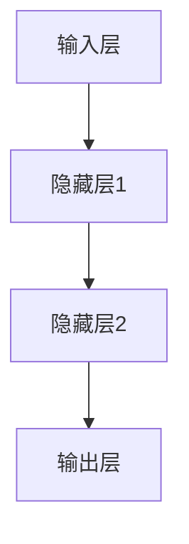

# AI人工智能代理工作流 AI Agent WorkFlow：在数据分析中的应用

## 1.背景介绍

在当今数据驱动的世界中，数据分析已经成为各行各业不可或缺的一部分。随着数据量的爆炸性增长，传统的数据分析方法已经无法满足需求。人工智能（AI）技术的引入，为数据分析带来了革命性的变化。AI代理（Agent）作为一种智能化的自动化工具，能够在数据分析过程中发挥重要作用。本文将深入探讨AI代理工作流在数据分析中的应用，帮助读者理解其核心概念、算法原理、数学模型、实际应用场景以及未来发展趋势。

## 2.核心概念与联系

### 2.1 AI代理的定义

AI代理是一种能够自主执行任务的智能系统。它可以感知环境、做出决策并采取行动，以实现特定目标。在数据分析中，AI代理可以自动化数据预处理、特征选择、模型训练和评估等步骤，从而提高分析效率和准确性。

### 2.2 数据分析的基本流程

数据分析通常包括以下几个步骤：
1. 数据收集
2. 数据预处理
3. 特征工程
4. 模型训练
5. 模型评估
6. 模型部署

### 2.3 AI代理与数据分析的联系

AI代理可以嵌入到数据分析的各个环节中，通过自动化和智能化的手段，提高数据分析的效率和效果。例如，AI代理可以自动化数据预处理过程，减少人为干预，提高数据质量。

## 3.核心算法原理具体操作步骤

### 3.1 数据预处理

数据预处理是数据分析的基础步骤，主要包括数据清洗、数据变换和数据归一化。AI代理可以通过以下步骤自动化数据预处理过程：

1. 数据清洗：检测并处理缺失值、异常值和重复值。
2. 数据变换：将数据转换为适合分析的格式，如数值化、标准化等。
3. 数据归一化：将数据缩放到特定范围内，以消除量纲差异。

### 3.2 特征工程

特征工程是提高模型性能的关键步骤。AI代理可以通过以下步骤自动化特征工程过程：

1. 特征选择：选择对模型有显著影响的特征。
2. 特征提取：从原始数据中提取新的特征。
3. 特征组合：将多个特征组合成新的特征。

### 3.3 模型训练与评估

模型训练与评估是数据分析的核心步骤。AI代理可以通过以下步骤自动化模型训练与评估过程：

1. 模型选择：选择适合数据的模型，如线性回归、决策树、神经网络等。
2. 模型训练：使用训练数据训练模型。
3. 模型评估：使用验证数据评估模型性能，如准确率、召回率、F1值等。

### 3.4 模型部署

模型部署是将训练好的模型应用到实际业务中的步骤。AI代理可以通过以下步骤自动化模型部署过程：

1. 模型保存：将训练好的模型保存为文件。
2. 模型加载：在实际业务中加载模型文件。
3. 模型预测：使用模型对新数据进行预测。

## 4.数学模型和公式详细讲解举例说明

### 4.1 线性回归模型

线性回归是一种常见的回归分析方法，用于预测因变量与自变量之间的线性关系。其数学模型如下：

$$
y = \beta_0 + \beta_1 x_1 + \beta_2 x_2 + \cdots + \beta_n x_n + \epsilon
$$

其中，$y$ 是因变量，$x_1, x_2, \cdots, x_n$ 是自变量，$\beta_0, \beta_1, \cdots, \beta_n$ 是回归系数，$\epsilon$ 是误差项。

### 4.2 逻辑回归模型

逻辑回归是一种用于分类问题的回归分析方法。其数学模型如下：

$$
P(y=1|x) = \frac{1}{1 + e^{-(\beta_0 + \beta_1 x_1 + \beta_2 x_2 + \cdots + \beta_n x_n)}}
$$

其中，$P(y=1|x)$ 是事件发生的概率，$x_1, x_2, \cdots, x_n$ 是自变量，$\beta_0, \beta_1, \cdots, \beta_n$ 是回归系数。

### 4.3 神经网络模型

神经网络是一种模拟人脑神经元结构的模型，广泛应用于分类、回归等任务。其基本结构如下：



神经网络的数学模型如下：

$$
y = f(W_2 \cdot f(W_1 \cdot x + b_1) + b_2)
$$

其中，$x$ 是输入向量，$W_1, W_2$ 是权重矩阵，$b_1, b_2$ 是偏置向量，$f$ 是激活函数。

## 5.项目实践：代码实例和详细解释说明

### 5.1 数据预处理代码实例

```python
import pandas as pd
from sklearn.preprocessing import StandardScaler

# 读取数据
data = pd.read_csv('data.csv')

# 数据清洗
data = data.dropna()  # 删除缺失值
data = data.drop_duplicates()  # 删除重复值

# 数据变换
data['category'] = data['category'].astype('category').cat.codes  # 数值化

# 数据归一化
scaler = StandardScaler()
data[['feature1', 'feature2']] = scaler.fit_transform(data[['feature1', 'feature2']])
```

### 5.2 特征工程代码实例

```python
from sklearn.feature_selection import SelectKBest, f_classif

# 特征选择
X = data.drop('target', axis=1)
y = data['target']
selector = SelectKBest(score_func=f_classif, k=5)
X_new = selector.fit_transform(X, y)

# 特征提取
data['new_feature'] = data['feature1'] * data['feature2']  # 特征组合
```

### 5.3 模型训练与评估代码实例

```python
from sklearn.model_selection import train_test_split
from sklearn.linear_model import LogisticRegression
from sklearn.metrics import accuracy_score

# 数据分割
X_train, X_test, y_train, y_test = train_test_split(X_new, y, test_size=0.2, random_state=42)

# 模型训练
model = LogisticRegression()
model.fit(X_train, y_train)

# 模型评估
y_pred = model.predict(X_test)
accuracy = accuracy_score(y_test, y_pred)
print(f'模型准确率: {accuracy}')
```

### 5.4 模型部署代码实例

```python
import joblib

# 模型保存
joblib.dump(model, 'model.pkl')

# 模型加载
loaded_model = joblib.load('model.pkl')

# 模型预测
new_data = [[0.5, 1.2, -0.3, 0.8, 1.5]]
prediction = loaded_model.predict(new_data)
print(f'预测结果: {prediction}')
```

## 6.实际应用场景

### 6.1 金融领域

在金融领域，AI代理可以用于股票价格预测、信用风险评估、欺诈检测等任务。例如，AI代理可以自动化数据收集和预处理过程，使用机器学习模型预测股票价格走势，从而帮助投资者做出更明智的决策。

### 6.2 医疗领域

在医疗领域，AI代理可以用于疾病诊断、药物研发、患者管理等任务。例如，AI代理可以自动化医疗数据的清洗和分析过程，使用深度学习模型预测疾病风险，从而提高诊断准确性和治疗效果。

### 6.3 零售领域

在零售领域，AI代理可以用于客户行为分析、库存管理、个性化推荐等任务。例如，AI代理可以自动化客户数据的收集和分析过程，使用推荐系统模型为客户提供个性化的商品推荐，从而提高客户满意度和销售额。

## 7.工具和资源推荐

### 7.1 编程语言和库

- **Python**：Python是数据分析和机器学习领域最常用的编程语言，拥有丰富的库和工具支持。
- **Pandas**：Pandas是一个强大的数据处理和分析库，提供了高效的数据操作功能。
- **Scikit-learn**：Scikit-learn是一个机器学习库，提供了丰富的算法和工具支持。
- **TensorFlow**：TensorFlow是一个深度学习框架，广泛应用于神经网络模型的构建和训练。

### 7.2 数据集

- **Kaggle**：Kaggle是一个数据科学竞赛平台，提供了丰富的公开数据集和竞赛项目。
- **UCI Machine Learning Repository**：UCI机器学习库是一个著名的数据集资源库，提供了大量的机器学习数据集。

### 7.3 在线课程和书籍

- **Coursera**：Coursera提供了丰富的在线课程，涵盖数据分析、机器学习、深度学习等领域。
- **《Python数据科学手册》**：这本书详细介绍了Python在数据科学中的应用，适合初学者和进阶者阅读。
- **《机器学习实战》**：这本书介绍了机器学习的基本概念和算法，提供了丰富的代码实例和实践指导。

## 8.总结：未来发展趋势与挑战

### 8.1 未来发展趋势

随着数据量的不断增长和计算能力的提升，AI代理在数据分析中的应用前景广阔。未来，AI代理将更加智能化和自动化，能够处理更复杂的数据分析任务。同时，AI代理将与其他技术（如区块链、物联网等）深度融合，推动数据分析领域的创新和发展。

### 8.2 挑战与解决方案

尽管AI代理在数据分析中具有广泛的应用前景，但仍面临一些挑战：

1. **数据质量**：数据质量直接影响分析结果的准确性。解决方案是加强数据清洗和预处理，确保数据的完整性和一致性。
2. **算法复杂性**：复杂的算法可能导致计算成本高、训练时间长。解决方案是优化算法和模型，采用分布式计算和并行处理技术。
3. **隐私和安全**：数据隐私和安全问题是AI代理应用中的重要挑战。解决方案是采用数据加密、访问控制等技术，保护数据隐私和安全。

## 9.附录：常见问题与解答

### 9.1 什么是AI代理？

AI代理是一种能够自主执行任务的智能系统，能够感知环境、做出决策并采取行动，以实现特定目标。

### 9.2 AI代理在数据分析中的作用是什么？

AI代理可以自动化数据分析的各个环节，如数据预处理、特征工程、模型训练和评估等，从而提高分析效率和准确性。

### 9.3 如何选择适合的数据分析工具和资源？

选择适合的数据分析工具和资源需要考虑以下因素：数据类型和规模、分析任务的复杂性、工具的易用性和社区支持等。推荐使用Python、Pandas、Scikit-learn等常用工具，并参考Kaggle、UCI等数据集资源。

### 9.4 AI代理在数据分析中的未来发展趋势是什么？

未来，AI代理将更加智能化和自动化，能够处理更复杂的数据分析任务。同时，AI代理将与其他技术（如区块链、物联网等）深度融合，推动数据分析领域的创新和发展。

### 9.5 AI代理在数据分析中面临哪些挑战？

AI代理在数据分析中面临数据质量、算法复杂性、隐私和安全等挑战。解决方案包括加强数据清洗和预处理、优化算法和模型、采用数据加密和访问控制等技术。

---

作者：禅与计算机程序设计艺术 / Zen and the Art of Computer Programming